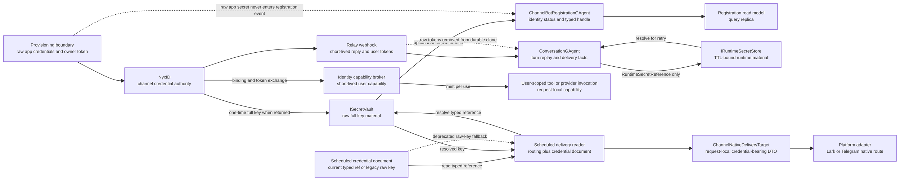
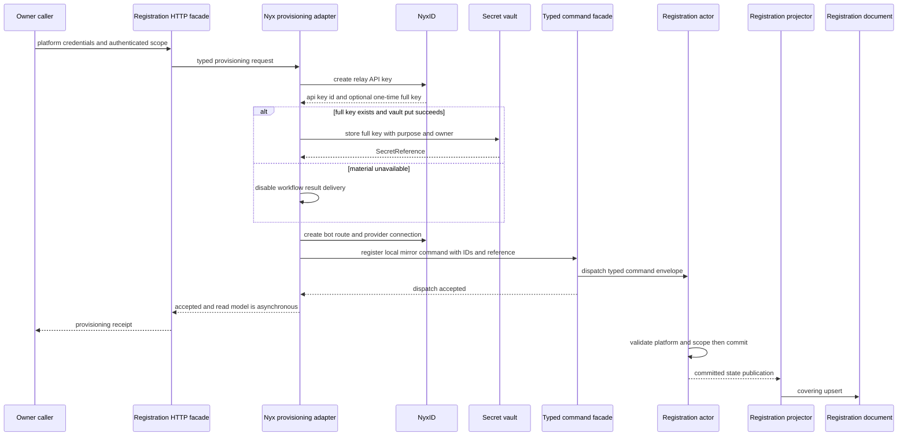
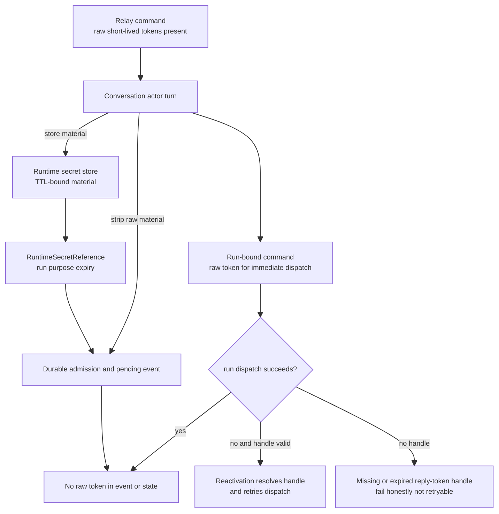

# Channel Runtime 与凭据边界：current durable write 不保存 raw secret material

> 版本与结论：本章描述 `current`。Channel Runtime 有两个长期事实 owner：well-known `ChannelBotRegistrationGAgent` 保存 bot registration mirror，按 conversation identity 分片的 `ConversationGAgent` 保存入站、重放、turn 与 delivery facts。两者写入 durable state/event 时，secret 只以 typed reference 表示，不持久化 raw bot key、relay reply token 或 user access token；scheduled credential projector 也只写 reference，但 delivery reader 仍保留旧 raw-key document 的 compatibility read。除这项迁移债务外，raw capability 止于 provisioning、relay/turn runtime、secret store、broker 和 native sender 调用边界。

## 设计抽象与事实源

- `agents/Aevatar.GAgents.Channel.Abstractions/protos/channel_contracts.proto:34`、`:47`、`:96`、`:108`、`:156`、`:172`：adapter capability、bot descriptor、bootstrap binding、external subject 与 outbound auth choice 的 channel-neutral contract。
- `agents/Aevatar.GAgents.Channel.Runtime/Conversation/ConversationGAgent.cs:118`、`:126`、`:337`、`:351`、`:2611`、`:2646`：Conversation actor 的入站 authority、raw credential strip、runtime reference 挂接与恢复边界；`agents/Aevatar.GAgents.NyxidChat/ChannelConversationTurnRunner.cs:2060-2074` 与 `ChannelContextMiddleware.cs:78-141`：mention 候选值的过滤、格式化与 prompt 注入边界。
- `docs/adr/0012-channel-runtime-credential-boundary.md:31`、`:35`、`:43`、`:62`：Channel Runtime 不是 channel credential authority，支持面收敛到 Nyx-backed ingress/reply，并要求 registration 只保留非 secret facts/handles。

## 两个 durable owner，不是一个“channel service”大对象

Channel Runtime 不以 platform 为单位复制整套业务状态。bot registration 与 conversation 的生命周期、基数和并发模型不同，因此分别拥有事实：

| owner | identity / cardinality | 持久化事实 | 不拥有 |
|---|---|---|---|
| `ChannelBotRegistrationGAgent` | well-known `channel-bot-registration-store`，一个 store actor 内多条 registration entry | registration id、platform、scope、Nyx bot/API-key/route id、provider slug、webhook URL、first inbound marker、tombstone、default skill、workflow delivery secret reference 与 repair state | raw Lark/Telegram credentials、raw Nyx full key、conversation turn |
| `ConversationGAgent` | canonical conversation key，relay 路径再加 scope hash fence | processed ids、callback replay claims、pending admission/run、retained history、recent attachment refs、reply lifecycle、delivery ledger | bot provisioning、registration catalog、long-lived bot key |
| projection documents | 每条 registration / conversation 的 read-side replica；scheduled delivery 另有 credential document | committed state version、last event id、query fields、typed reference；current credential projector把 deprecated raw-key字段置空 | authority、current raw-secret write、repair side effect |
| native sender invocation | request-local DTO | resolved platform-neutral address、provider slug、raw API key、native message | durable SSOT、cross-turn credential cache |

为什么当前没有拆成“每个 bot 一个 actor”？well-known actor 让 registration mirror、按 API key/bot id 查询所需的事实和 tombstone 生命周期共用一个 committed version；first-inbound marker 又只写一次，不让每条消息放大这个单点日志。代价是所有 registration 写入共享 mailbox；冻结实现没有吞吐测量可证明它适合任意规模，只有观测到 mailbox/日志成为瓶颈时才应分片，并同步改变 projector/read contracts。

为什么 conversation 不能也放进同一个 store actor？conversation 是高频、按会话串行的业务 authority。合并会把所有 tenant/message 排到一个 mailbox，并让 callback replay、turn retry 与 delivery lifecycle 互相阻塞；canonical-key actor 则把顺序限制在真正需要顺序的 conversation 内。



## Registration mirror：身份、状态与 typed handle

### 生产支持面比 proto compatibility 面窄

`ChannelBotDescriptor` 只有 registration id、bot id、channel 与 optional scope。`ChannelTransportBinding` 已 reserve 旧 `credential_ref`，但仍保留 `verification_token` bootstrap 字段；`AuthContext` 也保留 legacy `user_credential_ref`，同时为 broker mode 提供 `ExternalSubjectRef`。这说明冻结 wire surface 仍有 compatibility carrier，不能把 ADR 的 steady-state 目标扩大成“所有 proto 已物理删除一切 credential-like 字段”。

ADR-0012 的支持契约更具体：production ingress/reply 走 Nyx relay；direct callback token-update/test-reply 与依赖 ChannelRuntime-local credential ownership 的旧路径退出支持面。冻结 registration actor 只接受 `lark` 与 `telegram` 两个平台，其他 platform command 被丢弃且不持久化。新平台要进入生产面，首先要有外部 credential authority/broker 与 platform sender，而不是往 registration state 添 token。

### register command 只提交 mirror facts

`ChannelBotRegisterCommand` 要求非空 scope，缺 scope 时提交 rejection audit event但不新增 registration；unsupported platform 连 rejection event 都不写，只留 warning。合法 command 生成/采用 registration id，规范化 scope/default skill，并提交 `ChannelBotRegisteredEvent`。registration entry 与 document 中旧 `credential_ref` / `nyx_reply_credential_ref` tags 均已 reserve。

持久化 `workflow_result_delivery_credential` 不违反边界：它是 `SecretReference`，只含 opaque ref、purpose、fingerprint、version、owner scope 与时间字段；NyxID 返回 one-time full key 且 Vault put 成功时，raw key 留在 `ISecretVault`，registration 只收到 handle。response 没有 full key 或 Vault put 失败时，该字段为 `null`，bot 仍可 provisioning，但 workflow result delivery 关闭。这个 handle 不是 interactive relay reply token，也不是 bot platform AppSecret。read model 会复制这个 handle 与 repair state，因而“public projector is non-secret”准确含义是**没有 secret material**，不是“没有 secret locator”。任何暴露 read model 的 API 仍应按 owner scope 授权，opaque locator 也不是可公开枚举的无敏感数据。

unregister 先给 entry 写 tombstone 与 committed version；projector 看到 tombstone 后删除 document；housekeeping 只在 projection watermark 覆盖 tombstone version 后物理 compact actor state。这样 registration disappearance 不会先于 read-side delete evidence。



receipt 中的 `accepted` 只证明 local mirror dispatch 返回；registration actor commit 与 read-model visibility 是后续事实。远端 Nyx resources 已创建、local mirror 尚未物化时，查询可以暂时 missing。

## Conversation：raw token 活在 turn，reference 活在 state

### callback admission 与业务 turn 共用 actor，凭据不共用持久化形状

relay ingress command 可以携带 raw reply token、expiry、user access token、callback JTI 与 replay window，因为 actor 当前 turn 要验证重放并调用 runner。具备 `relayApiKeyId + callbackJti` 时，Conversation actor 先把 callback claim 与 sanitized `ChatActivity` 作为 typed event提交，再 self-dispatch continuation；缺少这组 replay identity 时则直接进入 turn，不产生这条 admission fact。两条路径中的 raw `NyxUserAccessToken` 都会在 `CloneForDurableState` 中清空。

当 runner 产出 deferred `NeedsLlmReplyEvent` 时，actor 建两份 copy：

| copy | raw reply/user token | route target | prior history | runtime secret refs | 去向 |
|---|---|---|---|---|---|
| run-bound | 同一 turn 可携带 | 可携带 transient `target_ref` | 可携带 request-local snapshot | 可携带 | dispatch 给 `AgentRunGAgent` |
| durable | raw token 清空，activity 内 user token 清空 | 清空 | 清空 request-local snapshot | 仅 `RuntimeSecretReference` | event store 与 actor state |

`RuntimeSecretReference` 与 durable `SecretReference` 也不能混用。前者绑定 run/step、TTL 与 optional consume-once，用于 transient dispatch failure 后恢复；后者带 owner scope/version，服务于较长期 Vault lifecycle。运行期 secret store 写失败时，冻结实现记录 warning 并继续同一 turn 的 raw-token dispatch；这保住即时可用性，但 actor deactivate 后可能失去 recovery capability。

为什么不把 token 加密后直接塞 event？event store 是长期审计事实，token TTL、rotation 与删除义务和业务历史生命周期不同。reference 让 secret store 独立执行过期/撤销，actor state只记录“如何按 purpose、owner、run 找回”的能力。为什么不只放进进程内 dictionary？actor deactivation或节点故障后，已 accepted 的 dispatch retry会失去 reply capability；TTL-bound reference 给 crash recovery 一个明确边界。



冻结 sentinel tests 扫描每个 persisted event 的 bytes，确认 reply token 与 user token 不出现；另一个 activation test 证明 state 中 token 为空、refs 非空，重建 actor 后又能从 runtime secret store 恢复并 dispatch。这比“代码里看起来调用了 Clear”更强，因为它检查了实际序列化结果。

### mention 是本 turn 的不可信寻址候选，不是新的 credential authority

Lark 消息正文中的 `@_user_N` 只是展示占位符，不能作为 member id。当前 turn runner 只遍历入站 `ChatActivity.Mentions` 的现有枚举顺序，过滤 `CanonicalId` 为空的项，再格式化为 `name <canonical_id>`；这段边界既不解析正文占位符，也不校验枚举顺序是否与占位符顺序一致。它同样不验证 `CanonicalId` 是否真是 Lark `open_id`，也不验证 display name 与 id 的对应关系。`ChannelContextMiddleware` 仅在结果非空时把整段字符串原样注入 `<channel-context>`，没有在该边界做转义或身份校验。

这次变化只为涉及 @某人的后续操作多提供了一组 turn-local 候选，并未把文本意图直接变成可信目标。固定证据也没有在此处证明 `sender_id` 已验证。因此，无论候选来自 `sender_id` 还是 `mentions`，消费者都必须结合受信 channel adapter / identity binding 校验平台、目标类型与真实 id，再由具体工具或服务的授权检查决定能否操作；绝不能把 `@_user_N` 或未经校验的 `CanonicalId` 直接提升为 permission grant 目标。当前固定基线的 system prompt 只说明如何消费这些字段及 placeholder safety，不构成身份验证、授权策略或 grant 执行能力的证据。

为什么不让 LLM 从正文猜 placeholder 与 id？正文只有序号，没有可信 identity 映射，猜测会把无效或错误字符串送进 permission API。为什么也不能直接相信注入的 `mentions`？该字符串来自未在此边界验证或转义的 activity 字段，最多缩小候选范围，不能证明 placeholder 对应关系、身份真实性或授权。把 mention 变成长久 binding 还会混淆一次消息里的指向与持续委托；因此它只能作为 turn-local 输入，目标校验与授权成败必须留给受信 adapter、identity binding 和下游平台。

```mermaid
%%{init: {"maxTextSize": 100000, "flowchart": {"useMaxWidth": false, "nodeSpacing": 14, "rankSpacing": 48}, "themeVariables": {"fontSize": "10px"}}}%%
flowchart LR
    A["Inbound text\n@_user_1 and @_user_2 placeholders"]
    M["ChatActivity.Mentions\ninput enumeration order"]
    F["Filter empty CanonicalId\nformat raw name plus id"]
    T["Turn metadata\nchannel.mentions"]
    C["channel-context\nmentions only when non-empty"]
    I{"requested target"}
    S["sender_id\nrequester"]
    P["untrusted sender or mention candidate"]
    V["Trusted adapter or identity binding\nvalidate platform target type and id"]
    Q["ask for a real id\nno guessing"]
    G["Authorized downstream operation\nthrough a concrete tool or service"]
    A -. "no mapping guarantee" .-> M --> F --> T --> C --> I
    I -->|"self candidate"| S --> V
    I -->|"mention candidate"| P --> V --> G
    I -->|"unresolved person"| Q
```



## Outbound native target：platform-neutral 不等于 credential-free

### durable address 与 runtime capability 是两层

通用 `DeliveryTarget` / `ChannelDeliveryAddress` 用 `platform + provider slug + primary/fallback(address_id,address_type) + conversation` 表达可寻址事实，不包含 `LarkReceiveId*`。Lark adapter 在 platform boundary 才把 generic address变成 Lark receive id/type；Telegram 或未来 adapter 不需要理解这些字段。

`ChannelNativeDeliveryTarget` 则明确是 **credential-bearing request-local DTO**：`AgentId, Platform, ConversationId, NyxProviderSlug, NyxApiKey`。scheduled/user-agent outbound 的 internal delivery reader 合并 public routing document、credential projection 与 Vault resolve；routing/credential document 缺失或最终 key 为空时返回 `null`，不会用空 key 调 Nyx proxy。这个 reader 的约束用途是 outbound components，CI guard 禁止 LLM-facing `IAgentTool` 通过构造参数或 service-provider lookup 依赖它。

这里仍有一条冻结 compatibility read：`UserAgentCatalogNyxCredentialDocument.nyx_api_key` 标记 deprecated，current catalog actor与credential projector都将它写为空并改写 `nyx_api_key_reference`；但 delivery reader 在 reference为空时仍会读取旧 document 的 raw `NyxApiKey`。因此准确结论是“current write path 不再制造 raw-key read model，legacy document仍可被读”，不是“冻结 schema/reader 已物理删除 raw-key字段”。该 fallback只能服务迁移期，不能成为新 producer 的许可。

这条边界的正确表述是：

- durable actor/readmodel 保存 address、identity 与 typed secret locator；
- narrow internal reader 在调用前解析 locator，短暂构造 raw-key DTO；
- platform adapter补 native address shape；
- sender完成请求后不把 DTO 回写 event/read model。

若把 runtime DTO 改成完全 credential-free，sender 仍需另一个可审计的 resolver/broker接口；仅仅从 type 删字段却改用 ambient singleton cache，会让 secret ownership 更差。若把 Lark receive id 放回 generic target，则所有 producer/resolver 都会重新依赖 Lark schema。当前两段式 target 是在安全和平台解耦之间的最小边界。

## Provisioning 不是原子事务

Nyx-backed Lark provisioning 当前依次创建 relay API key、把 one-time full key 存 Vault、创建/替换 channel bot、建 conversation route、连接 provider proxy，再 dispatch local mirror command。local mirror accepted 之前失败时按 route → bot → Vault reference/revoke → API key 逆序 best-effort compensation，并使用 detached cancellation token 避免 caller cancellation同时取消清理。

但它不是跨 NyxID、Vault、actor event store 的分布式事务：

- registration id 每次调用生成新 GUID；
- relay API key 在检查/替换同 app 的 channel bot之前创建；
- proxy connection 明确不进 rollback chain；
- local mirror一旦 marked accepted，后续 exception不再远端 cleanup；
- receipt 不等 read model visible。

因此“raw key 已进 Vault”只证明没有把 key material塞进 registration event，不证明重复调用幂等或旧 key 已回收。open #2812 已记录重复 registration 可产生新的 relay Agent Key 并泄漏旧资源。正确出口需要稳定 operation/idempotency identity、按 owner+app 发现既有资源、每个 remote/Vault/local phase的权威状态，以及可重试补偿；不能用前端禁用按钮冒充幂等。详细 Lark repair/reply failure 放在 [08/03](03-lark-delivery-interaction-and-repair.md)。

## 最小静态示例

> Demo status：`verified-static`（核对冻结 registration proto/actor/projector、ADR、Conversation sentinel/recovery tests、native target types与 provisioning implementation；未启动 Host，未创建真实 NyxID bot/key，未执行 Vault revoke）。

```yaml
  # Durable registration mirror: safe to project under owner authorization.
registration:
  id: reg-42
  platform: lark
  scope_id: scope-alpha
  nyx_provider_slug: api-lark-bot-4
  nyx_channel_bot_id: bot-42
  nyx_agent_api_key_id: key-id-42
  nyx_conversation_route_id: route-42
  workflow_result_delivery_credential:
    ref: vault://channel-delivery/sec-42
    purpose: channel.workflow-result-delivery-agent-key
    owner_scope_key: scope-alpha
    version: 1

  # Forbidden durable shape.
registration_forbidden:
  app_secret: raw-lark-secret
  nyx_full_key: raw-agent-key
  relay_reply_token: raw-turn-token
```

Conversation dispatch recovery 的最小判定：

```text
same activation:
  run command has raw reply/user token
  persisted event has RuntimeSecretReference only

after reactivation:
  valid unexpired reference -> resolve and retry dispatch
missing/expired reply-token reference -> missing_runtime_reply_token, NotRetryable
```

第三方授权的静态判定：

```text
text: "@_user_1 给 @_user_2 加一下权限"
mentions: Aevatar <ou_bot_1>; 张三 <ou_zhangsan>
candidate: 张三 <ou_zhangsan>
required: trusted adapter/binding validates member_type and member_id before grant

forbidden:
  member_id=@_user_2
  treat CanonicalId or sender_id as already verified
  treat mention presence as authorization success
```

## 边界与演进

| 情况 | current 行为 | 不能外推 |
|---|---|---|
| unsupported registration platform | actor warning并不持久化 entry | 所有 adapter 都是 production-supported |
| missing registration scope | committed rejection audit，无 entry | registration 已部分成功 |
| raw Nyx full key | 有 full key 且 Vault put成功时 mirror只存 typed ref；否则 reference为空并关闭 workflow result delivery | provisioning 已幂等、旧 key 已回收或 background delivery 可用 |
| registration read model | 含 identity/status、repair state 与 typed ref | 可匿名公开或可解析 secret |
| relay reply/user token | run command/runtime store 可持有，persisted bytes 清除 | actor 从未接触 secret |
| mention candidate | 过滤空 `CanonicalId` 后按 `ChatActivity.Mentions` 输入枚举顺序格式化，非空时原样进入 turn-local `channel-context` | 顺序对应正文 placeholder、字段已经验证/转义、Lark canonical id 必为 `open_id`，或平台已经授权 |
| runtime secret-store write失败 | same-turn raw command继续，recovery capability降级 | crash后仍必然可恢复 |
| native delivery target | narrow runtime DTO 可含 raw key，Lark fields 只在 adapter派生类型；reader仍可读 deprecated legacy raw-key document | current writer可重新持久化 raw key，或 durable generic target可含Lark schema |
| sender binding exists | broker可按 binding mint短命 capability | tool authorization与数据源访问必然成功 |

!!! warning "sender credential authority 仍有 confirmed bug"

    open #2461 记录 relay bot 在 `/init` 后调用 Ornn skill 仍出现 `credential_denied`。冻结实现已经有 external subject、binding、canonical owner scope 与 short-lived broker contract，也会把 `OwnerScopeId` 送入 tool caller context；这些结构不能证明端到端 credential selection正确。该 gap 必须保留到 [12/05](../12/05-open-gaps-and-canon-drift.md)。退出条件是以一个已绑定 external subject 运行 relay → tool policy → connected datasource 的回归测试，证明选中 sender capability、owner scope一致、撤销后 fail closed，且不回退 bot-owner secret。

!!! warning "provisioning idempotency 与资源回收未闭合"

    open #2812 的冻结证据显示每次 provisioning先创建命名为 `aevatar-lark-relay-<registration>` 的新 key；当前 replace-channel-bot逻辑不能替代 API key/Vault/local mirror 幂等。退出条件是同一 owner/app/idempotency key 重试返回同一 operation/result，或以明确 revision替换旧资源；旧 key、Vault secret、route、bot、proxy connection 与 mirror entry 均有最终可查询的 retired/active state和 crash-safe compensation。

`ChannelTransportBinding.verification_token` 与 `AuthContext.user_credential_ref` 仍在冻结 compatibility surface。若 steady-state 要完全删除，必须先证明所有 caller 已迁到 relay/broker并 reserve tags；若仍需非生产 adapter fixture，则应把用途和禁止持久化写进类型/测试，不能让 compatibility field悄悄重新成为长期 credential store。

scheduled credential document 的 deprecated `nyx_api_key` 与 reader fallback同样需要退出证据：先迁移/删除所有旧 raw-key documents，再删除 fallback并 reserve wire字段；在此之前，secret scan与访问控制必须覆盖旧数据。

## 读完应能回答

1. registration actor 与 Conversation actor 分别拥有哪些事实，为什么不能合并成一个 channel store？
2. `SecretReference`、`RuntimeSecretReference` 与 raw token/key 的生命周期和 owner有何不同？
3. `ChannelNativeDeliveryTarget` 为什么可以在运行期含 raw key，却仍不违反 actor/read-model credential boundary？
4. platform-neutral delivery address 如何避免 Lark receive-id 污染 generic contract？
5. 为什么 Vault store 成功和 HTTP `accepted` 都不能证明 provisioning 幂等、read model visible或 sender authorization 已闭合？
6. `@_user_N`、`mentions` 中的 canonical id 与 permission grant 分别证明什么，为什么不能互相替代？

<details>
<summary>论断—冻结证据映射</summary>

| 论断 | 冻结证据 |
|---|---|
| Channel contract 分离 bot descriptor、bootstrap、external subject 与 auth choice | `agents/Aevatar.GAgents.Channel.Abstractions/protos/channel_contracts.proto:34-54`、`:96-116`、`:156-188` |
| registration actor只接受 Lark/Telegram、scope缺失提交 rejection、合法 entry不含 raw bot key | `agents/Aevatar.GAgents.Channel.Runtime/ChannelBotRegistrationGAgent.cs:46-111` |
| registration state/document reserve旧 credential fields并保留 typed workflow-delivery ref | `agents/Aevatar.GAgents.Channel.Runtime/protos/channel_bot_registration.proto:12-50`、`:67-81`、`:268-292` |
| projector复制 committed mirror facts/ref，tombstone删除 document | `agents/Aevatar.GAgents.Channel.Runtime/ChannelBotRegistrationProjector.cs:29-60` |
| one-time full key存在时只写 Vault，缺失/写失败则关闭 workflow delivery；local mirror command只带 IDs 与 optional SecretReference | `agents/channels/Aevatar.GAgents.Channel.NyxIdRelay/NyxLarkProvisioningService.cs:131-162`、`:211-235`、`:266-309`、`:538-568` |
| local mirror前失败执行 best-effort remote/Vault compensation | `agents/channels/Aevatar.GAgents.Channel.NyxIdRelay/NyxLarkProvisioningService.cs:237-263` |
| Conversation durable clone清除 raw user token，run/persist copies分离 | `agents/Aevatar.GAgents.Channel.Runtime/Conversation/ConversationGAgent.cs:337-363`、`:2611-2631` |
| runtime refs 写入/恢复有 purpose、run、correlation、TTL fence | `agents/Aevatar.GAgents.Channel.Runtime/Conversation/ConversationGAgent.cs:2646-2751` |
| mention 过滤空 canonical id、保留 activity 输入枚举顺序，并在非空时原样注入 channel context；这些代码不建立 placeholder 映射或身份验证保证 | `agents/Aevatar.GAgents.Channel.Runtime/ChannelMetadataKeys.cs:38-44`；`agents/Aevatar.GAgents.NyxidChat/ChannelConversationTurnRunner.cs:2060-2074`；`agents/Aevatar.GAgents.NyxidChat/ChannelContextMiddleware.cs:78-141` |
| 当前 prompt 把 sender_id、identity_hints、mentions 描述为寻址输入并禁止把 placeholder 当 id；这是模型消费指令，不是字段已验证或具备 grant 执行能力的证据 | `agents/Aevatar.GAgents.NyxidChat/Skills/system-prompt.md:53-69` |
| persisted events不含 reply/user sentinel，reactivation可用 refs恢复 | `test/Aevatar.GAgents.Channel.Protocol.Tests/ConversationGAgentDedupTests.cs:1290-1348`、`:1685-1755` |
| generic native target含五个 channel-neutral字段，Lark address只由 platform adapter补齐 | `agents/Aevatar.GAgents.Channel.Abstractions/Composition/ChannelNativeDeliveryTarget.cs:1-15`；`agents/platforms/Aevatar.GAgents.Platform.Lark/LarkChannelNativeDeliveryTargetAdapter.cs:5-55` |
| internal delivery reader从 routing document + credential projection + Vault构造 runtime target；current projector清空 raw key但reader仍有deprecated fallback | `agents/Aevatar.GAgents.Scheduled/IUserAgentDeliveryTargetReader.cs:6-45`；`agents/Aevatar.GAgents.Scheduled/UserAgentDeliveryTargetReader.cs:26-105`；`agents/Aevatar.GAgents.Scheduled/UserAgentCatalogNyxCredentialProjector.cs:29-43` |
| CI guard禁止 `IAgentTool` 通过构造参数或 service-provider lookup取得 secret-bearing reader | `tools/ci/agent_tool_delivery_target_reader_guard.sh:1-69` |
| generic sender plugin按 platform选择 producer/sender/target adapter | `agents/channels/Aevatar.GAgents.Channel.NyxIdRelay/Outbound/NyxIdRelayChannelInteractionNotificationPort.cs:8-90` |
| external subject到 owner scope与 short-lived broker均为typed contract | `agents/Aevatar.GAgents.Channel.Identity.Abstractions/IOwnerScopeResolver.cs:5-19`；`agents/Aevatar.GAgents.Channel.Identity.Abstractions/INyxIdCapabilityBroker.cs:63-80` |

</details>
