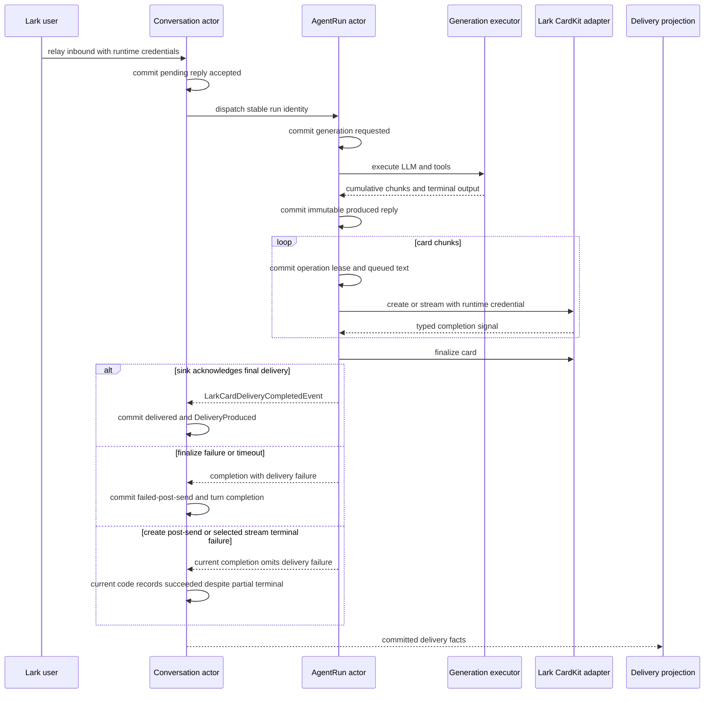
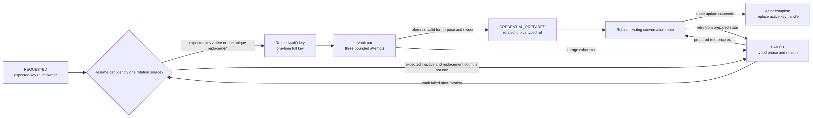

# Lark 投递、交互与修复：把意图、送达事实和平台故障分开

> 版本与结论：本章为 `mixed`。workflow interaction intent、channel-neutral producer/sender、conversation delivery ledger 与 Lark workflow-result credential 原地修复均已落地；但 Lark CardKit 的 create/stream/finalize 状态仍由 `AgentRunGAgent` 的 Lark-specific proto 与 handler 持有，若干生产可见的 slash、长回复、grant 与重复 provisioning 问题仍开放。

## 设计抽象与事实源

- `agents/channels/Aevatar.GAgents.Channel.NyxIdRelay/ChannelCallbackEndpoints.cs:29`、`:92`、`:252`、`:651`：HTTP 只适配 registration/status/repair，请求按 authenticated scope 隔离，repair response 只暴露非 secret phase/reason。
- `agents/channels/Aevatar.GAgents.Channel.NyxIdRelay/ChannelWorkflowResultDeliveryRepairService.cs:71`、`:116`、`:185`、`:215`、`:315`、`:419`：repair request、rotate、Vault prepare、route rebind、actor completion 与中断恢复。
- `docs/canon/lark-reply-completion-semantics.md:25`、`:38`、`:155`、`:263`：accepted、committed、delivered、finalized 不可互相推断，用户可见 delivery 必须有 actor-owned fact。

## 三条出站协议，不是一个“发 Lark 消息”函数

Lark 出站至少包含三种不同语义。兼容 `MessageContent` 的路径可以复用 native sender，但不能共用成功定义：

| 协议 | 输入意图 | 事实 owner | “成功”到哪里 | 当前限制 |
|---|---|---|---|---|
| workflow interaction notification | `delivery_target_id` + exactly one `InteractionSpec` / `InteractionTemplateSpec` | workflow 发布 notification envelope，projection 再执行外部投递 | `notify` step 的 `accepted` 只表示 publish调用已返回；port 返回表示本次 sender 调用未抛错 | workflow step 没有 durable platform-delivery ACK 回写 |
| conversation reply | LLM/tool 生成的 text 或 streaming card | `AgentRunGAgent` 拥有 run/card operation，`ConversationGAgent` 拥有 user-visible delivery | text ACK与CardKit completion进入Conversation后提交delivery fact | CardKit状态仍是Lark-specific，且两类post-send terminal分支会被误记为succeeded |
| workflow terminal-result delivery | workflow terminal notification + reserved delivery identity + registration credential handle | `WorkflowRunDeliveryGAgent` 与 registration actor | terminal text 被后台 delivery actor 送达并提交 succeeded/failed | 缺 handle 时 fail closed；旧 registration 需 repair |

为什么不把三者收敛成一个 `SendMessageAsync`？因为 `accepted`、LLM output committed、平台 ACK 与 workflow terminal observation 是不同阶段。抹平后，调用方会把“事件发布了”误报成“用户收到了”，或在平台已经发出卡片后做 text fallback，造成重复消息。复用只应发生在输入意图兼容的 `MessageContent → native message → sender` 平台边界，而不是成功语义上；当前 conversation CardKit 仍走自己的 Lark-specific operation path。

```mermaid
%%{init: {"maxTextSize": 100000, "flowchart": {"useMaxWidth": false, "nodeSpacing": 14, "rankSpacing": 54}, "themeVariables": {"fontSize": "10px"}}}%%
flowchart LR
    W["Workflow notify step\ntyped interaction payload"]
    WE["WorkflowInteractionNotificationEvent\npublished envelope"]
    P["Projection delivery side effect"]
    M["MessageContent\nchannel-neutral notify intent"]
    R["Conversation reply run\ntext or card stream"]
    A["AgentRunGAgent\nLark-specific card operation"]
    C["ConversationGAgent\nuser-visible delivery ledger"]
    WR["WorkflowRunDeliveryGAgent\nterminal delivery state"]
    RO["Nyx relay outbound port"]
    T["Delivery target resolver\nrouting plus runtime credential"]
    NP["Native producer selected by platform"]
    NS["Native sender selected by platform"]
    L["Lark API through NyxID proxy"]
    CD["Conversation delivered or failed fact"]
    WD["Workflow delivery succeeded or failed"]
    W --> WE --> P --> M
    M --> NP
    T --> NS
    NP --> NS --> L
    R --> A --> L
    L -->|"card completion"| A --> C --> CD
    WR --> RO --> L
    L -->|"terminal send result"| WR --> WD
    L -. "notify has no durable ACK back to step" .-> WE
```



## Typed interaction：业务写意图，Lark adapter 写卡片 JSON

`notify` primitive 要求显式 `delivery_target_id`，并要求 `interaction_spec` 与 `interaction_template_spec` 恰好出现一个。通过校验后，module 发布 `WorkflowInteractionNotificationEvent`，随即用 `StepCompletedEvent(success=true, output=accepted)` 结束该 step。这个 `accepted` 是 workflow 内部发布语义，不是 Lark delivery receipt。

projection 收到 notification event 后构造 `ChannelInteractionNotificationRequest(actorId, runId, stepId, deliveryTargetId, payload)`。`HumanInteractionMessageMapper` 把 typed field/action 映射成 channel-neutral `MessageContent`，resume action 只带稳定的 actor/run/step identity。relay notification port 再按 target platform 选择 producer、target adapter 与 sender：Lark producer 生成 interactive card，Telegram producer可生成自己的 native payload；workflow/Foundation 不需要认识 Lark card JSON。冻结代码允许 projector拆开 `CommittedStateEventEnvelope`，但 `NotifyModule` 本身只调用通用 publish，因此本章不把 step 的 `accepted`提升为 notification 已 committed。

为什么 `delivery_target_id` 不是 `chat_id`？前者是 Aevatar 内部资源 identity，可解析 owner、platform、provider slug、primary/fallback address 与 runtime credential；后者只是 Lark 原生地址。把 `chat_id` 直接塞 workflow 会让 definition 绑定单一平台，也绕过 owner-aware target resolver。

下面是冻结 demo 的最小化形状；它验证 schema/mapper 路径，不代表本轮实际向 Lark 发送过消息：

```yaml
name: approval_notification
roles: []
steps:
  - id: request_review
    type: notify
    presentation:
      delivery_target_id: "${input.delivery_target_id}"
      interaction_spec:
        title: "Expense review"
        body: "Choose one action."
        disposition: normal
        actions:
          - kind: button
            action_id: approve
            label: "Approve"
            value: approve
          - kind: button
            action_id: reject
            label: "Reject"
            value: reject
            style: danger
```

> Demo status：`verified-static`（核对冻结 demo、`NotifyModule`、notification projector、mapper、Lark/Telegram producer 与 sender；未启动 workflow Host，未向真实 Lark tenant 投递）。

## Conversation reply：生成完成不等于用户收到

### 四阶段只允许各自的事实证明

一条对话回复依次跨过四个语义边界：

1. **accepted**：`ConversationGAgent` 已持久化 pending reply request。
2. **committed**：`AgentRunGAgent` 已把 immutable reply payload 写入自身 state，不会因 handoff retry 重跑 LLM/tool chain。
3. **delivered**：channel sink ACK或CardKit completion进入 `ConversationGAgent` 后提交 delivery fact。text失败与finalize失败会提交 `LlmReplyDeliveryFailedEvent`；但冻结实现有两个CardKit分支错误地把partial terminal记为delivered，见下文。
4. **finalized**：run 已处于 terminal status，terminal cleanup 也已提交完成。

`REPLY_HANDED_OFF` 只说明 reply event 已交给 Conversation actor，不证明 Lark 看到了消息。类似地，Lark HTTP 200 日志也不能替代 actor event；真正的查询面是 `last_reply_delivery`、bounded `recent_deliveries` 与 `last_successful_delivery` 的 current-state projection。



### CardKit 的失败分界由“是否已产生用户可见对象”决定

CardKit path 的 durable state 位于 `AgentRunGAgentState.lark_card_delivery`：phase、card/message id、last flushed text、sequence、in-flight operation/generation、pending accumulated/final text 与 text-fallback phase。外部 create/stream/finalize I/O 由 self-dispatched operation step 执行，完成 signal 带 minimal raw result；10 秒 durable timeout只携带稳定 identity/lease keys，actor 用当前 state判断 signal 是否 stale。

- **create 失败或超时**：尚无可靠的 card user-visible object，phase 进入 `CREATION_FAILED`，后续可向 Conversation actor转发 status/final text fallback。
- **stream rate limit**：当前 frame 可以丢弃或 coalesce，不能把整回合宣告 delivered。
- **stream/finalize 的 post-send failure**：卡片已经可能可见，不能再发一条完整 text 假装原卡片不存在。finalize失败/超时当前会提交 `failed-post-send`；但 create post-send failure 与 table-limit/card-unavailable 的 stream terminal分支把 `deliveryFailure` 传为 `null`，随后被 Conversation actor记为 succeeded。这是 current/canon drift，不是正确语义。
- **finalize 成功**：Run actor准备并重试 card completion outbox，Conversation actor 收到后才提交 user-visible delivered fact。

为什么把 card operation state 放 actor 而不是 `Task.Run` closure？create 与 finalize 可跨 turn、节点和重试；只有 committed phase + operation generation 能吸收迟到 completion/timeout，避免同一个 chunk 被旧 callback 覆盖。代价同样明确：这些 durable types 仍叫 `LarkCard*`，说明 reply orchestration 尚未完全平台中立。

!!! warning "Lark CardKit orchestration 仍未退出通用 run/runtime"

    旧的“generic reply/runtime contract直接承载Lark card identity与phase”设计已被channel-neutral intent/native adapter边界取代，属于superseded方向；但冻结树仍由 `AgentRunGAgent.LarkCardDelivery.cs` 和 `AgentRunLarkCardDeliveryState` 持有 Lark-specific phase、card id 与 completion payload，迁移尚未完成。closed #2632 为 failed/abandoned，不能写成已完成解耦。该 gap 必须迁入 [12/05](../12/05-open-gaps-and-canon-drift.md)。退出条件是 provider-neutral reply-operation contract表达 create/update/finalize、pre/post-send failure 与 platform message identity，Lark adapter独占 CardKit schema，同时保留现有 actor fencing、timeout与 delivery ledger tests。

!!! warning "两类CardKit partial terminal当前被记成成功"

    `HandleLarkCardCreateCompletionAsync` 的 post-send failure，以及 `HandleLarkCardStreamCompletionAsync` 的 table-limit/card-unavailable terminal，都以 `deliveryFailure: null` 调用 completion；`ConversationGAgent` 因而提交 `LlmReplyDeliveredEvent` 与 `DeliveryStatus.Succeeded`。这与 canon 的 failed-post-send边界冲突，必须迁入 [12/05](../12/05-open-gaps-and-canon-drift.md)。退出条件是两条分支携带typed failure/partial outcome，并有current-state ledger回归证明不会误报成功。

## Workflow terminal reply credential：原 registration 上前滚修复

新 provisioning 没拿到 one-time full key或 Vault put失败时，bot relay chat仍可工作，但 registration 的 workflow-result delivery capability 为 `repair_required`。owner 可对原 registration 调用：

```text
POST /api/channels/registrations/{registration_id}/workflow-result-delivery/repair
Authorization: Bearer <owner access token>
```

endpoint先以 authenticated scope 查 registration。不存在、tombstoned、scope 不匹配都返回 indistinguishable `not_found`；只有 Lark registration进入 repair。HTTP response含 `repair_request_id`、非敏感 key id、capability status 与 typed failure phase/reason，不返回 full key、Vault ref或 bearer。

repair 是 actor-owned forward-only operation：



request先由 registration actor提交，application service才 rotate。rotate 后旧 key可能已经失活，因此不能“回滚到旧 key”；service 先把 full key放进 Vault，再提交 `CREDENTIAL_PREPARED`，然后更新**现有** conversation route，最后让 actor切换 key id/reference。prepared 后重试复用同一个 reference；中断在 rotation与prepare之间时，expected key仍 active且没有 replacement时可继续 rotate，expected key已 inactive时则必须按稳定 key name + requested time找到唯一 active replacement。expected inactive且 candidate为零或多个时，以 `AMBIGUOUS_ROTATED_KEY_RECOVERY` fail closed。

为什么不删除 bot重建？repair 保留 registration id、channel bot、route、webhook、scope与 default skill，用户不必修改 Lark developer console；变更只围绕 active key与 typed reference。为什么不用分布式事务？NyxID、Vault 与 actor event store没有共同 commit protocol，forward-only phase facts比伪原子事务更诚实，也允许故障后从权威 state继续。

但 repair 只修“已有 registration缺 workflow delivery handle”。它不解决 provisioning 自身的重复调用：#2812 的冻结路径仍会为每次 registration生成新 GUID和 relay key，repair endpoint不能回收这些旧资源。

## 边界与演进：Current、迁移债务与开放问题

| 主题 | 冻结结论 | 不能外推 |
|---|---|---|
| default skill routing | registration mirror持有 normalized `default_skill_name`，turn runner可将 explicit/default trigger组装进 skill recovery prompt | LLM一定会执行 skill，或后续自由文本一定延续 workflow |
| attachments | relay可规范化 attachment refs，workflow draft-run path按入站 provider slug下载并构造 input parts | 所有附件类型/大小都成功，或 reply truncation已由此修复 |
| native notification | Lark/Telegram producer、sender与 target adapter按 platform选择 | CardKit conversation streaming已经完全 platform-neutral |
| sender identity | resolved binding可携带 canonical `OwnerScopeId`进入 tool caller context | `/init` 后每个 service grant都可用 |
| delivery ledger | text/card terminal path写 delivered/failed与 bounded ledger | workflow `notify accepted`等于 platform delivered |
| credential repair | owner-scoped Lark registration可从 committed phase前滚 | provisioning幂等、旧 key自动回收 |

!!! warning "Lark skill、长回复与 grant 行为仍有 confirmed gaps"

    open #2357 记录 skill加载后后续输入仍可能变成润色回复；#2358 记录多行 slash内容只传首行，冻结树证明 trigger链存在但未证明具体截断点；#2359 记录 observatory输出完整而 Lark回复截断，冻结树未找到可把现象归因于单一长度/TTL分支的证据；#2754 缺 `/init` grant review/update闭环。它们必须进入 [12/05](../12/05-open-gaps-and-canon-drift.md)，不能因 current typed routing/ledger存在就标已修。退出条件分别是跨 turn skill continuation、保留换行的 parser回归、长输出 terminal delivery E2E与可审计 grant review/revoke 测试。

!!! warning "重复 provisioning 仍会泄漏资源"

    open #2812 的 current证据是每次调用先生成新 registration GUID并创建 `aevatar-lark-relay-<registration>` key；replace existing channel bot不等于 key/Vault/route/mirror幂等。退出条件是稳定 operation/idempotency identity、所有 remote/local phase可查询，以及旧 key、Vault secret、route、bot、proxy connection与 mirror entry的 crash-safe retirement。

## 读完应能回答

1. workflow `notify` 的 `accepted` 与 conversation reply 的 `delivered` 为什么不是同一事实？
2. typed interaction intent如何在不含 Lark JSON 的情况下变成 Lark card？
3. CardKit create失败为什么可以 text fallback，而 post-send finalize失败不能？
4. `REPLY_HANDED_OFF`、`LlmReplyDeliveredEvent` 与 delivery ledger分别证明什么？
5. credential repair为什么必须前滚，且为什么不等于 provisioning幂等？

<details>
<summary>论断—冻结证据映射</summary>

| 论断 | 冻结证据 |
|---|---|
| notify校验 exactly-one typed payload，发布 notification后只返回 accepted | `src/workflow/Aevatar.Workflow.Core/Modules/NotifyModule.cs:19-55`、`:62-117` |
| projection把 committed notification转成 channel request，port本身只返回 `Task` | `src/workflow/Aevatar.Workflow.Presentation.AGUIAdapter/WorkflowInteractionNotificationProjector.cs:21-58`；`src/Aevatar.Foundation.Abstractions/HumanInteraction/IChannelInteractionNotificationPort.cs:1-8` |
| typed interaction映射成 MessageContent并携带 actor/run/step resume identity | `agents/Aevatar.GAgents.Channel.Abstractions/HumanInteractions/HumanInteractionMessageMapper.cs:9-75` |
| relay notification按 platform选择 producer/sender/target adapter | `agents/channels/Aevatar.GAgents.Channel.NyxIdRelay/Outbound/NyxIdRelayChannelInteractionNotificationPort.cs:8-99` |
| Lark/Telegram各自持有 native rendering与transport | `agents/platforms/Aevatar.GAgents.Platform.Lark/LarkChannelNativeMessageProducer.cs:15-64`；`agents/platforms/Aevatar.GAgents.Platform.Lark/LarkChannelNativeMessageSender.cs:6-114`；`agents/platforms/Aevatar.GAgents.Platform.Telegram/TelegramChannelNativeMessageSender.cs:9-119` |
| Conversation actor在 text与card完成路径写 delivered/failed和 DeliveryProduced | `agents/Aevatar.GAgents.Channel.Runtime/Conversation/ConversationGAgent.cs:928-1165` |
| reply current state区分 pending/delivered/failed并保留bounded ledger | `agents/Aevatar.GAgents.Channel.Runtime/protos/conversation_state.proto:1-96` |
| AgentRun显式区分 reply produced、handed off与cleanup finalized | `agents/Aevatar.GAgents.NyxidChat/protos/agent_run.proto:13-88` |
| Lark CardKit phase/in-flight generation/pending text由run actor持久化 | `agents/Aevatar.GAgents.NyxidChat/protos/agent_run.proto:90-173`；`agents/Aevatar.GAgents.NyxidChat/AgentRunGAgent.LarkCardDelivery.cs:13-194` |
| finalize失败携带delivery failure，但create post-send与部分stream terminal当前以null failure完成并被Conversation记为succeeded | `agents/Aevatar.GAgents.NyxidChat/AgentRunGAgent.LarkCardDelivery.cs:366-425`、`:446-507`、`:541-607`；`agents/Aevatar.GAgents.Channel.Runtime/Conversation/ConversationGAgent.cs:1075-1163` |
| repair按scope隐藏非owner registration，只向HTTP输出非secret status/phase/reason | `agents/channels/Aevatar.GAgents.Channel.NyxIdRelay/ChannelCallbackEndpoints.cs:252-293`、`:651-721` |
| repair执行 request→rotate→Vault prepare→route rebind→complete | `agents/channels/Aevatar.GAgents.Channel.NyxIdRelay/ChannelWorkflowResultDeliveryRepairService.cs:71-313` |
| prepared retry与ambiguous rotated-key recovery由committed repair facts约束 | `agents/channels/Aevatar.GAgents.Channel.NyxIdRelay/ChannelWorkflowResultDeliveryRepairService.cs:315-555` |
| Nyx repair port只返回redacted credential对象并原地更新route | `agents/channels/Aevatar.GAgents.Channel.NyxIdRelay/ChannelWorkflowResultDeliveryRepairNyxPort.cs:32-49`、`:67-96`、`:141-185` |
| explicit trigger优先，default skill只接管plain text，并最终组装成skill recovery prompt | `agents/Aevatar.GAgents.NyxidChat/ChannelConversationTurnRunner.cs:2416-2508`、`:2584-2735` |
| relay规范化Lark attachment ref，draft-run按入站provider slug下载并生成input parts | `agents/channels/Aevatar.GAgents.Channel.NyxIdRelay/NyxIdRelayTransport.cs:225-295`；`agents/Aevatar.GAgents.NyxidChat/WorkflowDraftRun/ChannelWorkflowDraftRunInteractionPort.cs:238-332` |
| deferred tool context携带sender binding解析出的canonical owner scope | `agents/Aevatar.GAgents.NyxidChat/ChannelConversationTurnRunner.cs:2470-2493`、`:2530-2576` |

</details>
