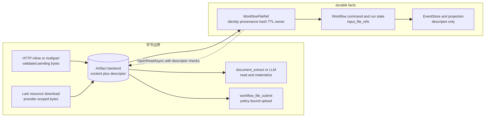
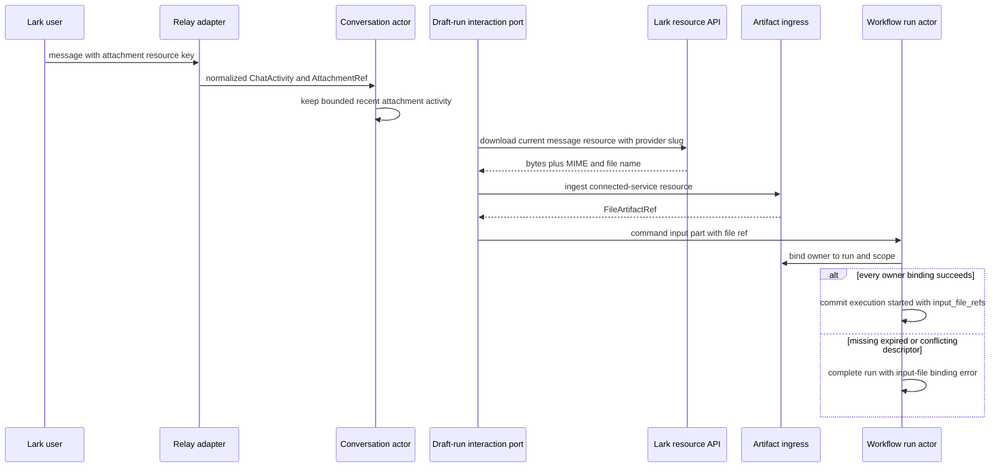
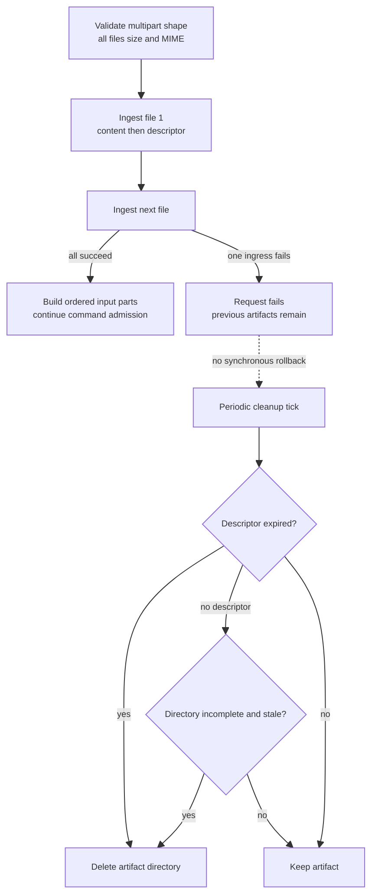

# 文件工件与附件：让字节停在边界，让引用进入事实层

> 版本与结论：本章为 `current`。冻结实现已形成 file ingress/read/ownership/cleanup 四端口、typed `WorkflowFileRef`、Lark attachment 下载入库、AgentRun 持久化前剥离 inline media，以及按需抽取/多模态 materialize/策略化回传链路；但跨消息的“先发文件、后发命令”仍没有可靠聚合契约，前端上传预览与 revisioned content artifact 也未落地。

## 设计抽象与事实源

- `src/workflow/Aevatar.Workflow.Abstractions/workflow_execution_messages.proto:129-153`、`:199-215`、`:265-274`：文件事实是带来源、完整性、时效与 owner 的 `WorkflowFileRef`，run/step 传引用而非文件内容。
- `src/workflow/Aevatar.Workflow.Infrastructure/CapabilityApi/WorkflowMultipartFileInputParser.cs:21-97`、`:110-172`：multipart 边界校验字段名、大小与 MIME，暂存 bytes 后交给 ingress，再构造 typed input part。
- `agents/Aevatar.GAgents.Channel.Runtime/protos/conversation_state.proto:11-40`：Conversation actor 只保留 bounded recent attachment activities 与 delivery facts；它不是文件内容仓库。

## 一条不变量：字节可以穿过边界，不能冒充 durable fact

“字节不进 actor”不是说进程从不看 bytes。HTTP multipart parser、Lark resource downloader、artifact store、document extractor、LLM request materializer 与 multipart upload adapter 都必须短暂处理内容。真正的不变量是：**一旦进入 actor-facing command/state/event/projection 主链，文件身份由 reference 表达；需要内容时才在窄边界按 ref 读取。**

`WorkflowFileRef` 同时承担四类事实：

| 维度 | 字段 | 设计作用 |
|---|---|---|
| identity | `file_id`、`artifact_id` | 找到 backing artifact；二者不能互相冲突 |
| provenance | `source_kind`、`source_message_id`、`source_resource_key` | 说明来自 chat、form、connected service、external resource 或 generated output |
| integrity/lifetime | `media_type`、`size_bytes`、`sha256`、创建/过期时间 | 读取时核对长度、hash 与 TTL，不信任调用方重复声明 |
| authority | `owner_run_id`、`owner_scope_id` | 将 artifact 单向绑定到 run/scope，冲突 owner fail closed |

为什么不是一个 URL？URL只回答“去哪里取”，不能证明内容是否被替换、是否已过期、属于哪个 run/scope，也会把 backing-store 布局泄漏给事实层。为什么不把 base64 放进 event？一份附件会随 EventStore、projection envelope、read model 与重放链路重复放大；#2673 已证明这会把大图片推到 Kafka 单消息上限附近。ref 把持久事实固定在小而可校验的描述符上。



## 入口：多个 producer，统一成同一种 ref

### JSON inline、multipart 与已有 ref

入口接受三种来源，但成功后的 actor-facing 形状相同：

1. JSON `inlineFile`：只作为 ingress 输入。async normalizer 解码 base64、核对可选 `sizeBytes`，调用 artifact ingress，并把 `DataBase64` 置空、填入 `FileRef`。
2. `multipart/form-data`：共享 parser要求所有 file part 使用同一配置字段名，逐文件检查非空、单文件大小和 allowlisted MIME；同名 file field可重复，保持 form 顺序。
3. 已有 `fileRef`：至少有 `fileId` 或 `artifactId`，校验 source kind 与时间范围后进入 command；public reusable ref不能自报 `sizeBytes`，大小以 store descriptor 为准。

multipart payload 不能再夹带 `inlineFile`、`fileRef` 或裸 `dataBase64`。这不是格式洁癖，而是避免同一 request同时声称两份相互冲突的文件事实。WebSocket 本身不收 multipart；调用方要先走 HTTP ingress取得 ref，或复用已有 ref。

下面是冻结契约允许的最小 JSON 入口。示例中的 base64 只活在 API ingress；它不是可持久化事件形状：

```json
{
  "prompt": "提取发票字段",
  "workflow": "invoice_review",
  "inputParts": [
    {
      "type": "image",
      "inlineFile": {
        "dataBase64": "aGVsbG8=",
        "mediaType": "image/png",
        "name": "invoice.png",
        "sizeBytes": 5
      }
    }
  ]
}
```

> Demo status：`verified-static`（核对 SDK JSON contract、`ChatRunRequestNormalizer.NormalizeAsync`、multipart parser、artifact lifecycle tests 与 proto roundtrip；本轮未启动 Host、未上传真实文件）。

### Lark attachment：adapter key 先变成 artifact identity

relay先把 Lark payload规范化为 `AttachmentRef`，其中 `attachment_id` 是 adapter-owned resource key，不是 durable artifact id。workflow draft-run只选择当前 command activity中的 Lark image/file attachment，使用该 activity 的 platform message id和入站 provider slug下载资源；每个下载结果进入 `IFileArtifactIngressPort`，得到带 `source_message_id`、`source_resource_key` 与 owner 的 ref。



这里必须区分“同一 activity 有多个附件”和“跨 activity 聚合”。前者已实现：parser与draft-run逐项处理文件，Conversation还维护最多五条、十分钟的 recent attachment activity window；普通 LLM reply会枚举该窗口，但只把可下载、未超限且当前 provider支持的Lark图片转成input part，其他附件只产生不可见提示。后者尚未形成 workflow command contract：Lark把文件和文本作为分开的消息时，`/workflow run` 仍只读取命令消息本身的 attachments，不能把上一条文件消息稳定 drain进本次 `input_file_refs`。

## Artifact backend：descriptor 是提交记录，owner 是运行事实

本地 filesystem backend 为每个 artifact 建目录，先写 `content.bin`，再写 `descriptor.pb`。descriptor包含服务端计算的 SHA-256、实际长度、TTL 与可选 owner。读取不只打开路径，还会：

- 校验 `workflow-file://` 与 `fileId` 一致，拒绝 path escape；
- 将调用方携带的 identity/hash/size/owner 与 authoritative descriptor 对照；
- 拒绝已过期 artifact；
- 对 backing content重新核对长度与 SHA-256。

run actor从 command input parts提取所有 ref，盖上自己的 `runId/scopeId`，再逐一调用 ownership port。已有同值 owner可幂等通过；已有不同 owner不能重绑。只有全部绑定成功，run才提交 `WorkflowRunExecutionStartedEvent.input_file_refs`。绑定同样不是批量事务：后项失败时，前项已经写入的owner不会回滚，但run不会提交execution-started fact。这让“文件属于谁”成为 run admission的一部分，而不是靠读取时猜测，也暴露了partial admission的真实恢复边界。

生产环境不允许隐式 filesystem：`WorkflowFileArtifacts:Backend` 必须为 `External`，并显式注册 ingress/read/ownership/cleanup 四个 port，少一个就启动失败。原因是本地目录不具备跨节点寻址与共同生命周期；把它当生产默认会让另一节点拿到合法 ref却找不到内容。

## 读取、抽取、多模态与回传：同一个 ref，三个窄出口

ref进入事实层后，字节只在有明确目的的出口重新出现：

| 消费者 | 如何读取 | 输出边界 |
|---|---|---|
| `document_extract` | `OpenReadAsync(fileRef)`；PDF/DOCX/UTF-8本地抽取，PNG/JPEG可经支持 image input 的 LLM | bounded text 或 schema-validated JSON，不返回 bytes/base64 |
| conversation/AgentRun LLM | step state持久化前清空非文本 `data_base64`；每次 provider request前按 ref重新读取并临时 materialize | bytes只进入这次 `LLMRequest`，不回写 durable step state |
| `workflow_file_submit` | 先读取 authoritative descriptor/content，再经 Host/provider policy收窄 method、size、selector | NyxID multipart adapter只返回安全 resource identifier和typed result，不回显 provider raw body |

为什么抽取和回传不直接拿 store path？因为 tool不应知道 filesystem/S3布局，也不能绕过 owner、TTL、hash与policy检查。read port把“能否读”与“如何存”分开；submit policy再把“读得到”与“允许发到哪里、能发多大”分开。

## 失败与清理：不是一个文件事务

multipart parser会先验证整批 pending files，但 artifact ingress仍是逐文件调用。若第 N 个写入失败，前 N-1 个已提交 artifact不会在请求内同步回滚；run owner binding也可能在后项失败前已绑定前项。当前没有 delete/rollback port。cleanup hosted service在启动时和周期 tick调用 provider-owned cleanup，filesystem实现删除过期 descriptor-committed artifact，以及超过 incomplete-age仍没有 descriptor的目录。



这不是 run完成即删：descriptor TTL 才是当前 retention事实，cleanup也没有从进程内 run/artifact registry推断归属。好处是 actor终态与对象清理不会伪装成跨系统事务；代价是失败请求可能暂时留下已提交但未被run采用的 artifact，直到TTL到期。

## 边界与演进：Current、兼容面与开放缺口

| 主题 | 冻结结论 | 不能外推 |
|---|---|---|
| actor持久化 | workflow主链持久化 `WorkflowFileRef`；AgentRun commit funnel清空非文本 inline base64 | 所有内部兼容 API都天然拒绝 `data_base64`；未注入 ingress port的normalizer仍保留兼容形状 |
| 多附件 | 同一 multipart form/activity可顺序产生多个 refs；普通Conversation LLM有bounded recent window | Lark独立文件消息与后续 `/workflow run` 已可靠聚合 |
| ownership | run/scope owner单向绑定，descriptor/read路径校验identity、owner、size、hash、TTL | ref本身就是授权凭证，或客户端声明metadata可替代store descriptor |
| cleanup | provider cleanup按TTL与staged completeness执行 | 请求失败同步回滚、run结束立即删除或跨backend已有统一delete API |
| artifact语义 | 当前 `FileArtifactRef` 解决输入/处理/提交中的binary artifact | 已有不可变revision、citation、current pointer的ContentArtifact资源 |

!!! warning "跨消息附件到workflow仍缺契约"

    open #2447 的关键断点仍存在：`ChannelWorkflowDraftRunInteractionPort` 只选择当前 command activity的attachments，而 `aevatar_invocation_tools.proto` 的 `InvocationContentPart` 只有inline text/base64/URI字段，没有typed file ref。退出条件是稳定的pending-attachment drain或tool invocation file-ref contract，并有“先发Lark文件、再发命令/skill trigger”的E2E回归。该缺口必须迁入 [12/05](../12/05-open-gaps-and-canon-drift.md)。

!!! warning "上传预览与revisioned content artifact尚未落地"

    open #2659 仍缺console的upload/select、preview/download、expired/redacted UI；open #2790 仍缺 `ContentArtifact` / immutable revision / provenance / citation / optimistic current pointer契约。二者不能用当前binary `FileArtifactRef` 与filesystem descriptor冒充。退出条件分别是前后端授权/retention联调测试，以及可寻址不可变revision与并发current-pointer测试；均登记到 [12/05](../12/05-open-gaps-and-canon-drift.md)。

## 读完应能回答

1. 为什么“字节不进事实层”不等于进程从不处理 bytes？
2. `WorkflowFileRef` 为什么比 URL 多承担 identity、integrity、lifetime 与 authority？
3. JSON inline、multipart、Lark attachment怎样收敛为同一种 actor-facing input？
4. AgentRun 如何既让 LLM看到图片，又不把 base64写进 durable step state？
5. 同一消息多附件与“先发文件、后发命令”为什么不是同一个已解决问题？

<details>
<summary>论断—冻结证据映射</summary>

| 论断 | 冻结证据 |
|---|---|
| ref包含identity、来源、MIME/size/hash/TTL与owner，并贯穿run/step facts | `src/workflow/Aevatar.Workflow.Abstractions/workflow_execution_messages.proto:129-153`、`:199-215`、`:265-274`、`:326-340`、`:536-546` |
| multipart校验字段名、大小、allowlisted MIME并保持多文件顺序 | `src/workflow/Aevatar.Workflow.Infrastructure/CapabilityApi/WorkflowMultipartFileInputParser.cs:21-97`、`:110-172`；`src/workflow/Aevatar.Workflow.Infrastructure/CapabilityApi/WorkflowMultipartChatRequestParser.cs:33-100` |
| JSON inline file经async normalizer解码入库并替换为ref | `src/workflow/Aevatar.Workflow.Infrastructure/CapabilityApi/ChatRunRequestNormalizer.cs:468-506`、`:569-650` |
| filesystem ingress计算hash/length/TTL，read校验descriptor、路径、过期、长度和hash | `src/workflow/Aevatar.Workflow.Infrastructure/Runs/FileSystemFileArtifactPort.cs:27-130`、`:172-230`、`:287-337` |
| run逐ref绑定owner，全部成功后才提交execution started input refs | `src/workflow/Aevatar.Workflow.Core/WorkflowRunGAgent.cs:523-562`、`:760-810` |
| Lark draft-run只下载当前activity附件并逐项生成ref | `agents/Aevatar.GAgents.NyxidChat/WorkflowDraftRun/ChannelWorkflowDraftRunInteractionPort.cs:238-323`、`:358-378` |
| Conversation保留bounded recent attachment activity，普通LLM selector可读取近期窗口 | `agents/Aevatar.GAgents.Channel.Runtime/protos/conversation_state.proto:11-40`；`agents/Aevatar.GAgents.Channel.Runtime/Conversation/ConversationGAgent.cs:3451-3525`；`agents/Aevatar.GAgents.NyxidChat/ConversationReplyGenerator.cs:915-943` |
| AgentRun在唯一commit funnel剥离inline media，executor在LLM调用前按ref临时materialize | `agents/Aevatar.GAgents.NyxidChat/AgentRunGAgent.cs:496-546`；`agents/Aevatar.GAgents.NyxidChat/AgentRunReplyGenerationExecutor.cs:173-184`、`:301-329` |
| document_extract按ref读取并对文本、PDF、DOCX、图片走受限分支 | `src/workflow/Aevatar.Workflow.Infrastructure/Runs/WorkflowDocumentExtractToolSource.cs:17-140`、`:144-303` |
| workflow_file_submit在artifact read、policy与multipart port之间fail closed | `src/workflow/Aevatar.Workflow.Infrastructure/Runs/WorkflowFileSubmitToolSource.cs:19-146`、`:245-305`；`src/Aevatar.AI.ToolProviders.NyxId/NyxIdWorkflowFileMultipartUploadPort.cs:7-60` |
| production必须显式External四端口，本地cleanup按TTL/不完整目录扫描 | `src/workflow/Aevatar.Workflow.Infrastructure/DependencyInjection/ServiceCollectionExtensions.cs:76-139`；`src/workflow/Aevatar.Workflow.Infrastructure/Runs/WorkflowFileArtifactCleanupHostedService.cs:8-80`；`src/workflow/Aevatar.Workflow.Infrastructure/Runs/FileSystemFileArtifactPort.cs:132-169` |
| tool invocation未提供typed file ref，跨消息workflow attachment仍缺契约 | `src/Aevatar.AI.ToolProviders.AevatarInvocation/aevatar_invocation_tools.proto:16-37`；`agents/Aevatar.GAgents.NyxidChat/WorkflowDraftRun/ChannelWorkflowDraftRunInteractionPort.cs:358-378` |

</details>
