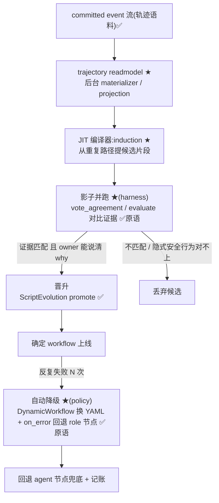
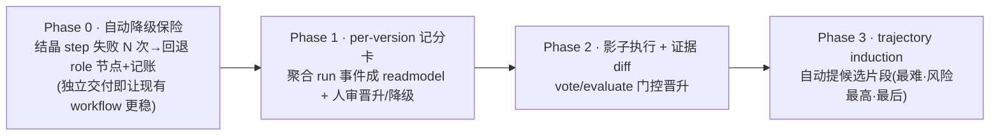

## 事实源

> 本篇是**产品层面的未来规划**(战略),区别于 [04 TODO List](04-todo-list.md) 的工程缺口清单(战术)。
> 核心论点来自一次产品战略对话,但**每条「aevatar 已有 X」的论断都已对照当前源码核实**
> (核对基线同 04 篇:`feature/integrate @ 803d1ab53`),净新建的部分明确标 ★。
> 高价值锚点(已验证存在):
> `src/Aevatar.Scripting.Core/ScriptEvolutionSessionGAgent.cs`、
> `src/Aevatar.Scripting.Abstractions/Definitions/ScriptEvolutionStatuses.cs`、
> `src/Aevatar.AI.ToolProviders.Skills/ISkillWorkflowMountPort.cs`、
> `src/workflow/Aevatar.Workflow.Core/Modules/`(含 `DynamicWorkflowModule.cs`/`EvaluateModule.cs`/`VoteAgreementModule.cs`)。

# 未来规划(战略):把「结晶梯度」做成一等的、可自迭代的生命周期

> 一句话:**aevatar 已经造好了梯度的两端和底座,真正稀缺、且只有它能造的,是中间那条
> 「结晶 + 影子 + 降级 + owner 验收」的回路。** 它恰好是市场真空,也恰好是
> `ScriptEvolutionSessionGAgent` 那台机器**再泛化一次**就能够到的地方。

---

## 1. 产品空白 = 市场真空(对源码核实后)

下面六样,OpenClaw / Lindy / Temporal / AWM 谁都没缝起来,aevatar 当前也没有 —— 但**底座已具备**。
✅ = 已有可复用载体;🟡 = 有雏形未产品化;★ = 净新建。

| # | 空白能力 | 现状(对源码核实) | 证据(已验证路径) | 归属 |
|---|---|---|---|---|
| 1 | **trajectory → workflow 结晶** | 全仓 grep `trajectory` **零命中**;committed event 流是完美轨迹语料却无人从"重复路径"induce workflow 片段。AWM 研究已证有效,产品侧空白。 | 语料已有:`src/Aevatar.Foundation.Core/EventSourcing/ICommittedStateEventPublisher.cs` + `src/Aevatar.CQRS.Projection.Core/README.md`(materializer) | ★ |
| 2 | **影子验证** | 无法让结晶出的新 workflow 与 agent 模式**并跑、对比证据后再晋升**。原语在,harness 无。 | 门控原语已有:`src/workflow/Aevatar.Workflow.Core/Modules/EvaluateModule.cs`、`VoteAgreementModule.cs`、`ReflectModule.cs` | ★(harness) |
| 3 | **自动降级** | 结晶 workflow 反复失败时无法自动退回 agent 节点兜底 ——「保险先于投资」完全缺失。**每多结晶一个,系统单调变脆一分。** | 底层事实已有:saga 补偿 + dead-letter(`src/workflow/Aevatar.Workflow.Core/Execution/WorkflowExecutionKernel.cs`、`workflow_state.proto`)+ `DynamicWorkflowModule.cs`(运行时换 YAML)+ `on_error` 路由 | ★(policy) |
| 4 | **梯度档位 = 被管理的位置** | skill 在左、workflow 在右,但没有「每类事务此刻该在梯度哪一档」这个一等概念,也没有搬动它的编译器/降级器。 | 两端载体已有(见 §2-(1)) | ★ |
| 5 | **per-version 记分卡** | usage 指标散在单条 committed event,没聚合成"v3 跑了 5 次、2 次卡在部署验证"这种能驱动晋升的版本级账本。 | 雏形:`src/Aevatar.Scripting.Projection/Projectors/ScriptEvolutionReadModelProjector.cs`(但 per-decision,非 per-version usage) | 🟡→★ |
| 6 | **owner 层** | 有短命 run actor + 长命 fact-owner actor,但没有「持 playbook、派 run、按版本记账、自提 diff」的那个 owner —— 整个模型的中枢。 | 雏形:`src/Aevatar.Scripting.Core/ScriptEvolutionManagerGAgent.cs`(manager actor,未产品化成 playbook owner) | 🟡→★ |

> **口径校正(不照搬对话,以源码为准)**:
> - 对话说的 `vote_consensus` → 实际模块是 `VoteAgreementModule`(`vote_agreement`);**无独立 `judge` 模块**,judge 由 evaluate/vote 承担。
> - 「降级回 **agent_run 节点**」→ 全仓**无字面 `agent_run` 原语**。"agent 节点" = 由 role 驱动的 agent loop(`WorkflowRoleGAgent` + `LLMCallModule` + `ToolCallModule`)。降级 = 用 `DynamicWorkflowModule` 把结晶子图换回 llm_call/role 节点;若要把 "agent_run" 做成一等节点,需**新增**。
> - 「35 个原语」→ 实际 `Modules/` 下 36 个文件,**约 31 个真实步骤模块**(余为 helper)。结论不变:已过边际收益拐点,**别再加原语**(见 §5)。

---

## 2. 核心产品:结晶梯度生命周期

把它定义成 aevatar 的**一等概念**,而不是 skill / workflow 之外的第三种东西。

```mermaid
flowchart LR
  subgraph OWNER["Owner actor(持 playbook · 派 run · 按版本记账 · 自提 diff)"]
    direction LR
  end
  S["① 散文 skill<br/>(agent loop 解释)"] -->|结晶| H["② 混合<br/>(workflow 骨架 + agent 节点)"]
  H -->|全结晶| W["③ 确定 workflow"]
  W -. "世界变了 / 反复失败 → 自动降级" .-> H
  H -. .-> S
  OWNER -. "管理每类事务此刻的梯度档位" .-> S
  OWNER -. .-> H
  OWNER -. .-> W
```

**(1) Playbook —— 横跨梯度的一等版本化实体。** 不是"skill 或 workflow",而是一个被拥有的产物,
其表示形态沿梯度移动:散文 skill → 混合(workflow 骨架 + agent 节点)→ 全结晶 workflow,
**每个片段当前在哪一档被显式记录**。载体已有:skill 可内嵌并 mount workflow ——
`src/Aevatar.AI.ToolProviders.Skills/ISkillWorkflowMountPort.cs`、`SkillWorkflowExtractor.cs`。

**(2) Owner actor —— 把已有的 fact-owner 概念产品化。** 持 playbook 引用、派 run、按 playbook 版本
记账、验收、升级、自提 diff。这正好兑现 CLAUDE.md「长期 actor 限定事实拥有者 / 短命 run actor」
(FI-001/FI-004),只是从架构原则**升级成产品表面**(对外是"我的事务全景")。
雏形 = `ScriptEvolutionManagerGAgent`,需泛化。

**(3) JIT 编译器 = trajectory induction(★)。** committed event 流就是语料;一个 synthesis service
从重复 agent 路径 induce 候选 workflow 片段。先加 **trajectory readmodel**(把 run 事件投影成结构化
轨迹)—— 它同时是可观察性资产("ES 免费送 observability")。**必须是后台 materializer**(见 §5)。

**(4) 影子验证(★) + (5) 自动降级(★) —— 用现成原语拼,不发明。**



**(6) 别新建,泛化你已有的那台机器。** 把 `ScriptEvolutionSessionGAgent` 的
`proposal → validation → promotion → rollback` 抽象成 `PlaybookEvolutionSessionGAgent`,
**加上 script 版还没有的两样:trajectory induction + 影子验证驱动的降级。**
最强卖点是"你离这个产品只差一次泛化",不是"造个新系统"。

> **核实:这台机器是真的。** `ScriptEvolutionStatuses` 的状态机已覆盖完整生命周期 ——
> `pending → proposed → build_requested → validated / validation_failed → promoted / promotion_failed / rejected → rollback_requested → rolled_back`
> (`src/Aevatar.Scripting.Abstractions/Definitions/ScriptEvolutionStatuses.cs`),配套
> `ScriptEvolutionProposal` / `ScriptEvolutionValidationReport` / `RuntimeScriptEvolutionRollbackService` /
> `DefaultScriptEvolutionPolicyEvaluator` 都在。**缺的只是 induction 与影子降级。**

---

## 3. 产品护栏 = 引擎不变量(不是文档建议,要做进引擎)

| 护栏 | 含义 | 对应不动点 |
|---|---|---|
| **凭 why 结晶,不凭计数** | 晋升门是结构化判据(owner 能说出"这步为什么不变"),**不是**"连续 N 次相同"计数器 —— 后者把巧合固化成流程。 | FI-006 基于 evidence |
| **隐式安全行为不许蒸发** | 影子 diff 的职责之一就是抓出"agent 每次顺手看一眼 dashboard 再部署、但没写进 YAML"这种动作;结晶前必须对得上。 | FI-006 |
| **扩权/扩爆炸半径无条件 `human_approval`** | owner 可自主优化"怎么做",**不能**自主扩大"能动什么"。 | FI-005 边界优先 |
| **验收契约 = run 的一等绑定(FI-001 产品化)** | owner 派 run 前声明验收标准;run 返回**证据**(diff/日志/hash)而非自述;用 `EvaluateModule` 派独立 verifier。把"对结果负责"从口号变引擎强制。 | FI-001 |
| **HITL 体验三细节落成结构化 payload** | 证据包 = diff + 爆炸半径 + 回滚方案(10 秒可决策);批的是**产物 hash**;suspend 数天后 resume 前**重验 precondition**(`GuardModule` 已有,接上即可)。 | FI-001/FI-006 |
| **通知反疲劳** | `NotifyModule` 默认:异常即时推、常规进 owner 级 digest、成功只进账本。 | — |

---

## 4. 竞争站位(一句 wedge)

> **「唯一会结晶的 durable agent runtime —— agent 把自己反复做的事编译成确定、可审计、可审批的
> workflow,世界变了再自动反编译回 agent 自愈。」**

这是把 **AWM(研究已证)productize 在 Restate 级底座上、再叠 HITL** —— 这个组合市面上没有任何一家在卖,
且 **.NET 企业生态那块几乎是空的**。
关键:这套打法**不和 Temporal 拼通用 workflow、也不和 LangGraph 拼 Python 生态**,正好打在 aevatar
已经付过成本的交叉点上(Actor + ES + CQRS + 35 原语 + ScriptEvolution 机器)。

---

## 5. 不要做什么(纪律)

- **别再加原语。** ~31 个已过边际收益拐点;再加是把复杂度当进步。
- **别先做编译器。** 顺序必须是**先做降级保险,再做自动结晶** —— 否则上线即变脆。
- **别让"结晶率"变成虚荣指标。** meta 工作要有预算上限,只对**高频、可说清 why** 的事务结晶。
- **别在 query path 做 induction。** 归纳是后台 materializer 的活,走 projection,**不在请求路径重放 ES**
  (这正是 04 篇 P2-5 / FI-004 的红线,也是本仓 05 章投影纪律)。

---

## 6. 落地排序(保险先于投资)



| Phase | 做什么 | 为什么这个顺序 | 复用 vs 新建 |
|---|---|---|---|
| **0** | **自动降级**:结晶 step 失败 N 次 → 自动回退 role(agent loop)节点 + 记账 | 先让结晶**安全**,再让它自动。独立交付就已让现有 workflow 更稳 | 复用 saga/dead-letter + `DynamicWorkflowModule` + `on_error`;★新增"反复失败→反编译"policy |
| **1** | **per-version 记分卡**(聚合 run 事件成 readmodel)+ owner 手动晋升/降级(人审) | 先把记账和人在环跑通 | 复用 `ScriptEvolutionManagerGAgent` + readmodel projector;★扩成 per-playbook-version |
| **2** | **影子执行 + 证据 diff**(用 `vote_agreement`/`evaluate` 门控晋升) | 解决"transcript→workflow 高错误率"和"隐式安全行为蒸发" | 复用 evaluate/vote 原语;★新增影子并跑 harness |
| **3** | **trajectory induction**(自动提候选片段) | 最难、风险最高,放最后 —— 前三档存在了它才安全 | ★新增 trajectory readmodel + synthesis service(后台 materializer) |

---

## 7. 与战术 TODO(04 篇)的衔接

战略要落地,有几条战术缺口是**前置 enabler**,见 [04 TODO List](04-todo-list.md):

- **P1-1(ADR-0034 saga)**:saga 补偿/dead-letter 是 Phase 0 自动降级的底层事实源 —— 先把它的 canon 口径扶正,降级 policy 才有可信依据。
- **P0-4 / 05 章投影纪律**:trajectory readmodel 必须走后台 materializer,不能踩 query-path 重放 ES 的红线。
- **P2-2(Tornado 降级路径)**:影子并跑要对比"证据",provider 能力不对称(Tornado 静默丢 tool/多模态)会污染对比结论,需先收口。

> **读者可回答**:aevatar 离"会结晶的 durable agent runtime"差哪几样(§1 的 6 项 ★/🟡)?
> 为什么先做降级再做结晶(§6 保险先于投资)?哪些是泛化已有机器、哪些是真新建(§2/§6 的 ✅/🟡/★ 标注)?

⟦AI:AUTO-LOOP⟧
