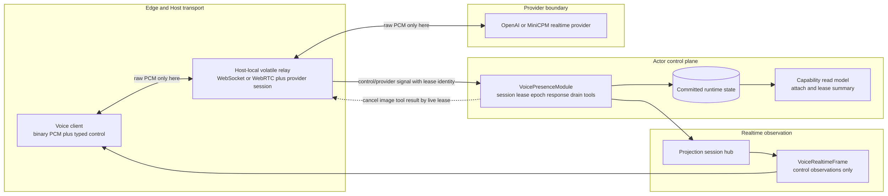
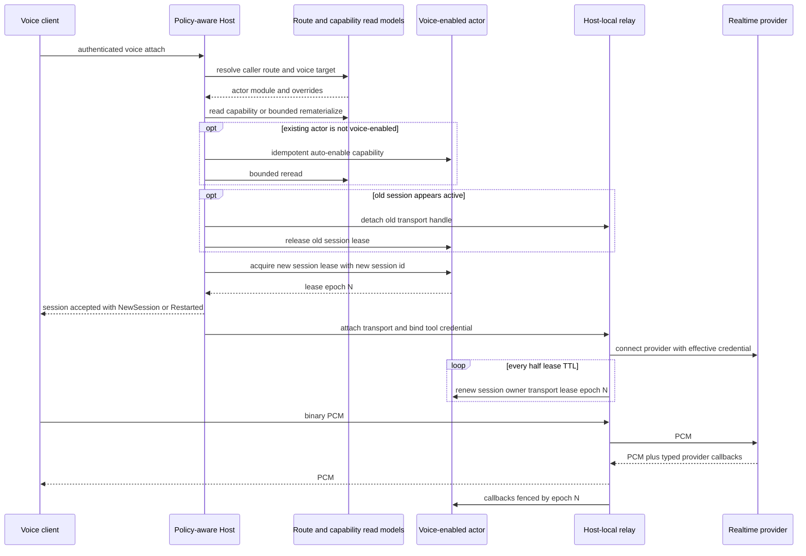
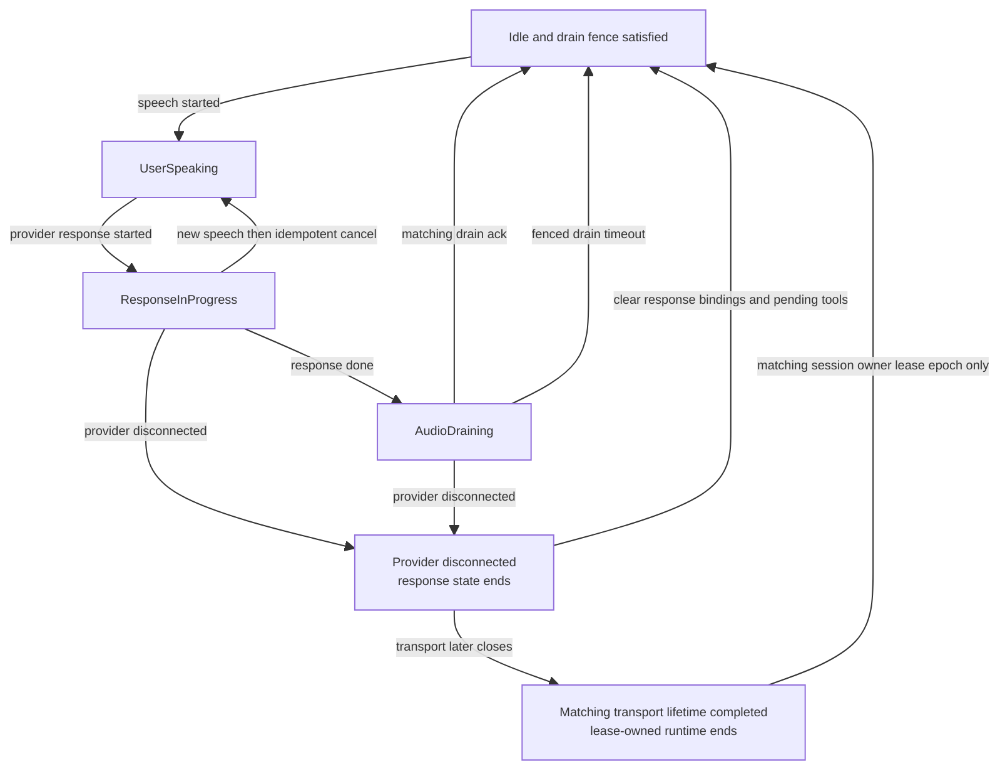

# Voice 控制面与媒体面：actor 记住语义，relay 搬运 PCM

> 版本与结论：本章为 `mixed`。冻结实现已经把会话、lease、response/drain、tool call 与凭证引用收进 actor 控制面，把 raw PCM 留在 Host-local relay，并以 `lease_epoch` 拒绝旧连接的迟到信号；但 `Restarted` 只是新会话接管，不是断点续传，首次连接也仍依赖既有 chat route。`transcript_delta/completed` 有 typed wire contract，却没有当前 provider producer 或 durable transcript history。

## 设计抽象与事实源

- `src/Aevatar.Foundation.VoicePresence.Abstractions/Protos/voice_presence.proto:150-180`、`:255-315`、`:368-505`：actor-owned runtime、provider/control frame 与 lease epoch 的稳定契约；raw audio 字段已从 actor-facing messages 移除并保留编号。
- `src/Aevatar.Foundation.VoicePresence.Abstractions/Sessions/IVoiceVolatileMediaStreamPort.cs:3-50`、`src/Aevatar.Foundation.VoicePresence/Hosting/VoiceVolatileMediaStreamPort.cs:43-100`：live relay 按 transport lease 寻址，找不到 relay 必须暴露 delivery gap。
- `src/Aevatar.Mainnet.Host.Api/Voice/PolicyAwareVoiceEndpoints.cs:190-250`、`:394-468`：认证 caller 先经 `ChatRoutePolicy` 得到 voice attach target，Host 签发、绑定并释放短期 tool credential reference。

## 一条边界：同一会话有三种数据，不是一份状态

Voice 不是第二套 Conversation actor。它是挂在既有 actor 上的 `VoicePresenceModule` capability：persona、tool catalog、回合与注入时机由这个 actor 的事件循环裁决；WebSocket/WebRTC 与 provider connection 只是可丢弃 transport handles。

冻结实现实际分成三层：

| 层 | 当前承载 | 生命周期与事实语义 |
|---|---|---|
| actor control plane | status、response id/binding、cancelled provider ids、drain ack、pending injection、session/owner/transport lease、`lease_epoch`、session config、tool context 与 pending client tool calls | `VoicePresenceRuntimeStateChangedEvent` 可提交、重放；capability read model 只投影 attach/lease 摘要 |
| realtime observation plane | response/speech/function/error/disconnect、预留的 transcript/display frame | projection session event hub 面向当前 session；不能自动等同于 Conversation history 或 durable transcript |
| volatile media plane | user PCM → provider、provider PCM → user，以及 provider session/WebSocket handles | 只存在于拥有 live relay 的 Host；不进 actor state、event envelope 或 read model |



为什么不是把 PCM 也写成 event？音频帧高频、大体积、只对活连接有意义；持久化会放大 EventStore、projection 与重放成本，却不能恢复已经错过的实时播放。反过来，为什么不能把 response/drain/tool 状态也放在 relay 字典？进程重启或跨节点调度会丢掉当前回合和安全注入栅栏，迟到 callback 也无法判断自己是否仍有权修改状态。边界按“是否需要重放和裁决”划分，不按“都来自 WebSocket”划分。

proto 还把 `VoiceProviderEvent.audio_received`、`VoiceModuleSignal.transport_audio_frame_received` 与 `VoiceRemoteTransportOutput.audio_output` 的编号/名字 `reserved`。这不是注释层约定，而是防止未来误复用旧字段号，把 raw audio 悄悄带回 actor-facing contract。

## Wire contract：binary 搬音频，text 搬有类型的语义

WebSocket binary message 是 PCM16；text message 解析为 `VoiceControlFrame` 或 input image。actor lease预检成功且WebSocket upgrade后，Host先回 `session_accepted`，其中有 actor/module/session、采样率、observed state version、wire contract version、image policy 和 `attach_outcome`，随后才尝试volatile relay attach；因此客户端仍可能在receipt之后收到attach/provider-credential失败的policy close。之后控制流使用 response/speech/error/disconnect 等 `VoiceRealtimeFrame`，播放端用 `drain_acknowledged(response_id, playout_sequence)` 说明哪一轮音频真正播完。

下面的控制帧是最小静态示例；PCM 不需要 JSON 包装：

```json
{
  "drainAcknowledged": {
    "responseId": 7,
    "playoutSequence": 42
  }
}
```

> Demo status：`verified-static`（核对 proto、`WebSocketVoiceTransport`、attach/session/module tests；本轮未启动 Host、未连接真实麦克风或 realtime provider）。

这里要对 transcript 保持克制。proto 的 `VoiceRealtimeFrame` 定义了 `transcript_delta` 与 `transcript_completed`，projection codec 也能序列化任意此类 frame；但冻结 OpenAI/MiniCPM adapter 只生产 response/speech/function/error/disconnect 与 PCM，`VoicePresenceModule.BuildRealtimeFrame` 也没有 transcript 分支。测试还明确断言 `drain_acknowledged` 只推进 drain 状态，不能伪造 `transcript_completed`。所以当前只有**可承载 transcript 的 wire shape**，没有“provider 已输出 transcript”或“actor 已提交 transcript history”的证据。

## Attach、lease 与 restart：新连接接管，不是续传旧 socket

一次 WebSocket attach 先经过 policy route，再进入 actor-owned session：

1. caller scope 与 channel 形成 `ChatRouteInput(source_kind=Voice)`；只有 policy action 带 voice attach target 才继续。
2. session 查询 capability read model；缺行时可从 committed facts rematerialize。对已经存在、runtime kind 已注册但未启用 voice 的 actor，还可首次 attach 时 auto-enable。
3. actor 授予五分钟 session lease；Host-local relay 每半个 TTL 发 renew signal。attach 再产生 transport lease 并连接 provider。
4. 若 projection 显示已有 active session/transport，新 attach 会先 detach/evict旧 handle，再用新的 session GUID acquire，receipt 标成 `Restarted`。每次 grant 增加 `lease_epoch`。
5. control、provider callback、image、renew、detach、lifetime completion 都必须同时匹配 session、owner、transport lease 与 epoch；旧 relay 的迟到帧静默失权。



`Restarted` 只说明接管成功：新 session id、新 lease、新 epoch，旧 relay 不再有状态写权。它不承诺 provider buffer、未播 PCM、transcript、pending client tool execution 或原 socket offset可以续上。这样做的取舍是安全优先：没有可验证 resume token 与 replay cursor时，声称“恢复原会话”比明确开始新会话更危险。

lower attach layer 仍可能对真实并发返回 typed conflict/409；上层 takeover 不是取消所有竞争检查。`IVoiceVolatileMediaStreamPort.Try*` 返回 `false` 也不能偷偷开替代 provider connection：只要 state 中已有 transport lease，找不到本 Host 的 live relay就是 delivery gap，避免同一 actor 回合出现第二条物理 provider session。

## Cancel、drain 与 disconnect：完成语义由 actor 裁决

用户在 response 播放中再次说话时，provider 的 `speech_started` 进入 actor。如果状态仍是 `ResponseInProgress`，actor要求 live relay发 `response.cancel`，记录 cancelled provider id、清理该 response 的 pending client tool calls；cancel先结束旧response，同一actor turn再把最终状态推进到 `UserSpeaking`。OpenAI adapter会吸收 `response_cancel_not_active` 与 `conversation_already_has_active_response` 这两类 benign race；它们说明幂等后置条件已经成立，不是用户可见的致命错误。

正常 response 完成则先到 `AudioDraining`，而不是立即 Idle。只有匹配当前 response 的 `drain_acknowledged` 才记录 playout sequence并释放栅栏；若客户端永远不回 ACK，带 session/owner/transport/epoch/response fence 的 durable timeout最终推进 Idle并 flush pending injections。provider disconnect会把 drain视为结束，并清理 response bindings 与 pending tool calls；remote-session分支会随之关闭session，transport-attach分支则仍要等匹配的detach/lifetime-completion signal才释放lease facts。



为什么要等 drain ACK，而不是把 provider `response_done` 当成播放完成？`response_done` 只证明 provider不再产生音频，不能证明客户端扬声器缓冲已经播放完。若此时注入下一条主动事件，音频可能重叠；drain fence把 provider完成和用户侧播放完成分成两个事实。timeout是活性兜底，不是假装收到了真实 ACK。

## 两类凭据：provider key 与 tool bearer 不共用生命周期

Voice connect 同时需要处理两种 authority，不能混成一个“voice token”：

| 凭据 | 解析时机与用途 | 当前保存边界 | 清理/兼容面 |
|---|---|---|---|
| provider credential | OpenAI provider connect时由 `IRealtimeProviderCredentialResolver` 经 NyxID mint短期 key | 只写入 effective config clone，开启物理 provider session，不进 actor state | resolver未注册或返回空时仍回退 static config key，属于 local/direct兼容面，不是所有 provider强制 broker |
| tool caller bearer | Host先从 WebSocket subprotocol、`Authorization` header、legacy query依次提取，签发约五分钟 `credential_ref` | actor/tool context保存 ref、expiry、caller/channel facts；raw bearer先在request-scope binding中短暂存在，attach后才按transport lease放入volatile port | endpoint在请求结束/失败时按ref幂等释放；media port在attach失败、detach或lifetime completion时按transport lease释放 |

NyxID provider broker只发生在 connect控制路径；拿到 ephemeral后，aevatar直连 OpenAI，NyxID不进入每个PCM frame的热路径。这样既缩短长期 provider secret的暴露边界，又不为音频每帧增加代理延迟。必须同时承认冻结实现的兼容面：OpenAI仍允许 static `ApiKey` fallback，MiniCPM也没有同一套 NyxID ephemeral broker，因此“所有语音 provider 都零长期密钥”不是 current事实。

tool bearer则不能写进 actor event。endpoint把它换成 opaque ref；issue结果中的raw binding只在当前request对象中传递，media port成功绑定到具体 transport lease后才进入volatile dictionary并可被 `ICredentialProvider.ResolveAsync`短暂解析。endpoint `finally` 与 media-port cleanup看似都有释放，但索引和阶段不同，释放实现是幂等 remove：前者在请求结束或失败时按ref扫除残留binding，后者在attach失败、detach或lifetime completion时按lease精确移除。

## 边界与演进：Partial zero-config 与 reconnect

open #2319 的原始描述已经**部分落地**：

- capability read model缺行时，WebSocket路径可从 committed actor facts rematerialize；
- 对已存在且runtime kind已注册的actor，首次attach可自动enable voice capability；
- enable已提交但projection窗口内未追上时，返回带 `Retry-After` 的 typed `voice_capability_not_ready` 503，而不是把异步可见性误报为永久404。

仍未落地的是完整首次连接 provisioning。`/ws/voice` 在进入这些步骤前就要让 `ChatRoutePolicy` 解析出 `ChatRouteVoiceAttachTarget`；它只会rematerialize已有route，不会为缺失caller route创建默认route。route reject/缺失仍403，`ForwardToModel`却没有voice target仍501。WHIP路径甚至只读materialized route，不执行legacy route recovery。

此外，当前 `WebSocketVoiceTransport` 断开即结束receive loop，executor随后detach并释放lease。客户端可以重新拨号并得到 `Restarted`/新会话，但服务端没有“同一socket自动重连、用resume token恢复provider buffer与未播音频”的契约。

!!! warning "完整 zero-config voice 仍缺 route provisioning"

    #2319 的剩余断点是：authenticated caller没有既有 chat route时，WebSocket不会自动建立可审计的default voice route/actor binding。退出条件是定义route owner、幂等provision identity、失败补偿与并发首次连接规则，并以“空账号第一次连接 → route创建 → actor capability enable → attach”集成测试覆盖。该缺口必须迁入 [12/05](../12/05-open-gaps-and-canon-drift.md)。

!!! warning "Restarted 不是可恢复重连"

    当前takeover解决陈旧lease与旧relay迟到信号，不保存或恢复provider会话、PCM cursor、transcript与pending tool执行。退出条件是明确resume token、可恢复与必须丢弃的状态、epoch/cursor组合规则，以及网络抖动、pod切换、重复client并发的端到端测试；事故与剩余缺口分别迁入 [12/04](../12/04-incident-case-studies.md) 与 [12/05](../12/05-open-gaps-and-canon-drift.md)。

!!! warning "Transcript contract 尚无 current producer"

    `VoiceRealtimeFrame` 已为delta/completed保留typed case，但冻结providers与module不生产它们，actor state也没有durable transcript集合。退出条件是provider adapter到realtime hub的producer测试，并先决定transcript是否只做volatile display、还是进入Conversation-owned history；在所有权决定前不能由drain ACK合成完成事件。登记到 [12/05](../12/05-open-gaps-and-canon-drift.md)。

## 读完应能回答

1. 为什么 raw PCM 可以经过 Host，却不能进入 actor event/read model？
2. control plane、realtime observation与volatile media各自保存什么，丢失后语义有何不同？
3. `Restarted` 与真正的resume/reconnect为什么不是同一能力？
4. `lease_epoch` 怎样阻止旧relay、旧provider callback和旧lifetime completion清掉新会话？
5. provider credential与tool bearer为什么要用两套ref/binding/cleanup边界？

<details>
<summary>论断—冻结证据映射</summary>

| 论断 | 冻结证据 |
|---|---|
| runtime持有response/drain、provider binding、lease/owner/epoch、session config、tool context与pending tool call | `src/Aevatar.Foundation.VoicePresence.Abstractions/Protos/voice_presence.proto:127-180` |
| raw provider/transport audio从actor-facing proto移除并保留字段，PCM只走transport/relay/provider session | `src/Aevatar.Foundation.VoicePresence.Abstractions/Protos/voice_presence.proto:255-268`、`:450-488`；`src/Aevatar.Foundation.VoicePresence.Abstractions/IVoiceTransport.cs:3-34`；`src/Aevatar.Foundation.VoicePresence/Hosting/VoiceVolatileMediaStreamPort.cs:409-489` |
| transcript有wire case但冻结provider/module无producer，drain ack不合成transcript | `src/Aevatar.Foundation.VoicePresence.Abstractions/Protos/voice_presence.proto:271-315`；`src/Aevatar.Foundation.VoicePresence/Modules/VoicePresenceModule.cs:1160-1199`；`test/Aevatar.Foundation.VoicePresence.Tests/VoicePresenceModuleTests.cs:41-96` |
| capability可rematerialize/auto-enable，projection lag为retryable 503 | `src/Aevatar.Foundation.VoicePresence/Hosting/ActorOwnedVoiceRealtimeSession.cs:46-117`；`src/Aevatar.Foundation.VoicePresence/Hosting/VoiceWebSocketAttachExecutor.cs:149-193` |
| takeover先evict旧handle，再以新GUID acquire并返回Restarted | `src/Aevatar.Foundation.VoicePresence/Hosting/ActorOwnedVoiceRealtimeSession.cs:119-223` |
| transport/provider signals以session、owner、lease、expiry与epoch接受，lifetime completion只清匹配会话 | `src/Aevatar.Foundation.VoicePresence/Modules/VoicePresenceModule.cs:733-838`、`:893-919` |
| lease TTL为五分钟，relay半TTL续约；attach失败/detach/lifetime完成都会释放relay、lease与tool credential binding | `src/Aevatar.Foundation.VoicePresence/Hosting/ActorOwnedVoiceRealtimeSession.cs:8-18`；`src/Aevatar.Foundation.VoicePresence/Hosting/VoiceVolatileMediaStreamPort.cs:43-145`、`:212-307` |
| response done进入drain，matching ACK或带完整fence的timeout回Idle；speech-start驱动idempotent cancel | `src/Aevatar.Foundation.VoicePresence/Modules/VoicePresenceModule.cs:224-311`、`:590-705`、`:1971-2031`；`src/Aevatar.Foundation.VoicePresence.OpenAI/OpenAIRealtimeProvider.cs:154-162` |
| live transport lease存在但本Host无relay时返回delivery gap，不开替代provider connection | `src/Aevatar.Foundation.VoicePresence.Abstractions/Sessions/IVoiceVolatileMediaStreamPort.cs:29-50`；`src/Aevatar.Foundation.VoicePresence/Modules/VoicePresenceModule.cs:1373-1410` |
| tool bearer按subprotocol/header/query取值，换成短期ref并按transport lease绑定/释放 | `src/Aevatar.Mainnet.Host.Api/Voice/PolicyAwareVoiceEndpoints.cs:190-250`、`:252-330`、`:362-388`；`src/Aevatar.Foundation.VoicePresence/Hosting/VoiceVolatileToolCredentialPort.cs:18-123` |
| OpenAI connect可经NyxID mint ephemeral，也保留static config fallback；resolved key只写effective clone | `src/Aevatar.Bootstrap.Extensions.AI/NyxIdRealtimeProviderCredentialResolver.cs:55-123`；`src/Aevatar.Foundation.VoicePresence.OpenAI/OpenAIRealtimeProvider.cs:337-370` |
| `/ws/voice`必须先解析已有route到voice target，不创建缺失route | `src/Aevatar.Mainnet.Host.Api/Voice/PolicyAwareVoiceEndpoints.cs:394-468` |
| WebSocket断开结束receive loop，executor随后detach，没有server-side resume loop | `src/Aevatar.Foundation.VoicePresence/Transport/WebSocketVoiceTransport.cs:87-141`；`src/Aevatar.Foundation.VoicePresence/Hosting/VoiceWebSocketAttachExecutor.cs:32-116` |

</details>
