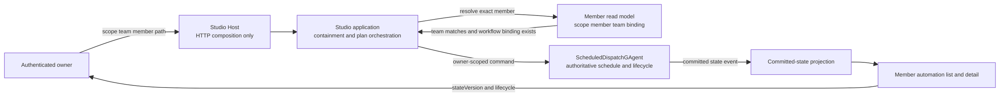
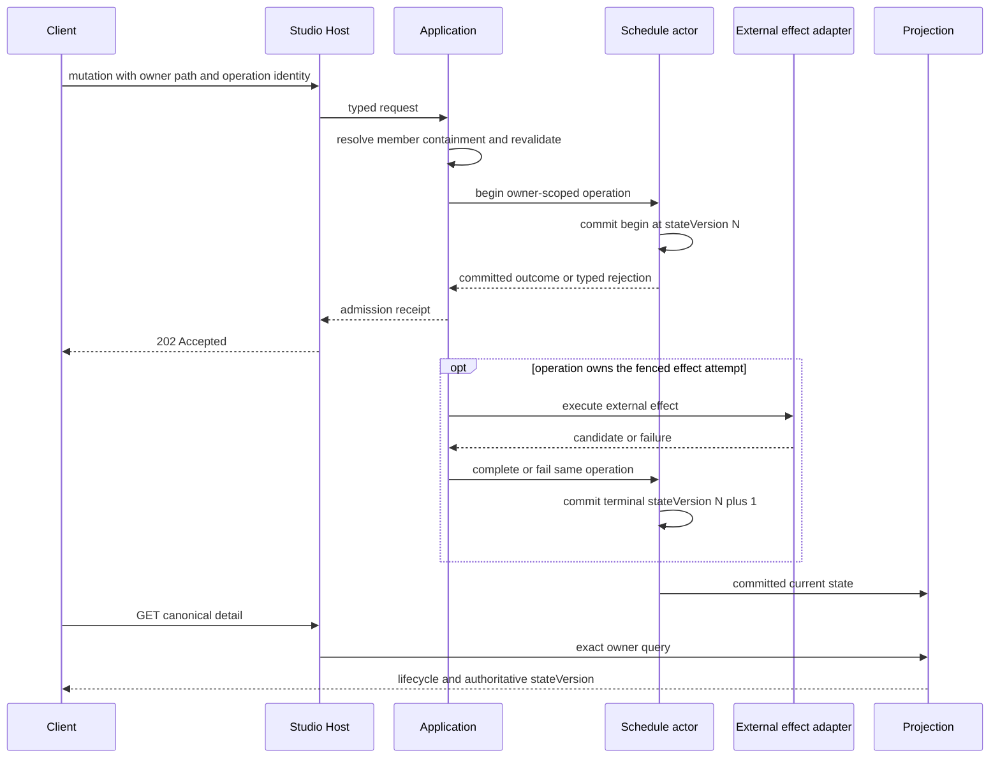

# Team Member Automation：资源 API、所有权与读模型

> 版本与结论：本章描述 `current`。canonical Studio 定时资源位于 exact scope/team/member 层级下；Host 只组合 HTTP，application 每次重新验证 member containment 与 workflow binding，`ScheduledDispatchGAgent` 持有 schedule/lifecycle 事实，Projection Pipeline 提供查询副本。所有 mutation 的 `202 Accepted` 都只是受理收据，不能替代更高 `stateVersion` 的 projected 终态。

## 设计抽象与事实源

- `src/Aevatar.Studio.Hosting/Endpoints/StudioMemberAutomationEndpoints.cs:19-47`、`:76-123`、`:227-398`：canonical collection 与 preflight/create/update/reauthorize/pause/resume/run-now/delete/retry-revocation HTTP surface。
- `src/platform/Aevatar.GAgentService.Abstractions/Schedules/TeamAutomationOperationObservationContracts.cs:5-47`：begin/candidate/complete/delete/fail/revocation 是 committed operation stages，outcome携带 authoritative `StateVersion`。
- `src/platform/Aevatar.GAgentService.Projection/Queries/ScheduledDispatchQueryPort.cs:47-154`、`:158-235`：read-model query按owner过滤并映射 lifecycle、fire、credential摘要与state version。

## 资源身份：owner 是 scope/member，team 是 containment guard

canonical collection root 是：

```text
/api/scopes/{scopeId}/teams/{teamId}/members/{memberId}/automations
```

这条路径不是为了把四个字符串拼成更长URL，而是让每次操作都重做三层判断：authenticated caller可访问 `scopeId`；`memberId` 在该scope内存在；member当前仍属于path中的 `teamId` 且实现类型是workflow，并有可调度的published binding。application从member summary派生 `publishedServiceId`，浏览器不能提交或替换它。

actor持久owner是 `(scopeId, memberId)`；`teamId` 保存当前assignment并作为请求时的containment guard，但不是可漂移的第二owner。这样member即使被错误地从另一个team路径访问，也返回not found，不泄露跨team资源；`scheduleId` 单独出现同样不构成权限。actor还拒绝把已经归属一个owner的schedule改给另一个owner。



为什么不是让前端直接提供 `workflowId` 或 `publishedServiceId`？这些是服务端binding事实；接受客户端值会把“选择页面资源”变成“指定授权执行目标”，产生confused deputy。为什么owner不包含team？member是长期资源，team是可验证assignment；若team也成为可变owner，转组就需要迁移schedule identity与凭据owner，反而扩大并发与补偿面。

## API surface：操作很多，事实 owner 仍只有一个

| Method / suffix | 语义 | HTTP结果能证明什么 | 后续权威观察 |
|---|---|---|---|
| `POST /preflight` | 纯读地构建当前typed authorization plan | 当前证据下的plan与digest | 不创建automation或credential |
| `GET` / `GET /{scheduleId}` | list/detail exact member-owned projected rows | 读模型当前可见版本 | 比较`stateVersion`与lifecycle字段 |
| `POST` | begin create与credential lifecycle | command/effect被受理 | `active`或稳定失败状态 |
| `PUT /{scheduleId}` | revalidate后更新cron/timezone/enabled等 | update受理 | 更高版本的definition与状态 |
| `POST /reauthorize` | 用fresh plan替换credential generation | replacement受理 | `active`新generation或失败 |
| `POST /pause` / `/resume` | 改变是否允许fire | action受理 | projected `enabled` |
| `POST /run-now` | owner-scoped manual fire | fire command受理 | fire record与run终态 |
| `DELETE` | 先提交tombstone与双轨revocation intent | delete受理 | cleanup终结后not found |
| `POST /retry-revocation` | fresh bearer重试原cleanup operation | retry受理 | 原operation两条track终结 |

preflight与write-side revalidation故意不同。preflight只读当前证据，适合让用户确认permission digest；create/update/reauthorize在写入前必须再次核验，catalog变化时返回plan conflict或可重试projection lag。否则用户确认的是版本A，系统却可能按版本B签发权限。

### 最小调用骨架

下面只演示资源协议，不填真实身份、bearer或permission digest：

```bash
curl -X POST \
  "$HOST/api/scopes/$SCOPE/teams/$TEAM/members/$MEMBER/automations/preflight" \
  -H "Authorization: Bearer $TOKEN" \
  -H 'Content-Type: application/json' \
  -d '{"scheduleCron":"0 9 * * *","scheduleTimezone":"Asia/Shanghai","enabled":true}'
```

> Demo status：`verified-static`（核对endpoint request contract、application owner resolution、query mapping与冻结tests；本轮未启动Host、未创建automation）。

## `202`、committed operation 与 projection 是三个时刻

mutation receipt包含 `accepted`、`status`、`scheduleId`、`operationId` 与 `commandId`。它只表示请求进入了异步actor/effect协议。create可能尚未把credential candidate提交，delete可能仍有NyxID或Vault track pending；此时把receipt渲染成“已完成”会隐藏真正需要恢复的状态。

operation observation按 `begin → candidate → complete` 或 `delete → revocation` 等stage跟踪同一个 `operationId/idempotencyKey`。每个committed outcome带 `StateVersion`，projection再将current state写成query document。客户端应在canonical list/detail中观察到不低于所需版本的row，才解释其lifecycle。



为什么需要committed operation observation，不能只轮询read model？effect执行者必须知道自己的begin/candidate/complete是否被actor接受，以及是否仍拥有fenced attempt；read model是最终查询副本，可能滞后，不能给writer发放副作用所有权。反过来，为什么用户不直接查询actor？产品query需要分页、owner过滤和稳定public shape，projection把actor内部状态收窄为非敏感资源view。

## Read model：公开状态不是actor state镜像

`StudioMemberAutomationView`公开schedule定义、`enabled`、下一/上次fire、lifecycle、credential source/expiry/generation、revocation摘要、owner LLM选择与 `stateVersion`。它不公开raw key或Vault `SecretReference`。关键lifecycle如下：

| `authorizationStatus` | 解释 |
|---|---|
| `provisioning_pending` | create effect已开始，active generation尚未提交 |
| `active` | credential generation可用；是否fire仍由`enabled`决定 |
| `needs_authorization` | owner/service/policy/digest/expiry/credential证据需要重新确认 |
| `replacement_pending` | reauthorize的新generation尚未终结 |
| `deleting` | tombstone/revocation intent已提交或执行中 |
| `revocation_pending` | 至少一条外部cleanup track未完成，资源仍必须可查 |
| `failed` | lifecycle operation以稳定错误终结 |

`enabled=false`不等于credential revoked，`active`也不等于刚才的workflow run成功。schedule resource、credential health与每次run是三组正交事实；将它们压成一个green/red badge会让暂停、授权失败和业务执行失败无法区分。

query还隔离generic schedule与Team automation：generic get/list排除team-owned documents，Team API要求exact owner并可在revocation pending时继续看到deleted row。只有required cleanup完成，删除资源才从canonical detail消失。

## 边界与演进：canonical surface 不是所有schedule的别名

- Team Member Automation使用workflow schedule kind与server-derived service target；generic schedule不是fallback。
- one-call `/provision-workflow` 是独立C1 surface，授权生命周期不同，不能借本章API或生产证据证明它。
- `SkillRunnerGAgent` 已退役；不要为兼容旧名重新添加runner actor、projection或query route。
- `run-now`证明manual fire路径，不证明wall-clock cron按时到达；两者的证据层级在 [09/05](05-production-canary-and-recovery.md) 分开。
- credential plan、Agent Key与revocation的内部不变量分别见 [09/03](03-owner-authorization-and-agent-key.md) 与 [09/04](04-vault-reference-and-revocation-compensation.md)。

## 读完应能回答

1. 为什么automation owner是`scopeId + memberId`，而`teamId`是每次重验的containment guard？
2. 哪些API返回`202`，为什么它们都不能证明resource已经到终态？
3. preflight与write-side revalidation为什么不能合并成一次长期有效的检查？
4. committed operation outcome与projected read model分别服务writer和reader的什么需求？
5. `active`、`enabled`、fire/run success为什么必须是三类不同事实？

<details>
<summary>论断—冻结证据映射</summary>

| 论断 | 冻结证据 |
|---|---|
| Host映射canonical member automation全套route并统一返回typed receipts | `src/Aevatar.Studio.Hosting/Endpoints/StudioMemberAutomationEndpoints.cs:19-47`、`:76-123`、`:227-398` |
| application按scope读取member、校验team与workflow implementation，并从binding派生published service | `src/Aevatar.Studio.Application/Studio/Services/StudioMemberWorkflowSchedulePort.cs:983-1020` |
| list/get/update/action都先解析exact member owner | `src/Aevatar.Studio.Application/Studio/Services/StudioMemberWorkflowSchedulePort.cs:242-406` |
| actor owner比较以scope/member为identity并拒绝owner变化 | `src/platform/Aevatar.GAgentService.Core/Schedules/ScheduledDispatchGAgent.cs:1963-2004`、`:2119-2147` |
| generic query/mutation排除或拒绝team-owned，Team query要求exact owner | `src/platform/Aevatar.GAgentService.Application/Schedules/ScheduledDispatchApplicationService.cs:164-205`、`:608-668` |
| operation observation区分stage/rejection并携带state version与effect ownership | `src/platform/Aevatar.GAgentService.Abstractions/Schedules/TeamAutomationOperationObservationContracts.cs:5-47` |
| public view含lifecycle/fire/credential摘要和stateVersion但不含secret reference | `src/Aevatar.Studio.Application.Abstractions/Provisioning/StudioMemberWorkflowScheduleContracts.cs:109-159` |
| query document按team owner过滤并映射authoritative summary | `src/platform/Aevatar.GAgentService.Projection/Queries/ScheduledDispatchQueryPort.cs:47-154`、`:158-235` |
| canon明确Team automation owner、202语义、projected lifecycle与retired runner边界 | `docs/canon/scheduled-skill-runners.md:34-94`、`:9-32` |

</details>
