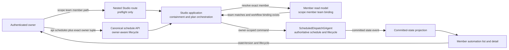
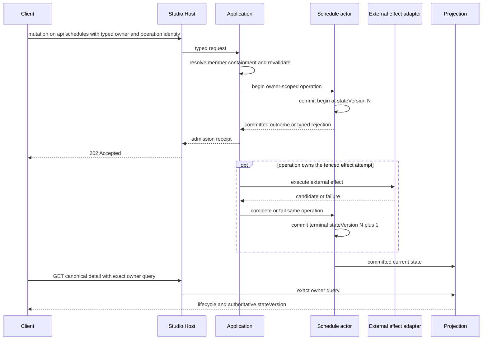

# Team Member Automation：资源 API、所有权与读模型

> 版本与结论：本章描述 `current`。产品导航中的 Team Member Automation 位于 exact scope/team/member 层级下，但该 nested Studio HTTP route **只保留 preflight**；list/read/create/update/enable/disable/delete/run-now 的 current lifecycle surface 统一为携带 typed owner 的 `/api/schedules`。稳定 owner 是 `scopeId + teamId + memberId` 三元组。`ScheduledDispatchGAgent` 持有 schedule/lifecycle 事实，Projection Pipeline 提供查询副本；所有 mutation 的 `202 Accepted` 都只是受理收据，不能替代更高 `stateVersion` 的 projected 终态。

## 设计抽象与事实源

- `docs/canon/scheduled-skill-runners.md:34-88`：nested route 只做 preflight；lifecycle 统一走 owner-aware `/api/schedules`；稳定 owner 是 scope/team/member 三元组。
- `docs/canon/scheduled-skill-runners.md:97-121`：mutation receipt、projected lifecycle、双轨撤销与 canonical read-after-write 边界。
- `docs/operations/2026-07-23-scheduled-agent-key-production-canary.md:1625-1851`：首次删除与 pending/failed track 恢复复用同一 canonical `DELETE`、原 owner/reason/operation/idempotency，仅刷新 bearer。

## 资源身份：产品层级与 lifecycle API 是两条不同边界

产品资源位置是：

```text
/scopes/{scopeId}/teams/{teamId}/members/{memberId}/automations
```

它表达 Studio 中“某个 Team 的某个 member 的 automation”这一产品归属；一旦 owner 已知，Team detail 的 query-string 选择也必须收敛到这条资源路径，不能成为另一种 owner。对应的 nested Host HTTP surface 只有：

```text
POST /api/scopes/{scopeId}/teams/{teamId}/members/{memberId}/automations/preflight
```

preflight 纯读地解析 Studio member，验证 path 中的 `teamId` 确实包含该 member、implementation 是 bound workflow，并从 member summary 派生 `publishedServiceId`。浏览器不能提交或替换 `workflowId`、`publishedServiceId`、grant、expiry 或 credential material。

actor 持久 owner 则是 exact `(scopeId, teamId, memberId)`。`teamId` 既参与 preflight containment，也参与稳定 owner identity；它不是可从 member 当前 assignment 临时补回的 guard。owner 一旦写入便不能改变，任一 scope/team/member 不匹配都按 not found 隐藏资源，`scheduleId` 单独出现从不构成 authority。



为什么不是让前端直接提供 `workflowId` 或 `publishedServiceId`？这些是服务端 binding 事实；接受客户端值会把“选择页面资源”变成“指定授权执行目标”，产生 confused deputy。为什么 owner 必须包含 team？因为同一个 member ID 经由错误 Team path 到达时，系统必须在 authority identity 层拒绝，而不能靠一次易漂移的 assignment lookup 把它归一成同一 owner。转组也不能静默改写已有 schedule/credential owner；原 tuple 的 lifecycle 必须先按权威协议处置。

## API surface：nested preflight，owner-aware lifecycle

| Operation | Current surface | Owner carrier | HTTP结果能证明什么 | 后续权威观察 |
|---|---|---|---|---|
| preflight | nested `POST .../automations/preflight` | path 的 scope/team/member | 当前证据下的 plan 与 digest | 不创建 automation 或 credential |
| list / detail | owner-aware `/api/schedules` collection/detail | query 中的 `ownerKind/ownerScopeId/ownerTeamId/ownerMemberId` | 读模型当前可见版本 | 比较 `stateVersion` 与 lifecycle 字段 |
| create | `POST /api/schedules` | request 中的 typed Studio member automation owner | command/effect 被受理 | `active` 或稳定失败状态 |
| update / reauthorize | canonical `/api/schedules` lifecycle request | request 中的同一 typed owner | mutation/replacement 受理 | 更高版本 definition 与 credential generation |
| enable / disable / run-now | canonical `/api/schedules` action surface | exact owner query/request | action/fire admission | projected `enabled`、fire record 与 run 终态 |
| first delete | `DELETE /api/schedules/{scheduleId}` | body 中的 typed owner | tombstone 与双轨 revocation admission | 两条 track 终结后 not found |
| unfinished revocation recovery | **重放同一** `DELETE /api/schedules/{scheduleId}` | 原 owner/reason/operation/idempotency；仅 bearer 刷新 | 原 cleanup operation 再次准入 | 原 operation 两条 track 终结 |

固定 canon 明确了 canonical root、owner 传递与 operation 集合，并给出了 delete 的 exact wire shape；其他 action 的具体 method/suffix 仍应从部署时同版本 OpenAPI 读取，不能从旧 nested route 猜回。

preflight与write-side revalidation故意不同。preflight只读当前证据，适合让用户确认permission digest；create/update/reauthorize在写入前必须再次核验，catalog变化时返回plan conflict或可重试projection lag。否则用户确认的是版本A，系统却可能按版本B签发权限。

### 最小调用骨架

下面只演示边界切换，不填真实身份、bearer、permission digest 或任何 credential material：

```bash
curl -X POST \
  "$HOST/api/scopes/$SCOPE/teams/$TEAM/members/$MEMBER/automations/preflight" \
  -H "Authorization: Bearer $TOKEN" \
  -H 'Content-Type: application/json' \
  -d '{"scheduleCron":"0 9 * * *","scheduleTimezone":"Asia/Shanghai","enabled":true}'

OWNER_QUERY="ownerKind=studio_member_automation&ownerScopeId=$SCOPE&ownerTeamId=$TEAM&ownerMemberId=$MEMBER"

curl -X POST "$HOST/api/schedules" \
  -H "Authorization: Bearer $TOKEN" \
  -H 'Content-Type: application/json' \
  -d "$(jq -n \
    --arg scope "$SCOPE" --arg team "$TEAM" --arg member "$MEMBER" \
    --arg digest "$CONFIRMED_PERMISSION_DIGEST" \
    --arg policy "$CONFIRMED_POLICY_VERSION" \
    --arg op "$OPERATION_ID" --arg idem "$IDEMPOTENCY_KEY" '{
      ownerKind: "studio_member_automation",
      ownerScopeId: $scope,
      ownerTeamId: $team,
      ownerMemberId: $member,
      scheduleCron: "0 9 * * *",
      scheduleTimezone: "Asia/Shanghai",
      enabled: false,
      confirmedPermissionDigest: $digest,
      confirmedPolicyVersion: $policy,
      credentialProvisioningKind: "dedicated_scheduled_invocation_agent_key",
      operationId: $op,
      idempotencyKey: $idem
    }')"

curl -H "Authorization: Bearer $TOKEN" \
  "$HOST/api/schedules/$SCHEDULE_ID?$OWNER_QUERY"
```

> Demo status：`verified-static`（按 controller 固定 end-range canon 核对 nested preflight、owner-aware create/read 与 owner 三元组；本轮未启动 Host、未创建 automation）。

!!! warning "固定事实源的 route drift"
    固定 production runbook 的 create/detail/run-now 示例仍保留较早的 nested lifecycle route，而同一 end-range 的 `docs/canon/scheduled-skill-runners.md:44-82` 已明确 nested route 只剩 preflight、其余 lifecycle 统一走 owner-aware `/api/schedules`。因此这些 runbook 片段只解释当次版本化 canary，不能作为 current route contract；本章以更新后的 canon 为准。

## `202`、committed operation 与 projection 是三个时刻

mutation receipt包含 `accepted`、`status`、`scheduleId`、`operationId` 与 `commandId`。它只表示请求进入了异步actor/effect协议。create可能尚未把credential candidate提交，delete可能仍有NyxID或Vault track pending；此时把receipt渲染成“已完成”会隐藏真正需要恢复的状态。

operation observation按 `begin → candidate → complete` 或 `delete → revocation` 等stage跟踪同一个 `operationId/idempotencyKey`。每个committed outcome带 `StateVersion`，projection再将current state写成query document。客户端应在canonical list/detail中观察到不低于所需版本的row，才解释其lifecycle。



为什么需要committed operation observation，不能只轮询read model？effect执行者必须知道自己的begin/candidate/complete是否被actor接受，以及是否仍拥有fenced attempt；read model是最终查询副本，可能滞后，不能给writer发放副作用所有权。反过来，为什么用户不直接查询actor？产品query需要分页、owner过滤和稳定public shape，projection把actor内部状态收窄为非敏感资源view。

## Read model：公开状态不是actor state镜像

`StudioMemberAutomationView`公开schedule定义、`enabled`、下一/上次fire、lifecycle、credential source/expiry/generation、revocation摘要、owner LLM选择与 `stateVersion`。它不公开raw key或Vault `SecretReference`。关键lifecycle如下：

| `authorizationStatus` | 解释 |
|---|---|
| `provisioning_pending` | create effect已开始，active generation尚未提交 |
| `active` | credential generation可用；是否fire仍由`enabled`决定 |
| `needs_authorization` | owner/service/policy/digest/expiry/credential证据需要重新确认 |
| `replacement_pending` | reauthorize的新generation尚未终结 |
| `deleting` | tombstone/revocation intent已提交或执行中 |
| `revocation_pending` | 至少一条外部cleanup track未完成，资源仍必须可查 |
| `failed` | lifecycle operation以稳定错误终结 |

`enabled=false`不等于credential revoked，`active`也不等于刚才的workflow run成功。schedule resource、credential health与每次run是三组正交事实；将它们压成一个green/red badge会让暂停、授权失败和业务执行失败无法区分。

query还隔离generic schedule与Team automation：generic get/list排除team-owned documents，owner-aware schedule API要求exact scope/team/member tuple，并可在revocation pending时继续看到deleted row。只有required cleanup完成，删除资源才从canonical detail消失。

## 边界与演进：canonical surface 不是所有schedule的别名

- Team Member Automation使用workflow schedule kind与server-derived service target；generic schedule不是fallback。
- one-call `/provision-workflow` 是独立C1 surface，授权生命周期不同，不能借本章API或生产证据证明它。
- `SkillRunnerGAgent` 已退役；不要为兼容旧名重新添加runner actor、projection或query route。
- `run-now`证明manual fire路径，不证明wall-clock cron按时到达；两者的证据层级在 [09/05](05-production-canary-and-recovery.md) 分开。
- credential plan、Agent Key与revocation的内部不变量分别见 [09/03](03-owner-authorization-and-agent-key.md) 与 [09/04](04-vault-reference-and-revocation-compensation.md)。

## 读完应能回答

1. 为什么automation稳定owner必须是`scopeId + teamId + memberId`，而不能在请求时只靠member assignment补回team？
2. 哪些API返回`202`，为什么它们都不能证明resource已经到终态？
3. preflight与write-side revalidation为什么不能合并成一次长期有效的检查？
4. committed operation outcome与projected read model分别服务writer和reader的什么需求？
5. `active`、`enabled`、fire/run success为什么必须是三类不同事实？

<details>
<summary>论断—冻结证据映射</summary>

| 论断 | 冻结证据 |
|---|---|
| nested Studio route 只保留 preflight，并由服务端解析 member containment、binding 与 published service | `docs/canon/scheduled-skill-runners.md:34-50` |
| list/read/create/update/enable/disable/delete/run-now 统一属于 owner-aware `/api/schedules` | `docs/canon/scheduled-skill-runners.md:52-61` |
| 初次删除与未完成 revocation 恢复重放同一 DELETE，原 owner/reason/operation/idempotency 不变，仅刷新 bearer | `docs/canon/scheduled-skill-runners.md:63-82`、`docs/operations/2026-07-23-scheduled-agent-key-production-canary.md:1625-1851` |
| 稳定 owner 精确包含 scope/team/member，任一不匹配按 not found 隔离，owner 不可变 | `docs/canon/scheduled-skill-runners.md:84-95` |
| receipt 只是 admission，projected `stateVersion` 与 lifecycle 才是 durable reader evidence | `docs/canon/scheduled-skill-runners.md:97-115` |
| schedule actor 持有 lifecycle 事实，projection 持有 query replica，client 不直接写 actor state | `docs/canon/scheduled-skill-runners.md:86-88`、`:117-129` |

</details>
