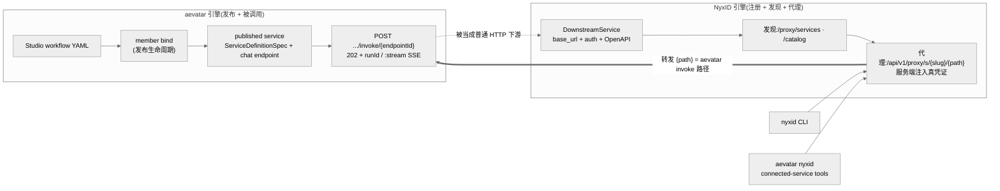
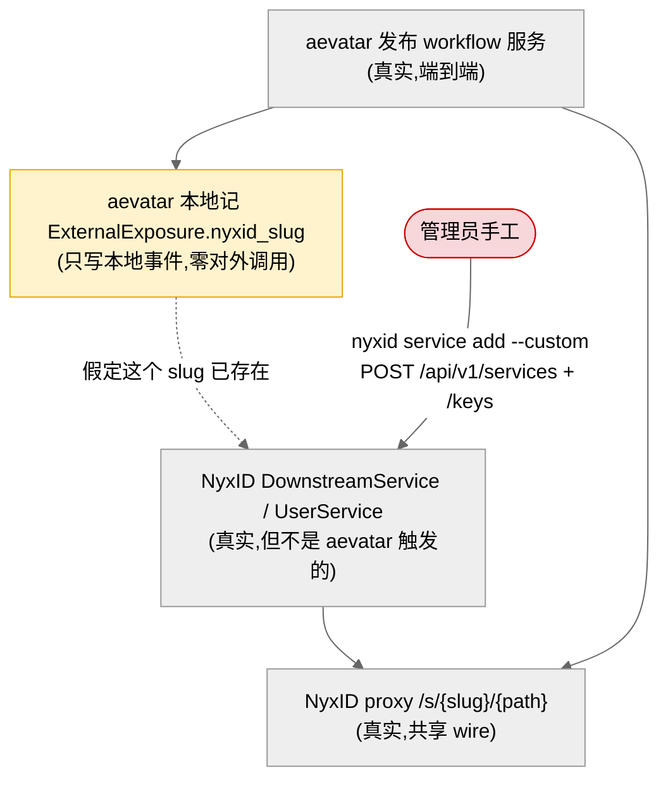

# 机制总览:两半引擎与它们相遇的那一根线

## 事实源/设计抽象(以 ~/Code/aevatar 为准)

> 本篇先把「当前可用的机制」摊开:aevatar 侧能做什么、NyxID 侧能做什么、两者在哪根线上相遇。事实源脊柱:

- `src/platform/Aevatar.GAgentService.Hosting/Endpoints/ScopeServiceEndpoints.cs`:aevatar 把实现(workflow/script/gagent)发布成 published service、并对外提供发现/调用的统一前门。
- `src/platform/Aevatar.GAgentService.Abstractions/Protos/service_definition.proto`:`ServiceDefinitionSpec` + `ExternalExposure`(aevatar 服务模型,protobuf 强类型)。
- `~/Code/NyxID/backend/src/models/downstream_service.rs`:NyxID `DownstreamService` 描述符(base_url + auth_method + 加密凭证 + OpenAPI spec URL),即「一个下游服务」在 NyxID 里是什么。
- `~/Code/NyxID/backend/src/handlers/proxy.rs`:`/api/v1/proxy/s/{slug}/{path}` 代理入口——两半相遇的**唯一**线。

---

把整件事拆成两台各自独立、各自完整的引擎,再看它们靠哪根线咬合。



## 1. aevatar 半截:发布 + 被调用,是真的

aevatar 早就有一套**「把一个实现发布成可调用服务」**的治理机制,落在 `Aevatar.GAgentService.*`(Governance)层:

- **published service / scope service**:一个由 4 段 `ServiceIdentity`(tenant=scopeId / app / namespace / serviceId)标识的、持久的对外契约面。它有一个或多个 named **endpoint**(每个带 `kind`= `command` | `chat`、请求/响应的 protobuf type-url)。
- **实现种类(implementation kind)**:`workflow` | `script` | `gagent`。workflow 就是其中一种——一段 Studio workflow YAML 被发布后,变成一个 `Workflow` 种类的 service revision,带一个 `chat` endpoint(请求 `ChatRequestEvent` / 响应 `ChatResponseEvent`)。
- **发布 = bind + activate**:`CreateService → EnsureEndpointCatalog → CreateRevision → Prepare → Publish → SetDefaultServingRevision → Activate` 一条生命周期跑完,服务就在 `POST .../invoke/{endpointId}` 上可调用了。
- **调用语义**:异步。invoke 返回 `202 Accepted` + `ServiceInvocationAcceptedReceipt`(带 `runId` / `statusUrl`),或者 `:stream` 变体直接吐 `text/event-stream`(AG-UI / workflow-run-event 帧)。

这半截在 [02 发布路径](02-publish-path.md)、[04 调用](04-calling.md)展开,关键事实:**它产出的就是一个普通(虽然鉴权门很硬)的 HTTP 服务**。这一点决定了 NyxID 能不能代理它——能,因为 NyxID 代理的就是普通 HTTP。

## 2. NyxID 半截:注册 + 发现 + 代理,是真的

NyxID 的产品本体是**凭证经纪 + 通用反向代理**。它眼里「一个下游服务」分两层:

| 层 | 是什么 | 谁建 | API |
|---|---|---|---|
| 目录层 `DownstreamService` | 平台级描述符:base_url、auth_method、加密的 master 凭证、OpenAPI/AsyncAPI spec URL、能力标记、AI 发现元数据 | 管理员 | `POST /api/v1/services` |
| 连接层 `UserService` | 把**某个用户自己的凭证**绑到一个目录项(或一个完全自定义的 endpoint)上,产出可代理的实例 | 任意用户 / agent | `POST /api/v1/keys`(= `nyxid service add`) |

- **发现**:`GET /api/v1/proxy/services`(你已连接、可代理的服务 + 它们的 proxy URL)、`GET /api/v1/catalog`(可连接的目录模板)、`GET /api/v1/catalog/{slug}/endpoints`(从 OpenAPI 解析出的具体 operation)。AI agent 走 MCP meta-tool `nyx__discover_services`。
- **代理**:`ANY /api/v1/proxy/s/{slug}/{path}`(或按 id `/proxy/{service_id}/{path}`)。调用方只带自己的 NyxID 凭证;NyxID 按 `auth_method`(bearer / header / query / basic / path / token_exchange / aws_sigv4 …)**服务端注入真凭证**再转发。调用方永远看不到下游的真 key。
- **两个注入平面**:**cloud broker**(凭证在 NyxID 里 envelope 加密,NyxID 解密后自己转发)与 **node proxy**(凭证留在用户机器上,NyxID 只把请求元数据经长连 WebSocket 发给用户跑的 node agent,由 node 本地注入)。后者是给「跑在防火墙后的私有服务」用的——一个**内网自托管的 aevatar host** 正好落在这个场景。详见 [03](03-register-and-discover.md)。

这半截在 NyxID 仓库里**完全实现、与 aevatar 无关**:它对 OpenAI、GitHub、和任何一个 HTTP API 一视同仁。

## 3. 相遇点:唯一一根线 + 一颗本地指针

两台引擎只在**一个 wire 契约**上真正咬合:`POST /api/v1/proxy/s/{slug}/{path}`。

- NyxID CLI 的 `nyxid proxy request <slug> <path>` 命中它;
- aevatar 自己的 connected-service tools(`NyxIdApiClient.ProxyRequestAsync`)也命中它——**字节级同一个 endpoint**。

而 aevatar 模型里,与 NyxID 唯一的**结构性**联系是 `ServiceDefinitionSpec` 上一个可选字段:

```proto
message ExternalExposure {
  string nyxid_slug = 1;
  google.protobuf.Timestamp registered_at = 2;
}
```

⚠️ **关键诚实点**:这颗 `nyxid_slug` 是 aevatar **本地记下的一个指针**,通过 `PUT /api/services/{serviceId}/external-exposure` 写入(只 dispatch 一个 event-sourced 命令,文件里没有任何 `HttpClient`/NyxID 调用)。它**不向 NyxID 注册任何东西**,只是声明"这个已发布服务在 NyxID 那边以 `<slug>` 注册过了"——而那个 slug 必须由别的动作(管理员手工)先在 NyxID 创建出来。方向是反的:**NyxID 是发现/代理权威,aevatar 只是又一个被人工接上的下游**。



## 4. 当前可用机制一览表

| 机制 | 在哪 | 状态 | 备注 |
|---|---|---|---|
| 发布 workflow 为服务 | aevatar `PUT /api/scopes/{scopeId}/members/{memberId}/binding` | ✅ 现役 | member-first(ADR-0016) |
| 调用已发布服务 | aevatar `POST .../invoke/{endpointId}`(+`:stream`) | ✅ 现役 | 异步 202 + runId / SSE |
| aevatar 记录"已外部暴露" | aevatar `PUT /api/services/{serviceId}/external-exposure` | ⚠️ 仅本地指针 | 不调 NyxID |
| 注册下游服务 | NyxID `POST /api/v1/services` / `POST /api/v1/keys` | ✅ 现役 | **需人工**,无 aevatar 自动注册 |
| 发现服务 | NyxID `/proxy/services` · `/catalog[/{slug}/endpoints]` | ✅ 现役 | OpenAPI 驱动 operation 发现 |
| 代理调用 | NyxID `/api/v1/proxy/s/{slug}/{path}` | ✅ 现役 | 凭证服务端注入;cloud / node 两平面 |
| aevatar 反向把 NyxID service 当工具 | aevatar `NyxIdConnectedServiceToolSource` + `x-aevatar-tool` | ✅ 现役 | 见 [04](04-calling.md) |
| **发布→NyxID 自动发现/注册** | — | ❌ 不存在 | 靠手工 + 手写 OpenAPI 补缝 |

## 验收

1. 当前有哪些可用机制?**aevatar 侧**:发布(member bind)、调用(invoke 202/SSE)、本地外部暴露指针(external-exposure)。**NyxID 侧**:注册(`/services`、`/keys`)、发现(`/proxy/services`、`/catalog`)、代理(`/proxy/s/{slug}/{path}`,cloud+node 两平面)。
2. 两半在哪相遇?在**唯一一个** wire 契约 `POST /api/v1/proxy/s/{slug}/{path}` 上;CLI 与 aevatar 自身的 nyxid tools 都命中它。
3. 缺什么?「发布即被 NyxID 发现」这一跳没有代码实现——`ExternalExposure.nyxid_slug` 只是本地指针,注册是人工动作。这是整条方案唯一需要靠流程(而非现成 API)补上的缝。

⟦AI:AUTO-LOOP⟧
