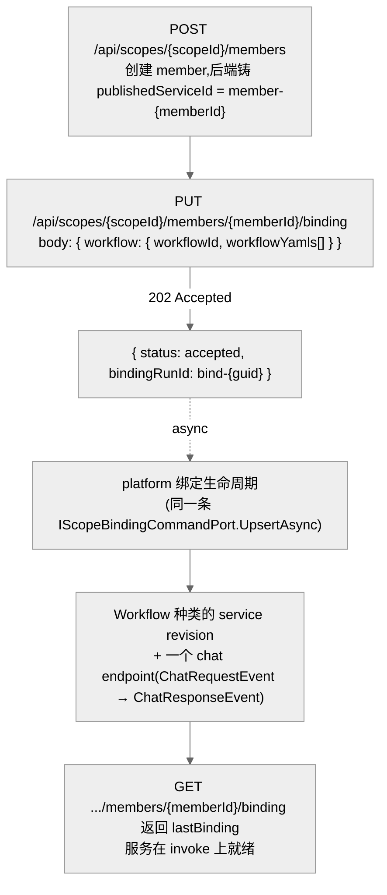
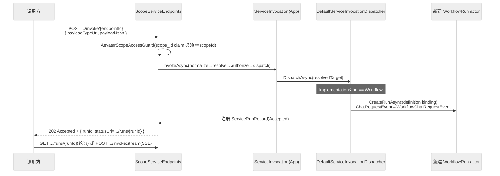

# 发布路径:Studio workflow → 可调用的 published service

## 事实源/设计抽象(以 ~/Code/aevatar 为准)

> 本篇回答方案的第一问:**「我在 Studio 建了一个 workflow,通过 aevatar 的什么 API 把它发布成能被调用的服务?」** 事实源脊柱:

- `src/Aevatar.Studio.Hosting/Endpoints/StudioMemberEndpoints.cs`:Studio member 生命周期前门,member-first bind(`PUT .../members/{memberId}/binding`)在这里。
- `src/platform/Aevatar.GAgentService.Hosting/Endpoints/ScopeServiceEndpoints.cs`:scope-default bind(`PUT .../binding`)、调用契约查询(`.../endpoints/{endpointId}/contract`)、invoke。
- `src/platform/Aevatar.GAgentService.Infrastructure/Dispatch/DefaultServiceInvocationDispatcher.cs`:按实现种类分发,`Workflow` 分支把 invoke 变成一个新的 workflow run actor。
- `docs/adr/0016-studio-member-first-published-service.md`:member 是 Studio 唯一主对象、每个 member 拥有一个稳定 `publishedServiceId` 的权威决策。

---

## 1. 心智模型:member 才是主对象,workflow 只是它的"实现种类"

ADR-0016 把 Studio 的语义钉死成一条链:

```
scope → member → implementation(workflow/script/gagent) → published service → endpoint → run
```

要点(直接决定你调哪个 API):

- **member 是唯一主对象**,`workflow / script / gagent` 是同一个 member 的**实现种类**,不是平行的顶层对象。
- **每个 member 出生即拥有一个稳定的 `publishedServiceId`**(后端在创建时生成 = `member-{memberId}`,重命名不变)。普通用户**不需要、也不应该手填 `serviceId`**。
- **Bind = 把当前实现修订发布到该 member 自己的那个 published service**,不是"去服务目录里挑一个服务"。

所以「发布一个 Studio workflow」= **创建/选定一个 member → 把 workflow YAML bind 到它**。



## 2. 发布 API:两条路,同一套生命周期内核

### 路 A(推荐 / Studio 正道):member-first bind

```bash
# 1) 创建 member(若已有则跳过)
curl -X POST "$AEVATAR/api/scopes/$SCOPE/members" \
  -H "Authorization: Bearer $AEVATAR_JWT" -H 'Content-Type: application/json' \
  -d '{ "displayName": "Invoice Triage", "implementationKind": "workflow" }'

# 2) 把 Studio workflow 发布到该 member 的 publishedServiceId(异步)
curl -X PUT "$AEVATAR/api/scopes/$SCOPE/members/$MEMBER/binding" \
  -H "Authorization: Bearer $AEVATAR_JWT" -H 'Content-Type: application/json' \
  -d '{ "workflow": { "workflowId": "invoice-triage", "workflowYamls": ["<your workflow YAML>"] } }'
# → 202 { "status": "accepted", "bindingRunId": "bind-...", "scopeId": "...", "memberId": "..." }
```

- `PUT .../members/{memberId}/binding` 返回 **202** + `bindingRunId`,`ServiceId` 全程不由用户提供。
- 异步阶段内部复用平台的 `IScopeBindingCommandPort.UpsertAsync`,显式传 `ServiceId = member-{memberId}`,跑完 `CreateService → EnsureEndpointCatalog → CreateRevision(Workflow) → Prepare → Publish → SetDefaultServingRevision → Activate`。
- 用 `GET .../members/{memberId}/binding` 查 `{ lastBinding: { publishedServiceId, revisionId, implementationKind, boundAt }, currentBindingRun }` 确认发布完成。

### 路 B(平台 / 迁移期):scope-default bind

```bash
curl -X PUT "$AEVATAR/api/scopes/$SCOPE/binding" \
  -H "Authorization: Bearer $AEVATAR_JWT" -H 'Content-Type: application/json' \
  -d '{ "implementationKind": "workflow", "workflowYamls": ["<your workflow YAML>"] }'
# → 200 ScopeBindingUpsertResult(同步返回)
```

- `PUT /api/scopes/{scopeId}/binding` **同步**跑完同一条生命周期,upsert 该 scope 的**默认**服务(`ServiceId` 省略时落到 `options.DefaultServiceId`)。
- 适合"一个 scope 就一个服务"的简单场景或迁移期;member-first 才是 ADR-0016 的权威语义。

> ⚠️ 还有第三个东西别混:`POST /api/services/{serviceId}/bindings`(治理层 service binding)绑的是**依赖**(connector / secret / bound-service / policy),不是"发布一个实现"。本篇讲的发布,是上面路 A / 路 B。

## 3. 发布出来的"服务"长什么样(调用方需要的契约)

发布完,服务在 aevatar 内部**可发现 + 可调用**。一个 endpoint 的调用契约可以直接查:

```bash
GET /api/scopes/{scopeId}/services/{serviceId}/endpoints/{endpointId}/contract
```

返回 `ScopeServiceEndpointContractHttpResponse`,把调用方需要的东西全给齐:

| 字段 | 含义 | 对接 NyxID 时的用途 |
|---|---|---|
| `InvokePath` | `/api/scopes/{scopeId}/services/{serviceId}/invoke/{endpointId}`(+`:stream`) | 就是要写进 NyxID 代理的 `<path>` |
| `Method` = `POST` | 调用方法 | NyxID `proxy request -m POST` |
| `RequestTypeUrl` / `ResponseTypeUrl` | 请求/响应的 protobuf type-url(= 输入 schema 引用) | workflow 的 `chat` endpoint 即 `ChatRequestEvent` / `ChatResponseEvent` |
| `RequestContentType` / `ResponseContentType` | `application/json` / `json` 或 `text/event-stream` | 决定是否 `:stream` |
| `SupportsSse` / `SupportsAguiFrames` | 是否支持流式 | NyxID `--stream` |
| `SampleRequestJson` / `CurlExample` / `FetchExample` | **可直接抄的示例请求体** | 不用猜 body 形状 |

> **务实建议**:对接 NyxID 之前,先调一次 `.../endpoints/{endpointId}/contract`,把 `InvokePath` 和 `SampleRequestJson` 抄下来——这就是后面写 NyxID OpenAPI、构造 `nyxid proxy request` 时唯一需要的权威信息。

服务在 scope 内的列表与就绪态:

```bash
GET /api/scopes/{scopeId}/services            # ScopeServiceHttpResponse[]:含 endpoints + InvokeReady
GET /api/scopes/{scopeId}/members/{memberId}/published-service   # 解析 member → publishedServiceId
```

## 4. 调用一次会发生什么(为后面"被 NyxID 代理"打底)

invoke 是**异步**的,这是后面对接 NyxID 时要心里有数的一点:



- **buffered**:`POST .../invoke/{endpointId}` → `202` + `runId` + `statusUrl`;之后 `GET .../runs/{runId}` 观察、`POST .../runs/{runId}:resume|:signal|:stop` 控制。
- **streaming**:`POST .../invoke/{endpointId}:stream` → `text/event-stream`,RunStarted / 帧 / RunError,2 分钟超时。
- 对 `Workflow` 种类,**`runId` 故意等于新建的 workflow run actor id**,所以 `/runs/{runId}` 与 SSE 的 RunStarted 共用同一标识。
- 请求体 `InvokeScopeServiceHttpRequest`:`{ payloadJson + payloadTypeUrl }`(JSON 形)或 `{ payloadBase64 + payloadTypeUrl }`(二选一);省略 `revisionId` 用当前 active serving revision。

## 5. 为什么是这个设计(正当性)

- **为什么 member-first、用户不碰 serviceId?** 因为 published service 是"契约面"而非"身份"。把身份钉在 member 上、`publishedServiceId` 由后端从不可变 member 身份派生且重命名安全(ADR-0016),既避免了"workflowId / serviceId / actorId 互相冒充身份"的混乱,也让普通用户的心智只剩"我的一个 member 发布了"。
- **为什么 invoke 是 202 异步、解析走读模型?** actor 运行时的投递契约本就是 accepted-only(`IActorDispatchPort` 只承诺"已入 inbox",不等于"已处理/已提交")。目标解析全程走读侧(catalog readiness + prepared revision artifact),不碰活 actor 状态——invoke 因此快、与 actor 放置解耦,并能把"未就绪"作为显式 `SERVICE_INVOKE_UNAVAILABLE` 快速失败门。
- **这对 NyxID 对接意味着什么?** NyxID 代理转发后拿到的是一个 `202 + runId`(buffered)或一段 SSE(stream),**不是同步业务结果**。任何"经 NyxID 调 workflow"的调用方,都要按"提交 + 观察"两段式来用,而不是期待一次 proxy 调用同步返回最终答案。这一点 [04 调用](04-calling.md) 会再强调。

## 验收

1. 用哪个 API 发布 Studio workflow?**`PUT /api/scopes/{scopeId}/members/{memberId}/binding`**(member-first,推荐,202+bindingRunId),或迁移期的 `PUT /api/scopes/{scopeId}/binding`(scope-default,同步)。两者复用同一条 `CreateService→…→Activate` 生命周期。
2. 发布出来的服务怎么拿到调用契约?`GET .../services/{serviceId}/endpoints/{endpointId}/contract` 直接给 `InvokePath`、`Method`、请求/响应 type-url、`SampleRequestJson`——对接 NyxID 只需这一份。
3. 调用语义?异步:`POST .../invoke/{endpointId}` → 202+runId(轮询 `/runs/{runId}`)或 `:stream` SSE;workflow 种类下 runId == workflow run actor id。

⟦AI:AUTO-LOOP⟧
