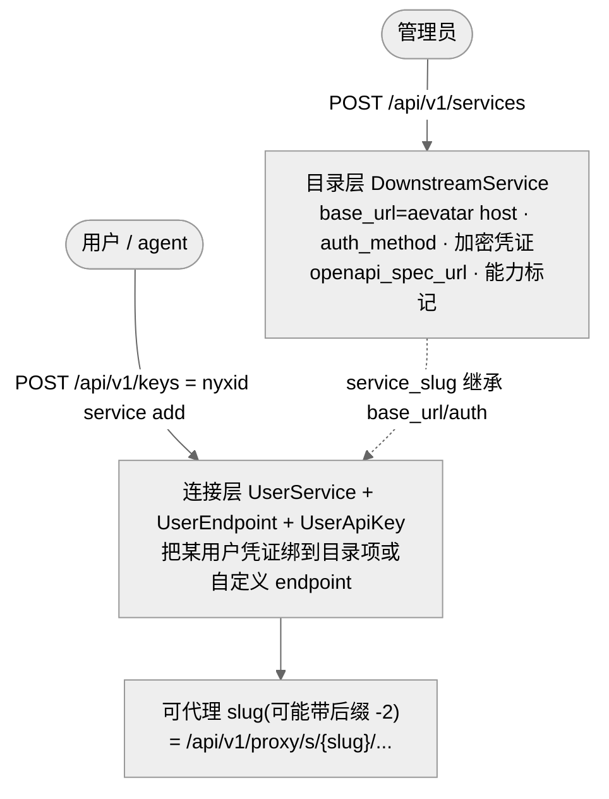
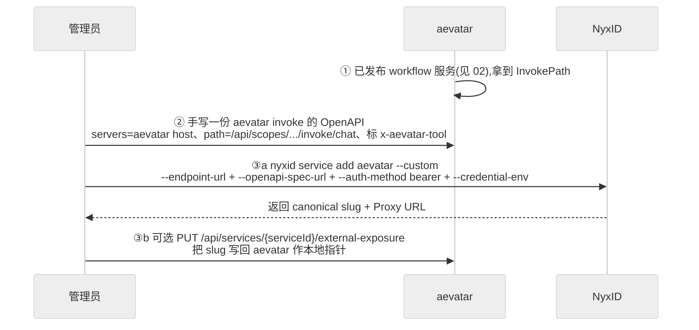
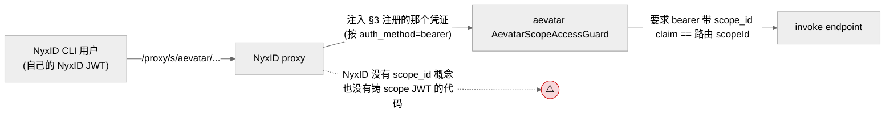

# 注册与发现:怎么让 NyxID "看见"这个 workflow 服务

## 事实源/设计抽象(以 ~/Code/aevatar 为准)

> 本篇回答方案的第二问:**「怎么让 NyxID 发现这个服务?」** 这一篇也是整条链路缺口最集中、必须最诚实的一篇。事实源脊柱(NyxID 侧以 `~/Code/NyxID/` 前缀标注边界):

- `~/Code/NyxID/backend/src/handlers/services.rs`:`POST /api/v1/services`——把任意 HTTP API 注册成平台目录 `DownstreamService`。
- `~/Code/NyxID/backend/src/services/api_docs_service.rs`:OpenAPI 自动探测 + proxy-aware 重写(`servers[].url` 重指到 NyxID 代理路由),决定 operation 能否被发现。
- `src/platform/Aevatar.GAgentService.Application/Services/ServiceCommandApplicationService.cs`:`UpdateServiceExternalExposureAsync`——aevatar 记 `nyxid_slug` 的写侧,**全文无 NyxID 调用**(本地事件)。
- `src/Aevatar.Capabilities/AevatarScopeAccessGuard.cs`:invoke/发现的 scope-claim 鉴权门,是后面"鉴权缺口"的另一端。

---

## 0. 先纠正一个方向误解

直觉是"aevatar 把服务推给 NyxID,NyxID 发现它"。**代码里方向是反的**:

> NyxID 是**凭证经纪 + 通用代理 + 发现 + 审计 + approval** 的权威通道(`docs/canon/approval-quota-ledger.md`)。aevatar 在 NyxID 眼里只是**又一个下游 HTTP 服务**——和 OpenAI、GitHub 同列。"让 NyxID 发现 aevatar 服务" = **由人把 aevatar 的 HTTP API 注册成一个普通 `DownstreamService`**。

aevatar 没有任何代码会主动去 NyxID 注册自己(全仓 grep:aevatar 对 NyxID 只有**消费**调用——`/keys` 读、`/proxy/services`、`/proxy/s/{slug}`、OAuth broker、approvals;没有 `POST /api/v1/services` 注册调用)。所以本篇的"发现",落到实处就是**一次手工注册 + 一份让 operation 可被发现的 OpenAPI**。

## 1. NyxID 里"一个下游服务"的两层模型



- **目录层 `DownstreamService`**(`POST /api/v1/services`,需管理员):平台级描述符——`base_url`、`auth_method`、加密 master 凭证、`openapi_spec_url`、能力标记、AI 发现元数据。NyxID 已 seed 一批(openai/anthropic/github/discord/slack/lark/telegram)。
- **连接层 `UserService`**(`POST /api/v1/keys` = `nyxid service add`):把**某用户自己的凭证**绑到目录项(`service_slug`)上;或者**完全自定义**(`slug` + `endpoint_url` + `auth_method`)。返回可代理的 `slug`(若撞名带后缀,如 `aevatar-2`)。

> aevatar 的 workflow 服务**不在 NyxID 目录里**,所以走的是**自定义连接**(`--custom`)或由管理员先建一个目录项再连接。

## 2. 注册 aevatar workflow 服务的三个动作(手工)



**动作 ②(让 operation 可被发现)** —— NyxID 的发现是 **OpenAPI 驱动**的:`GET /api/v1/catalog/{slug}/endpoints` 解析 OpenAPI 才能列出具体 operation;`GET /proxy/services/{id}/openapi.json` 会把 spec 的 `servers[].url` 重写成 NyxID 代理路由。所以要让 NyxID(以及 aevatar 自己的 connected-service tools)"看见"具体可调的 endpoint,**得有一份描述 aevatar invoke 路径的 OpenAPI**——而 aevatar 当前**不为 scope-service invoke 端点产出 OpenAPI**(它的契约是 protobuf type-url,见 §4)。这份 OpenAPI 目前需要**手写**:用 [02](02-publish-path.md) 里 `.../endpoints/{endpointId}/contract` 拿到的 `InvokePath` + `SampleRequestJson` 填一个最小 spec(给那个 `POST .../invoke/chat` operation 加上 `x-aevatar-tool` 标记——见 [04](04-calling.md) 为什么)。

**动作 ③a(注册 + 连接)**:

```bash
export AEVATAR_SVC_TOKEN='<NyxID 要注入到 aevatar 的凭证,见 §3>'
nyxid service add aevatar \
  --custom \
  --endpoint-url https://<aevatar-host> \
  --openapi-spec-url https://<where-you-host-the-spec>/openapi.json \
  --auth-method bearer \
  --credential-env AEVATAR_SVC_TOKEN
# → 打印 Slug: aevatar(或 aevatar-2)、Proxy URL: <root>/api/v1/proxy/s/aevatar/
```

等价直连 REST:`POST /api/v1/keys`,body `{ slug, endpoint_url, auth_method, auth_key_name, credential, openapi_spec_url }`。

**动作 ③b(可选,把缝在 aevatar 侧也记一笔)**:

```bash
curl -X PUT "$AEVATAR/api/services/$SERVICE_ID/external-exposure" \
  -H "Authorization: Bearer $AEVATAR_JWT" -H 'Content-Type: application/json' \
  -d '{ "nyxidSlug": "aevatar" }'
```

⚠️ 这一步**纯本地**:`ServiceCommandApplicationService.UpdateServiceExternalExposureAsync` 只 provision 定义 actor 并 dispatch 一个 `ServiceExternalExposureUpdatedEvent`,**不向 NyxID 发任何请求**。它记的 slug 是否真在 NyxID 存在、是否有效,aevatar 不校验——指针可能悬空。它的价值仅是:让 aevatar 侧的目录/控制台能显示"这个服务对外以 `aevatar` 暴露"。

## 3. 发现 = 注册之后,这些面自然就有了

注册并连接后,服务就出现在 NyxID 的发现面上(给人、给 agent、给 CLI):

| 发现面 | API / 命令 | 返回 |
|---|---|---|
| 已连接、可代理的服务 | `GET /api/v1/proxy/services`(`nyxid proxy discover`) | id/slug、`proxy_url`、`proxy_url_slug`、`docs_url`/`openapi_url`(有 spec 才有)、streaming/ws 标记 |
| 可连接的目录模板 | `GET /api/v1/catalog`(`nyxid catalog list`) | 可连接条目(自定义服务通常不在此) |
| 某服务的具体 operation | `GET /api/v1/catalog/{slug}/endpoints`(`nyxid catalog endpoints`) | 从 OpenAPI 解析的 `{method, path, name, request_body_schema}`——**无 spec 则为空** |
| AI agent 发现 | MCP `nyx__discover_services` | `{service_id, name, slug, description, requires_credential}` |

> 反复强调:**operation 级发现完全依赖那份 OpenAPI**。没有它,NyxID 只能把 aevatar 当成"一个能 proxy 任意 `<path>` 的通用 passthrough"——能调,但调用方得自己知道 `api/scopes/.../invoke/chat` 这个路径,NyxID 帮不了你列出来。

## 4. ⚠️ 两个必须诚实标出的缺口

### 缺口 1:协议形状不匹配(protobuf ServiceIdentity ↔ OpenAPI)

aevatar 的服务模型是 **protobuf**:`ServiceDefinitionSpec`(4 段 `ServiceIdentity` + 带请求/响应 type-url 的 endpoint;`chat` endpoint 的 I/O 是 `ChatRequestEvent`/`ChatResponseEvent`)。NyxID 的注册与发现是 **OpenAPI 中心**(`base_url` + `openapi_spec_url`,`/catalog/{slug}/endpoints` 解析 OpenAPI op)。aevatar **不为它的 invoke 端点输出 OpenAPI**。

后果:**没有自动的"aevatar 服务规格 → NyxID 服务规格"翻译**。要让 NyxID 做 operation 级发现,必须**有人手写**一份 OpenAPI(§2 动作 ②)。这是 target-state 的活,目前两个仓库都没有这个 adapter。

### 缺口 2:鉴权对不齐(scope_id claim ↔ 注入式凭证)

这是最硬的一处。两端各自的鉴权假设没有被任何代码接起来:



- aevatar 的 invoke 端点(`Aevatar:Authentication:Enabled` 默认开)要求 bearer JWT 带**恰好一个 `scope_id`(或 `workflow.scope_id`)claim,且 == 路由里的 `{scopeId}`**,否则 `403 SCOPE_ACCESS_DENIED`。
- NyxID 代理只会把**注册时存的那个下游凭证**按 `auth_method` 注入;NyxID **没有 `scope_id` 概念**,也没有任何"为某 scope 铸一个 aevatar-scoped JWT"的代码路径。

所以要让"经 NyxID 的调用"过得了 aevatar 的门,§3 注册的那个凭证必须是一个**预先铸好、长期有效、带着那个确切 `scope_id` claim 的 JWT**——即**一个 scope 一把静态共享密钥**,且**没有 per-user 身份穿透**(所有 CLI 用户经这个 slug 调用,对 aevatar 都表现为同一个 scope 身份)。这把静态 JWT 由谁签发/轮转,两个仓库里**都找不到**对应代码。

> 此外:对 `Workflow` 种类,**per-run 的 LLM/connector 凭证是 payload 内携带**的(`ChatRequestEvent.ConnectorHttpAuthorization`、`LlmControl.SenderNyxIdAccessToken`),不是 HTTP `Authorization` 头。也就是说"工具/模型用谁的额度"和"谁有权调这个 scope 服务"是两层凭证,经 NyxID 代理时都得各自安排。

这两个缺口都已登记进本 block 的[端到端方案](05-end-to-end-plan.md)落地清单与 ⚠️。在它们被正式设计前,**不要对读者承诺"发布即被发现、任意 NyxID 用户用自己身份即可调用"**。

## 验收

1. 怎么让 NyxID 发现这个服务?把 aevatar 的 HTTP API **手工注册成一个普通 `DownstreamService`**:`nyxid service add aevatar --custom --endpoint-url <aevatar-host> --openapi-spec-url <spec> --auth-method bearer --credential-env …`(= `POST /api/v1/services` / `POST /api/v1/keys`)。注册后它出现在 `/proxy/services`、`/catalog/{slug}/endpoints`、`nyx__discover_services`。
2. operation 级发现的前提?**一份描述 invoke 路径的 OpenAPI**(目前需手写,因为 aevatar 服务规格是 protobuf、不产出 OpenAPI)。无 spec 时只能当通用 passthrough。
3. 有哪些缺口?① 没有"aevatar 规格 → NyxID 规格"自动翻译(协议形状不匹配);② 鉴权对不齐——aevatar 要 `scope_id` claim,NyxID 只注入静态凭证、无 scope-JWT 签发,导致只能用"一 scope 一把静态 JWT、无 per-user 穿透",且无代码签发它。`external-exposure` 只是本地指针,不触发任何 NyxID 注册。

⟦AI:AUTO-LOOP⟧
