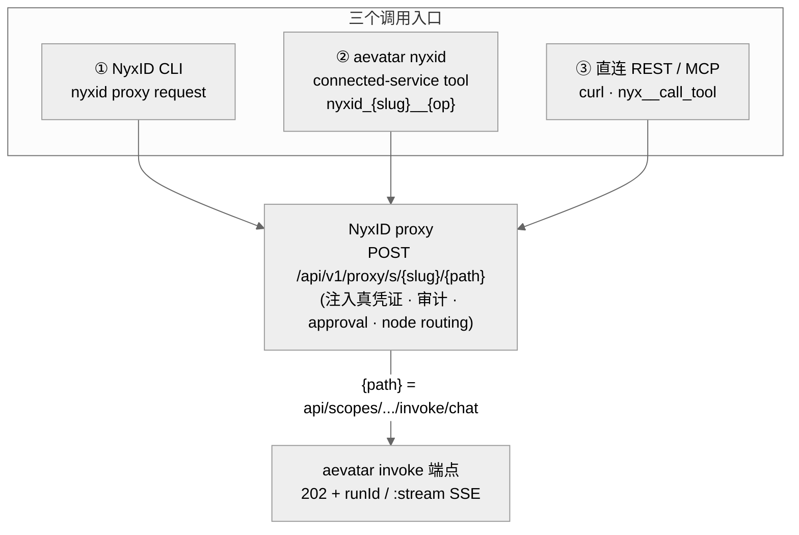
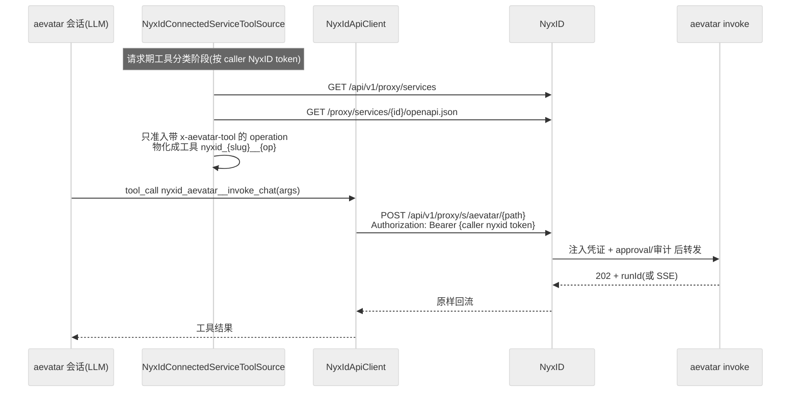

# 三个调用入口:CLI / aevatar 自身 nyxid tools / 直连

## 事实源/设计抽象(以 ~/Code/aevatar 为准)

> 本篇回答方案的第三问:**「NyxID CLI、以及 aevatar 本身(它有 nyxid 相关 tools)怎么调用这个 workflow?」** 关键事实:三条入口最终都命中**同一个** NyxID proxy。事实源脊柱(NyxID 侧以 `~/Code/NyxID/` 前缀):

- `~/Code/NyxID/cli/src/commands/proxy.rs`:`nyxid proxy request` 构造 `/proxy/s/{slug}/{path}`、`--stream` 把字节流写 stdout。
- `~/Code/NyxID/backend/src/handlers/proxy.rs`:`proxy_request_by_slug`——服务端解析 slug、注入凭证、转发并回流(含 SSE)。
- `src/Aevatar.AI.ToolProviders.NyxId/NyxIdConnectedServiceToolSource.cs`:aevatar 把 NyxID connected service 的 operation 动态注册成 LLM 工具。
- `docs/canon/nyxid-connected-service-tools.md`:`x-aevatar-tool` 准入标记 + `ConnectedServiceProxyTool` → `NyxIdApiClient.ProxyRequestAsync` → 同一个 proxy 的权威口径。

---

## 0. 一张图:三条入口,同一个 proxy



调用方都只带**自己的 NyxID 凭证**(session JWT 或 `nyx_...` Agent Key);下游(aevatar)的真凭证由 NyxID 服务端注入。`<path>` 就是 [02](02-publish-path.md) 里那条 `InvokePath`(去掉 host)。

## 1. 入口①:NyxID CLI

最直接。先确认服务已 [注册](03-register-and-discover.md),拿到 slug(假设 `aevatar`):

```bash
# 发现:确认 slug 和 proxy URL
nyxid proxy discover                      # GET /api/v1/proxy/services
nyxid catalog endpoints aevatar           # 有 OpenAPI 时列出 invoke operation

# 调用(buffered):把 aevatar invoke 路径作为 <path>
nyxid proxy request aevatar \
  api/scopes/$SCOPE/members/$MEMBER/invoke/chat \
  -m POST \
  -H 'Content-Type: application/json' \
  -d '{ "payloadTypeUrl": "<chat 请求 type-url>", "payloadJson": "{\"prompt\":\"hello\"}" }'
# → aevatar 返回的 202 + { runId, statusUrl } 原样回到你的终端

# 观察 run(经同一个 proxy 透传 aevatar 的 runs 端点)
nyxid proxy request aevatar api/scopes/$SCOPE/services/$SERVICE/runs/$RUN_ID -m GET

# 调用(streaming):SSE 直接打到 stdout
nyxid proxy request aevatar \
  api/scopes/$SCOPE/members/$MEMBER/invoke/chat:stream \
  -m POST -H 'Content-Type: application/json' \
  -d '{ ... }' --stream
```

机制要点(`cli/src/commands/proxy.rs` + `cli/src/api.rs`):

- CLI 构造 `<base>/api/v1/proxy/s/<slug>/<path>`(`--by-id` 改走 `/proxy/<id>/`;`--via-service <id>` 在一个 slug 对应多份凭证时选其一)。
- 用你的 NyxID session JWT 作 `Bearer`(401 自动 refresh 重试一次);**主动剥掉客户端自带的 `Authorization` 头**,保证只有 NyxID token 上线、下游凭证永不从客户端泄漏。
- `--stream`:逐 chunk `bytes_stream()` 写 stdout——SSE / 音视频 / 大文件都走这条;服务端用 `Body::from_stream` 透传上游流,受 `proxy_stream_idle_timeout_secs`(默认 60s)/ node 场景 `node_max_stream_duration_secs`(默认 300s)约束。

> ⚠️ 记住 [02](02-publish-path.md) 的异步语义:`nyxid proxy request` 这一调,buffered 形式回来的是 **202 + runId**(不是最终答案);要么 `--stream` 看 SSE,要么再 proxy 一次 `.../runs/{runId}` 轮询。NyxID 只透传,不会替你把"提交+观察"合成一次同步调用。

## 2. 入口②:aevatar 自身的 nyxid connected-service tools

这正是"aevatar 因为有 nyxid 相关 tools、所以能调"的那条路。aevatar 作为一个 **agent**,会把 NyxID 上**带 `x-aevatar-tool` 标记**的 connected-service operation 动态注册成 LLM 工具,工具调用经 NyxID proxy 下发——**和 CLI 命中同一个 `/proxy/s/{slug}/{path}`**。



落地要点(`docs/canon/nyxid-connected-service-tools.md` + `NyxIdConnectedServiceToolSource.cs`):

- **准入是 allow-list**:只有在(手写的)OpenAPI 里给那个 invoke operation 标了 `x-aevatar-tool`(service 级或 operation 级)的,才会变成工具。没标的永不暴露。这就是 [03](03-register-and-discover.md) 里"那份 OpenAPI 要带 `x-aevatar-tool`"的原因。
- **工具名** `nyxid_{service_slug}__{operationId}`,参数 schema 从 OpenAPI 结构化生成(path/query/header/body)。
- **执行**:`ConnectedServiceProxyTool.ExecuteAsync` → 从 `AgentToolRequestContext` 读 caller 的 NyxID token(user/org 双 token,不落盘)→ `NyxIdApiClient.ProxyRequestAsync(token, slug, path, method, body)` → `{BaseUrl}/api/v1/proxy/s/{slug}/{path}` → NyxID 注入凭证 / approval / 审计 / node routing / delegation → 下游(aevatar)。
- **默认不开**:动态工具在独立 tool set `nyxid.connected_services`(`ToolSetNames.NyxIdConnectedServices`),**不并入 `workspace.default`**。要启用,得让 chat route policy 的 `forward_to_model.tool_set_ref` 指向它(或一个 include 了它的组合 tool set)——见 [07/10 Input 入口统一](../../07/10-input-ingress-unification.md) 关于 tool-first ingress 的口径。
- **发现是 live、不落盘**:每次请求期从 NyxID live surface 读 service 列表 + OpenAPI;仓库内不留 service/endpoint 影子目录,执行始终回到 NyxID proxy。

> 一句话:**入口② 与入口① 是对称的**——同一个 NyxID 服务、同一个 proxy 端点,区别只是"谁发起":CLI 是人,connected-service tool 是 aevatar 里的模型在 tool-call 里发起。Voice realtime attach 也遵循同一边界(caller-scoped 发现)。

## 3. 入口③:直连 REST / MCP meta-tools

无 CLI 依赖(n8n / CI / 自写脚本)或让别的 agent(Claude Code / Cursor)接 NyxID MCP 时用:

```bash
# 直连 REST:和 CLI 同一组端点
export NYX_API_KEY=nyx_...                # AI Services → Agent Keys,带 proxy scope
curl -X POST "$NYXID_BASE/api/v1/proxy/s/aevatar/api/scopes/$SCOPE/members/$MEMBER/invoke/chat" \
  -H "X-API-Key: $NYX_API_KEY" -H 'Content-Type: application/json' \
  -d '{ "payloadTypeUrl": "...", "payloadJson": "{...}" }'
```

- 认证用 `X-API-Key: nyx_...`(必须有 `proxy` scope,否则 403);短期 `Authorization: Bearer`(登录 token,默认 15 分钟)是备选。
- MCP 路径:`nyx__discover_services` → `nyx__connect_service` → `nyx__search_tools` → `nyx__call_tool`(`<BASE_URL>/mcp`)。`nyx__call_tool` 命中同一个 proxy——这是"让一个外部 agent 通过 NyxID 调 aevatar workflow"的标准姿势。

## 4. 三入口对照

| 入口 | 发起者 | 认证 | 命中端点 | 适用 |
|---|---|---|---|---|
| ① CLI `nyxid proxy request` | 人 | NyxID session JWT(自动刷新) | `/api/v1/proxy/s/{slug}/{path}` | 终端 / 脚本调试 |
| ② aevatar connected-service tool | aevatar 内的 LLM(tool-call) | caller 的 NyxID user/org token | **同上** | 让 aevatar agent 在对话里调 workflow |
| ③ 直连 REST / MCP | 任意客户端 / 第三方 agent | `X-API-Key: nyx_...`(proxy scope) | **同上** | 自动化 / 跨 agent 集成 |

三者**同源**:都把"凭证注入、审计、approval、node routing"交给 NyxID,自己只持 NyxID 凭证。差别仅在发起者与认证形式。

## 5. 为什么是"同一个 proxy、三种发起"(正当性)

- **为什么 aevatar 调外部服务也走 NyxID proxy,而不是直连下游 base_url?** 因为这样**凭证永不出 NyxID 边界**:aevatar 的模型在 tool-call 里只拿到一个工具结果,从不接触下游真 key;审计、approval、node routing、delegation 在一处统一施加(`docs/canon/nyxid-connected-service-tools.md` §架构边界:不绕过 proxy 直打下游)。
- **为什么默认不把 connected services 注入 `workspace.default`?** 否则每个用户的 connected service 都会默认塞给模型,既是噪声也是越权面。用 route policy 显式开启,符合 [tool-first ingress](../../07/10-input-ingress-unification.md) 的"动作收敛 + 按 caller scope 装配 tool set"原则。
- **为什么对称设计是对的?** "人用 CLI 调" 和 "aevatar 用工具调" 走同一个 wire,意味着只要 [03](03-register-and-discover.md) 那次注册做对(含 OpenAPI + `x-aevatar-tool` + 凭证),两条入口同时可用——不需要为 agent 调用单独再搭一条链。这也是为什么本方案把力气压在"注册那一跳"上:它一通,三入口全通。

## 验收

1. NyxID CLI 怎么调?`nyxid proxy request <slug> api/scopes/.../invoke/chat -m POST -d '{…}'`(`--stream` 看 SSE);先 `nyxid proxy discover` / `catalog endpoints` 确认 slug 与 operation。
2. aevatar 自身怎么调?它把 NyxID 上带 `x-aevatar-tool` 的 invoke operation 物化成工具 `nyxid_{slug}__{op}`,经 `NyxIdApiClient.ProxyRequestAsync` 命中**同一个** `/api/v1/proxy/s/{slug}/{path}`;需 route policy 把 tool set `nyxid.connected_services` 开给该会话。
3. 三入口什么关系?同源——CLI / aevatar tool / 直连·MCP 都命中同一 proxy,凭证由 NyxID 注入;差别只在发起者与认证形式。记得 invoke 是异步(202+runId / SSE),NyxID 只透传不合并。

⟦AI:AUTO-LOOP⟧
