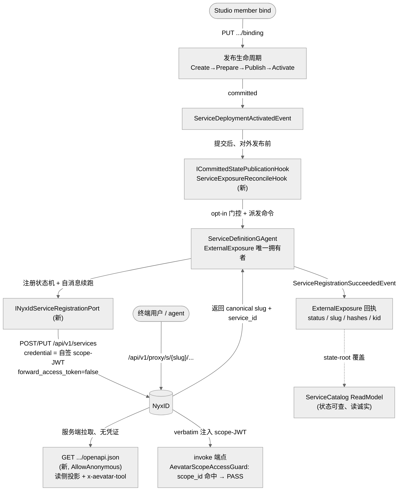
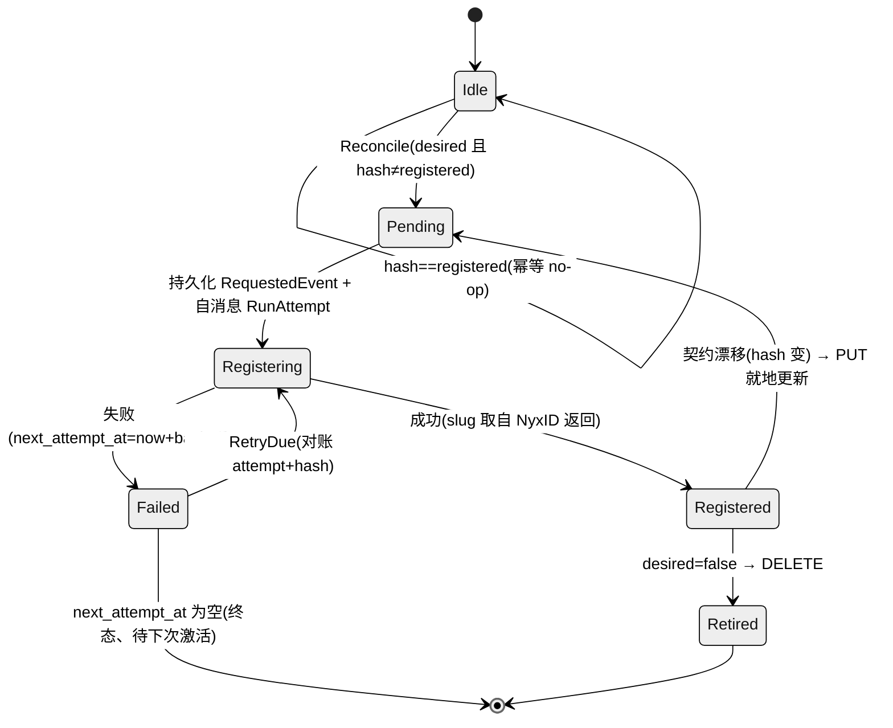
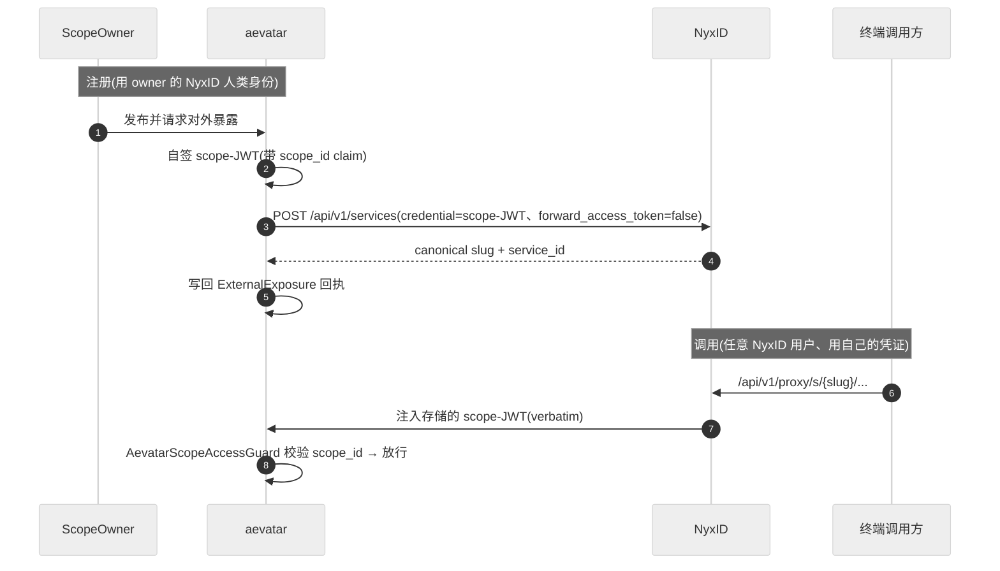

# 自动注册:让已发布服务"发布即被 NyxID 发现"(落地方案)

## 事实源/设计抽象(以 ~/Code/aevatar 为准)

> 本篇把 [03 注册与发现](03-register-and-discover.md) 标红的"当中那一跳是手工的"补成**自动**:已发布的 scope service 在激活那一拍自动注册进 NyxID 目录、自动产出一份可发现的 OpenAPI、并把 NyxID 回吐的 slug 写回成**真回执**——全部在 aevatar 内部完成,**不改 NyxID 一行**(NyxID 只读其既有 HTTP 契约)。事实源脊柱(只列高价值锚点,正文用设计语言展开):

- `src/Aevatar.Foundation.Abstractions/EventSourcing/ICommittedStatePublicationHook.cs` —— committed domain event 提交后、对外发布前的写侧钩子;本方案的**自动触发缝**。
- `src/platform/Aevatar.GAgentService.Infrastructure/Orchestration/ScriptingServiceRevisionRepublishHook.cs` —— 同一钩子的**活先例**(committed 事件 → 读 readmodel → 经命令端口派发),证明触发缝已现役、可复用。
- `src/platform/Aevatar.GAgentService.Abstractions/Protos/service_definition.proto` —— `ServiceDefinitionSpec` 与 `ExternalExposure`,本方案唯一需要演进的契约。
- `src/platform/Aevatar.GAgentService.Core/GAgents/ServiceDefinitionGAgent.cs` —— `ExternalExposure` 的**唯一权威拥有者**,注册状态机的归属。
- `src/Aevatar.Capabilities/AevatarScopeAccessGuard.cs` —— invoke 端点的 `scope_id` 鉴权门,鉴权闭环的另一端。
- 关键 NyxID 契约(只读):`~/Code/NyxID/backend/src/handlers/services.rs`(`POST /api/v1/services`)、`~/Code/NyxID/backend/src/handlers/proxy.rs`(代理时凭证 verbatim 注入)。

---

## 一句话结论

> **发布 → 提交激活事件 → 写侧钩子派发对账命令 → `ServiceDefinitionGAgent` 注册状态机经端口调用 NyxID 既有 `POST /api/v1/services` → 把 NyxID 返回的 canonical slug 写回 `ExternalExposure` 作真回执**。三个缺口全部 aevatar-only 关闭;唯一关不掉的是"per-user 身份穿透"(需改 NyxID,显式登记为残留)。

整条链路复用既有主干,不发明第二系统:发布生命周期是现役的、committed 事件→命令的写侧钩子是现役的、NyxID 通用代理是现役的。新增的只是"把已发布服务对账成一个 NyxID 下游"这一段。

## 1. 补的是哪一跳

[03](03-register-and-discover.md) / [05](05-end-to-end-plan.md) 已诚实标出"两头是真的、当中那一跳是手工的",对应三个 aevatar-only 工作项:

| 缺口 | 手工现状 | 自动化关法(本方案) |
|---|---|---|
| **G1 OpenAPI 形状不匹配** | aevatar 服务规格是 protobuf,不产出 OpenAPI,要手写 spec | 读侧投影:把 `ServiceDefinitionSpec` 的 chat endpoint + 契约 type-url + 样例投影成 OpenAPI 3.1,带 `x-aevatar-tool`,由一个匿名端点托管 |
| **G2 注册桥 = 本地悬空指针** | `external-exposure` 只记一个本地 slug,不调 NyxID,可能悬空 | committed 事件钩子 → actor 注册状态机 → 调 NyxID `POST /api/v1/services` → 写回**NyxID 返回的** slug,`ExternalExposure` 升级成带 status/hash/kid 的真回执 |
| **G3 scope 鉴权对不齐** | NyxID 无 `scope_id` 概念、不铸 scope JWT | aevatar **自签**一把带 `scope_id` claim 的 JWT,作为存进 NyxID 的下游凭证;NyxID verbatim 注入回来即自满足 `AevatarScopeAccessGuard` |

## 2. 设计骨架:发布→对账→注册→回执 闭环



注册是**解耦的后续动作**:即使注册失败,服务本身仍可调(只是未上架),这与发布生命周期不耦合 exposure 的现状一致。

## 3. 触发缝:为什么是 committed 钩子,不是 request-path、不是新 actor

候选设计最容易踩的坑是"在发布请求线程里同步发起注册"或"新造一个注册协调 actor"。两者都违反主链路约束。正确的接入点是 **committed domain event → 命令** 的写侧钩子:

- **为什么是钩子而非请求线程**:注册是一个对外副作用,必须由"已提交的事实"驱动,才满足"committed event 必须可观察 / 业务推进在 actor 事件流内"。`ICommittedStatePublicationHook` 在领域事件提交后、对外发布前被调用,`ScriptingServiceRevisionRepublishHook` 已用同一机制做"committed 事件 → 读 readmodel → 经命令端口派发"。激活事件(`ServiceDeploymentActivatedEvent`)落在部署管理 actor 上,注册回执落在 `ServiceDefinitionGAgent` 上——两者天然是**跨 actor 命令**,绝不能 inline。
- **为什么不新建 actor**:`ExternalExposure` 已经属于 `ServiceDefinitionGAgent`。回执是"已发布服务定义"的一个属性,新拆一个 actor 会把同一业务实体劈成两半,违反"actor 即业务实体 / 事实源唯一"。注册状态机就长在 `ServiceDefinitionGAgent` 里。
- **opt-in 门控在钩子里(Application 边界算),actor 不读配置**:钩子解开 committed 的激活事件、判断该服务是否 desired-exposure、算出 `desired_spec_hash`,再把这些作为命令字段派发进 actor;actor 只消费命令,不感知 host 配置(FI-002)。

## 4. 注册状态机(单线程、可重放、防悬空)



- **防悬空 slug**:`nyxid_slug` **只**由 `ServiceRegistrationSucceededEvent` 携带 NyxID 的**返回值**写入。`PENDING/REGISTERING/FAILED` 期间 slug 为空 + `status` 明示,绝不存一个 aevatar 猜出来的指针。这把 03 里"指针可能悬空"的⚠️ 从根上消除。
- **幂等 / 重发对账**:re-bind 会重新提交激活事件 → 钩子重派对账命令。`desired_spec_hash == registered_spec_hash` ⇒ no-op;漂移 ⇒ 用存的 `nyxid_service_id` 做 `PUT`(就地更新,slug 稳定,绝不重复建)。
- **崩溃后半注册恢复**:若 NyxID 已建但 ack/commit 丢失,下次 `POST` 命中 NyxID 全局 slug 唯一性 409,适配器映射为"已存在" → `GET` 取回 `service_id` → 直接进 `Registered`。重放只重建回执,不重发 HTTP。
- **重试/超时事件化**:出站调用 `await` 完成后,处理器**向自己 inbox 发自消息**携带结果(回调只发信号,不在回调线程改 `State`);退避是 `await → 发 RegistrationRetryDueCommand → actor 消费`。陈旧重试用 `expected_attempt == State.attempt` + hash 相等显式对账拒绝。**无 `Task.Run` 改状态、无 lock**。

## 5. G1 —— OpenAPI 自产(读侧投影)

新增一个匿名只读端点(`GET /api/scopes/{scopeId}/services/{serviceId}/openapi.json`),纯读 `ServiceCatalog` readmodel,把已物化的 endpoint 契约投影成 OpenAPI 3.1:

- **复用既有机制、不新写 schema 代码**:请求/响应 schema 走既有的 protobuf→JSON-schema 转换(`src/Aevatar.AI.ToolProviders.ServiceInvoke/Schema/ProtoToJsonSchemaConverter.cs`);路径模板/方法/SSE 标记取自 `ScopeServiceEndpoints` 已经在产出的调用契约(`InvokePath` / `SampleRequestJson`);chat endpoint 标 `text/event-stream`,让代理不去缓冲整包 body。
- **`x-aevatar-tool` 对称性**:给每个 invoke operation 标 `x-aevatar-tool { enabled, name, ... }`——这正是 aevatar 自己的 connected-service 工具已经在**消费**的标记。aevatar 因此成为自己消费者的**对称生产者**:同一份 spec,NyxID 与 aevatar 自身 tools 都能发现具体 operation。标记取值来自每服务配置,不出现任何具体 skill 名(FI-002)。
- **可达性两处硬约束(显式处理)**:
  1. 该端点必须 **`[AllowAnonymous]`**——否则默认的"必须已认证"回退策略会让 NyxID **无凭证的服务端拉取**吃 401,发现静默退化成空 tool 面。
  2. aevatar 在注册体里**显式**把这个 URL 作为 `openapi_spec_url` 传给 NyxID,由 NyxID 的 SSRF 加固拉取器去取(而不是让它猜探测路径)。NyxID 的 proxy-aware 重写会保留 vendor extension,`x-aevatar-tool` 端到端存活。

## 6. G2 —— scope 凭证闭环(最硬的一处)

**机制(已对 NyxID 代理路径核实)**:NyxID 代理一个入站调用时,对 `auth_method=bearer` 会把 `Authorization: Bearer <存储的凭证>` **原样**置入,不重铸、不重 scope。于是 aevatar 注册时存进 NyxID 的 `credential` 就是**它自己签的一把 JWT**,带 `scope_id = <被发布的 scope>`——恰好是 `AevatarScopeAccessGuard` 要求的 claim。代理下来的调用一落到 invoke 端点就已带着一把过得了门的 token。闭环完全落在 aevatar 内部:**aevatar 自己铸、自己验**,NyxID 永远不需要理解 `scope_id`。

> ⚠️ **这是一个真子项目,不是一行配置**。aevatar 今天是纯 OIDC RP:单个 `AddJwtBearer` 绑 NyxID 一个 Authority、一个 Audience,无签名密钥、无 `ValidIssuers`、无 JWKS、从不签发 token(`src/Aevatar.Authentication.Hosting/AevatarAuthenticationHostExtensions.cs`)。要让 aevatar 既铸又收自签 `scope_id` JWT,必须三件齐全:
>
> 1. **签名密钥**由 host 配置 / KMS 引用注入(FI-002,隔离在一个新的认证项目,绝不硬编码密钥);
> 2. **暴露 JWKS**(匿名端点)或钉死 `IssuerSigningKey`;
> 3. invoke 端点接受**双 issuer**(NyxID + aevatar-self),为自签 issuer 显式登记 `ValidIssuers` / `IssuerSigningKeys`,绕开纯 OIDC discovery。

- **注册体必须 `forward_access_token=false`**:否则 NyxID 会用调用方的 NyxID token 覆盖 `Authorization`,毁掉存储的 scope-JWT。
- **轮转**:`credential_kid` 进回执。轮转 = 铸新 kid 的 JWT → `PUT /api/v1/services/{id}` 换 credential → `ServiceRegistrationSucceededEvent` 带新 kid;旧 kid 在 JWKS 保留一个重叠窗口,避免在途代理调用 401;TTL ≥ 轮转窗口。

## 7. 身份与信任边界:谁的 NyxID 身份去注册



- **注册必须用 scope owner 的"人类" NyxID token**:NyxID 的 `/api/v1/services` 路由挂在 human-only 段,**同时拒绝 service-account 与 delegated token**,且 `create_service` 无 admin 门。所以注册只能用"把 aevatar 连到 NyxID 的那个人"的活人 token,经现有 NyxID 用户解析路径取得。这让 NyxID 侧 `created_by = scope owner`,所有权正确。
- **两套凭证、两条生命周期**:owner 人类 token 只在请求上下文里**瞬时**存在(AsyncLocal,绝不进 grain state);**存进 NyxID 的**是 aevatar 自签的 scope-JWT。proto / grain state 里不落任何 secret。
- 因为注册需要 owner 活人 token,注册/轮转**搭在 owner 发起的那次激活上**触发;需要无人值守轮转的场景,复用 ADR-0018 的 per-user binding(以 `binding_id` 引用重铸),绝不存原始 token。binding 被吊销则轮转停在 `FAILED`(见 §11)。

## 8. Host 配置面(FI-002)与 opt-in

所有 host 事实由配置注入,不硬编码 URL / slug / skill 名:

```
Aevatar:NyxId:Authority                        (复用现有)NyxID 基址
Aevatar:ServiceExposure:Enabled        = false  全局开关(默认关、删除优先)
Aevatar:ServiceExposure:DefaultDesired = false  每次发布的默认 opt-in
Aevatar:ServiceExposure:PublicInvokeBaseUrl     base_url + servers[](禁 5000/5050)
Aevatar:ServiceExposure:OpenApiPathTemplate     OpenAPI 文档 URL 模板
Aevatar:ServiceExposure:Visibility     = public 透传给 NyxID
Aevatar:ServiceExposure:Retry:*                 退避参数
Aevatar:ScopeServiceToken:Issuer / :Audience
Aevatar:ScopeServiceToken:SigningKeyRef         KMS/secret 引用(绝不是字面密钥)
Aevatar:ScopeServiceToken:TtlMinutes / :RotationOverlapHours
```

**opt-in 两层**:全局 `Enabled`(host)**且**每服务 `exposure_desired`(bind 请求 / scope 策略,在 Application 边界算好后作为命令字段传入)。任一为否 ⇒ 钩子是 no-op,服务照常发布可调,只是不上架。

## 9. 失败与幂等

| 场景 | 行为 |
|---|---|
| 悬空 slug(旧 bug) | 不可能。slug 只由成功事件携带 NyxID 返回值写入;`status` 区分 `REGISTERING/FAILED` 与真 `REGISTERED` |
| 重发布无变化 | `desired_spec_hash == registered_spec_hash` ⇒ no-op |
| 契约漂移 | 新 hash ⇒ `PUT /services/{id}`(用存的 `service_id`);slug 稳定、不重复 |
| NyxID 5xx/429/宕 | `FAILED{next_attempt_at}` ⇒ 事件化退避;服务仍可调(未上架) |
| 永久 4xx | `FAILED` + `last_error` 记录、readmodel 可见;不静默吞;下次激活/re-bind 再触发 |
| 半注册(已建、ack 丢) | 下次 `POST`→409→适配器映射"已存在"→`GET` 取回 `service_id`→`Registered` |
| slug 全局撞名 | aevatar 不预占;接受 NyxID 规范化后的返回 slug;撞名由 NyxID 报错 → 分类上浮 |
| 陈旧/并发重试 | `RegistrationRetryDueCommand.expected_attempt` + `desired_spec_hash` 与 `State` 对账,陈旧拒绝 |
| 下架/停用 | `ServiceDeploymentDeactivatedEvent` → 钩子派 `RetireExternalExposureCommand` → `DELETE /services/{id}` → `RETIRED`、slug 清空 |
| owner binding 在轮转时被吊销 | 轮转停在 `FAILED + last_error`;旧 token 在 TTL 内仍有效;readmodel 读诚实 |
| 重放 | 由 committed 事件重建回执;重放不发 HTTP |

## 10. 分阶段交付(每阶段独立可发可验)

- **Phase 0 —— proto + 回执 + readmodel(纯结构、无行为)**:扩 `ExternalExposure` 成状态机回执、加命令/事件、扩 readmodel + 映射。reducer 精确键路由、各有测试引用。验证:build + reducer/replay 单测,无外部调用。
- **Phase 1 —— MVP:自动发现(头号诉求)**:OpenAPI 匿名端点 + `ServiceExposureReconcileHook` + `INyxIdServiceRegistrationPort`/适配器 + `NyxIdApiClient` 新增 `/services` 方法,完整状态机(请求→注册→成功→重试→漂移→退役),用 **owner token** 注册先跑通"上架+OpenAPI 发现+回执回写+下架"。**暂不**接自签 scope-JWT。验证:发布一个 workflow 后它出现在 NyxID catalog、spec 可拉、unpublish 自动 retire。诚实限制:此阶段代理调用还过不了 `AevatarScopeAccessGuard`(除非调用方自带 scope token)。
- **Phase 2 —— G3 凭证闭环(真子项目)**:新认证项目(scope-JWT 铸币 + JWKS + 双 issuer + `credential_kid` 轮转 via `PUT`)。把自签 scope-JWT 作为存储凭证注册。验证:铸出的 token 的 `scope_id` 过 `AevatarScopeAccessGuard`、错配则拒;mock NyxID 注入的代理调用打到 invoke 端点过门;轮转推新凭证。
- **Phase 3 —— 硬化**:退避耗尽策略、`status` 可观测、opt-in 接进 bind 请求面、文档/ADR(supersede"external-exposure 被动注解"旧口径、canon 更新回执模型)。

## 11. 验证 & guard

```bash
dotnet build aevatar.slnx --nologo                 # 先 proto 重生
dotnet test aevatar.slnx --nologo                  # 或按对应测试项目显式跑
bash tools/ci/architecture_guards.sh               # 分层、无中间层字典、无 generic request-reply
bash tools/ci/committed_state_projection_guard.sh  # 钩子是写侧 committed 路径
bash tools/ci/query_projection_priming_guard.sh    # openapi 端点只读 readmodel,不 query-time priming
bash tools/ci/runtime_callback_guards.sh           # 回调只发信号、自消息续跑
bash tools/ci/proto_lint_guard.sh                  # 新 proto 合规
bash tools/ci/aevatar_oauth_client_es_acl_guard.sh # 签名密钥材料不进 grain/projection/query 路径
bash tools/ci/test_stability_guards.sh             # 改测试必跑;退避路径用注入测试时钟,禁 Task.Delay
```

> CI full-scan 禁 `GetAwaiter().GetResult()` 与 `TypeUrl.Contains(...)` 字符串路由——事件路由按精确 descriptor 键路由(照 `ScriptingServiceRevisionRepublishHook` 写)。

## 12. 诚实缺口与 TODO 登记

1. **per-user 身份穿透:aevatar-only 关不掉**。代理调用带的是 scope-JWT,workflow 在**scope 权威**下跑,不是原始用户的 NyxID subject。要按人归属,只能消费 NyxID 的 delegation token,那会把 aevatar 耦合到 NyxID 的 delegation wire 格式(新信任假设)——禁改 NyxID,**出界**。与 ADR-0018 的边界一致。
2. **OpenAPI URL 必须从 NyxID 后端公网可达**。私网/集群内地址会让发现退化成空 tool 面(注册仍成功)。这是部署/网络事实,仓库内保证不了。
3. **双 issuer / JWKS 是真成本**(Phase 2),不是配置行。所以排在 MVP 后,让"自动发现"先发,不被它阻塞。
4. **注册/轮转需 owner 活人 token**(NyxID `/services` 拒 service-account + delegated)。无无人值守注册;owner binding 被吊销且不可重铸时轮转停 `FAILED`。这是 NyxID 契约约束,非 aevatar-only 可解。

> 以上 1–4 登记到 [08/04 战术 TODO](../../08/04-todo-list.md) 性质的工作项,与 03/05 已登记的两处缺口合并收口。

## 13. 设计正当性(为什么是它,不是别的)

- **不发明协议**:复用既有发布链 + committed 事件钩子 + NyxID 通用代理,缝只在"对账注册"一处,且用的是 NyxID 给所有下游的同一套 API。少一套专用集成 = 少一处双轨。
- **信任边界放对**:调用方只持 NyxID 凭证,aevatar 的真凭证由 NyxID 注入;审计/approval/node routing 在 NyxID 一处统一施加。aevatar 自签的 scope-JWT 把"谁有权调这个 scope"收敛回 aevatar 自己的门,不外泄给 NyxID 一个它不该懂的概念。
- **对缺口诚实**:per-user 穿透、可达性、双 issuer 成本都显式标红并登记,不用"一键打通"掩盖(写作原则 + FI-006)。

## 验收

1. 怎么让"发布即自动被发现"?**committed 激活事件 → 写侧钩子 → `ServiceDefinitionGAgent` 注册状态机 → NyxID `POST /api/v1/services` → 回写真回执**;OpenAPI 由匿名读侧端点自产。见 §2/§3/§5。
2. 三个缺口怎么 aevatar-only 关?G1 读侧 OpenAPI 投影、G2 事件驱动注册桥 + 真回执、G3 自签 scope-JWT 作存储凭证(NyxID verbatim 注入)。见 §1 表 + §5/§6。
3. 还差什么?per-user 身份穿透关不掉(需改 NyxID)、OpenAPI 须公网可达、双 issuer 是真子项目——见 §12,已登记。
