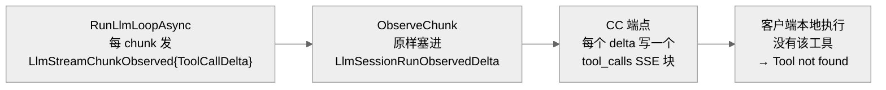
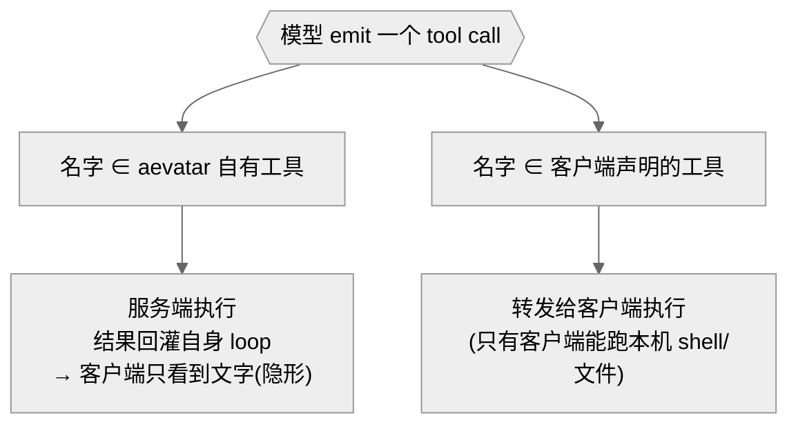

# 01 · 泄漏链路与非对称所有权不变量

## 事实源/设计抽象(以 ~/Code/aevatar 为准)

> 本章坐实「aevatar 自有工具为什么会漏给客户端」,并立起修复要守的不变量。事实源脊柱:
>
> - **逐 chunk 透出**:`src/platform/Aevatar.GAgentService.Core/GAgents/LlmSessionGAgent.cs`(`RunLlmLoopAsync` 每 chunk 发 `LlmStreamChunkObserved { ToolCallDelta }`,不带所有权)。
> - **provider 分类**:`src/Aevatar.Mainnet.Host.Api/Responses/ResponsesUserSkillsToolProvider.cs`(`GetAdditiveToolsAsync` 给出 ornn / skills —— 永远是 additive)与 `src/Aevatar.Mainnet.Host.Api/Responses/ResponsesAevatarToolProvider.cs`(`GetSubstituteToolsAsync` 给出 TodoWrite / WebFetch / WebSearch)。
> - **客户端写出**:`src/Aevatar.Mainnet.Host.Api/ChatCompletions/ChatCompletionsEndpoints.cs`(每个 `ToolCallDelta` 一个 `tool_calls` SSE 块)。
>
> 核对基线:`feature/integrate`(HEAD `82e957bc8` 附近)。

---

## 1. 泄漏链路:三跳,全在流式渲染层

`/v1/chat/completions` 把 LLM 产生的**每一个** tool-call delta 无差别送达客户端,与「该谁执行」无关:

- `LlmSessionGAgent.cs:633` —— 每 chunk 持久化 `ToolCallDelta`,无所有权标记。
- `LlmSessionRunObservationAccumulator.cs:27` —— `ObserveChunk` 原样透出。
- `ChatCompletionsEndpoints.cs:118` —— 写 `tool_calls` 流块。
- 次级口:`LlmSessionRunObservationAccumulator.cs:36` 的 `ObserveToolCall` 不看 `Forwarded`,连服务端工具执行后的观察也透出。

---

## 2. 为什么偏偏是 additive 工具

aevatar 把自有工具分成两类,`ornn_search_skills` 属于前者:

| 类别 | 来源 | 语义 | 例子 |
|---|---|---|---|
| **additive(自有、纯新增)** | `ResponsesUserSkillsToolProvider.cs` `GetAdditiveToolsAsync` | 客户端从没声明过、只有 aevatar 能执行;实时 NyxID 发现、吞异常 | `ornn_search_skills`、`use_skill`、skills |
| **substitute(自有、覆盖同名)** | `ResponsesAevatarToolProvider.cs` `GetSubstituteToolsAsync` | 覆盖客户端声明的同名工具,服务端执行 | `TodoWrite`、`WebFetch`、`WebSearch` |

additive 工具**永远不是** substitute → 本该 100% 服务端执行、对客户端隐形。但上面的流式线把它的调用 delta 照样送出去了。客户端没有 `ornn_search_skills`,于是 `Tool not found`。

> 间歇性也由此解释:additive 发现是 live NyxID 调用且吞异常,某轮发现成功(服务端执行,列出 skills)、某轮发现失败或调用形态不同(漏给客户端)。

---

## 3. 不变量:非对称所有权

修复要守的唯一不变量:

> **按工具所有权双向收口** —— 自有的留服务端、对客户端隐形;客户端声明的转发回去。

- **自有 ⇒ 服务端 + 隐形**:这正是「伪装成模型返回」—— 工具往返发生在服务端 loop 内,客户端只收到最终文字 delta。
- **客户端声明 ⇒ 转发**:codex 的 `shell` / 改文件工具跑在用户机器上,aevatar 执行不了,必须转发。
- **撞名 ⇒ 所有权优先**:客户端声明了与自有 additive 同名的工具时,按 aevatar 所有权走服务端,不转发(否则又漏)。

---

## 4. 为什么不是「纯服务端永不转发」

一个看似更简单的选项是:aevatar 永不向客户端转发任何工具,把客户端当纯聊天前端。它能彻底关掉泄漏,但**代价是废掉 agentic 客户端的本地能力** —— codex 的 `shell`、文件编辑跑在客户端机器,aevatar 根本执行不了;一律不转发,这些就用不了。

| 取向 | 自有工具 | 客户端本地工具 | 结论 |
|---|---|---|---|
| 纯服务端(永不转发) | 隐形 ✅ | **废掉 ❌** | 否决 |
| **非对称转发(本方案)** | 隐形 ✅ | 仍可用 ✅ | 采纳 |

> **与 [10/02](../../10/02-codex-shell-vs-aevatar-tools.md) 的衔接**:10/02 讲的是「LLM 该选 codex 的 shell 还是 aevatar 的 ornn 工具」这场**选择之争**(架构张力、只能提胜率)。本方案不解决「选谁」,而是保证**一旦选了 aevatar 自有工具**,这次执行对客户端**完全不可见** —— 把 10/02 的下游(选对了仍泄漏)从根上清掉。

!!! warning "设计待论证"
    非对称所有权是修复方向,**尚未实现**。落地需实测:① 删掉 live tool-call delta 后,`/v1/chat/completions` 的转发类工具仍能在终局正确送达;② 撞名与发现抖动两种边界确实不再泄漏。胜负不靠静态证明,需对真实 agentic 客户端回归。
