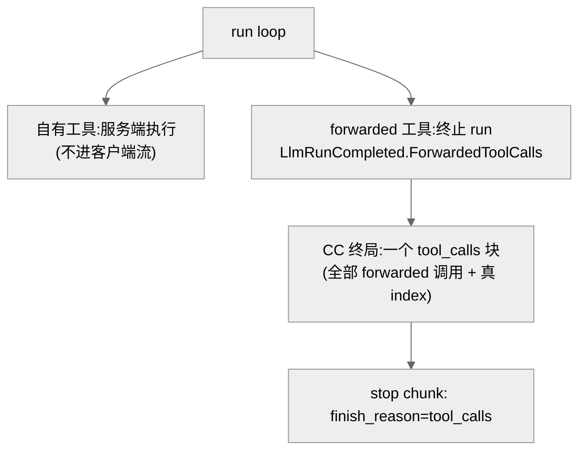

# 02 · 两个落点、codex 审出的 6 缺口、落地与缺口

## 事实源/设计抽象(以 ~/Code/aevatar 为准)

> 本章把不变量([01 章](01-leak-and-asymmetric-rule.md))落成两个具体落点,并记录 codex 设计评审审出的 6 个实现缺口。事实源脊柱:
>
> - **分类**:`src/platform/Aevatar.GAgentService.Application/Responses/ResponsesToolClassificationService.cs`(产出 forwarded / substituted / additive 名单)。
> - **路由与执行**:`src/platform/Aevatar.GAgentService.Core/GAgents/LlmSessionGAgent.cs`(`SelectForwardedToolCalls` / `SelectLocalToolCalls` / `BuildEffectiveToolsAsync` / `MaxToolRounds` loop)。
> - **渲染**:`src/platform/Aevatar.GAgentService.Application/Responses/LlmSessionRunObservationAccumulator.cs` + 三个端点 `ChatCompletionsEndpoints.cs` / `ResponsesEndpoints.cs` / `MessagesEndpoints.cs`。
>
> 核对基线:`feature/integrate`(HEAD `82e957bc8` 附近)。

---

## 1. 落点一:流式渲染只让 forwarded 过线(Approach A)

转发类工具调用是**终局交付**:它们本就**终止当前 run**、并由 `LlmRunCompleted.ForwardedToolCalls` 携带。所以:

1. **边界不再透出 tool-call delta**:`ObserveChunk` / `ObserveToolCall` 保留内部状态,但不再往 `LlmSessionRunObservedDelta` 放 `ToolCallDelta`。这一刀同时关掉 `ObserveToolCall` 那条次级口。
2. **CC 端点终局补发 forwarded 调用**:删掉 live tool-call 块(`ChatCompletionsEndpoints.cs:118` 一带),在 stop chunk 前把 `completion.ToolCalls` 作为 `tool_calls` 块发出,`finish_reason=tool_calls`。

为什么选 Approach A 而非「逐 delta 打所有权标记再过滤」:后者要缓冲跨 chunk 的半截工具名、把所有权语义塞进流式事件契约,活动部件更多,且 forwarded 调用反正终止 run、无需实时增量。

`/v1/responses`、`/v1/messages` **不需要改流式**(它们的 facade 只回文本 delta);其正确性来自落点二。

---

## 2. 落点二:所有权 typed 分类 + 发现稳定

1. **proto**:给 `LlmSessionRuntimeToolSelection` 背后的消息加 `owned_tool_names`(repeated string),重新生成。typed 事实,不用字符串袋。
2. **分类器**:`ownedNames` 从**原始发现到的自有集**算(`GetSubstituteToolsAsync` ∪ `GetAdditiveToolsAsync`,在任何撞名过滤**之前**);`forwarded = 客户端声明 ∖ ownedNames`;填 `owned_tool_names`。
3. **actor 选择器**:`SelectForwardedToolCalls` / `SelectLocalToolCalls` 按 typed 的 `owned_tool_names` + `forwarded_tools` 判定;两桶都不命中 → 服务端结构化错误,不静默丢。
4. **发现稳定**:分类信任 command 的 `owned_tool_names`;实时发现只用来拿可执行实例;实例临时缺失仍按自有/服务端处理并回结构化 `tool_not_available`,绝不改判 forwarded。
5. **显式终局**:`MaxToolRounds` 耗尽时给出对用户可见的 terminal 失败 / 文本,不静默空完成。

---

## 3. codex 设计评审:6 个实现缺口(已并入)

codex 确认根因与方向,并审出 6 处不补就会漏的坑:

1. **范围措辞**:live-delta 泄漏只在 CC;但 `/v1/responses`(`ResponsesEndpoints.cs:247`)、`/v1/messages`(`MessagesEndpoints.cs:168`)在完成阶段渲染 `completion.ToolCalls` → 完成阶段泄漏跨三条 ingress,只由落点二守。
2. **多 forwarded 调用**:当前 `BuildStreamingToolCallChunk` 是单调用、写死 `index=0`;CC stop chunk 只有空 delta + finish。终局必须按真 index 输出**全部** forwarded 调用。
3. **`owned_tool_names` 必须从原始发现集算**,不能复用现有 `AdditiveToolNames` —— 分类器当前会丢掉与客户端声明撞名的 additive(`ResponsesToolClassificationService.cs:154`),那份名单恰好缺了撞名;复用即 R3 仍坏。断言 `use_skill` 被 forwarded 的测试需改。
4. **R4 真因纠正**:actor 本就每 run 只发现一次(`LlmSessionGAgent.cs:589`);真正的重复是 **facade 分类**与 **actor 执行**各发现一遍,第二次失败丢实例。修法 = 分类信任 command 的 owned set,发现只取实例。
5. **max-rounds 显式终局**:反复调用不可用工具会耗尽轮次后落静默空完成(`LlmSessionGAgent.cs:709`);须改成显式可见失败。
6. **resume 路径安全**:转发结果回灌路径不依赖 live delta(用会话里的 `ForwardedToolCalls` + previous-snapshot 校验),所以终局交付不破坏 resume。

---

## 4. 落地:里程碑 27 + 5 个 issue

GitHub 里程碑 27《Ingress Tool Ownership (agent-as-model)》,Part 1 + Part 2 **一起 ship**:

| issue | 内容 |
|---|---|
| #2269 | 伞 bug([10/03](../../10/03-ingress-own-tool-stream-leak.md)) |
| #2277 | Part 1:CC 停止流式透出自有工具 delta + 终局多调用交付 |
| #2278 | Part 2:typed `owned_tool_names`(从原始发现集算,撞名修复) |
| #2279 | Part 2:按所有权路由 + 发现抖动安全 + 显式终局 |
| #2280 | 跨 ingress 对齐 + 测试矩阵 + 真实客户端验证 |

验收(摘):自有工具触发时客户端流**无** `tool_calls`、只有文字 + `stop`;客户端声明的工具在终局正确送达(多调用带真 index)且 resume 可续;撞名走服务端;发现抖动不漏不空。门禁:build + 目标测试 + `tools/ci/test_stability_guards.sh` + `tools/ci/architecture_guards.sh`。

---

## 5. 诚实缺口

!!! warning "设计待论证 / 待实测"
    - 方案已经 codex 设计评审,但**尚未实现**;6 个缺口是「实现时必须做对」,不是已完成项。
    - 终局多调用的 SSE 形态(单块完整 vs 增量)需对真实 agentic 客户端实测;`index`/`id` 必须每调用正确。
    - 删 `ToolCallDelta` 边界字段前,需确认无 CC 之外的消费者(AGUI 走另一条 committed-event projection,初判不受影响,待落地核实)。
    - proto 加字段向后兼容;旧请求无 `owned_tool_names` 时回退当前行为 —— 在前滚分支可接受,新请求走新路径。

---

## 6. 读者应能回答

- 修复落在哪两点?——① 流式渲染只让 forwarded 过线(自有工具 delta 不写客户端);② 所有权 typed 分类(`owned_tool_names`,撞名所有权优先)。
- 为什么 `/v1/responses`、`/v1/messages` 不用改流式却仍受影响?——它们不 live 泄漏,但完成阶段渲染 `completion.ToolCalls`,靠落点二的分类正确性兜底。
- codex 审出最致命的两个坑?——多 forwarded 调用不能写死 `index=0`;`owned_tool_names` 必须从原始发现集算,复用 `AdditiveToolNames` 会漏撞名。
- 为什么 Part 1 + Part 2 一起 ship?——只上 Part 1 只止住 CC live 泄漏,撞名 + 完成阶段泄漏仍在三条 ingress。
