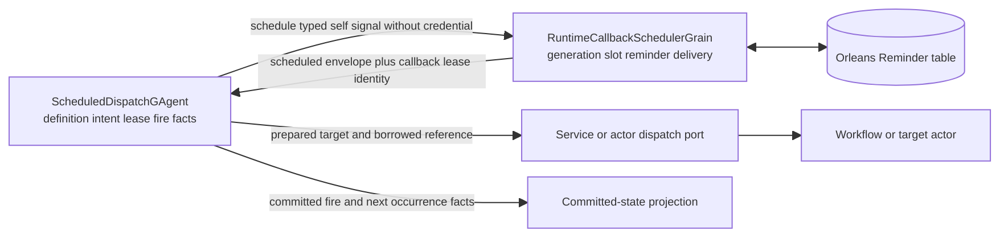
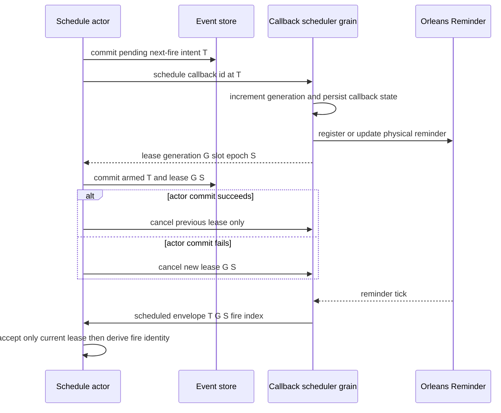
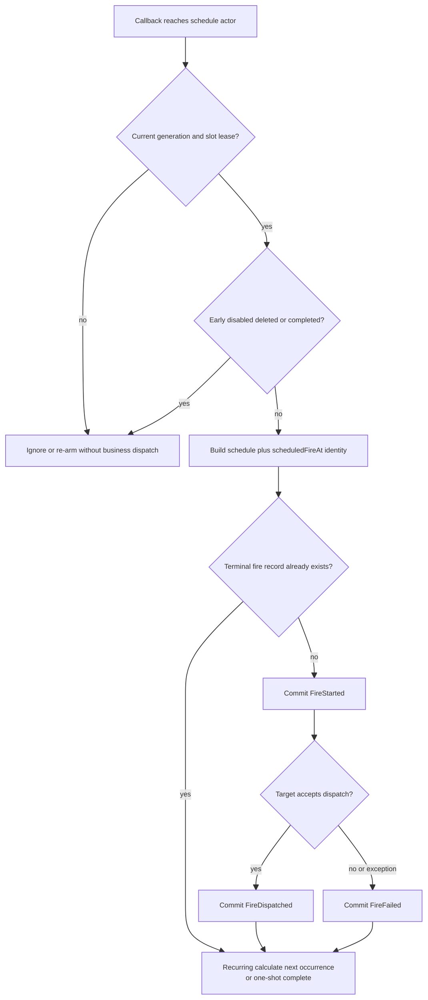
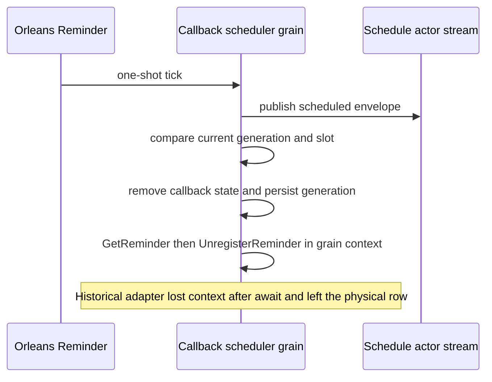

# Schedule Actor、Durable Callback 与 Fire：唤醒不是执行事实

> 版本与结论：本章描述 `current`。`ScheduledDispatchGAgent` 是schedule definition、armed occurrence、fire record与下一拍的唯一事实owner；Orleans durable callback只负责到点向actor投递带generation/slot身份的signal。cron与run-now最终复用同一dispatch主链，但前者额外证明wall-clock wake-up，后者只证明manual admission。历史上“一次性callback已发布却注销reminder失败”的第四类事故，当前通过让grain自己完成查询与注销消除了错误上下文边界。

## 设计抽象与事实源

- `src/platform/Aevatar.GAgentService.Core/Schedules/ScheduledDispatchGAgent.cs:50-77`、`:893-1090`、`:1698-1818`：actor重激活、armed intent/lease、fire fencing、terminal record与下一拍推进。
- `src/Aevatar.Foundation.Runtime.Implementations.Orleans/Grains/Callbacks/RuntimeCallbackSchedulerGrain.cs:30-114`、`:151-240`：callback generation、Orleans Reminder delivery、one-shot state清理与物理注销都由scheduler grain执行。
- `src/platform/Aevatar.GAgentService.Abstractions/Schedules/ScheduledDispatchCalculator.cs:22-64`、`:145-157`：Cronos standard cron、timezone-aware occurrence、过期due-time兜底与稳定scheduled-fire idempotency key。

## 两个 actor、两类所有权

schedule actor回答“这项业务何时该触发、哪一拍已经发生、目标是什么”；runtime callback scheduler grain回答“怎样在进程重启后仍把一个typed envelope送回来”。后者不是schedule数据库，也不读取workflow target或credential。



为什么不让callback直接调用workflow？因为callback不知道schedule在等待期间是否被pause、delete、reauthorize或换了target；它持有的payload会立刻变成陈旧业务快照。唤醒actor后，actor在单线程turn中用current state重新裁决。为什么不使用进程内`Timer`？timer在pod重启后消失，也没有跨节点generation与物理存储。

callback envelope在准入时还会被credential guard检查，不能携带runtime bearer/raw key/secret。定时等待可以很久；把凭据复制进Reminder既扩大泄漏面，也绕开fire-time授权状态。

## Arm 协议：先留下意图，再确认哪一份 lease 生效

actor的下一拍不是一个时间字段，而是一段可恢复协议：

1. 计算cron下一occurrence，或读取one-shot UTC时刻。
2. 先提交 `PendingNextFireAt` intent。
3. 请求runtime安排callback；runtime为同一callback id递增generation，并返回 `(actorId, callbackId, generation, backend, slotEpoch)` lease。
4. actor提交 `NextFireAt + NextFireLease`，清掉pending intent。若这次commit失败，先取消刚得到的新lease。
5. 新lease事实提交后，才取消previous lease。

这段顺序无法做成一个跨EventStore与Reminder table的事务，但能保证恢复时有依据：看到pending说明“业务意图已提交、物理arm未确认”；看到`NextFireAt + lease`说明actor只接受该generation/slot的callback。



很远的下一拍不会要求Orleans一次睡到终点：actor把单次callback hop封顶为七天。早于`scheduledFireAt`到达的hop被识别为early callback，再按同一目标时刻重arm；它不产生fire record。

## 重激活与 overdue：保留已武装时刻，不能从 now 覆盖

actor激活时按以下优先级恢复：

- 有 `PendingNextFireAt`：继续完成这份尚未确认的arm intent；
- 无pending但有 `NextFireAt`：按**同一精确时刻**重新arm；
- 两者都无：才从当前时间计算首次下一拍。

第二条是防漏拍不变量。若pod恰在到点附近重启，而激活逻辑从`now`重算，已到期occurrence会被直接跳过；当前实现保留armed时刻，过去时刻通过`ComputeDueTime`得到一秒due time并尽快catch up。

若激活时发现armed occurrence已超过十分钟且没有terminal fire record，actor提交 `ScheduledDispatchFireOverdueDetectedEvent`，同一occurrence只记一次，然后仍按原时刻重arm。这个counter是“发现了一个overdue armed occurrence”，不是精确统计离线期间漏了多少cron tick。

## Fire 协议：lease 拒绝旧唤醒，idempotency 吸收重复投递

automatic callback进入actor后依次检查：schedule未delete/complete、envelope匹配current callback lease、不是early callback、schedule仍enabled、Team credential状态可用。然后用以下稳定identity建立fire record：

```text
schedule:{scheduleId}:fire:{scheduledFireAtUtc:O}
```

> Demo status：`verified-static`（核对`BuildIdempotencyKey`、fire handler、callback generation/slot与重激活tests；本轮未等待真实cron时钟、未投递workflow）。

如果同一identity已有 `Dispatched` 或 `Failed` terminal record，重复delivery被抑制；recurring schedule仍会推进下一occurrence。首次处理先提交`FireStarted`，target admission成功则提交`FireDispatched`，失败则提交`FireFailed`。这里的`Dispatched`只证明下游接受了command并留下command/correlation identity，不证明workflow业务终态。



这三层fence各挡不同问题：callback generation/slot防止被替换的物理slot继续有效；schedule actor lease防止别的callback或旧envelope进入当前业务状态机；fire idempotency防止相同occurrence在合法redelivery下重复产生业务effect。它们不能互相替代。

## Cron 与 run-now：同一dispatch主链，不同证据

canonical Team Member Automation 的manual `run-now`要求exact Team owner，并使用调用方提供的operation/idempotency identity；它不要求matching callback lease，也不读wall clock callback metadata。generic schedule另有独立run-now surface，不能借这里的owner contract推断。automatic fire由 `(scheduleId, scheduledFireAt)` 生成identity，并携带runtime实际observed fire time。两者都提交started/dispatched/failed facts并走同一target preparation。

因此：

- `run-now`成功可验证owner、credential、target preparation与downstream admission；
- cron fire还覆盖timezone计算、arm、Reminder delivery、lease match与wall-clock路径；
- 两者的`Dispatched`都不是workflow completion；要再查run/read model；
- `enabled=false`只阻止automatic fire，不能用pause证明manual path或credential已撤销。

## One-shot 收尾：第四类事故不是“没有触发”

one-shot Reminder使用一分钟retry period作为物理兜底。当前scheduler grain在tick中按顺序：发布scheduled envelope；确认state里仍是相同generation/slot；移除callback并写state；最后在**同一个grain执行上下文**查询并注销物理Reminder。

受保护事故记录保留了一类不同故障：业务envelope已经发布、schedule fire也可能推进，但旧的普通singleton adapter在“查询reminder → await → 注销”之间丢失Orleans grain执行上下文，注销报`non-grain context`，整个tick被标为delivery error，物理row未删除，one-shot遂按retry period重放。它与“激活重算漏拍”“membership脑裂收不到tick”“provision凭据冲突创建失败”不是同一根因。

当前修复不是只删一处`ConfigureAwait(false)`，而是删除会偷走上下文所有权的适配层，让`RuntimeCallbackSchedulerGrain`自己调用`GetReminder`与`UnregisterReminder`。类型与调用位置因此共同约束“只能在grain context操作Reminder”。



## 边界与演进

- durable callback提供可恢复唤醒与redelivery，不承诺exactly-once业务执行；exact effect由actor facts与idempotency收敛。
- Reminder row存在不证明schedule业务有效；actor的current lease与state才决定是否接受。
- `FireDispatched`不证明target完成，只有command/correlation identity可用于后续观察。
- timezone/cron preview是计算结果，不证明生产membership、Reminder storage与目标服务健康。
- membership配置漂移、重激活漏拍与第四类one-shot注销事故会在 [12/04](../12/04-incident-case-studies.md) 按四类根因分别保留；不得合并成一句“Orleans不可靠”。

## 读完应能回答

1. schedule actor与callback scheduler grain分别拥有哪类事实？
2. 为什么下一拍要分成pending intent、armed time与runtime lease？
3. generation/slot、actor lease与fire idempotency分别拦截哪一种重复或陈旧信号？
4. `run-now`成功为什么不能证明wall-clock cron已通过？
5. 第四类one-shot事故为什么是“触发成功但收尾失败”，当前修复为何必须让grain自己注销？

<details>
<summary>论断—冻结证据映射</summary>

| 论断 | 冻结证据 |
|---|---|
| state持有pending/armed next fire、runtime lease、fire records、mode与completed facts | `src/platform/Aevatar.GAgentService.Core/Schedules/scheduled_dispatch_state.proto:12-83`、`:133-153`、`:690-744` |
| activation按pending、exact armed time、fresh calculation顺序恢复并检测overdue | `src/platform/Aevatar.GAgentService.Core/Schedules/ScheduledDispatchGAgent.cs:50-77`、`:1830-1873` |
| arm先提交intent，再安排callback/提交lease，并按结果取消新旧lease | `src/platform/Aevatar.GAgentService.Core/Schedules/ScheduledDispatchGAgent.cs:1698-1777` |
| automatic fire校验lease/early/enabled/credential，按occurrence幂等并提交terminal record | `src/platform/Aevatar.GAgentService.Core/Schedules/ScheduledDispatchGAgent.cs:893-1090` |
| cron按timezone计算，过期时刻最短一秒触发，fire identity绑定schedule与UTC occurrence | `src/platform/Aevatar.GAgentService.Abstractions/Schedules/ScheduledDispatchCalculator.cs:22-64`、`:145-157` |
| runtime为callback递增generation，持久化slot/envelope，并拒绝credential进入callback | `src/Aevatar.Foundation.Runtime.Implementations.Orleans/Grains/Callbacks/RuntimeCallbackSchedulerGrain.cs:39-148` |
| one-shot发布后只清理matching generation/slot，并由grain直接注销Reminder | `src/Aevatar.Foundation.Runtime.Implementations.Orleans/Grains/Callbacks/RuntimeCallbackSchedulerGrain.cs:151-240`、`:311-316` |
| callback lease与fire command是typed proto，SkillRunner enum值已reserved | `src/platform/Aevatar.GAgentService.Core/Schedules/scheduled_dispatch_state.proto:124-153`、`:460-480` |

</details>
