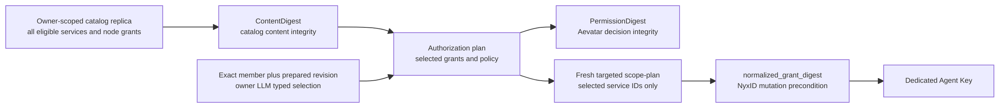
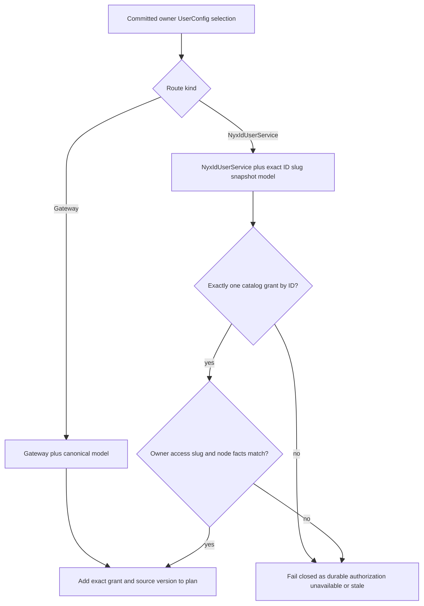
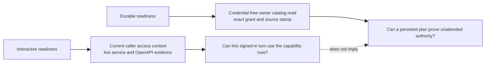
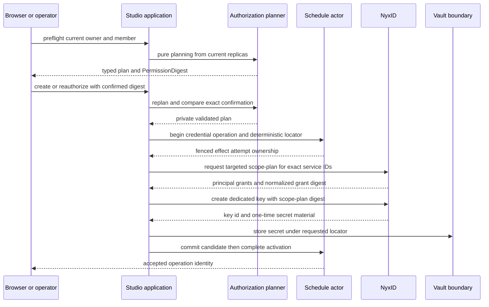

# Owner 授权与 Agent Key：把无人值守权限固定成可重验计划

> 版本与结论：本章描述 `current`。Team Member Automation 不保存交互会话的 bearer，也不靠 service slug 猜测权限；它把 exact owner、`UserService.id`、owner LLM selection、catalog authority 与 credential policy 收进一份可重算的 authorization plan。`create` / `reauthorize` 只有在该计划重验通过后才签发一把 dedicated Agent Key；`update` 只重验既有 `PermissionDigest`，不会暗中换 key。

## 设计抽象与事实源

- `src/platform/Aevatar.GAgentService.Abstractions/Protos/scheduled_invocation_authorization_plan.proto:56-60`、`:90-152`：owner LLM route、exact service grant、catalog authority、credential policy 与 `PermissionDigest` 的 typed contract。
- `src/platform/Aevatar.GAgentService.Application/Schedules/Authorization/ScheduledInvocationAuthorizationPlanner.cs:32-150`、`:283-412`：owner/target/catalog 重验、exact `UserService.id` 选择、slug drift 拒绝与 canonical plan 生成。
- `agents/Aevatar.GAgents.Scheduled/Authoring/ScheduledAgentApiKeyIssuer.cs:147-255`、`src/Aevatar.Studio.Application/Studio/Services/StudioMemberWorkflowSchedulePort.cs:462-705`、`docs/adr/0041-scheduled-invocation-agent-key-credential-reference.md:24-37`：targeted scope-plan、dedicated key effect、candidate/activation 边界与 typed reference 约束。此处列出三段是因为“授权决定”与“外部签发副作用”跨越 application、agent adapter 和 ADR 三个边界；正文仍按设计链路而非文件逐段展开。

## 权限不是一个字符串，而是三层可核对事实

调度会在 owner 离线时执行。若只保存 service slug、一次 HTTP `200` 或浏览器 bearer，系统无法回答“这次无人值守调用究竟代表谁、允许访问哪一个资源、证据是否已漂移”。当前模型把权限拆成三层：



| 摘要 | 谁产生 | 覆盖范围 | 用途 | 不能替代什么 |
|---|---|---|---|---|
| catalog `ContentDigest` | Aevatar catalog actor / projection | typed owner 与整份 owner-scoped service catalog | 证明读到的 catalog replica 内容完整、未被静默改写 | 不证明某个 workflow 只选择了哪些 service |
| authorization `PermissionDigest` | Aevatar planner | target、owner、authenticated actor、exact grants、catalog authority、source versions、policy、owner LLM selection | 供用户确认，并在 mutation 前按当前证据重算比较 | 不是 NyxID 创建 key 的 mutation precondition |
| `normalized_grant_digest` | NyxID fresh targeted scope-plan | 本次计划选中的 ordinal-sorted service IDs、node grants 与 principal | 作为 `scope_plan_digest` 随 key creation 发送，让 NyxID 对当前状态再次 fail closed | 不应持久化成 catalog digest，也不能拿全量 catalog 的值代替 selection |

为什么需要三层而不是一个通用 hash？因为三者的 authority 与失效时机不同：catalog 内容由 actor-owned replica 证明，Aevatar 决策由 canonical Protobuf plan 证明，外部 key mutation 的最后一刻由 NyxID 证明。合并后会把“全量 inventory 没变”误当成“这个 workflow 的最小权限没变”，也会让 Aevatar 自己生成一个 NyxID 无法验证的 precondition。

## Exact owner LLM selection：ID 是身份，slug 只是快照

owner LLM route只有两个有效 durable 选择：`Gateway` 与 `NyxIdUserService`。二者都必须携带合法 model；不存在 UserConfig 时保持 `Unspecified`，不能从 Host 默认值补出一个看似可运行的选择。

当选择 `NyxIdUserService` 时，planner把 exact `nyx_id_user_service_id` 加入 required grants，并把 `service_slug_snapshot` 作为 route/display integrity check：

- catalog必须恰好有一条相同 `UserService.id`，缺失或重复都拒绝；
- service必须属于相同 owner authority，且 access、resource owner、node requirement 与node IDs完整；
- slug snapshot与该ID当前slug不一致时判定snapshot drift；
- planner绝不按slug反查ID。两个相同slug、不同ID的service仍是两份不同grant。



为什么不用slug做主键？slug为人类路由和展示服务，允许重命名，也可能在不同identity下重复；用它恢复ID会把“可读名称”升级成“授权主体”。为什么不在fire时再查UserConfig？那会让已确认的permission在每一拍悄悄变化。create、reauthorize和update把validated selection写进actor-owned authorization fact，并由同一事实导出runtime LLM control；fire只校验已提交事实，不补Host默认值。

## Durable readiness 与 interactive readiness 回答不同问题

同一个NyxID capability可以在interactive模式可用、但在durable模式不可用。live admission里的两种模式都可借当前登录调用者的短期access context核对service与OpenAPI；interactive成功只说明此刻的交互调用者可完成选择。durable模式在这层contract检查之外，还必须用一个不携带bearer的owner-scoped catalog read补上无人值守授权证明：

- replica必须active、未invalidated/cleaned、`StateVersion > 0`；
- owner、contract/policy lifecycle、时间窗口与重算后的`ContentDigest`必须一致；
- selected capability必须按exact ID唯一匹配，slug、access、resource owner与node facts全部有效；
- 成功证据带`DURABLE_AUTHORIZATION_CATALOG` source stamp，包括actor id、version、freshness与content digest。



这种分离避免两种危险捷径：不能因为interactive成功就把bearer塞进schedule；也不能因为catalog里“曾经见过”某service就跳过freshness与content integrity。live admission把durable source stamp封进计划后，prepare/publish/replay等persisted revalidation重验该stamp而不重建调用者、也不保存bearer。durable授权检查失败时返回`DURABLE_AUTHORIZATION_UNAVAILABLE`，让调用者补齐/刷新授权或改用interactive，而不是降低权限校验。

## Create / reauthorize：先重验决定，再执行一次受围栏副作用

`preflight`只从当前read models构造plan，不刷新catalog、不签发key。用户确认`PermissionDigest`后，`create` / `reauthorize`重新解析同一member与prepared revision，并让revalidator重跑planner；target、owner、schema、policy或digest任一变化都返回plan changed。对于可恢复的catalog snapshot问题，写侧至多刷新并再读一次；若committed refresh version尚未投影出来，返回retryable projection-pending，而不是拿旧replica继续。

通过重验后，actor先提交stable operation、idempotency、mutation digest与deterministic credential effect locator。只有获得当前effect attempt ownership的调用者才可执行外部副作用：



issuer不会盲信targeted response。它逐项比较authority、authenticated actor、intended owner、contract/policy、freshness/completeness、exact service顺序、per-service resource owner、node grants以及flattened allowlists。任何不一致都返回`authorization_plan_changed`，并且不会调用key creation；provider timeout返回稳定的sanitized code。匹配时两个`allow_all_*`始终为`false`，key范围来自targeted response。

新key先作为candidate提交，再与configuration和authorization fact一起完成activation。`reauthorize`用新generation替换旧credential；旧generation的撤销与Vault补偿见 [09/04](04-vault-reference-and-revocation-compensation.md)。`update`则读取既有expiry与`PermissionDigest`，重验成功后只更新configuration/fact，不调用materializer；这避免“改cron或display name”意外制造另一把key。pause/resume也保留现有credential。

## 最小验证：确认plan，而不是把权限字段交给浏览器拼装

下面只演示协议边界。请求体中的owner身份由认证/绑定层形成；浏览器不提交grants、key ID、secret、allow-all开关或expiry。

```bash
BASE="$HOST/api/scopes/$SCOPE/teams/$TEAM/members/$MEMBER/automations"

plan=$(curl -fsS -X POST "$BASE/preflight" \
  -H "Authorization: Bearer $TOKEN" \
  -H 'content-type: application/json' \
  -d '{"scheduleCron":"0 9 * * *","scheduleTimezone":"Asia/Shanghai","enabled":false}')

digest=$(jq -er '.plan.permissionDigest | select(length > 0)' <<<"$plan")
policy=$(jq -er '.plan.credentialPolicy.policyVersion | select(length > 0)' <<<"$plan")
jq -e '
  .success == true and
  .plan.credentialPolicy.allowAllServices == false and
  .plan.credentialPolicy.allowAllNodes == false and
  (.plan.nyxIdServiceGrants | length) > 0 and
  ([.plan.nyxIdServiceGrants[].userServiceId] | all(length > 0))
' <<<"$plan"

curl -fsS -X POST "$BASE" \
  -H "Authorization: Bearer $TOKEN" \
  -H 'content-type: application/json' \
  -d "$(jq -n \
    --arg digest "$digest" \
    --arg policy "$policy" \
    --arg op "$OPERATION_ID" \
    --arg idem "$IDEMPOTENCY_KEY" '{
    scheduleCron: "0 9 * * *",
    scheduleTimezone: "Asia/Shanghai",
    confirmedPermissionDigest: $digest,
    confirmedPolicyVersion: $policy,
    credentialProvisioningKind: "dedicated_scheduled_invocation_agent_key",
    operationId: $op,
    idempotencyKey: $idem,
    enabled: false
  }')"
```

> Demo status：`verified-static`（逐字段核对canonical request/response DTO、planner/revalidator、issuer、materializer及对应冻结tests；本轮没有向真实NyxID签发key，也没有提交production mutation）。示例依赖部署侧已配置的HTTP认证与NyxID identity binding；这两项是外部前置条件，不在请求体里伪造。

成功的mutation receipt仍只是admission。要证明专用key已激活，应读取canonical detail/list并观察更高`stateVersion`、`active`与credential generation；要证明key实际被使用或已撤销，还需要 [09/05](05-production-canary-and-recovery.md) 的版本化canary与 [09/04](04-vault-reference-and-revocation-compensation.md) 的双轨终态。

## 边界与演进：Fail closed 清单

- authenticated actor不完整、owner与catalog不一致：拒绝planning。
- catalog未激活、已invalidated/cleaned、版本或lifecycle字段无效、过期、`ContentDigest`重算不等：拒绝或走一次显式refresh recovery。
- exact ID缺失/重复、access denied、slug drift、resource owner或node topology无效：不按slug或Host默认值补全。
- owner LLM selection缺失或非法：不把`Unspecified`当Gateway；NyxId route缺少exact ID时不签发。
- preflight后target/source version/policy/`PermissionDigest`变化：要求重新确认。
- targeted scope-plan的principal、grant、allowlist、freshness或contract漂移：不调用key creation。
- raw key、Vault locator、部分失败补偿与revocation track不在本章展开，统一由`09/04`说明，避免把authorization decision和secret custody混成一套状态机。

## 读完应能回答

1. `ContentDigest`、`PermissionDigest`与`normalized_grant_digest`分别由谁产生、约束哪一层？
2. owner LLM选择为什么必须保存exact `UserService.id`，slug为什么只能作integrity snapshot？
3. interactive readiness成功为什么不能直接授权durable automation？
4. `create` / `reauthorize`与`update`在credential副作用上有什么根本差异？
5. targeted scope-plan漂移时，为什么issuer必须在key creation之前停止？

<details>
<summary>论断—冻结证据映射</summary>

| 论断 | 冻结证据 |
|---|---|
| plan包含exact grants、catalog authority、owner/authenticated actor、owner LLM selection与`PermissionDigest` | `src/platform/Aevatar.GAgentService.Abstractions/Protos/scheduled_invocation_authorization_plan.proto:90-152` |
| catalog lifecycle、owner、freshness与重算`ContentDigest`不满足即拒绝 | `src/platform/Aevatar.GAgentService.Application/Schedules/Authorization/ScheduledInvocationAuthorizationPlanner.cs:40-97` |
| NyxId owner LLM selection把exact ID加入required grants，slug只校验该ID的route snapshot | `src/platform/Aevatar.GAgentService.Application/Schedules/Authorization/ScheduledInvocationAuthorizationPlanner.cs:283-412` |
| durable readiness只读owner catalog replica并产生带version/freshness/digest的typed source stamp | `src/Aevatar.AI.ToolProviders.NyxId/NyxIdExternalWorkflowCapabilitySource.cs:258-355` |
| durable catalog与grant按owner、digest、exact ID、slug、access和node facts fail closed | `src/Aevatar.AI.ToolProviders.NyxId/NyxIdExternalWorkflowCapabilitySource.cs:358-445` |
| revalidator重跑planner并比较target、owner、schema、policy与`PermissionDigest` | `src/platform/Aevatar.GAgentService.Application/Schedules/Authorization/ScheduledInvocationAuthorizationRevalidator.cs:19-52` |
| issuer请求selection-scoped scope-plan，核对principal/grants后把`normalized_grant_digest`作为`scope_plan_digest` | `agents/Aevatar.GAgents.Scheduled/Authoring/ScheduledAgentApiKeyIssuer.cs:147-255`、`:443-514` |
| create/reauthorize先提交effect operation，再materialize、提交candidate并完成activation | `src/Aevatar.Studio.Application/Studio/Services/StudioMemberWorkflowSchedulePort.cs:462-705` |
| update复用既有expiry/digest并只更新configuration，不调用credential materializer | `src/Aevatar.Studio.Application/Studio/Services/StudioMemberWorkflowSchedulePort.cs:281-346` |
| Agent Key raw material不得进入state/readmodel/API，trusted provisioning只写typed reference | `docs/adr/0041-scheduled-invocation-agent-key-credential-reference.md:24-37` |

</details>
