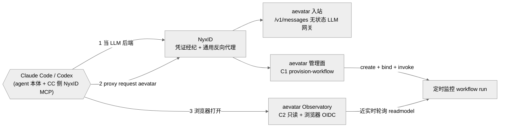
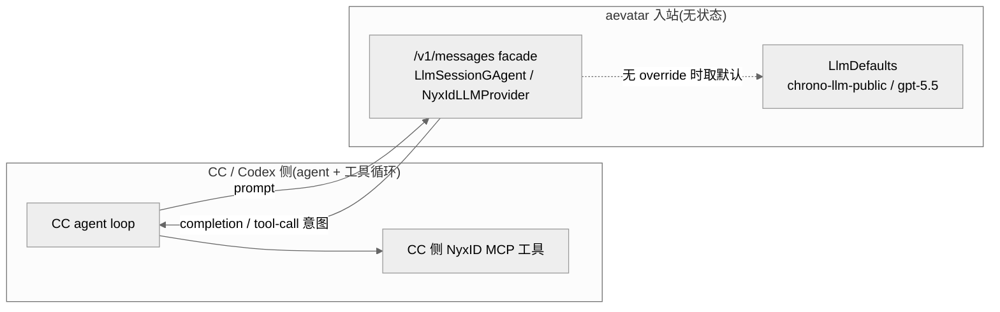
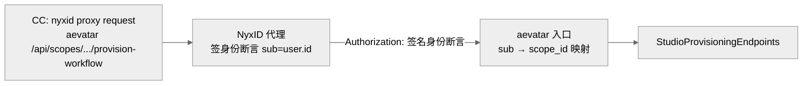
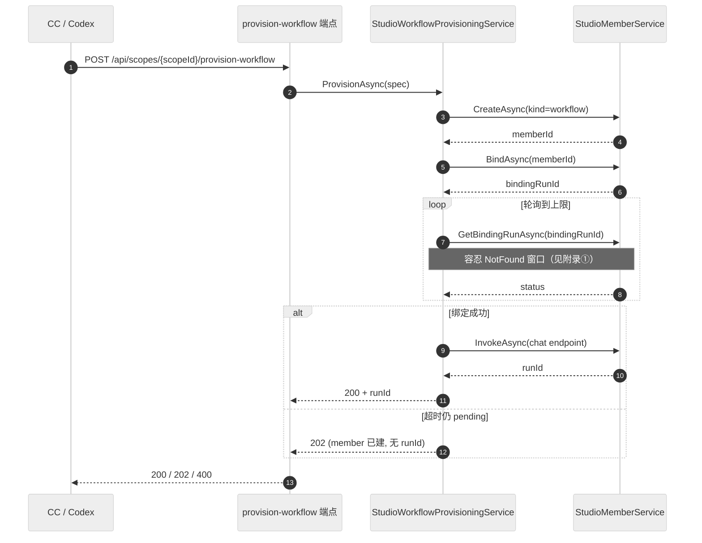
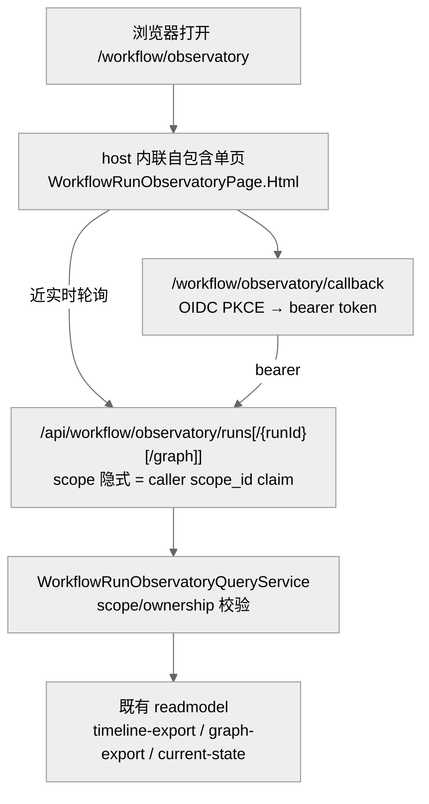

# 全链路:大脑 → reach → C1 provision → C2 观测(附 6 条 live 实测发现)

## 事实源/设计抽象(以 ~/Code/aevatar 为准)

> 本章沿一条真实操作走完每一跳:一个 Claude Code / Codex 会话,凭一句话 + 一个 NyxID 凭证,在 aevatar 上 provision 一个定时监控 workflow 并实时观测。论断回指下面四段主链的事实源脊柱(非正文骨架):

- **大脑(无状态 LLM 网关)**:`src/Aevatar.Mainnet.Host.Api/Messages/MessagesEndpoints.cs`(`/v1/messages` = Anthropic Messages stateless facade,注释自陈「stateless facade over the same LlmSessionGAgent / NyxIdLLMProvider typed run pipeline」)、默认路由唯一真相源 `src/Aevatar.AI.Abstractions/LLMProviders/LlmDefaults.cs`(`Model="gpt-5.5"`、`NyxIdRoute="chrono-llm-public"`)。
- **C1 provision**:`src/Aevatar.Studio.Hosting/Endpoints/StudioProvisioningEndpoints.cs`(`POST /api/scopes/{scopeId}/provision-workflow`)、`src/Aevatar.Studio.Application/Studio/Services/StudioWorkflowProvisioningService.cs`(create → bind → 轮询 binding run → invoke)、`src/Aevatar.Studio.Application/Studio/Services/StudioMemberService.cs`(`SetDefaultServingRevision` + `ActivateServiceRevision`)。
- **C2 观测**:`src/workflow/Aevatar.Workflow.Infrastructure/CapabilityApi/WorkflowRunObservatoryEndpoints.cs`(page + OIDC callback + `/api/workflow/observatory/runs[/{runId}[/graph]]`)、`src/workflow/Aevatar.Workflow.Application/Observatory/WorkflowRunObservatoryQueryService.cs`、底层复用的导出端点 `src/workflow/Aevatar.Workflow.Infrastructure/CapabilityApi/ChatQueryEndpoints.cs`(`timeline-export` / `graph-export`)。
- **run 内 LLM 鉴权**:`src/Aevatar.AI.LLMProviders.NyxId/NyxIdLLMProvider.cs`(无 caller token 时 `throw NyxIdAuthenticationRequiredException`)。

> 核对基线:aevatar mainnet `feature/integrate`(本次会话核对于 HEAD `c46824af1` 附近);C1 上线 `c80c77929` + 修复 `c46824af1`,C2 上线 `bd9975c8a`。第 5 节附录每条均为 2026-06-19 活体实测,逐条标注。

---

## 0. 一句话主线

> **三条已有主链、各复用一次,拼成「一句话开监控」。** CC/Codex 把 aevatar 当 LLM 大脑(入站无状态网关),用 NyxID MCP 的 proxy 调 aevatar 管理面(reach,aevatar 是 NyxID 下游),一条 C1 调用 provision 出 workflow,再用 C2 只读 Observatory 实时观测。没有任何「aevatar 专用客户端」或「aevatar 专用 agent」——agent 是 CC 自己,工具来自 CC 侧的 NyxID MCP。

---

## 1. 入站当大脑:无状态 LLM 网关,不是 agent 工具循环

CC/Codex 把 aevatar 的 OpenAI/Anthropic 兼容入口经 NyxID 配成自己的 model provider。aevatar 暴露三条入站,语义一致:

| 入站 | 协议 | 角色 |
|---|---|---|
| `/v1/messages` | Anthropic Messages | 无状态 LLM facade |
| `/v1/chat/completions` | OpenAI Chat | 无状态 LLM facade |
| `/v1/responses` | OpenAI Responses | 无状态 LLM facade |

关键认知:**这条入站是「无状态 LLM 网关」,不是一个会替你跑工具循环的 agent**。`src/Aevatar.Mainnet.Host.Api/Messages/MessagesEndpoints.cs` 顶部注释把话讲死了——它是「stateless facade over the same LlmSessionGAgent / NyxIdLLMProvider typed run pipeline」。也就是说:

- **真正的 agent 是 CC 自己**。CC 维护对话、决定调哪个工具、把工具结果喂回模型。
- **工具来自 CC 侧的 NyxID MCP**,不是 aevatar 注入的。aevatar 这一侧只负责「给一段 prompt 产出下一段 completion / tool-call 意图」。
- 默认走哪条路由、哪个模型,由唯一真相源 `src/Aevatar.AI.Abstractions/LLMProviders/LlmDefaults.cs` 决定(`chrono-llm-public` / `gpt-5.5`),不在各入站各写一份、不会漂移。

**为什么必须是无状态网关**:如果 aevatar 入站也去跑自己的工具循环,就会和 CC 的工具循环抢同一个对话——这正是 [方案 02 / 10·03](../02-ingress-tool-ownership/index.md) 里「自有工具泄漏进客户端流」的同源张力。把 agent 语义留在 CC、让 aevatar 入站只做 LLM 转发,边界才干净。

---

## 2. 管理面 reach:aevatar 是 NyxID 的一个下游,不是自建 MCP

CC 要调 aevatar 的管理面(建 workflow、查 run),用的是 **NyxID MCP 的 `proxy request aevatar api/...`**,而**不是**给 aevatar 单写一个 MCP server。这能成立,是因为 aevatar 把自己注册成了一个普通的 NyxID 下游服务:

- 下游服务的 `Auth` 是 `none`(NyxID 不替 aevatar 转发某把上游 API key),
- 但 `identity_propagation_mode = jwt`:NyxID 对每个代理过去的请求,**签一份身份断言**,断言里 `sub = 当前 NyxID user 的 id`。
- aevatar 收到后,把这个 `sub` 映射成内部的 **`scope_id`**——也就是该调用者在 aevatar 里能看见/能操作的隔离边界(参见已知问题 [10/01](../../10/03-ingress-own-tool-stream-leak.md) 同一套 `scope_id` 隔离口径)。

于是「CC 调 aevatar 管理面」这件事,完全复用了 NyxID 的通用代理通道:CC 只持 NyxID 凭证、永不接触 aevatar 的真凭证;审计、approval、node routing 自动适用。**不需要 aevatar 长出一个专用 MCP server**——这正是「单一主干、不造第二系统」的体现。

---

## 3. C1:一次调用 provision 出一个 workflow(`provision-workflow`)

provision 一个 workflow member 本来要三步:**建 member → 绑定(bind)→ 调用(invoke)**。C1 把它们收口成**一条**调用:`POST /api/scopes/{scopeId}/provision-workflow`(`src/Aevatar.Studio.Hosting/Endpoints/StudioProvisioningEndpoints.cs`)。它不重新发明任何东西——内部按顺序复用既有的 member-first 服务(`src/Aevatar.Studio.Application/Studio/Services/StudioWorkflowProvisioningService.cs`):

1. **create**:`IStudioMemberService.CreateAsync`,member kind = `workflow`。published service 要等 bind 后才浮现,所以这一步不读它。
2. **bind**:`IStudioMemberService.BindAsync`,拿到一个 `bindingRunId`。
3. **poll**:`GetBindingRunAsync` 轮询这个 binding run,**有上限**(不会无限阻塞),直到它成功或超时。
4. **invoke**(可选):绑成功后对 member 的唯一 `chat` endpoint 调一次 `InvokeAsync`,产出一个 run。

返回语义诚实分档(端点注释自陈):

| 情况 | HTTP | 含义 |
|---|---|---|
| 绑定成功 + 起了一次 run | `200` | 带 run id |
| 绑定**还没**完成(超时前仍 pending) | `202` | member 已建、会继续绑,但**还没** run id |
| 校验失败 / 终态绑定失败 | `400` | —— |

> **为什么是「一次调用」而不是让 CC 自己串三步**:把 create+bind+invoke 收口在一处,CC 的 agent 不必理解 aevatar 的 member 生命周期细节;但**代价**正是第 5 节附录里反复出现的——绑定是慢异步流水线,这条「一次调用」必须异步化、必须容忍读模型最终一致,否则在真机上会撞超时与 `500`。

---

## 4. C2:平台级只读 Observatory,浏览器 OIDC + 近实时轮询

provision 出 run 之后,怎么「看着它跑」?C2 = 一个**平台级、只读、scope 隔离**的 Workflow Run Observatory(`src/workflow/Aevatar.Workflow.Infrastructure/CapabilityApi/WorkflowRunObservatoryEndpoints.cs`),设计上有几个硬约束(端点注释自陈):

- **host 自带内联单页**:`GET /workflow/observatory` 直接 `Results.Text(WorkflowRunObservatoryPage.Html, "text/html")`——页面是 host 内联的自包含 shell,**不依赖 wwwroot**(有专门的 inline-page 门禁),也就没有前端构建/部署这一环。
- **浏览器 OIDC PKCE**:`GET /workflow/observatory/callback` 是 OIDC PKCE 重定向目标,页面 JS 拿到 token 后,所有数据走 bearer API。page 与 callback 本身是 `AllowAnonymous` 的静态壳,真正的数据面才鉴权。
- **scope 隔离**:数据端点 `GET /api/workflow/observatory/runs` **路径里没有 scopeId**——它隐式取调用者自己的 `scope_id` claim(`AevatarScopeAccessGuard.TryGetCallerScopeId`),所以**一个调用者永远只看得到自己 scope 的 run**;跨 scope 的 `runId` 直接 `404`(不泄漏存在性)。
- **只读**:GET-only、只走 query ports,由只读门禁强制——它**只复用**既有 readmodel,不新增事实源。

它复用的 readmodel 正是 `src/workflow/Aevatar.Workflow.Infrastructure/CapabilityApi/ChatQueryEndpoints.cs` 里已有的 **`timeline-export`**(run 的 AGUI 形状时间线 + summary + usage 合计)与 **`graph-export`**(run 拓扑)以及 current-state。`WorkflowRunObservatoryQueryService`(`src/workflow/Aevatar.Workflow.Application/Observatory/WorkflowRunObservatoryQueryService.cs`)在这些之上加了一层 scope/ownership 校验。

近实时轮询而非长连接:页面定期拉 `runs/{runId}`,把 `RunStarted → StepStarted → StepCompleted / RunError` 这串事件渲染成时间线。第 5 节附录⑤记录了一次 demo run 把 C2 端到端验证通的实况。

---

## 5. 附录:live 实测发现(每条都是 mock 单测测不出、只有活体才暴露)

> 下列 6 条均为 2026-06-19 在 aevatar mainnet 活体跑这条链路时暴露的。它们的共同点:**单测用 mock 把异步/网关/凭证都假掉了,所以测不出来**;只有真机(真异步流水线、真网关超时、真 NyxID 换票、真 ES 投影)才会撞上。前 4 条已在 aevatar 侧改掉/有结论,后 2 条是 demo 验证与旁观到的独立问题。

### ① binding-run 读模型最终一致 → 曾 `500`,修复=轮询容忍 NotFound 窗口(`c46824af1`)

`BindAsync` 返回 `bindingRunId` 后,**紧接着** `GetBindingRunAsync` 不一定查得到那条 run 记录——bind 的 admission 是异步的,读模型有一个短暂的「还没物化」窗口。早期实现一撞到就抛 `StudioMemberBindingRunNotFoundException` → 冒泡成 `500`。修复(`c46824af1`)是在轮询循环里**容忍这个窗口**:`catch (StudioMemberBindingRunNotFoundException)` 后继续轮询到 deadline,而不是把它当失败上抛(见 `StudioWorkflowProvisioningService.cs` 轮询段)。**为什么 mock 测不出**:单测里 `GetBindingRunAsync` 的 mock 通常一开始就返回记录,根本没有「先 NotFound 后出现」的最终一致窗口。

### ② 绑定是慢异步流水线(实测 ~3 分钟到 bound)→ C1 同步阻塞撞网关 ~60s 超时(pod 日志 `499`)→ 必须异步化

实测从 `BindAsync` 到真正 `bound`,要 **~3 分钟**。如果 C1 在这 3 分钟里同步阻塞等绑定,就会撞**网关 ~60s 超时**——pod 日志里表现为请求满 60s 后返回 `499`(客户端/网关侧主动断开)。结论:**C1 必须异步化**——超时前没绑完就返回 `202`(member 已建、会继续绑),把「等绑定完成」这件事变成调用方稍后再查,而不是在一次 HTTP 里硬等。这正对应 CLAUDE.md 的「跨 turn 等待 continuation 化、actor/请求不长阻塞」。**为什么 mock 测不出**:单测里绑定是瞬时返回的,既没有 3 分钟延迟、也没有 60s 网关闸,撞不到这条边。

### ③ invoke 需要 serving revision(绑完 revision 未自动激活)

绑定成功 ≠ 可调用:member 绑完后,它的 serving revision **不会自动激活**,直接 invoke 会因为「没有在服务的 revision」而调不动。需要显式把某个 revision 设为默认并激活——`StudioMemberService` 里对应 `SetDefaultServingRevisionAsync` + 激活逻辑(`src/Aevatar.Studio.Application/Studio/Services/StudioMemberService.cs`)。**为什么 mock 测不出**:单测里 invoke 的前置 revision 状态通常被直接摆成「已激活」,不会复现「绑完但 revision 悬空」这一步。

### ④ run 内 `llm_call` 需把调用者 NyxID token 注入 caller credential,否则 `NyxIdAuthenticationRequiredException`

workflow run 里一旦有 `llm_call` 步骤,它要用 NyxID 后端出 LLM——而 NyxID provider **没有 caller token 就直接拒**:`src/Aevatar.AI.LLMProviders.NyxId/NyxIdLLMProvider.cs` 在取不到 access token 时 `throw NyxIdAuthenticationRequiredException`(报文 `NyxID authentication required for provider 'nyxid'`)。所以必须把**调用者的 NyxID token 注入到 workflow 的 caller credential** 里。定时派发路径已有这条自动注入——`ProjectSenderNyxIdAccessTokenToWorkflowCallerCredential`(`src/platform/Aevatar.GAgentService.Core/Schedules/ScheduledDispatchGAgent.cs` / `src/platform/Aevatar.GAgentService.Infrastructure/Schedules/ScheduledServiceInvocationDispatchPort.cs`),即定时触发时用存的身份现换 token 并注入(与 [07/12 定时任务](../../07/12-scheduled-tasks.md) §4 同一条换票链)。**为什么 mock 测不出**:单测里 LLM provider 一般被整体 mock 掉,caller credential 是否注入根本不影响 mock 返回。

### ⑤ demo run 把 C2 端到端验证通了:Observatory 正确渲染 `RunStarted → StepStarted(llm_call) → RunError`

跑一次 demo run,C2 Observatory 把这串事件**正确渲染**:`RunStarted` → `StepStarted(llm_call)` → `RunError`。这条 demo 同时坐实了两件事:C2 的 scope 隔离 + readmodel 复用确实能近实时把 run 画出来;以及这次 run 因为(④的)凭证/配置在 demo 环境未齐而以 `RunError` 收尾——**而 Observatory 如实呈现了这个失败**,没有掩盖。这正是只读观测面该有的诚实:它呈现事实,不替运行面兜底。

### ⑥ 旁观到一个独立 infra 问题:`WorkflowExecutionCurrentStateDocument` 的 ES 投影报 `Limit of total fields [1000] exceeded`

跑链路时旁观到一个**与本方案无关**的基础设施问题:`WorkflowExecutionCurrentStateDocument`(workflow actor-scoped current-state readmodel,真实类型见 `src/workflow/Aevatar.Workflow.Projection/` 下多处引用)在 ES 投影时报 `Limit of total fields [1000] exceeded`——疑似动态字段爆炸(mapping 漂移导致每个 run 的动态键不断撑大字段总数)。这是 ES 端的 mapping/动态模板问题,不在 C1/C2 任何代码路径上,登记为**独立的 infra TODO**(与 MEMORY 里记录过的 ES schema drift 同类),不与本方案的 provision/观测链混为一谈。

---

## 6. ⚠️ 边界与诚实标注

- **本仓库是只读解读仓**,不改 `~/Code/aevatar`。上面的 commit(`bd9975c8a` / `c80c77929` / `c46824af1`)是 aevatar 侧已落地的事实,本章只解读、不复制其实现。
- **附录①~④是已改/有结论的设计边界**,⑤是验证实况,⑥是旁观到的**独立** infra 问题(不属于 C1/C2)。把⑥和 provision/观测混谈会误导排障。
- **未亲验的环节**:CC 侧 NyxID MCP 把 `sub` 注进请求、aevatar 把 `sub` 映射成 `scope_id` 的那段我按已注册下游 + 身份断言口径解读(与 [方案 01](../01-workflow-as-nyxid-service/index.md) 同源),未逐字追到映射代码;若要精确到「映射在哪一层落地」,需再追入口鉴权链。
- **当前态 vs 目标态**:C1 已异步化(返回 `202`),但「绑定到底走到哪一步了」目前要靠调用方自己回查 member——更顺滑的「provision 进度可观测」可登记为后续改进。

> **读者应能回答**:为什么 CC/Codex 不需要给 aevatar 写专用 MCP server 或专用 agent(§0/§1/§2)?入站「当大脑」为什么必须是无状态网关、它和 [方案 02](../02-ingress-tool-ownership/index.md) 的工具所有权问题怎么同源(§1)?C1 把哪三步收成一次调用、为什么必须异步化、`202` 表示什么(§3)?C2 凭什么做到「平台级只读 + scope 隔离 + 无前端部署」(§4)?附录 6 条里,哪几条是 mock 单测测不出、只有活体才暴露,各自的根因是什么(§5)?
