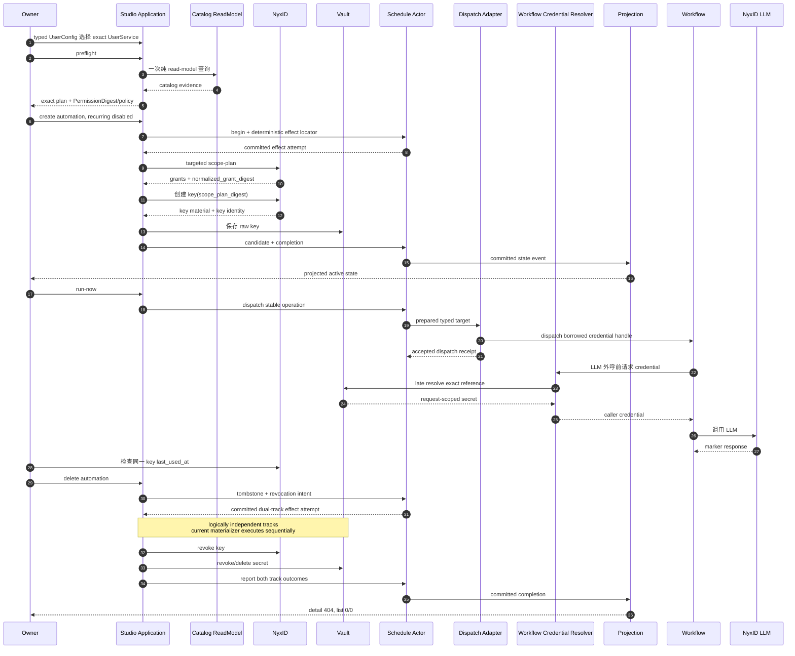

# Studio Team Member Automation 使用 Agent Key:从 scope-plan 到生产证据闭环

## 事实源/设计抽象(以 ~/Code/aevatar 为准)

> 本章回答一个窄而关键的问题:**canonical Studio Team Member Automation 在用户离线后,怎样仍以该用户明确授权的 NyxID 能力执行 LLM 调用,又不把 raw key 放进 actor state、read model、日志或浏览器?** 事实源集中在三组稳定契约:

- **产品与运行时主契约**:`docs/canon/scheduled-skill-runners.md`,定义 owner-scoped automation、exact owner LLM selection、`scheduled_invocation_agent_key`、read model 与删除可见性。
- **凭证与补偿边界**:`docs/adr/0041-scheduled-invocation-agent-key-credential-reference.md`、`docs/adr/0043-scheduled-credential-lifecycle-compensation.md`,定义 typed credential reference、Vault purpose 与 NyxID/Vault 双轨吊销。
- **生产验证程序与首次结果**:`docs/operations/2026-07-23-scheduled-agent-key-production-canary.md`,定义门禁、精确身份断言、`last_used_at` 证据、失败恢复和清理顺序,并记录首次 production canary 的脱敏结果与 provenance exception。

本章对应 private tracker 中的 `SCOPE_EXTEND #147`。实现事实以 `~/Code/aevatar` 为准;第二次执行来自 owner-only 本地 evidence report,公开文档只转录 allowlisted 脱敏字段并在 §6 给出 SHA-256,不提交包含生产身份的原始报告。

---

## 0. 先给结论

> **canonical Member Automation 的功能已经工作,而且证据不是“接口返回 202”或“模型说自己成功了”。** 第一次生产 canary 证明了完整功能与 audit 闭环:exact UserService grant → dedicated Agent Key → `run-now` → 同一 key 的 `last_used_at` 从空变为非空 → NyxID/Vault `Completed/Completed` → detail `404` → key inactive/absent → automation `0/0` → 临时资源清理。该次 release provenance 使用一次性 operator exception,所以不能称为全部 gate 无例外的 strict canary。

随后在新生产镜像上又执行了一次 operator-attested functional repeat。owner-only report 明确保存 `lastUsedBefore=null`、run request 后的 `last_used_at`、版本推进、删除与清理结果;run 成功与 marker 命中属于 operator observation,不是报告里的独立布尔证明。Pod stdout 也没有 `6201/6202` operational audit,公开读者无法仅凭报告 hash 重建原始内容,所以它不能冒充第二次 audited canary。

| 问题 | 结论 | 证据等级 |
|---|---|---|
| canonical Member Automation 是否真的使用 Agent Key 调过 LLM? | 是 | 首次公开 runbook 记录完整 transition;第二次报告记录 `lastUsedBefore=null` 与 run request 后 timestamp,operator 观察 run/marker 成功 |
| 创建绑定和双轨吊销是否有完整 operational audit? | 第一次有,第二次当前 Pod stdout 没有 | 第一次功能/audit 完整;第二次仅 functional repeat |
| release provenance 是否达到无例外 strict gate? | 否 | 两次都缺 immutable full-SHA → digest attestation;首次使用一次性 exception |

---

## 1. NyxID #1188 为什么关闭了,却不再阻塞

NyxID issue [#1188](https://github.com/ChronoAIProject/NyxID/issues/1188) 原本要求提供“为目标服务生成最小 API-key scope”的能力。它关闭后,真正的产品契约由 [#1207](https://github.com/ChronoAIProject/NyxID/issues/1207) 原文替代,并经 [PR #1209](https://github.com/ChronoAIProject/NyxID/pull/1209) 合入 NyxID `0.8.0`。

关键不是 issue 编号,而是生产 contract 已存在:

```text
POST /api/v1/api-keys/scope-plan
```

这个 contract 接受目标 UserService 集合,返回 exact service/node grants、policy/contract version 与 opaque `normalized_grant_digest`。创建 key 时,Aevatar 把该值原样作为 `scope_plan_digest` 交回 NyxID,由 NyxID 对当前 inventory 做 fail-closed revalidation。

这里有三个不能互换的 digest:

| Digest | 生产方 | 约束什么 |
|---|---|---|
| `normalized_grant_digest` | NyxID targeted scope-plan | 本次待签发 key 的 exact service/node grants;创建 key 时名为 `scope_plan_digest` |
| catalog `ContentDigest` | Aevatar catalog actor | owner-scoped authorization catalog 的 typed current state |
| authorization `PermissionDigest` | Aevatar planner | member、prepared revision、owner LLM selection、catalog evidence 等完整授权计划 |

Aevatar 不从 slug 或 proxy route 猜身份。**授权身份是 exact `UserService.id`;slug、route 和 model 只是同一次选择的配套快照。** 这就是为什么 #1188 本身不需要重新打开:它要解决的产品能力已在替代 contract 中落地。

---

## 2. 主链怎么改:从“触发时换短票”到“创建时固化最小授权”

one-call C1 `/provision-workflow` 这条独立 surface 当前仍只保存 `SenderNyxId`,每次 fire 时由 dispatch 向 NyxID 换一张 short-lived token。它把无人值守执行绑定到“此刻 broker 可用、binding 仍可换票、scope/tenant 仍匹配”三个条件,因此可能出现“能创建、到点失败”。[07/12 定时任务](../../07/12-scheduled-tasks.md)给出了它与 caller-authority per-call re-mint、Member Automation Agent Key 的边界。

当前 Studio Team Member Automation 路径把凭证生命周期前移到创建面:

```mermaid
%%{init: {"maxTextSize": 100000, "flowchart": {"useMaxWidth": false, "nodeSpacing": 10, "rankSpacing": 50}, "themeVariables": {"fontSize": "10px"}}}%%
flowchart LR
    U["Owner typed UserConfig<br/>exact UserService ID + model"]
    C["Catalog refresh<br/>user-services + full-catalog scope-plan"]
    P["Projected catalog + Studio preflight<br/>PermissionDigest + exact plan"]
    I["Schedule actor<br/>committed begin + effect locator"]
    T["Targeted scope-plan<br/>normalized_grant_digest"]
    K["NyxID create key<br/>scope_plan_digest"]
    V["Vault<br/>raw key material"]
    A["Schedule actor state<br/>SecretReference + api_key_id + expiry"]
    F["run-now / cron fire"]
    D["Dispatch adapter<br/>borrowed typed handle"]
    W["Workflow inbox"]
    X["Workflow credential resolver<br/>late resolve per external call"]
    L["NyxID LLM"]
    R["Projection/read model<br/>status, versions, owner LLM snapshot"]

    U --> C
    C --> P
    P --> I
    I --> T
    T --> K
    K --> V
    V -->|"confirmed SecretReference"| A
    A --> F
    F --> D
    D --> W
    W --> X
    X -->|"resolve borrowed reference"| V
    V -->|"request-scoped secret"| X
    X --> L
    A --> R
```



这里有四个不能混淆的边界:

1. **UserConfig 是 owner 选择事实**,不是浏览器临时 route 字符串。稳定读取必须同时看到 route kind、exact UserService ID、slug snapshot、route 和 model。
2. **preflight 是纯 read-model 授权计划**,不是 key,也不直接调用或刷新 NyxID。它给出 exact grants、wildcard flags、policy version 和 Aevatar `PermissionDigest`。
3. **create 先提交 actor intent,再签发 dedicated key**。浏览器只确认 `PermissionDigest`/policy 和 `dedicated_scheduled_invocation_agent_key`;targeted scope-plan、key ID、过期时间、service grants 与 secret reference 都由服务端派生。
4. **actor state 持 typed credential locator**:`SecretReference + api_key_id + key expiry`。raw key 的唯一持久化位置是专用 Vault purpose;public automation view、日志和 durable callback envelope 都不含 raw key 或 secret reference。

### 为什么不把 raw key 存进 schedule state

schedule state 是可持久化、可重放、可投影的事实边界。raw key 一旦进入,会同时扩大 event store、snapshot、projection、debug dump 和迁移工具的泄漏面。typed reference + Vault 把“谁拥有凭证生命周期”和“谁拥有业务状态”拆开:actor 决定何时需要凭证,Vault adapter 决定如何保存和解析 secret。

### 为什么不在每次 fire 时换 token

无人值守 schedule 的核心要求是 **owner 离线后仍可执行**。把授权固定在 create/reauthorize 时,fire 前可对 actor-owned binding、reference shape 与 expiry 做 fail-closed 校验;这类 schedule-owned 证据失效可进入 `needs_authorization`。dispatch 本身不读 Vault,只把 borrowed typed handle 交给 workflow;Vault 在每次 LLM/tool/connector 外呼前 late resolve。当前没有证据表明 late Vault resolution failure 会自动反馈成 schedule 的 `needs_authorization`,因此它只能按 workflow 外呼失败报告,不能被文档夸大。

---

## 3. identity 必须分开

| 身份 | 表达什么 | 进入哪里 |
|---|---|---|
| `memberId` | Studio Team member authority | member、binding、automation API path |
| `draftWorkflowId` | workspace workflow draft | binding body,不进入 member path |
| `publishedServiceId` | 可调用 workflow service runtime identity | invocation target,由 binding/read model 给出 |
| NyxID `UserService.id` | owner 允许 Agent Key 调用的外部 LLM service | scope-plan grant 与 key allowed service IDs |

生产验证故意为这些身份使用不同形态,并要求它们互不相等。这样可以把“workflow ID 误传成 member ID”或“拿 slug 当 UserService ID”的错误在 mutation 前暴露。

---

## 4. 从 preflight 到删除:一次完整生命周期



完整证明分成六段,任何一段都不能用上一段的 ACK 代替:

1. **preflight**:从已物化 catalog 构建计划;exact UserService grant 只有一个;`allowAllServices=false`、`allowAllNodes=false`;owner LLM 五字段一致。
2. **create**:`202 Accepted` 只证明请求进入写侧。actor 先提交 begin/effect locator,外部 effect 才能执行;随后必须从 projection 观察 automation 到 `active`,并确认 recurring `enabled=false`。
3. **key baseline**:按 deterministic name 精确定位一个 key。它必须 active、只允许目标 UserService、两个 wildcard 为 false、`last_used_at` 为空。
4. **run**:`run-now` 复用 schedule actor 的 manual-fire/dispatch 主链,完成 `simple_qa`,输出含唯一 marker;automation `stateVersion` 推进且 `lastFireAt` 非空。canary 故意保持 recurring disabled,所以这一步不验证 wall-clock cron 精度。
5. **credential proof**:再次读取同一 key ID/name,要求 `last_used_at` 从空变为非空。**这是“Agent Key 实际执行”的核心证据。**
6. **delete**:actor 先提交 tombstone/revocation intent,再执行互相独立的 NyxID/Vault tracks,最后提交 completion。audited canary 需要 operational audit 证明两轨均为 `Completed`,然后才从 projection 接受 detail `404`、key inactive/absent 和 list `0/0`。

---

## 5. 生产前门禁

### 5.1 deployment 与 contract

- `/health/ready` 必须为 ready,且 workflow、gagent-service、studio 组件都在。
- Pod 必须 Running/Ready,并记录实际 image tag 与 runtime digest。
- OpenAPI 必须包含 typed UserConfig;`StudioMemberAutomationView` 必须包含 owner LLM 五字段与 NyxID/Vault 两条 revocation status。
- `StudioMemberAutomationView` 必须不暴露 caller authority、verified binding、key ID、secret reference、raw key 或 ciphertext。Admin repair request 是独立受控边界,合法包含 typed key identifier/reference,不能拿整份 OpenAPI 做同一断言。

### 5.2 owner、service 与库存

- Studio bearer 文件必须 owner-only,且 Studio owner/scope 与 NyxID `whoami` 一致。
- exact NyxID UserService 必须 active、connected,并同时匹配 ID、slug 与 slug route。
- mutation 前必须遍历 scoped members/automations,要求 zero pending。
- 没有完整 caller-binding audit 覆盖的 active Agent Key automation 必须先 pause。
- NyxID 中不得留有上一次 canary 的 active `studio-schedule-*` key。

### 5.3 provenance 要诚实

首次 evidence 记录了短 tag 唯一解析、registry digest 与 Pod image ID 匹配。第二次 report 只保存 `sourceSha`、`imageDigest`、`provenanceMode` 与 `immutableSourceAttestationPresent=false`;它不包含首次报告的 tag uniqueness 或 Pod/registry match 字段。

两次都没有外部 release system 提供的 immutable full-SHA → image-digest attestation。因此现有记录只能按各自字段强度使用,不能冒充供应链 attestation。第一次执行使用了一次性、无先例的 operator-approved exception;这个事实不改变严格 runbook 对未来 release manifest 的要求。

---

## 6. 两次生产执行:相同功能结论,不同证据等级

首次结果已写入 aevatar 的 production runbook。第二次原始报告包含生产资源身份,因此只保存在 owner-only 本地 state 目录;本章转录下表所需的最小字段。SHA-256 只能锚定 operator 本机的原始文件,不能让公开读者独立复核未提交内容。两份原始报告的内容校验和分别为:

```text
audited run:                  b1819d830b3f9efa7dc732ba58fe6d75175a6506036a5db05a5a5386c8ec2d7a
operator-attested repeat:    27d362c15aa942c820796b15f740001e6a7b77a4166b3ff829ca700204baf025
```

| 执行 | 运行镜像 | 功能证据 | audit / revocation 证据 | 结论 |
|---|---|---|---|---|
| audited canary,provenance exception | `f1a18bac0c86df2dd5e1f1fd20bbe32e41c97330` / `sha256:cffd1aef30b1dff7ede81ebd780dced55a7697928703d9199b11e7d909d6cc75` | exact key `last_used_at`:空 → `2026-07-24T13:25:59.746+00:00`;run marker 成功;state version `8 → 10` | `6201` 精确 binding;`6202` NyxID/Vault `Completed/Completed`;terminal version `14`;404/key inactive/list 0/0 | 功能与 audit 闭环;release provenance 使用一次性 exception |
| operator-attested functional repeat | `4e0def2c231b7074209b852b855954b3db7d3e71` / `sha256:dbaccff2cac9184fb65f8e71f7e6b22b86d7c09397e4c890a2f59143e7ebf796` | 报告记录 `lastUsedBefore=null`、run request `2026-07-24T15:48:35Z` 后 `last_used_at=2026-07-24T15:48:38.775Z`、state version `8 → 12`;operator 观察 run/marker 成功 | Pod stdout 没有 `6201/6202`;报告记录删除后 404、exact key inactive/absent、list 0/0 | operator 功能复测通过;非独立可复核 audited canary |

为什么要保留第二行的缺口?因为下面三句话不是同一件事:

- “workflow 完成了”证明业务执行成功;
- “同一 key 的 `last_used_at` 变了”证明 Agent Key 被实际使用;
- “`6202` 证明双轨 `Completed/Completed`”证明删除补偿的两个外部副作用都被 operational audit 观察到。

第二次由 operator baseline + owner-only report 支持前两项与清理后的外部状态,但缺第三项 audit和公开可复核 bundle。把它写成完整 canary 会制造不存在的证据。

---

## 7. 失败恢复

| 失败位置 | 正确恢复 | 禁止动作 |
|---|---|---|
| create response 丢失 | 用原 `operationId`/`idempotencyKey` 和 deterministic schedule/key identity 查询 | 换新 ID 再 create |
| member/draft 已建,automation 未建 | 从 owner-only ledger 恢复,确认无 key 后按 revision → member → draft → Team 清理 | 猜 identity 或删除无关资源 |
| run receipt 已接受但结果未知 | 查 exact schedule run 与 exact key `last_used_at`;失败也进入 delete/revoke | 用第二个 run ID 隐藏第一次失败 |
| revocation pending | fresh bearer + 原 delete body 调 `retry-revocation` | 新建 delete operation 或先删 member |
| operational audit 缺失 | 停止 audited canary;若只做功能复测,必须降级标注并以 404/key inactive/inventory 0 收尾 | 把模型输出或 202 当 audit |

owner-only ledger 的意义不是方便拼脚本,而是确保一次跨多个 actor、API、NyxID 和 Vault 的操作在网络超时后仍有唯一恢复键。它不能包含 bearer、raw key、Vault ciphertext 或完整 API inventory。

---

## 8. 可复现检查单

### mutation 前

- [ ] 当前 checkout 含目标实现,远端 SHA 与本地一致。
- [ ] 记录 Pod tag/digest,health 与 OpenAPI typed/sensitive-field gate 通过。
- [ ] Studio owner/scope 与 NyxID owner 一致,exact UserService active/connected。
- [ ] scoped automation inventory 无 pending,上次 canary 无 active key 残留。
- [ ] exact UserConfig 已通过 typed GET 观察。
- [ ] provenance manifest 已提供;否则停止严格 canary。

### create 与 run

- [ ] Team、member、draft workflow、published service、schedule 五类身份互不混用。
- [ ] preflight exact grant 唯一,两个 wildcard 为 false,digest/policy 固定。
- [ ] recurring schedule disabled。
- [ ] exact key active、scope 收敛、run 前 `last_used_at` 为空。
- [ ] `run-now` 只执行一次,marker 与 run status 成功。
- [ ] 同一 key ID/name 的 `last_used_at` 变为非空。

### delete 与收尾

- [ ] delete/retry 始终复用原 operation/idempotency pair。
- [ ] audited canary 观察到 `6202` 的 NyxID/Vault `Completed/Completed`。
- [ ] detail `404`,exact key inactive/absent,automation list `0/0`。
- [ ] revision retired → member deleted → draft deleted → Team archived。
- [ ] final health ready,exact UserConfig 仍为批准的选择。
- [ ] 只导出 allowlisted evidence,删除本地敏感 state dir。

---

## 9. 最终判断

canonical Studio Team Member Automation 使用 Agent Key 的基本要求已经满足:

- 授权由 owner 的 exact UserService selection 和 NyxID scope-plan 决定;
- key 在创建期按最小 grants 签发,raw key 的唯一持久化位置是 Vault;
- schedule actor 持 `SecretReference + api_key_id + expiry`;public read model 只投影 source kind、expiry、generation、状态与版本,不投影该 reference;
- 首次公开 runbook 记录完整 key-use transition;第二次由 operator baseline 与 run 后 timestamp 支持同一结论。两次均保持 recurring disabled,不把结果夸大为 cron 计时精度验证;
- 删除会撤销 key 并清理 secret,第一次 audited canary 已记录双轨终态。

剩余问题不在“Agent Key 是否能跑”,而在两条治理能力:

1. 发布系统应产出 immutable full-SHA → image digest attestation,取消人工 provenance exception。
2. 当前 `4e0def2c` Pod stdout 缺失 `6201/6202`,需恢复 operational audit 可见性;连同 immutable provenance manifest 一起补齐后,才能做无例外的 fully gated canary。

⟦AI:AUTO-LOOP⟧
