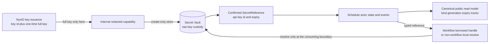
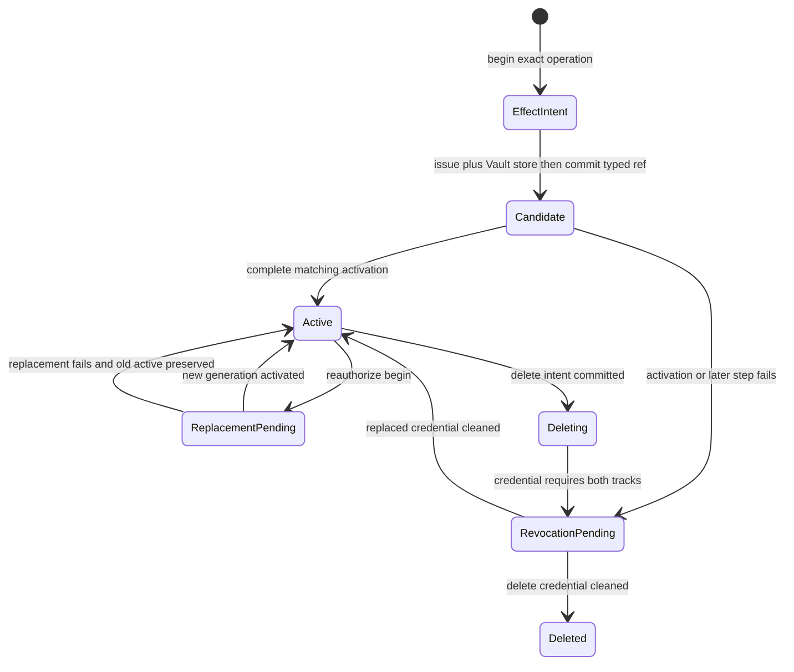
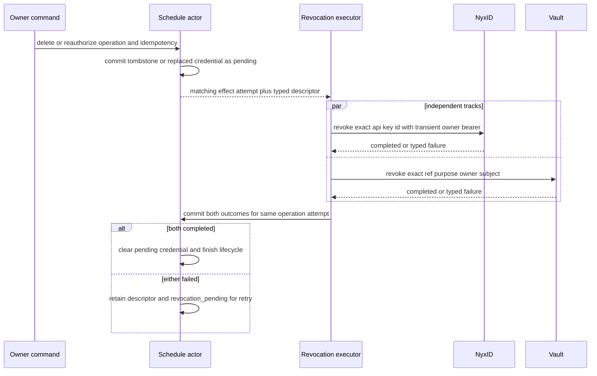
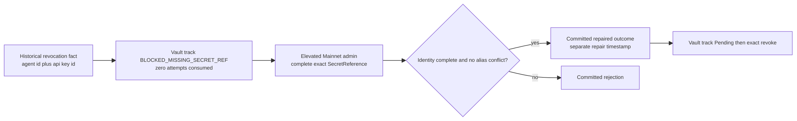

# Vault Reference 与撤销补偿：秘密不成为业务事实

> 版本与结论：本章描述 `current`。Dedicated Agent Key 的 raw value 只在签发结果与 Vault store/resolve 的窄边界短暂出现；schedule actor持久化的是 `api_key_id + SecretReference + expiry`，canonical public read model进一步只公开credential类型、generation、expiry、两条revocation track与状态。Team Automation的替换/删除由schedule actor持有双轨补偿；历史scheduled-agent/delivery-target缺失exact locator的修复则由owner-scoped catalog actor持有，不能混成同一个状态机。

## 设计抽象与事实源

- `docs/canon/scheduled-skill-runners.md:63-88`、`:117-129`：canonical DELETE 重放、stable owner、actor-owned intent/effect attempt 与双轨 cleanup。
- `docs/adr/0041-scheduled-invocation-agent-key-credential-reference.md:24-37`：typed `SecretReference`、raw credential 禁入持久状态与 trusted provisioning 边界。
- `docs/adr/0043-scheduled-credential-lifecycle-compensation.md:20-66`：通用 scheduled credential 的 intent-first 双轨补偿、`REQUESTED_NOT_CONFIRMED` 与 `BLOCKED_MISSING_SECRET_REF` repair；它与 Team Automation schedule actor 是相邻但不同的 owner 边界。

这里按 schedule state、secret materialization、历史 repair contract 三个设计边界分组；它们只属于事实源清单，不构成正文骨架。

## Secret custody：状态保存定位符，不保存可用秘密

`SecretReference`包含 `ref`、`purpose`、fingerprint、version、owner scope与时间边界；它是一份“怎样在正确owner与purpose下定位某个secret”的typed descriptor，不是secret本身。Team Automation在actor state里的credential形状只有：

```text
ScheduledInvocationAgentKeyCredentialReferenceState
  secret_reference: SecretReference
  api_key_id: string
  key_expires_at_unix_ms: int64
```

materializer先从 `(scheduleId, operationId, credential owner)` 产生deterministic credential name与requested Vault ref，再让issuer返回 `api_key_id + full_key`。`full_key`被一个内部redacted capability直接交给Vault store；store成功后才形成confirmed `SecretReference`，随后actor只接收typed reference。



为什么不加密raw key后直接写actor event？event会进入EventStore、snapshot、replica、日志与调试工具，密文仍扩大key material的长期复制面，也把密钥轮换/访问审计耦合给业务actor。Vault已经提供owner/purpose/subject校验、原子create-only store与resolve/revoke边界；actor只需要可审计定位符。为什么public API连 `api_key_id` 与 `SecretReference`也不返回？它们虽不是raw secret，却是内部credential inventory与攻击面线索；UI只需知道generation、expiry、lifecycle和补偿是否完成。

dispatch也不把raw key提交回schedule actor，但冻结实现按target分成两条消费路径。canonical Team Member Automation调用workflow service时，dispatch只校验purpose、owner scope、api key subject、expiry与caller authority，然后把exact locator投影成`DurableCallerCredentialRef`；它**不访问Vault、不把token写进`ChatRequestEvent.LlmControl`**，由workflow内真正发起LLM/tool/connector外呼的consumer再late-resolve。非workflow service invocation则可在dispatch边界直接resolve，并把token注入这次request-local调用。两条路径都禁止把resolved value写回schedule state；reference不完整、purpose错误、过期或Vault不可用均在对应消费边界fail closed。

## Provision / reauthorize：candidate 是补偿锚点，不是半成品active

跨actor、NyxID与Vault无法建立一个ACID事务，因此创建和替换采用可恢复的effect协议：

1. schedule actor先提交operation、idempotency、mutation digest、activation decision与deterministic effect locator。
2. 当前effect-attempt owner先按locator清理同名遗留effect，再签发key并写Vault。
3. confirmed typed credential作为`candidate`提交；只有matching operation/effect attempt可写。
4. candidate与完整configuration一起原子激活为新generation。
5. reauthorize的旧active credential同时转为`pending_revocation`，NyxID与Vault两条track均为`Pending`。



candidate不能只留在application内存中。进程若在Vault store后、activation前退出，外部key已存在却没有恢复依据；committed candidate与locator让下一次operation观察到“effect发生到哪一步”。反过来，也不能在Vault store前伪造confirmed reference：requested ref只说明打算写哪里，不证明Vault已接受descriptor与secret。

recovery attempt复用同一个deterministic locator，并先列出同名active keys、核对owner plan、清Vault再撤销NyxID遗留key。第二次effect attempt若找不到任何recovery evidence会以`scheduled_credential_recovery_evidence_missing`阻塞，而不是再盲签一把。这牺牲了“自动向前猜测”，换来不会静默产生standing credentials。

## Tombstone first：撤销是两条独立事实，不是一条 finally

delete先在schedule actor提交`TeamAutomationDeletionRequestedEvent`与`ScheduledDispatchDeletedEvent`，取消fire/expiry lease，再执行外部撤销。reauthorize也在新generation激活时先把旧credential提交为pending。两者都遵循同一不变量：**先让权威actor记住要清理谁，再调用NyxID与Vault。**



Team Automation公开的track wire值是`NotRequired / Pending / Completed / Failed`。这里的`Failed`是最近一次effect attempt的结果，不是cleanup终态；actor仍以`!= Completed`判定该track需要后续执行。有credential时，任一track失败都保留`PendingRevocationTeamCredential`，lifecycle进入`revocation_pending`；只有两条都`Completed`才清掉pending descriptor。delete场景在此后才允许canonical detail最终not found，reauthorize场景则回到新credential的`active`。

为什么不能把“NyxID 404”或“Vault absent”一概当失败？revoke是确保资源不再存在的postcondition，exact resource已不存在可以是幂等成功；但owner不匹配、descriptor变化或无权访问不能被吞掉。为什么不在HTTP handler里`try/finally`两次删除？handler崩溃会丢掉未完成track，且重试无法知道哪条已成功。actor facts把两条外部系统的结果拆开，允许只重试仍未完成的effect。

## 删除重放必须回到同一权威 operation

current contract 不存在独立的 public revocation-retry route。首次删除与任何 pending/failed track 恢复都重放同一个 `DELETE /api/schedules/{scheduleId}`：body 中 normalized `scopeId + teamId + memberId` owner、reason、`operationId` 与 `idempotencyKey` 必须逐字段复用；只有 Host 从新认证会话派生的 bearer 可以刷新，而且 bearer 不进入 body。schedule actor核对 pending descriptor 与原 operation，重新授予 fenced effect attempt；executor 只执行仍未完成的 track，再把结果提交回同一 operation。

这样做避免两个并发 repair 各自撤销不同 generation，也避免最终一致 read model 驱动写侧。list/detail 用于观察；是否还有 pending descriptor、谁可 claim attempt，必须由 actor state 决定。`202 Accepted` 只证明同一 delete operation 再次准入，最终要以 owner-aware detail 的更高 `stateVersion`、两条 track 与最终 not found 收敛。

## 历史缺失 locator：catalog repair 是另一条窄门

ADR-0043还治理普通scheduled-agent / delivery-target的credential lifecycle。该路径由well-known owner-scoped catalog actor持有revocation fact，natural identity为`(agent_id, api_key_id, secret_reference.ref)`；它不是Team Automation schedule actor。旧数据可能只有agent/key身份而缺exact Vault ref：



`BLOCKED_MISSING_SECRET_REF`是非终态，也不消耗attempt；普通tool不能把它改成`NotApplicable`。只有elevated Mainnet admin endpoint可提交完整 `SecretReference`、`api_key_id` subject、repair reason，repair port通过Projection Session观察actor提交的repaired或rejected outcome后才返回。`repair_requested_at`与原`requested_at`分开，避免篡改事故时间线。

这条repair不能直接套在Team Automation上：canonical Team Automation从一开始就把confirmed typed reference写入candidate/active/pending state；若其operation observation报告`revocation_descriptor_missing`，当前实现会保留失败事实供同operation重试，但没有证据表明catalog admin repair endpoint能改写schedule actor。应当排查数据/迁移完整性，而不是跨actor补一条ref。

## 最小验证：公开面只显示生命周期

```bash
detail=$(curl -fsS \
  -H "Authorization: Bearer $TOKEN" \
  "$HOST/api/schedules/$SCHEDULE?ownerKind=studio_member_automation&ownerScopeId=$SCOPE&ownerTeamId=$TEAM&ownerMemberId=$MEMBER")

jq -e '
  (.credentialSourceKind == "scheduled_invocation_agent_key") and
  (.credentialGeneration >= 1) and
  (.stateVersion >= 1) and
  has("nyxIdRevocationStatus") and
  has("vaultRevocationStatus") and
  (has("apiKeyId") | not) and
  (has("secretReference") | not)
' <<<"$detail"
```

> Demo status：`verified-static`（逐字段核对canonical detail mapping、projection document与endpoint DTO；本轮未访问运行中的Host，也未执行撤销或admin repair）。JSON命名按默认web camelCase contract展示。

这个检查只证明public contract的字段边界；它不能证明生产实例不存在旁路日志、旧索引或运维导出。生产证据与cleanup顺序见 [09/05](05-production-canary-and-recovery.md)，全局日志/secret storage治理见后续生产章节。

## 边界与演进

- raw Agent Key只进入issuer result的内部capability与Vault store/resolve局部；actor event、projection、public DTO、exception与日志不得携带。
- internal operation observation为补偿执行可携带typed locator或credential reference；它不是canonical public list/detail，不能直接暴露给浏览器。
- pause/resume不撤销credential；reauthorize换generation并清理旧credential；delete先tombstone再等待双轨终态。
- Team Automation 的 delete replay 绑定原 owner/reason/operation/idempotency，且只刷新 bearer；catalog repair 绑定另一类 actor 与历史 revocation identity，二者不可互相代写。
- 本章不承诺跨NyxID/Vault exactly-once；它承诺每个外部effect有权威intent、可观察track与幂等postcondition。

## 读完应能回答

1. 为什么 `SecretReference` 可以进actor state，而raw key不可以？
2. candidate credential在crash recovery中提供什么锚点，为什么不能直接视为active？
3. reauthorize与delete怎样复用同一个NyxID/Vault双轨模型？
4. 为什么未完成撤销必须重放同一 owner-aware DELETE，并复用原 owner/reason/operation/idempotency，而不能从read model新建cleanup？
5. `BLOCKED_MISSING_SECRET_REF`属于哪个actor路径，为什么不能用catalog admin repair改写Team Automation？

<details>
<summary>论断—冻结证据映射</summary>

| 论断 | 冻结证据 |
|---|---|
| schedule state只保存Agent Key typed reference、active/candidate/pending三态、effect locator与双轨状态 | `src/platform/Aevatar.GAgentService.Core/Schedules/scheduled_dispatch_state.proto:53-82`、`:251-304` |
| materializer由deterministic locator签发并把secret直接写Vault，返回confirmed typed reference | `agents/Aevatar.GAgents.Scheduled/StudioScheduledCredentialMaterializer.cs:30-133`、`agents/Aevatar.GAgents.Scheduled/ScheduledCredentialEffectLifecycle.cs:88-117` |
| matching candidate先提交，activation才提升generation并把旧credential转pending revocation | `src/platform/Aevatar.GAgentService.Core/Schedules/ScheduledDispatchGAgent.cs:549-700`、`:3234-3276` |
| delete先提交pending credential与deleted事实，再取消fire/expiry lease | `src/platform/Aevatar.GAgentService.Core/Schedules/ScheduledDispatchGAgent.cs:330-409`、`:3308-3333` |
| workflow dispatch只借用exact handle且不访问Vault；非workflow path才在dispatch局部resolve | `src/platform/Aevatar.GAgentService.Infrastructure/Schedules/ScheduledServiceInvocationDispatchPort.cs:233-375`、`:531-728` |
| 两条track独立提交，任一失败保留pending descriptor，双完成才清理 | `src/platform/Aevatar.GAgentService.Core/Schedules/ScheduledDispatchGAgent.cs:758-831`、`:3335-3371` |
| 首次删除与未完成撤销恢复重放同一 owner-aware DELETE，复用原 owner/reason/operation/idempotency，仅刷新 Host bearer | `docs/canon/scheduled-skill-runners.md:63-82`、`docs/operations/2026-07-23-scheduled-agent-key-production-canary.md:1625-1851` |
| canonical projection/public view只有lifecycle、generation、track、error与version，不投影key/ref | `src/platform/Aevatar.GAgentService.Projection/Projectors/ScheduledDispatchCurrentStateProjector.cs:51-132`、`src/Aevatar.Studio.Application/Studio/Services/StudioMemberWorkflowSchedulePort.cs:1023-1056` |
| 通用catalog revocation fact具有exact identity、双轨、requested/confirmed descriptor与blocked状态 | `agents/Aevatar.GAgents.Scheduled/protos/user_agent_catalog.proto:80-146`、`docs/adr/0043-scheduled-credential-lifecycle-compensation.md:20-66` |
| elevated admin repair只接受完整reference并等待committed repaired/rejected outcome | `src/Aevatar.Mainnet.Host.Api/Scheduled/ScheduledAgentCredentialRepairAdminEndpoints.cs:18-94`、`agents/Aevatar.GAgents.Scheduled/UserAgentCatalogGAgent.cs:326-390` |

</details>
