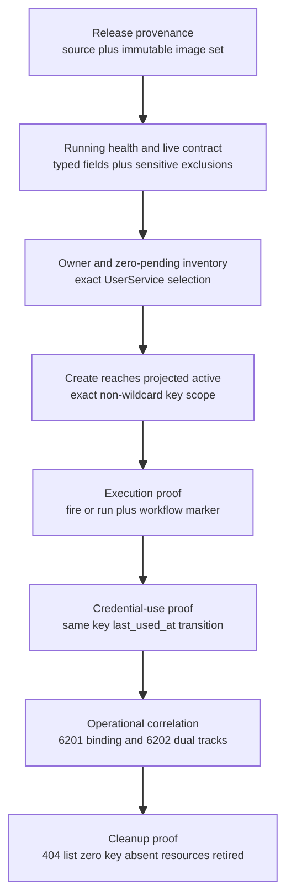
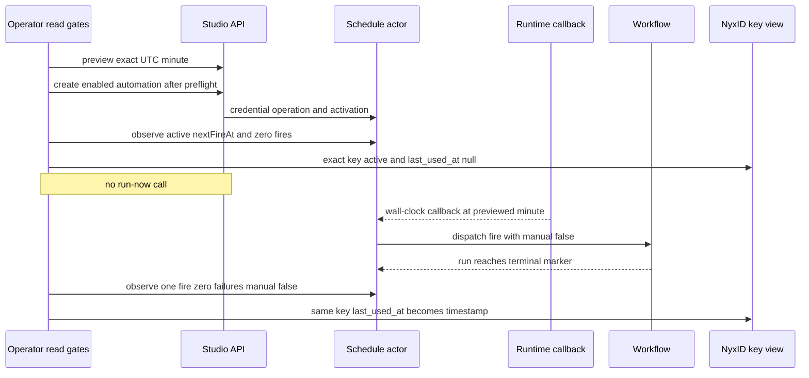
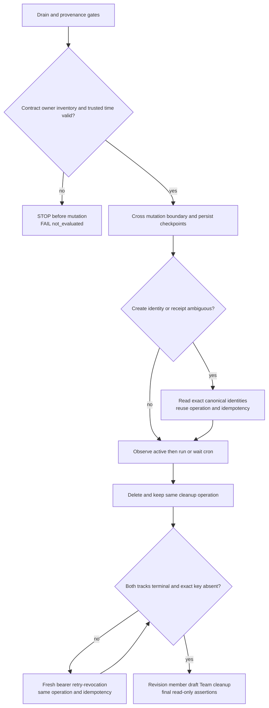

# Production Canary 与恢复：一次执行只能证明它绑定的版本

> 版本与结论：本章是 `mixed`。冻结源码与runbook定义当前canary contract；生产结果是版本化历史证据，只适用于记录的source、image、日期与Aevatar production环境。2026-07-24首次audited canary证明了exact grant、dedicated key、`run-now`、同一key的`last_used_at`变化、`6201/6202`与cleanup，但release provenance使用一次性exception。2026-07-26第三次证明真实wall-clock cron唯一fire为`manual=false`，却缺`6202`。2026-07-27第四次在mutation前失败，结论只能是`FAIL / not_evaluated`。这些结果都不能外推成冻结commit `f02aa690`或未来部署“已生产验证”。

## 设计抽象与事实源

- `docs/operations/2026-07-23-scheduled-agent-key-production-canary.md:9-31`、`:36-89`、`:2002-2085`：首次生产结果、secret-safe gate、ambiguous-create/revocation recovery与cleanup顺序。
- `docs/operations/2026-07-23-scheduled-agent-key-runtime-integrity-rollout.md:14-30`、`:32-109`、`:111-168`：old-binary drain、atomic release provenance、live contract、key-use与双轨验收。
- 本仓库 [受保护工作区账本 §7](../migration/2026-07-25-protected-worktree.md)：退役 canary 输入的第二/三/四次 owner-only evidence、真实 cron、audit 缺口、前置失败与恢复矩阵已逐节迁入本章和 `12/04`；源内容由 Git 历史归档，复核 SHA-256 为 `cb2ae417ad2d3bf7796b91a7a5f6a3620bb6623dc574312f58efb02d6dbb5d8e`。

## Evidence ladder：每一层回答一个不同问题

生产canary不是一条“pass”布尔，而是一组不可互相替代的proof：



| Evidence | 能证明 | 不能证明 |
|---|---|---|
| `202 Accepted` | command/effect admission | actor终态、run成功、key使用或撤销 |
| projected `active`与更高`stateVersion` | credential generation与schedule事实已提交并可见 | LLM实际使用了哪份credential |
| workflow marker / run succeeded | 业务执行完成 | 它是manual还是wall-clock、是否使用dedicated key |
| exact key `last_used_at: null → timestamp` | 同一dedicated key发生实际调用 | run业务语义、双轨撤销 |
| unique fire `manual=false` at previewed UTC | wall-clock callback→actor fire路径成立 | operational audit完整或未来每拍都准时 |
| `6201` | create acceptance与verified binding的allowlisted correlation | credential激活或run完成 |
| `6202`且两值`Completed` | 双轨completion被operational audit观察到 | 其本身不是actor业务事实源 |
| owner detail `404`、list `0/0`、exact key absent | committed deletion visibility与NyxID外部postcondition | 若缺`6202`，不能声称完整audited canary |

为什么不用一个“E2E通过”标签？因为它会掩盖最重要的诊断信息：第二次可以证明功能但没有audit；第三次可以证明cron和key，却仍缺`6202`；第四次甚至没进入mutation。把它们压成同一个绿色结果，后续release会误把旧缺口当已闭合。

## 四次执行：结论严格绑定版本与环境

以下均发生在Aevatar production环境；owner-only artifact的hash只锚定operator本机文件，公开读者无法凭hash独立还原内容，因此证据强度必须保持原标注。

| 日期 / 执行 | Source / tag / runtime image digest | 实际观察 | 可接受结论 | 明确缺口 |
|---|---|---|---|---|
| 2026-07-24 audited canary | `f1a18bac0c86df2dd5e1f1fd20bbe32e41c97330` / short tag `f1a18bac` / `sha256:cffd1aef30b1dff7ede81ebd780dced55a7697928703d9199b11e7d909d6cc75` | one exact grant、wildcards false；disabled automation；`run-now`完成marker；同一key `last_used_at`空→`2026-07-24T13:25:59.746+00:00`；`6201`；`6202 Completed/Completed`；terminal version 14；404/key inactive/list 0/0与资源清理 | Agent Key功能与operational audit闭环 | 无immutable full-source-SHA→image-digest attestation；仅一次operator-approved provenance exception，非先例 |
| 2026-07-24 operator-attested functional repeat | `4e0def2c231b7074209b852b855954b3db7d3e71` / `sha256:dbaccff2cac9184fb65f8e71f7e6b22b86d7c09397e4c890a2f59143e7ebf796` | owner-only report保存baseline null、run request后`2026-07-24T15:48:38.775Z`、version `8→12`、404/key absent/list 0/0；operator观察run marker | functional repeat，支持key-use transition与cleanup triangulation | run/marker不是artifact内独立布尔；Pod stdout无`6201/6202`；不能称第二次audited canary |
| 2026-07-26 wall-clock cron canary after code-owned projection repair | `c70f284908fd352cd64719349abae128ee8da0b2` / `c70f2849` / `sha256:22ee592d65a2974f73c2fb313f87dcc9f2321a6de574ee341a2986de1650836f` | preview `2026-07-26T04:22:00Z`；pre-fire `0/0/[]`→post `1/0/1`；唯一fire `manual=false`；marker成功；同一key null→`2026-07-26T04:22:03.156+00:00`；version `10→14`；`6201`、404/list 0/0/key absent与resource cleanup | 真实cron + Agent Key功能闭环，且read-model regression可由typed fenced repair恢复 | `6202`未观察；Vault completion是current committed-visibility contract支持的推论，不是backend直接检查；仍无immutable attestation |
| 2026-07-27 reminder fix后第四次尝试 | `198fe84ec44e997ac3b4c45bff597cc5a5f6bcc5` / `198fe84e` / `sha256:f3c0fea51e2330bf32480b112f08777753e3e72d062aacbb1880eb22761dcec0`，revision 1106 | 强制`code_execute`可信时钟探针返回401 `UNAUTHENTICATED`；mutation前停止；owner-scoped Team与Agent Key核验为零新增资源 | `FAIL`、`featureConclusion=not_evaluated`、`PREREQUISITE_CODE_EXECUTE_UNAVAILABLE`；没有资源所以cleanup平凡完成 | 对reminder修复、cron、key-use、run与revocation均未产生功能证据；不是`CLEANUP_INCOMPLETE` |

前三份owner-only evidence artifact记录的SHA-256分别为：audited run `b1819d830b3f9efa7dc732ba58fe6d75175a6506036a5db05a5a5386c8ec2d7a`、functional repeat `27d362c15aa942c820796b15f740001e6a7b77a4166b3ff829ca700204baf025`、wall-clock cron `dcc4b9ecbc3e1eace9277d9c7a3a4314991ac1f2771e71683e17d8dc205a7221`。这些hash不是release attestation，也不授权在公共仓库发布原始inventory。

## 为什么第三次是cron proof，第一次不是

首次canary故意让recurring schedule保持disabled，并调用`run-now`，覆盖owner、authorization fact、key、Vault、workflow dispatch与cleanup，但没有覆盖wall-clock callback。第三次则先用cron preview固定目标UTC整分钟与远期第二拍，创建`enabled=true` automation，确认fire前为`fireCount=0/failureCount=0/recentFires=[]`，并且**不调用`run-now`**。目标分钟后唯一record精确匹配preview且`manual=false`。



为什么还要`last_used_at`？即使workflow marker成功，也可能有交互bearer或错误credential path替它完成调用；同一exact key的before/after transition把“业务成功”与“哪份凭证被实际使用”关联起来。为什么`manual=false`不能单独证明成功？它只证明actor记录了automatic fire，还需run/marker与key transition覆盖下游。

## Gate 顺序：先证明能安全变更，才跨 mutation boundary

production procedure按以下顺序fail closed：

1. old binary drain：遍历全部Team/member/automation pagination；无pending operation；缺verified-binding audit的active Agent Key automation先pause并观察`enabled=false`。
2. atomic release：authorization plan/fact、schedule state、projector、Studio API必须来自同一immutable manifest/image set；部分滚动禁止。
3. live contract：health ready、OpenAPI含typed owner LLM与两条track，同时排除caller/binding/key/ref/raw/ciphertext字段；allowlisted audit query可取`6201/6202`。
4. owner/inventory：Studio owner、NyxID owner、scope与exact UserService一致；零pending、零collision、bearer只在mode-0600文件。
5. trusted time/preview：若要证明wall-clock cron，目标分钟必须由可信UTC source得到；前置工具401时停止，不能用模型自述时间替代。
6. mutation：建立secret-safe checkpoint ledger后，才依次创建Team、draft、member、binding、catalog/preflight与automation。
7. fire与key proof：按目标类型选择`run-now`或等待cron；不混淆两类证据。
8. revoke与cleanup：先等两条track终态，再按revision→member→draft→Team顺序清理，最后重查health、list与exact key。



## 恢复：checkpoint ledger 是跨轮事实源

| 失败点 | 只能怎样恢复 | 禁止捷径 |
|---|---|---|
| create response丢失 | 用原`operationId/idempotencyKey`与deterministic schedule/key identity查询 | 换ID再create，制造第二把key |
| member/draft已建但automation未知 | 从owner-only ledger读exact identities，确认automation/key实际状态后决定继续或逆序清理 | 猜ID、按名字批量删 |
| run receipt已接受或cron到点后结果未知 | 查exact fire、run终态与same key `last_used_at` | 再跑一次掩盖第一次未知 |
| revocation pending/failed | fresh owner bearer调用`retry-revocation`，复用原delete operation/idempotency | 新delete operation、先删member/draft |
| audit缺失 | 降级为functional/terminal triangulation并登记observability gap | 用单独`202`、模型输出或单独`404`冒充`6202` |
| 前置探针失败且零mutation | 记录`FAIL/not_evaluated`与独立零资源readback | 标成cleanup incomplete，或绕过trusted-time gate继续 |

生产`/v1/responses`在该次观察中虽接受并回显`previous_response_id`，但`store=false`且不会重放跨轮history；第一轮token在第二轮读回为`NONE`。因此phased skill必须在每轮完整输出labelled checkpoint，由调用方原样带回；`previous_response_id`不能替代ledger。ledger只保存allowlisted identity、status、version、UTC时间与artifact hash，不保存bearer、raw key、Vault reference/ciphertext或完整外部inventory。

## 最小 demo：本地校验证据分类，不执行生产 mutation

```bash
jq -e '
  .environment == "production" and
  (.sourceSha | test("^[0-9a-f]{40}$")) and
  (.imageDigest | test("^sha256:[0-9a-f]{64}$")) and
  (
    if .featureConclusion == "passed" then
      .mutationStarted == true and
      .exactKeyLastUsedBefore == null and
      (.exactKeyLastUsedAfter | type == "string")
    elif .featureConclusion == "not_evaluated" then
      .mutationStarted == false and
      (.errorCode | length > 0) and
      .createdResourceCount == 0
    else false end
  )
' allowlisted-canary-summary.json
```

> Demo status：`verified-static`（校验本章定义的最小evidence shape；本轮没有读取owner-only artifact、没有访问production、没有执行canary）。这不是上游runbook的替代实现，也不能把自行构造的JSON变成生产证据。

## 边界与演进

- frozen current code与历史production evidence分开：代码可说明contract，canary只说明特定部署。
- 首次audited result仍受provenance exception限制；future strict canary必须有immutable full-SHA→complete image-set attestation。
- 第二次缺`6201/6202`，第三次缺`6202`；两次都不能升级为完整audited canary。
- 第三次projection repair是typed identity/version-fenced read-model delete后由正式主链重建，不是运维直写或actor state回写；其repair provenance仍需signed inspection/durable request ID。
- 第四次暴露`code_execute`→sandbox bearer缺失的独立缺陷，应在 [12/05](../12/05-open-gaps-and-canon-drift.md)登记；它不证明reminder fix失败。
- reminder context事故、projection regression与canary evidence缺口会在 [12/04](../12/04-incident-case-studies.md)按不同根因保留，不能压成“生产不稳定”。

## 读完应能回答

1. `202`、projected active、run marker、`last_used_at`、`manual=false`与`6202`分别证明哪一层？
2. 为什么首次canary有完整audit仍不能称无例外strict provenance？
3. 第三次缺`6202`时，哪些terminal结论仍可由owner view与exact key交叉支持？
4. 第四次为什么是`FAIL/not_evaluated`而不是`CLEANUP_INCOMPLETE`或“reminder修复失败”？
5. 网络中断后为什么必须复用checkpoint ledger里的operation/idempotency，而不能重新开始？

<details>
<summary>论断—冻结与版本化证据映射</summary>

| 论断 | 证据 |
|---|---|
| 首次生产canary的source/image、exact key transition、6201/6202与cleanup | `docs/operations/2026-07-23-scheduled-agent-key-production-canary.md:9-31`、`:36-59` |
| strict rollout要求old-binary drain、atomic image set、live sensitive-field gate与完整key/revocation proof | `docs/operations/2026-07-23-scheduled-agent-key-runtime-integrity-rollout.md:32-168` |
| 第二/三/四次证据等级、版本、时间、缺口与owner-only artifact hash | [受保护工作区账本 §7](../migration/2026-07-25-protected-worktree.md) 的逐节迁移与 SHA-256 记录；源内容由 Git 历史归档 |
| ambiguous create、run unknown、revocation pending与audit缺失的恢复规则 | `docs/operations/2026-07-23-scheduled-agent-key-production-canary.md:2002-2085`、[受保护工作区账本 §7](../migration/2026-07-25-protected-worktree.md) |
| cleanup必须先完成credential terminal，再按revision/member/draft/Team收尾 | `docs/operations/2026-07-23-scheduled-agent-key-production-canary.md:1624-1953` |
| phased Responses不能依赖`previous_response_id`保存history | [受保护工作区账本 §7](../migration/2026-07-25-protected-worktree.md) 所登记的 2026-07-27 production observation；源内容由 Git 历史归档 |

</details>
