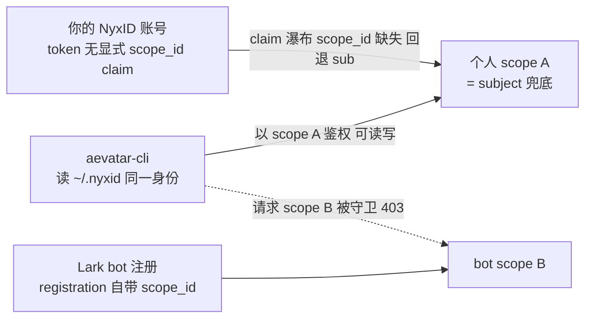
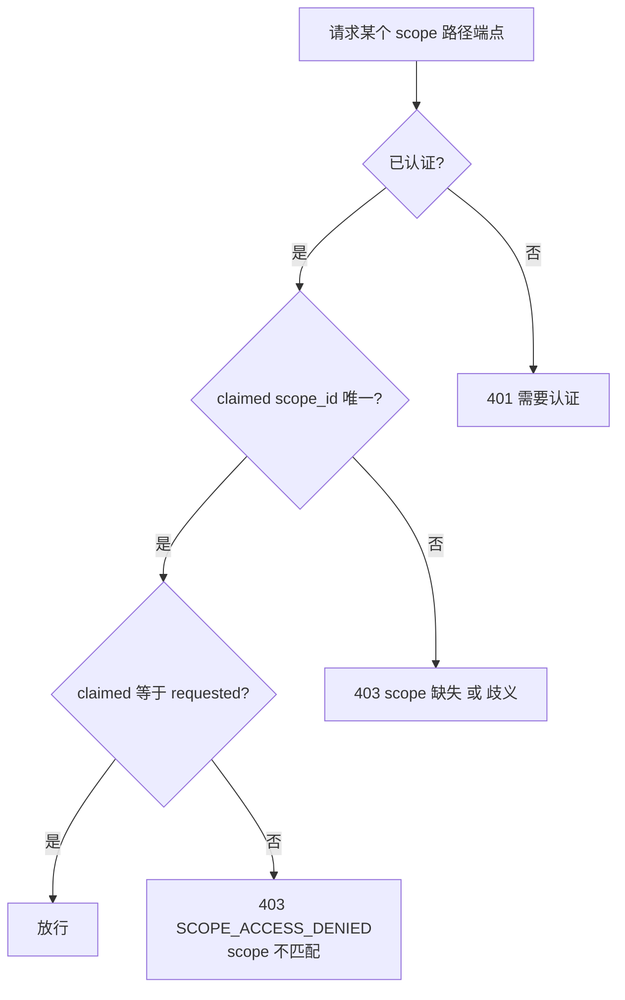

# CLI 看不到 Lark bot 创建的 agent:scope 隔离与单 claim 绑定

## 事实源/设计抽象(以 ~/Code/aevatar 为准)

> 现象:用户把自己的 NyxID 账号绑定到 Aevatar 的 Lark bot,通过 bot 对话创建/驱动了一批 agent;但用 `aevatar-cli`(读 `~/.nyxid/` 的**同一份**凭证)却既看不到、也操作不了这些 agent。本篇把现象钉到 aevatar 服务端的两段事实上 —— **scope 来自 token 的单一 claim** + **每个 scope 端点做严格相等校验** —— 并诚实标注:这是"按设计的隔离",不是 bug;真正的缺口在**可发现性**(用户无从得知自己被钉在哪个 scope、为什么 403)。
>
> 事实源脊柱(非正文骨架):
>
> - **scope claim 瀑布**:`src/Aevatar.Authentication.Providers.NyxId/NyxIdClaimsTransformer.cs`(映射顺序 `scope_id → uid → sub → NameIdentifier → 任意 *_id`);标准 claim 常量 `src/Aevatar.Authentication.Abstractions/AevatarStandardClaimTypes.cs`。
> - **scope 访问守卫(403 的出处)**:`src/Aevatar.Capabilities/AevatarScopeAccessGuard.cs`(单一 claimed scope 必须与 requested scope 严格相等,否则 `SCOPE_ACCESS_DENIED`);studio 侧同义校验见 `src/Aevatar.Studio.Hosting/Endpoints/StudioEndpoints.cs` 与 `src/Aevatar.Studio.Hosting/Controllers/ExecutionsController.cs`。
> - **channel 注册自带独立 scope**:`src/Aevatar.AI.ToolProviders.ChannelAdmin/ChannelRegistrationTool.cs`(registration 记录里带 `scope_id`,与发起人个人 scope 不同)。
>
> 核对基线:`feature/integrate @ efaee423d`;运行期证据采集自 mainnet(`aevatar-console-backend-api.aevatar.ai`)。下文出现的 subject / scope / bot 资源 UUID **均已脱敏**为占位符(`scope-A` / `scope-B` 等),只保留结构,不暴露真实账号标识。

---

## 0. 一句话主线

> **scope 不是你在客户端选的,而是 NyxID token 里那一个 `scope_id` claim 决定的。** 服务端对每个 `/api/scopes/{scopeId}/...` 端点都做"claimed scope == requested scope"的严格相等校验,不等就 `403`。Lark bot 跑在它**注册时自带**的 scope 里,你的个人 CLI 跑在"你 subject 兜底出来的"scope 里 —— 两个 scope 天然隔离,于是 CLI 看不到 bot 的 agent。这不是权限没配好,而是**身份模型本身**:同一个人的"个人 scope"与"bot scope"是两个独立空间。

---

## 1. 复现:CLI 与 Lark bot 看到的是两个世界

同一台机器、同一份 `~/.nyxid/` 凭证,沿 mainnet 探针逐步对照(真实 UUID 已脱敏):

| 探针 | 结果 |
|---|---|
| `aevatar-cli --env mainnet whoami` | `subject = <你的 NyxID subject>`,`scope = null`(CLI 本地没设 active scope) |
| `GET /api/app/context` | `scopeId = scope-A`,`scopeResolved = true`,`scopeSource = claim:scope_id` |
| `GET /api/agents` | 200 个 `WorkflowRunGAgent`,全部在 `scope-A` 里(名字含 `lark_im_*`、`weekly_report`、`twitter_approval` 等) |
| `GET /api/channels/registrations` | 一条 Lark 注册:`platform = lark`、`registration_mode = nyx_relay_webhook`、**`scope_id = scope-B`**(≠ `scope-A`) |
| `GET /api/scopes/<scope-B>/gagent-actors` | **`403 SCOPE_ACCESS_DENIED`** ·「Authenticated scope does not match requested scope.」 |
| `GET /api/scopes/<scope-A>/gagent-actors` | `200 OK`:`nyxid.chat` 等 actor 组正常返回 |

关键反差:**注册记录看得到(它把 `scope-B` 摊给你看了),但 `scope-B` 里的 agent 运行时碰不到**。`/api/agents` 里那些 Lark 风格的名字是你**自己 `scope-A` 里**跑过的同名 workflow(很多带 `probe`),不是 bot 在 `scope-B` 里那批。

!!! note "为什么注册看得到、agent 看不到"
    channel 注册是"你作为 NyxID 账号 provision 出来的资源",归属于你、对你可见;但 bot 的 agent **运行时**活在 `scope-B`,受 scope 守卫保护。两件事分属不同层。

## 2. 根因一:scope = NyxID token 的单一 `scope_id` claim(claim 瀑布)

aevatar 不让客户端自由声明 scope。鉴权管线在 `NyxIdClaimsTransformer` 里把 NyxID token 的 claim 映射成 aevatar 标准 `scope_id`,顺序是一条**瀑布**:

> `scope_id`(显式) → `uid` → `sub` → `NameIdentifier` → 任意非忽略的 `*_id`

- 若 token **已带**显式 `scope_id` claim → 直接用它,不再兜底。
- 若**没有** → 一路回退,最常见落到 `sub`(subject)。

你的 CLI token 里没有显式 `scope_id`,于是 `scope_id := sub`,也就是 `scope-A` = 你的 subject。这正是 `/api/app/context` 报 `scopeSource = claim:scope_id` 的由来 —— 它是"从身份 claim 解析出来的",不是你选的。Lark bot 那侧则在注册时绑定了**自己**的 `scope_id`(`scope-B`),不走 subject 兜底。

> 一句话:**同一个人,用 CLI 进来是"subject 兜底 scope",用 bot 进来是"bot 注册 scope" —— 天生两个 scope。**

## 3. 根因二:scope 访问守卫做严格相等校验(403 的出处)

每个 scope 路径端点在执行前都过 `AevatarScopeAccessGuard`。它的判定链很短也很硬:

要点:守卫收集 token 里 `scope_id`(及 `workflow.scope_id`)claim,要求**有且仅有一个**,且必须与 URL 里的 `requested scope` **按序数严格相等**;否则返回 `code = SCOPE_ACCESS_DENIED` 的 `403`,文案即「Authenticated scope does not match requested scope.」。studio 侧(`StudioEndpoints` / `ExecutionsController`)有同义校验。

所以 `GET /api/scopes/<scope-B>/...` 在 claimed=`scope-A` 时必然 403 —— 与权限/角色无关,是**身份的 scope 与请求的 scope 不是同一个**。

## 4. 根因三:Lark bot 注册自带独立 scope

channel 注册记录(`ChannelRegistrationTool` 等)里带 `scope_id`,指向 bot 运行所在的 scope(`scope-B`),与发起绑定的个人 scope(`scope-A`)不同。bot 在对话里创建/驱动的 agent,都落在 `scope-B`。"把 NyxID 账号绑定到 bot"解决的是**让 bot 能代表你去调 NyxID 经纪的能力/工具**,并**不**把 bot 的 scope 并入你的个人 scope。

## 5. 影响面

- **能看/能操作(你的 `scope-A`)**:`/api/agents`、`gagent-actors`(如 `nyxid.chat` actor)、binding、conversations、runs 等 —— 凡是你 subject scope 里的东西。
- **看不到/不能操作(bot 的 `scope-B`)**:Lark bot 在对话里创建的 agent、它们的 run 状态与审计 —— 一律 `403`。
- **半可见**:Lark 注册记录本身(`/api/channels/registrations`)对你可见,可做注册级管理(列出 / 状态 / 解绑),但触达不到其 scope 内的 agent 运行时。

## 6. 规避与修复方向

**要在 CLI 里看/操作 bot 的 agent,需要一份 `scope_id` claim == `scope-B` 的 NyxID 凭证。** scope 由 token claim 决定、客户端选不了(`--scope` 传一个不等于 claim 的值只会被守卫 403),所以这是 **NyxID 侧的身份问题**,不是 CLI 能绕过的:

1. 查清 `scope-B` 归谁:它是一个独立的"bot 身份"还是本应并入你?
2. 若是独立 bot 身份 → 取得该身份的 NyxID 凭证(或作为一个 profile 放进 `~/.nyxid/profiles/`),CLI 以该身份进来即落在 `scope-B`。
3. 若 `scope-B` 本应属于你 → 这是绑定/provision 时 scope 归属的配置问题,要从 bot 注册流程查,而非 CLI。

!!! warning "设计待论证:可发现性缺口"
    隔离本身是对的(FI-005 边界优先),但当前**对用户不可见**:CLI 不显示"你被钉在哪个 scope",遇到跨 scope `403` 也不解释成因、不指路。改进点不在放宽隔离,而在**把 scope 模型显式化** —— CLI 侧应展示 active scope、把 `SCOPE_ACCESS_DENIED` 翻译成"你在 scope A,请求的是 scope B"并提示多 profile 切换;服务端的 403 文案也可附带 claimed/requested 对照。该可发现性改进已登记到 aevatar-cli 的交互优化计划,亦可回指本仓库 [08/04 TODO List](../08/04-todo-list.md) 的"待决策"清单。

## 关联章节

- [07/01 Channel Runtime](../07/01-channels.md) —— channel 注册模型与 scope 归属。
- [07/08 Lark Bot 全链路走查](../07/08-lark-end-to-end.md) —— bot 从消息到 agent 的完整链路,bot 绑定 NyxID 的同源机制。
