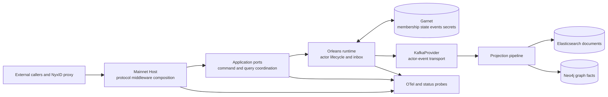
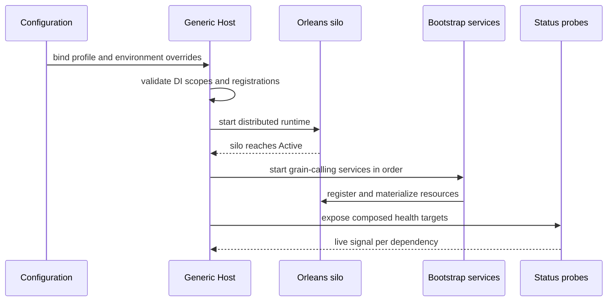

# 生产拓扑与配置：先选择一致性档位，再组合能力

> 版本与结论：本章描述 `current`。Mainnet Host 是产品统一组合根；它把 runtime、transport、持久化、Projection、认证、Audit 与产品能力装进同一进程，但不拥有这些模块的业务状态。冻结配置提供全临时本地、持久写侧本地与 distributed 三种档位；生产档位使用 Orleans、KafkaProvider、Garnet、Elasticsearch 与 Neo4j，并通过环境配置提供秘密。配置档位决定故障与一致性边界，不能把“Host 能启动”解释成“所有依赖和业务闭环都健康”。

## 设计抽象与事实源

- `src/Aevatar.Mainnet.Host.Api/Hosting/MainnetHostBuilderExtensions.cs:94-155`、`:484-509`：Mainnet 的组合顺序、DI fail-fast、禁止本地 secrets/scripting 与容器监听策略。
- `src/Aevatar.Mainnet.Host.Api/README.md:15-49`、`:61-129`：Distributed、local 与 PersistentLocal 三种运行档位及各自依赖、持久性限制。
- `docs/canon/overview.md:71-101`：Host、Application、Infrastructure、Domain 的职责边界，以及 Local 与生产 runtime 的共同抽象。

## 一张拓扑图：组合根不是事实所有者

Mainnet Host 的长注册清单容易制造错觉，好像所有能力都由 Host 控制。更准确的读法是：Host 只决定“哪些实现进入进程、用什么配置连接”，状态仍由各自边界拥有。



Host 终结 HTTP/SSE/WS、认证和横切中间件；Application 把请求变成 typed command/query；actor 持有写侧事实；Projection 物化查询副本；OTel 和 status 只观察这些边界。为什么不让 Host 直接协调业务流程？因为多副本 Host 没有全局单线程所有权，任何进程内 orchestration 都会在重启或负载均衡后失去唯一事实源。

## 三种档位，不是一条“当前到目标”的线

冻结仓库不是“当前只有 InMemory、未来才有分布式”。三种配置都已存在，只服务不同用途：

| 档位 | runtime / stream / write-side | read side | 适用边界 |
|---|---|---|---|
| local script | `InMemory` / 进程内 / 临时 | InMemory document + graph | 最快本机反馈；重启后读写一起清空 |
| `PersistentLocal` | Orleans + InMemory stream + Garnet event/state/secret | InMemory document + graph | 单机保写侧；重启后读侧会丢，可能暂时看不到仍存在的写侧资源 |
| `Distributed` | Orleans + KafkaProvider + Garnet | Elasticsearch + Neo4j，InMemory 被拒绝 | 多副本与生产形态；依赖共享基础设施和正确 cluster identity |

`Distributed` 的具体选择来自 `appsettings.Distributed.json`：`ActorRuntime:Provider=Orleans`、`OrleansStreamBackend=KafkaProvider`、`OrleansPersistenceBackend=Garnet`、`SecretStoreBackend=Garnet`、`Orleans:ClusteringMode=Garnet`。环境变量在该文件之后重新加入配置源，所以部署可用 `AEVATAR_` 前缀覆盖；这不是允许随意拼配置，覆盖后的组合仍须满足同一档位的不变量。

为什么保留 local，而不是强迫每位开发者启动完整集群？全临时档位让读写同时消失，语义虽弱却自洽，反馈也快。为什么 `PersistentLocal` 不能冒充 production？它只持久化写侧，读模型仍是进程态；适合验证恢复与回补，不提供 durable query surface。

## 启动顺序与 fail-fast 各挡什么

Mainnet 明确保留 Generic Host 的顺序启动：先让 co-hosted Orleans silo 到达 Active，再启动会调用 grain 的 bootstrap/registration/probe 服务。并发启动曾让这些服务在 silo 可创建 activation 前发请求；因此这里的正确性来自所有权顺序，不是“多线程启动更快”。



当前有几类不同的启动拒绝：

- `ValidateOnBuild` / `ValidateScopes` 拦截容器缺口和生命周期误配；
- Mainnet 强制 `AllowLocalFileSecretsStore=false`，写秘密必须来自部署配置或专用 Vault；
- Mainnet 明确 `EnableScriptingCapability=false`，tenant C# 不进入生产宿主；
- Distributed Projection policy 拒绝 InMemory document/graph fallback；
- Garnet clustering 缺 connection string、未知 clustering mode 等配置会直接抛错；
- feature-specific `IValidateOptions` 在能力装配时拒绝缺失或越界配置。

这些 gate 为什么分散在组合边界，而不是做一份万能配置 schema？每个模块最清楚自己的安全不变量；Host 负责选择模块并让验证在启动时执行。集中复制所有规则会形成第二份、很快漂移的配置模型。

## 依赖健康不等于业务事实

一份生产部署至少要区分：

1. **进程活性**：Kestrel 能监听，pod 没有退出；
2. **基础设施可达**：Garnet、Kafka、Elasticsearch、Neo4j 与外部 identity/provider 可用；
3. **主链健康**：actor command 能提交、Projection 能推进、query 能看到所需 `StateVersion`；
4. **产品闭环**：具体 Team、Conversation、Automation 或 Channel 操作到达自己的终态。

只检查 HTTP `200` 最多覆盖前两层的一部分。Mainnet 将 status executors 与 OTel 装进 Host，是为了暴露分层信号；权威业务结论仍来自 actor committed state 和 canonical read model，详见 [10/07](07-observability-status-and-observatory.md)。

## 最小配置核对

下面只读取冻结配置，不启动服务，也不写任何 secret：

```bash
upstream="${AEVATAR_SRC:?set AEVATAR_SRC to the frozen checkout}"
jq -e '
  .ActorRuntime.Provider == "Orleans" and
  .ActorRuntime.OrleansStreamBackend == "KafkaProvider" and
  .ActorRuntime.OrleansPersistenceBackend == "Garnet" and
  .ActorRuntime.SecretStoreBackend == "Garnet" and
  .Orleans.ClusteringMode == "Garnet" and
  .Projection.Policies.DenyInMemoryDocumentReadStore == true and
  .Projection.Policies.DenyInMemoryGraphFactStore == true
' "$upstream/src/Aevatar.Mainnet.Host.Api/appsettings.Distributed.json"
```

> Demo status：`verified-static`（本轮对冻结 JSON、Host composition 与 README 的档位说明做交叉核对；没有启动 Mainnet、容器或外部依赖）。

## 为什么是 profile，而不是散落的 feature flags

runtime、stream、persistence、read side 与 clustering 是一组耦合的一致性选择。profile 给出一套可审查基线，环境变量只承担部署差异；若每项都由独立布尔临时拼装，容易得到“共享持久化 + 本地 membership”或“持久写侧 + 被误认为持久的内存读侧”这类危险组合。

不过冻结实现并没有证明所有交叉字段都被 fail-fast 覆盖。尤其 `Localhost` clustering 与共享 Garnet persistence 的不安全组合仍由 open `#2224` 跟踪；本章只把它标为当前缺口，不宣称已修复。具体边界见 [10/02](02-orleans-runtime.md)、[10/03](03-garnet-clustering-and-secret-storage.md) 与 [12/05](../12/05-open-gaps-and-canon-drift.md)。

## 边界与演进

- `appsettings.Distributed.json` 是冻结默认，不是生产 secret 清单；密码、keyring 与 endpoint 必须由部署注入。
- `PersistentLocal` 是开发工具，不提供多副本 membership、durable read side 或生产授权保证。
- Mainnet 的长组合函数不授权 Host 读取 actor state、回放 event 或拼装业务终态。
- Kafka、Garnet、Elasticsearch、Neo4j 可以分别健康，却仍可能存在 Projection lag 或 owner-specific 失败。
- open issue、Proposed ADR 与运维愿望只能进入缺口层，不能反写为当前 topology。

## 读完应能回答

1. Mainnet Host 为什么是组合根而不是业务事实所有者？
2. local、`PersistentLocal` 与 `Distributed` 分别保留哪些状态，在哪些边界会丢？
3. Distributed profile 为什么必须把 Orleans、KafkaProvider、Garnet 与 durable read side 当成一组理解？
4. 顺序启动解决什么所有权问题，DI fail-fast 又解决什么问题？
5. 为什么一次 HTTP health 成功不能证明某个业务资源已完成？

<details>
<summary>论断—冻结证据映射</summary>

| 论断 | 冻结证据 |
|---|---|
| Mainnet 强制 DI build/scope validation、禁止本地 secret store 与生产 scripting | `src/Aevatar.Mainnet.Host.Api/Hosting/MainnetHostBuilderExtensions.cs:100-144` |
| Orleans 必须先 Active，随后才启动 grain-calling hosted services | `src/Aevatar.Mainnet.Host.Api/Hosting/MainnetHostBuilderExtensions.cs:107-122` |
| Distributed profile 选择 Orleans/KafkaProvider/Garnet 与 durable projection providers | `src/Aevatar.Mainnet.Host.Api/appsettings.Distributed.json:2-60` |
| local 与 PersistentLocal 的不同持久性和限制 | `src/Aevatar.Mainnet.Host.Api/README.md:61-129` |
| Distributed JSON 后重加环境变量，Orleans provider 才装 silo，Kafka backend 才装 adapter | `src/Aevatar.Mainnet.Host.Api/Hosting/MainnetDistributedHostBuilderExtensions.cs:19-67` |
| Garnet membership 使用共享 store，缺连接或未知 mode 启动失败 | `src/Aevatar.Mainnet.Host.Api/Hosting/MainnetDistributedHostBuilderExtensions.cs:72-134` |
| Host 只负责协议/组装，业务状态与读侧各有边界 | `docs/canon/overview.md:71-101` |

</details>
