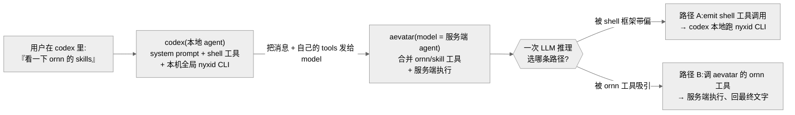
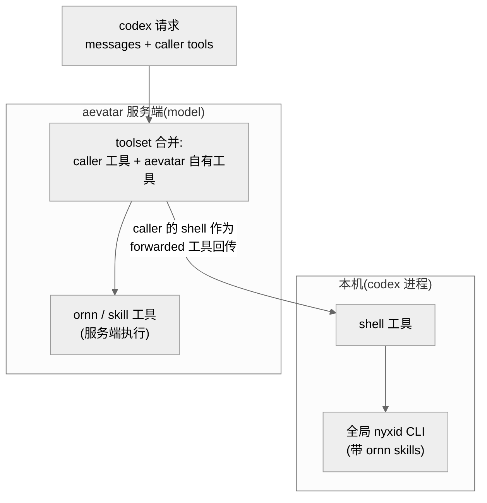
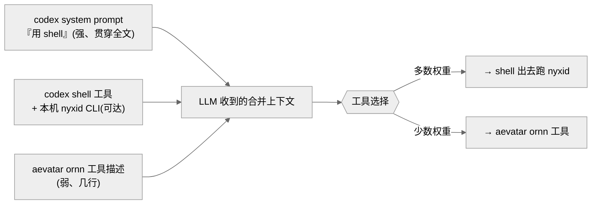
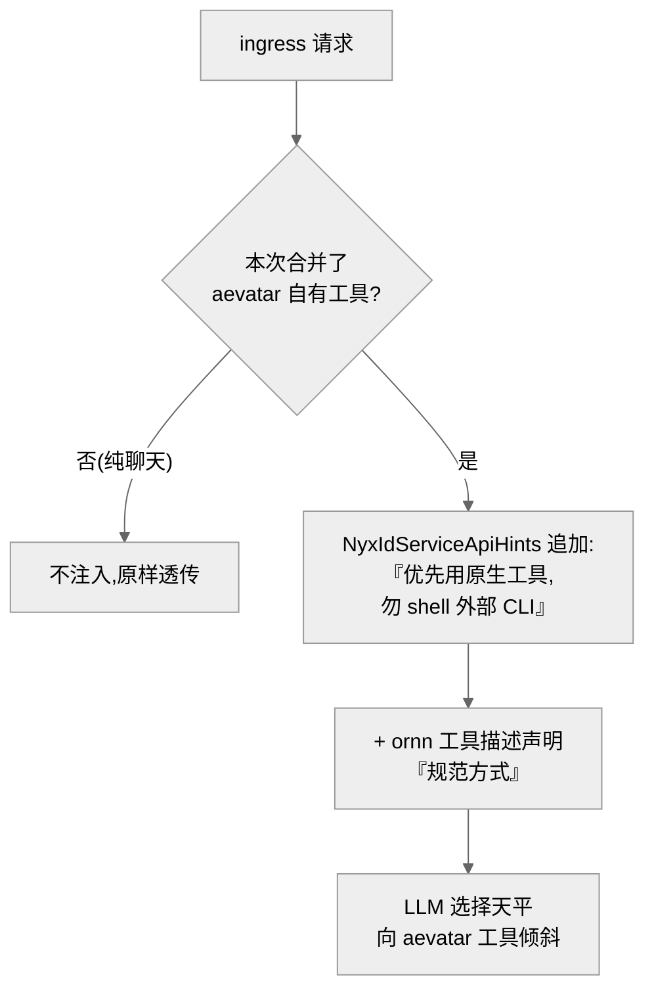

# 把 aevatar 当 model 套给 codex:shell 工具 vs aevatar 自有工具的归属之争

## 事实源/设计抽象(以 ~/Code/aevatar 为准)

> 现象:用户把 aevatar 的 OpenAI 兼容入口(`/v1/chat/completions`)配成 codex 的 model provider,然后在 codex 里说「看一下 ornn 的 skills」。**期望**:aevatar 的 LLM 调用 aevatar **自己的** ornn 工具,在服务端执行、把结果回给 codex。**实际可能**:codex 是个 shell-first 的编码 agent,本机还装了带全局 skills 的 `nyxid` CLI,于是 LLM 反而 emit 一个 `shell` 工具调用,让 **codex 本地**跑 `nyxid …`。两层 agent 在**同一次推理**里争夺「这件事归谁的工具做」。
>
> 这不是某行代码的 bug,而是**把一个 agent 当 model 套进另一个 agent** 的结构性张力:外层 agent 的 system prompt 与本地工具,会和内层 agent 注入的工具互相拉扯。aevatar 侧只能**提高自有工具被选中的概率**,无法在协议层 100% 保证。
>
> 事实源脊柱(非正文骨架,≤3 高价值锚点):
>
> - **aevatar 把自有工具并入 LLM toolset**:`src/Aevatar.Mainnet.Host.Api/Responses/ResponsesUserSkillsToolProvider.cs`(从 `SkillsAgentToolSource` + `OrnnAgentToolSource` discover 出 ornn/skill 工具,塞进每次会话);ornn skill 执行经共享 `use_skill` 工具,见 `src/Aevatar.AI.ToolProviders.Ornn/OrnnAgentToolSource.cs`。
> - **ingress 原样透传 caller 消息、不替换 system prompt**:`src/platform/Aevatar.GAgentService.Application/Responses/ChatCompletionsCommandFacade.cs`(`BuildLlmRequest` 里 `Messages = caller 消息`,只补 `ModelOverride`/`NyxIdRoutePreference` 等 typed 控制,不注入 aevatar 自己的 system prompt)。
> - **现成的 system-prompt 注入点(方案落点)**:`src/Aevatar.AI.ToolProviders.NyxId/NyxIdServiceApiHints.cs`(已有「按用户连接的服务把 API hints 注入 system prompt」的机制,可挂载工具偏好引导)。
>
> 核对基线:`feature/integrate`(核对于 HEAD `60dae854f`);所引三处面均早于本次会话改动,在仓库标定基线 `efaee423d` 同样成立。下文中的工具名 / CLI 名为占位语义,不暴露真实账号标识。

---

## 0. 一句话主线

> **谁来执行「看 ornn skills」,是 LLM 在一次推理里决定的;而这次推理被 codex 的「你是编码 agent、用你的 shell」框架主导。** codex 把请求发给 aevatar 当 model 时,aevatar 不是裸 LLM —— 它把自己的 ornn/skill 工具并进 toolset、并在服务端执行。但 aevatar **原样透传**了 codex 的 system prompt 与 shell 工具,没有用自己的 system prompt 覆盖。于是 LLM 同时看到「codex 的 shell + 本机 nyxid CLI」和「aevatar 的 ornn 工具」两套路径,二选一。谁的上下文塑造得更强,谁赢。

---

## 1. 结构:两层 agent,工具归属天然重叠

codex 与 aevatar **都是 agent**,只是 codex 把 aevatar 当成「model」来调:

- **codex(外层、本地)**:身份是「编码 agent」,只有一个通用 `shell` 工具,system prompt 反复强调「用 shell 完成任务」。它本身**不认识** `nyxid`/`ornn` 这些命令 —— 除非本机把它们做成全局 CLI(用户的情形正是如此),LLM 才容易「猜到」可以 shell 出去。
- **aevatar(内层、服务端)**:OpenAI 兼容入口收到请求后,把 caller 声明的工具(codex 的 shell)与**自己的** provider 工具(ornn/skill,经 `ResponsesUserSkillsToolProvider` discover)**合并**成一份 toolset 交给 LLM;LLM 若选中 aevatar 自有工具,aevatar 在**服务端**执行并续跑,只把最终结果回给 codex;若选中 codex 的 shell,则作为 tool_call **转发回** codex 本地执行。

> **为什么会重叠而不是分工清晰?** 因为「看 ornn skills」这件事**两边都能做**:aevatar 有原生 ornn 工具,codex 有能跑 nyxid CLI 的 shell。OpenAI 的工具协议里没有「服务端工具优先于客户端工具」的概念 —— 工具是**平的一张表**,LLM 自由挑。归属之争由此而来。

---

## 2. 症结:胜负在「一次推理」里定,且 codex 框架占场

把请求摊开看 LLM 实际收到什么上下文,就能看清为什么 aevatar 现在**赢不稳**:

| 上下文要素 | 来自谁 | 倾向 |
|---|---|---|
| system prompt「你是编码 agent,用 shell 探索/完成」 | **codex**(被 aevatar 原样透传) | → 用 shell |
| `shell` 工具(可跑本机任意命令,含全局 nyxid CLI) | **codex** | → 用 shell |
| ornn / skill 工具(描述为「搜/列/执行 ornn skills」) | **aevatar** 注入 | → 用 aevatar 工具 |
| 是否有 aevatar 的「优先用我的工具」引导 | **当前:无** | (中立/缺位) |

关键事实:aevatar 的入口**透传** caller 消息、**不替换** system prompt(`ChatCompletionsCommandFacade.BuildLlmRequest`:`Messages = caller 消息`)。所以 LLM 是在 **codex 的身份框架**下做选择 —— 它「以为自己是 codex」。aevatar 唯一的反向作用力,就是它**并进去的那几个工具的描述**。一边是贯穿整个 system prompt 的「用 shell」,一边是几行工具描述,**力量不对称**。

> **失败模式还不止「shell 出去」一种**:在「你是编码 agent」的框架下,LLM 也可能把「ornn 的 skills」误读成**本地文件**,直接 `ls`/`find` 去翻磁盘 —— 同样绕开了 aevatar 的 ornn 工具。

---

## 3. 规避/修复方向:三个杠杆,稳健度递增

没有「一招 100%」的解;只能在 LLM 那次推理里把天平往 aevatar 这边压。三个杠杆从弱到强:

### 杠杆 ①:用户单次提示(最弱、最即时)

用户在 codex 里显式写:「用你可用的 aevatar/ornn 工具列出我的 ornn skills,不要用 shell 或 nyxid CLI。」

- **正当性**:直接在同一上下文里加一条反向指令。
- **局限**:每次都要打;codex 的 system prompt / `AGENTS.md` 可能盖过这一行;不持久。

### 杠杆 ②:codex 侧常驻指令(强、用户可控、推荐先试)

在 codex 的 `AGENTS.md` / 自定义指令里加一条常驻规则(与 codex 自己的 system prompt **同一权威层**,正是冲突发生地):

> 涉及 ornn / skills / aevatar 能力时,优先使用服务端(model 提供)的工具完成,不要 shell 出去调用 nyxid CLI 做这些工具已覆盖的事。

- **正当性**:把反向作用力放进 codex **最权威的通道**,而不是和 system prompt 不对等地较劲;且持久、免重打。
- **局限**:改的是用户侧配置,aevatar 管不到;对没读 `AGENTS.md` 的调用方无效。

### 杠杆 ③:aevatar 侧提示工程(持久、对所有客户端生效、需代码改动)

这是「给 aevatar 的 agent 做提示工程」的落地,两件事**配合**做:

1. **条件式 system 指令注入**:当 aevatar **确实把自己的工具并进了请求**时,在 system prompt 追加一句简短引导 —— 「你有原生服务端工具(ornn skills 等),对它们覆盖的能力优先用它们,不要指示客户端去跑外部 CLI(如 nyxid)」。落点用现成的 `NyxIdServiceApiHints`(它本就负责按连接服务把 hints 注入 system prompt)。**关键边界**:只在「合并了 aevatar 工具」时注入,纯聊天请求不受影响,避免劫持普通对话。
2. **强化工具描述**:把 ornn / skill 工具的 description 写成「检视/操作 ornn skills 的**规范方式**」,显式声明不要为同一能力 shell 外部 CLI。

> **三个杠杆的关系**:② 与 ③ **组合**最有效 —— ② 在 codex 权威层压制 shell 倾向,③ 从服务端再加一道引导。① 只能临时救急。

---

## 4. 性质判定:架构固有张力,只能提胜率,不能保证

⚠️ **这是「把 agent 当 model 套给另一个 agent」的结构性张力,不是单点 bug。** 哪怕 ①②③ 全上,仍**不能 100% 保证** —— codex 的「shell 编码 agent」身份太强,加上本机 nyxid CLI 全局可达,LLM 偶尔还是会 shell 出去。

| 取向 | 适用 | 代价 |
|---|---|---|
| 接受 codex 客户端 + 三杠杆 | 必须用 codex 时 | 概率性,胜率提升但非保证 |
| **换薄客户端 / aevatar 自己的聊天入口** | 想稳定让 aevatar 用自有工具 | 放弃 codex 的本地编码能力 |

> **最稳健的答案其实是「别用 codex 这种 shell-first 客户端」**:薄客户端那边没有竞争的 shell、也没有本机 nyxid CLI,aevatar 的工具就是**唯一**选择,归属之争从根上消失。codex 的整套编码 agent 框架,与「让 aevatar 当 agent 干活」的诉求,本质上是对冲的。

!!! warning "设计待论证"
    aevatar 侧条件式 system 注入(杠杆 ③)目前是**建议方向**,尚未落地实现;落地时需实测它能否压过 codex 的 shell 框架,并确保只在「合并了自有工具」时注入、不污染纯聊天。胜率提升幅度只能靠线上 A/B 观测,无法静态证明。

---

## 5. 读者应能回答

- 为什么在 codex 里让 aevatar「看 ornn skills」,可能没走 aevatar 的工具而是本地跑了 nyxid?——因为 aevatar 是被当 model 套进 codex 的内层 agent,LLM 在 codex 的 shell-first 框架下一次推理选了 shell 路径。
- aevatar 现在为什么赢不稳?——入口原样透传 codex 的 system prompt + shell 工具,不替换 system prompt;aevatar 唯一反向作用力是几行工具描述,力量不对称。
- 怎么提高 aevatar 自有工具被选中的概率?——② codex `AGENTS.md` 常驻指令 + ③ aevatar 条件式 system 注入(`NyxIdServiceApiHints`)+ 强化工具描述;最稳健是换薄客户端。
- 这是 bug 吗?——不是,是「agent 套 agent」的架构固有张力;只能提胜率,协议层无法保证。
