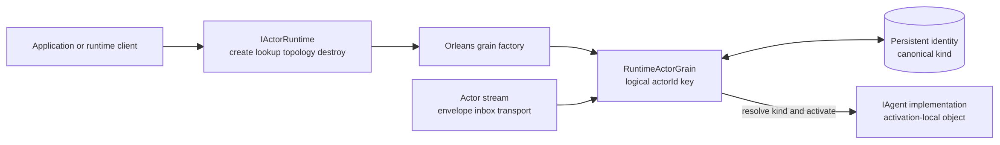
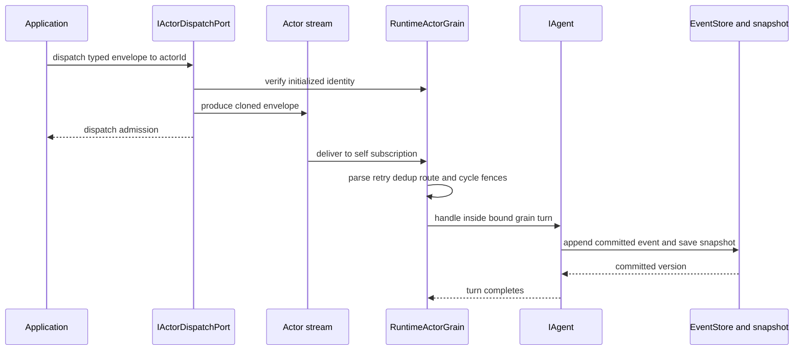

# Orleans Runtime：逻辑 Actor、Grain Turn 与可恢复投递

> 版本与结论：本章描述 `current`。Orleans 实现把稳定 `actorId` 映射为 `RuntimeActorGrain` key，在同一 Orleans cluster 内由 grain activation 串行处理 inbox turn；`IActorRuntime` 负责创建、寻址、拓扑与销毁，`IActorDispatchPort` 仍只负责把 envelope 投入目标 stream。Grain 持久态保存 kind、拓扑和 snapshot，EventStore 保存事件历史。该模型提供可恢复、可重投的 actor 执行边界，不承诺 exactly-once，也不能跨配置错误形成的两个 cluster 维持全局单激活。

## 设计抽象与事实源

- `src/Aevatar.Foundation.Runtime.Implementations.Orleans/Grains/RuntimeActorGrain.cs:24-76`、`:165-291`：grain activation、self-stream、identity恢复、去重/路由与单次handler turn。
- `src/Aevatar.Foundation.Runtime.Implementations.Orleans/Actors/OrleansActorRuntime.cs:37-159`：稳定kind创建、grain寻址、父子拓扑、销毁与stream relay生命周期。
- `src/Aevatar.Foundation.Runtime.Implementations.Orleans/README.md:1-22`、`:40-85`：与Local共享的 runtime/dispatch抽象、持久后端选择与KafkaProvider边界。

## Actor ID、Kind 与 Activation 是三件事

`actorId` 是稳定寻址键；kind 决定应装载哪一种 `IAgent` 实现；activation 是某个silo里承载该逻辑actor的暂时进程对象。创建时 runtime 先从注册表把CLR agent type解析成canonical kind，再用 `actorId` 取得grain并提交identity。重激活时grain从持久identity重新绑定实现，而不是从actor ID前缀猜类型。



为什么不用“actor ID前缀 → CLR类型”的快捷规则？前缀会把寻址格式变成业务schema，重命名或alias会让旧actor无法恢复。持久化canonical kind后，registry是实现选择的唯一入口，actor ID继续只承担身份。

为什么不是每次请求创建一个普通对象并加分布式锁？锁只能保护临界区，还要自行处理对象定位、故障接管、mailbox、reminder与持久状态绑定。Orleans activation把这些运行时问题收进grain边界；业务仍以actor协议表达，不依赖silo地址或线程。

## 一次 inbox turn 怎样发生

`OrleansActorDispatchPort`不会直接调用grain handler。它确认目标已初始化，将envelope clone写入actor stream，再返回dispatch admission。grain订阅自己的stream，解析envelope后依次做retry metadata、去重、visited-chain、direct/topology audience检查，最后在当前grain state binding内调用 `IAgent.HandleEventAsync`。



admission只证明envelope交给传输边界，不证明handler已经提交事件。即使handler成功，也要由对应committed fact和read model判断业务终态；runtime不会把所有业务ACK升级成同步grain RPC。

同一grain activation没有标记为reentrant，普通turn按Orleans actor语义串行进入。代码只在runtime执行跨grain拓扑维护时显式打开call-chain reentrancy，避免父子互调死锁；这不把业务handler变成并发执行。

## 持久身份、Snapshot、EventStore 与拓扑分工

`RuntimeActorGrainState`包含：

- `Identity.Kind`：重激活时选择agent实现；
- `ParentId` / `Children`：authoritative runtime topology关系；
- `AgentStateTypeName` / serialized snapshot / snapshot version：恢复当前agent状态的加速点。

Event-sourced agent的事件历史仍写入 `IEventStore`；snapshot不替代历史，也不应成为查询API。选择Garnet persistence时，grain state与 `IEventStore` 都切换到共享持久后端，以便silo重启后从snapshot/事件恢复。Projection继续消费committed事实构建read model，不能直接暴露grain snapshot。

父子链接也分两层：grain state保存parent/children，stream forwarding registry安装hierarchy与committed-observation relay。`LinkAsync`逐步更新这些边界，并非跨多个grain和stream store的全局事务；各步采用add/upsert/remove形状便于重试，但调用者仍不能把一次方法返回外推成任意业务子资源都已完成。

为什么topology不能只存在stream subscription里？subscription回答“消息如何转发”，不稳定表达“谁是父子”。为什么不能只存在grain state里？没有relay，跨节点stream不会按拓扑送达。两份数据各管一个职责，runtime负责让它们按同一actor关系维护。

## Retry、去重与失败传播

冻结默认retry policy是最多3次、延迟1000ms，并且在没有显式覆盖时只重试 `EventStoreOptimisticConcurrencyException`（含wrapped exception）。显式配置max attempts会启用更宽的异常重试，因此部署者必须把它当风险选择，而不是无条件“更可靠”。

有延迟的retry通过durable callback重新投递，保留origin event ID与attempt；若envelope含runtime credential，callback guard拒绝持久化它，runtime保留原handler失败而不会静默剥掉credential后重跑。零延迟才直接写回actor stream。尝试耗尽后记录错误；只有明确要求 `propagate_failure` 的direct dispatch才把失败抛回调用链。

grain还可以调用 `IEventDeduplicator`，冻结默认注册是 `MemoryCacheDeduplicator`。它只降低单进程重复处理，silo重启或跨节点redelivery后不能证明全局exactly-once。因此领域副作用仍要依赖stable command/effect identity、actor committed state和外部幂等键。

!!! warning "HEAD 漂移（2026-08-02 登记）"
    `IEventDeduplicator` / `MemoryCacheDeduplicator` 已在同步目标之后的 HEAD（`origin/feature/integrate`）移除（`1215ca6b95` Remove process-local envelope duplicate filtering），本段是冻结基线 `f02aa690` 的事实。HEAD 上 RuntimeActorGrain 不再调用进程内去重器；跨 silo 的 exactly-once 依旧不成立，业务幂等仍依赖 stable identity 与 committed state。以 HEAD 为准。

## 最小静态核对

```bash
upstream="${AEVATAR_SRC:?set AEVATAR_SRC to the frozen checkout}"
grain="$upstream/src/Aevatar.Foundation.Runtime.Implementations.Orleans/Grains/RuntimeActorGrain.cs"
dispatch="$upstream/src/Aevatar.Foundation.Runtime.Implementations.Orleans/Actors/OrleansActorDispatchPort.cs"
rg -q '\[PersistentState\("agent"' "$grain"
rg -q 'await _agent.HandleEventAsync\(envelope\)' "$grain"
rg -q '_streams.GetStream\(actorId\).ProduceAsync\(envelope.Clone' "$dispatch"
```

> Demo status：`verified-static`（本轮对冻结grain、runtime、dispatch、state/snapshot store与retry tests做静态交叉核对；未启动Orleans cluster或Garnet）。

## 为什么 runtime-neutral dispatch 仍然重要

Local与Orleans都实现 `IActorRuntime` / `IActorDispatchPort`。上层只提交 `EventEnvelope` 和stable actor identity，才能在本地与分布式实现之间保持同一业务协议。若Application直接拿 `IGrainFactory`、silo地址或Kafka partition，业务会把运行时偶然结构写进身份、ACK与恢复逻辑，Local测试也无法代表生产语义。

同理，`IActor.Agent`在Orleans下是远程proxy，不保证能向下转成具体GAgent。依赖具体实例类型的逻辑只能在Local偶然成立，应改成typed command/query或窄端口，而不是为Orleans加反射逃生门。

## 边界与演进

- “一个actor ID一个activation”只在同一Orleans cluster内成立；`Localhost` membership与共享Garnet误配可产生两个cluster，open `#2224`尚未在冻结基线闭合。
- grain turn串行不等于跨actor事务；两个actor间仍是消息协议和最终收敛。
- runtime retry不能替代业务幂等，也不应默认重试不可分类的外部副作用。
- snapshot属于恢复，不属于canonical query；查询仍读Projection。
- destroy会清callback、topology relay、grain state并请求deactivation，但外部业务资源的补偿仍由其业务owner负责。

## 读完应能回答

1. `actorId`、canonical kind与activation分别负责什么？
2. dispatch admission与handler committed fact为什么不是同一个时刻？
3. grain state、EventStore、snapshot和stream relay各自拥有什么？
4. 默认retry为什么只覆盖OCC类失败，为什么仍不能宣称exactly-once？
5. 哪个配置前提一旦破坏，会让“全局单激活”结论不成立？

<details>
<summary>论断—冻结证据映射</summary>

| 论断 | 冻结证据 |
|---|---|
| runtime由注册kind创建grain，稳定actorId直接作为grain key | `src/Aevatar.Foundation.Runtime.Implementations.Orleans/Actors/OrleansActorRuntime.cs:37-73` |
| grain激活订阅self stream并从持久identity恢复agent | `src/Aevatar.Foundation.Runtime.Implementations.Orleans/Grains/RuntimeActorGrain.cs:55-91` |
| envelope经过dedup、route/visited fences后在state binding内调用handler | `src/Aevatar.Foundation.Runtime.Implementations.Orleans/Grains/RuntimeActorGrain.cs:203-291` |
| dispatch port写stream并只返回admission，不inline调用handler | `src/Aevatar.Foundation.Runtime.Implementations.Orleans/Actors/OrleansActorDispatchPort.cs:20-32` |
| grain state保存identity、topology与typed snapshot/version | `src/Aevatar.Foundation.Runtime.Implementations.Orleans/Grains/RuntimeActorGrainState.cs:5-36` |
| Orleans snapshot store把event-sourced snapshot绑定到当前grain persistent state | `src/Aevatar.Foundation.Runtime.Implementations.Orleans/Grains/RuntimeActorGrainEventSourcingSnapshotStore.cs:8-60` |
| 默认retry仅分类OCC，延迟retry走durable callback且拒绝runtime credential | `src/Aevatar.Foundation.Runtime.Implementations.Orleans/Grains/RuntimeEnvelopeRetryPolicy.cs:28-94`、`src/Aevatar.Foundation.Runtime.Implementations.Orleans/Grains/RuntimeActorGrain.cs:511-560` |
| Orleans与Local共享runtime/dispatch抽象，Garnet persistence同步切换EventStore | `src/Aevatar.Foundation.Runtime.Implementations.Orleans/README.md:1-22`、`:40-57` |

</details>
