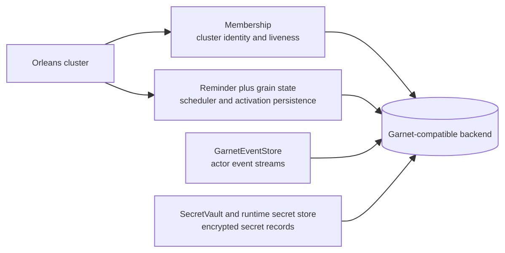
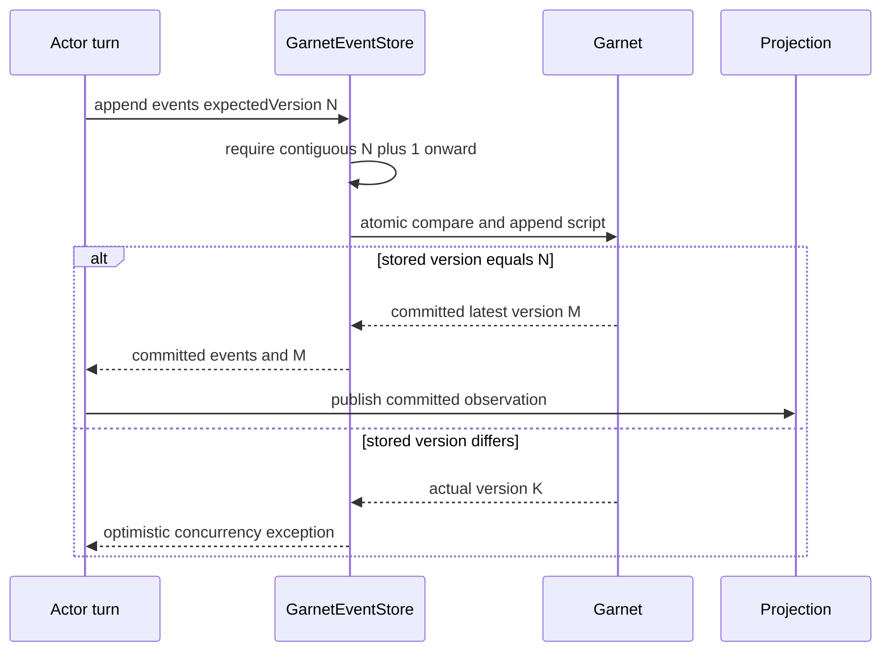
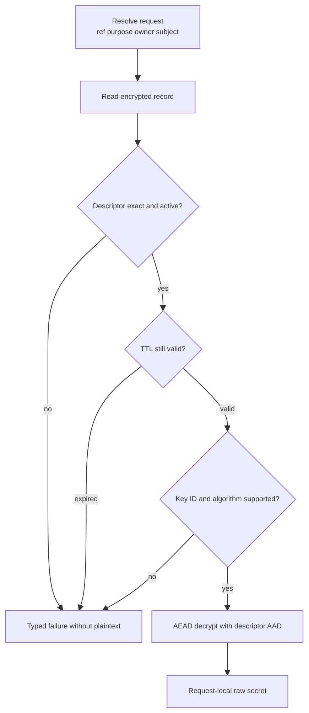

# Garnet 聚类与秘密存储：共享后端，不共享语义

> 版本与结论：本章描述 `current`。Distributed profile 让 Orleans membership、reminder/grain state、EventStore 与 secret stores 使用 Garnet-compatible Redis surface；共享后端让重叠silo看见同一cluster和持久事实，却不把这些数据合成一种模型。EventStore用expected version原子追加连续 `StateEvent`；SecretVault用独立prefix、purpose/owner/subject授权、AES-256-GCM、HMAC fingerprint、TTL与CAS管理secret。Vault删除只证明Aevatar的secret material已不可解析，外部Agent Key等资源是否撤销仍由业务补偿协议单独证明。

## 设计抽象与事实源

- `src/Aevatar.Foundation.Runtime.Persistence.Implementations.Garnet/GarnetEventStore.cs:11-147`、`:150-266`：按actor stream分key、expected-version原子追加、顺序读取与显式损坏失败。
- `src/Aevatar.Foundation.Runtime.Persistence.Implementations.Garnet/GarnetBackedSecretVault.cs:31-164`、`:191-285`：create-only ref、owner/purpose解析、加密、rotate/revoke CAS与TTL。
- `docs/adr/0032-mainnet-garnet-clustering.md:8-62`：共享membership为何必须与稳定 `ClusterId` / `ServiceId`、reminder和grain state组成同一生产边界。

## 一个部署，四种职责



| 职责 | 权威键/版本 | 失败意味着什么 | 不证明什么 |
|---|---|---|---|
| membership | `ClusterId + ServiceId` 下的silo成员 | silo不能形成期望cluster或接管ring | actor业务事件已提交 |
| reminder / grain state | Orleans provider自己的etag与keyspace | callback或activation state无法持久/接管 | workflow或schedule已完成 |
| EventStore | actor ID编码后的version/index/data keys | expected version冲突或event stream损坏 | read model已追上 |
| SecretVault | vault prefix + opaque ref + record version | secret无法存取、授权、解密、旋转或删除 | 外部credential已撤销 |

为什么共用后端而不共用repository？共享连接降低生产依赖数量，也让silo重叠期间membership、reminder与grain state看到同一基础设施。但每层的原子性、生命周期和授权完全不同；做成一个通用`Get/Set`业务接口会丢失expected version、TTL、owner和encryption等不变量。

## Membership：单激活保证的基础设施前提

生产rolling deploy会短暂同时运行新旧silo。若两者都用 `Localhost` clustering，它们各自以为自己是完整单节点cluster，却共同读写同一reminder和grain-state表，于是可能同时拥有整条ring并争写etag。ADR-0032选择Redis clustering over Garnet，让重叠silo以稳定 `ClusterId` / `ServiceId`加入同一cluster并分摊ring。

这里的关键不是“Garnet比内存快”，而是membership必须是所有节点共享的权威记录。给每次部署换 `ServiceId` 会孤立durable reminder；只换 `ClusterId`却复用 `ServiceId`会让两个cluster继续争同一reminder表；`Development` primary的membership在被替换时又会丢失。

冻结 `Distributed` 默认已经选择 `ClusteringMode=Garnet`，但代码仍允许显式覆盖成不安全组合；open `#2224`跟踪缺失的交叉配置gate。因此应把profile当受审查的整体，不能说“用了Garnet persistence就自动不会split-brain”。

## EventStore：版本是并发契约

`GarnetEventStore.AppendAsync`先验证待提交事件从 `expectedVersion + 1`连续递增，再用一个Lua脚本比较当前version、写入sorted index与payload hash、最后推进version key。比较失败抛 `EventStoreOptimisticConcurrencyException(expected, actual)`，不会last-write-wins。



读取同时取有序version集合和对应payload；数量不一致、缺payload、空payload或非法version都显式失败，而不是跳过坏记录。compaction只删除指定水位之前的event index/data；stream reset是维护能力，不是普通业务路径。

为什么不用单个JSON snapshot覆盖？EventStore需要保留因果顺序和expected-version fence，才能检测两个错误activation或并发turn争写。snapshot可以加速恢复，但不能替代event history的提交证据。反过来，EventStore提交也不代表Elasticsearch/Neo4j已经更新；Projection有独立的物化水位。

EventStore把serialized protobuf直接写入其keyspace；冻结实现没有给这些event payload增加本章Vault的AEAD envelope。基础设施层TLS、磁盘加密、访问控制若存在，应由部署证据单独证明，不能从“同样存于Garnet”推断。

## SecretVault：descriptor授权后才解密

Vault record包含opaque ref、purpose、owner scope、subject、version、fingerprint、expiry与AEAD ciphertext。`PutAsync`允许caller预分配ref，但只用`SET NX`创建；同ref仅在descriptor、expiry、fingerprint和解密后的secret全部一致时幂等返回，否则拒绝覆盖。

resolve按顺序检查record可解析、active、`purpose + ownerScopeKey + subjectId`完全一致、未过期，之后才用keyring解密。AES-256-GCM的associated data绑定record descriptor；篡改owner或purpose会导致认证失败。fingerprint由独立32-byte HMAC key产生，不复用data encryption key，也不公开raw secret。



rotate读取原始bytes，递增record version、重算fingerprint与ciphertext，再compare-set；它保留剩余TTL，且绝不延长backend上更短的TTL。revoke则compare-delete exact bytes；记录已经不存在时视为postcondition满足，竞争修改导致compare-delete失败时不删除新值。

为什么revoke是delete，而不是把status改成`Revoked`永久留存？secret store的目标是让material不可再解析，业务审计和补偿状态由actor/audit拥有；在Vault另造长期业务timeline会形成第二事实源。为什么Vault删除不等于外部Agent Key撤销？Vault只能控制本地raw key；NyxID等外部issuer有自己的资源与revocation API，必须由 [09/04](../09/04-vault-reference-and-revocation-compensation.md) 的双轨协议分别完成。

## Keyring 与轮换：runtime和maintenance分责

canonical keyring要求：

- `activeKeyId`指向一个32-byte AES key；
- 至少保留所有仍被record引用的旧data keys；
- 独立32-byte `fingerprintKey`必填；
- Unix文件权限必须为owner-only；缺项、长度错误、active key不存在或权限无法收紧均fail fast。

正常runtime只用keyring加解密，不暴露maintenance port。运维工具负责generate、add-key与CAS re-encryption sweep；sweep保留每条record的TTL，支持checkpoint/resume/verify。旧key只能在verify确认无record引用后，通过受控keyring更新移除。

为什么不让runtime看到新key就自动后台扫全库？在线请求路径没有全局maintenance ownership，多个replica会重复扫描、覆盖并发rotate，失败也难以审计。独立工具以CAS、checkpoint和verify显式暴露进度与冲突，更符合可恢复运维边界。

## 最小静态核对

```bash
upstream="${AEVATAR_SRC:?set AEVATAR_SRC to the frozen checkout}"
event_store="$upstream/src/Aevatar.Foundation.Runtime.Persistence.Implementations.Garnet/GarnetEventStore.cs"
vault="$upstream/src/Aevatar.Foundation.Runtime.Persistence.Implementations.Garnet/GarnetBackedSecretVault.cs"
keyring="$upstream/src/Aevatar.Foundation.Runtime.Persistence.Implementations.Garnet/SecretStoreKeyringDocument.cs"
rg -q 'EventStoreOptimisticConcurrencyException' "$event_store"
rg -q 'CompareSetAsync' "$vault"
rg -q 'CompareDeleteAsync' "$vault"
rg -q 'requires fingerprintKey' "$keyring"
```

> Demo status：`verified-static`（本轮核对冻结EventStore/Vault/keyring源码、integration tests、secret-vault canon与ADR；未连接Garnet、未解密或写入任何secret）。

## 边界与演进

- Garnet连接可达不代表cluster identity正确、event stream完整或keyring可用；四层要分别监控。
- EventStore OCC是冲突信号，runtime可对安全分类的冲突重试，但业务副作用仍需幂等。
- SecretReference是定位与授权descriptor，不是secret，也不是外部资源撤销凭证。
- Vault AEAD保护secret record，不自动保护EventStore、Orleans membership或read-model payload。
- open `#2224`在冻结基线仍是配置gate缺口；ADR-0032说明正确production profile，不等于所有覆盖组合都被代码拒绝。

## 读完应能回答

1. 为什么membership、grain state、EventStore与SecretVault即使共用Garnet也不能共用语义接口？
2. EventStore的expected version与连续event version分别挡住什么错误？
3. Vault为什么在验证purpose/owner/subject和TTL之后才解密？
4. rotate/revoke的CAS如何避免覆盖竞争写，为什么rotate不能延长TTL？
5. Vault ref删除为什么不能证明外部Agent Key已经撤销？

<details>
<summary>论断—冻结证据映射</summary>

| 论断 | 冻结证据 |
|---|---|
| event append在一个脚本里比较version并写index/data/version，冲突显式抛OCC | `src/Aevatar.Foundation.Runtime.Persistence.Implementations.Garnet/GarnetEventStore.cs:16-147` |
| event读取对version/payload数量、缺失和空值fail closed | `src/Aevatar.Foundation.Runtime.Persistence.Implementations.Garnet/GarnetEventStore.cs:150-197` |
| Vault create-only ref只对exact same descriptor/secret幂等 | `src/Aevatar.Foundation.Runtime.Persistence.Implementations.Garnet/GarnetBackedSecretVault.cs:31-65` |
| resolve验证active、owner/purpose/subject、expiry后才AEAD解密 | `src/Aevatar.Foundation.Runtime.Persistence.Implementations.Garnet/GarnetBackedSecretVault.cs:68-99`、`:238-280` |
| rotate用compare-set保留剩余TTL，revoke用compare-delete满足幂等postcondition | `src/Aevatar.Foundation.Runtime.Persistence.Implementations.Garnet/GarnetBackedSecretVault.cs:101-164` |
| AES-256-GCM使用随机nonce与associated data，fingerprint使用独立HMAC key | `src/Aevatar.Foundation.Runtime.Persistence.Implementations.Garnet/GarnetSecretRecordCrypto.cs:7-72` |
| keyring强制active data key、独立fingerprint key和owner-only权限 | `src/Aevatar.Foundation.Runtime.Persistence.Implementations.Garnet/SecretStoreKeyringDocument.cs:96-170` |
| production共享membership解决rolling overlap，Localhost/Development不适合多副本 | `docs/adr/0032-mainnet-garnet-clustering.md:8-62` |

</details>
