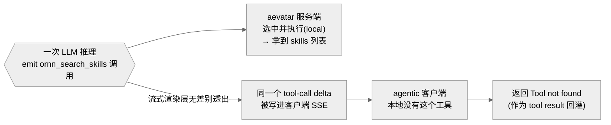
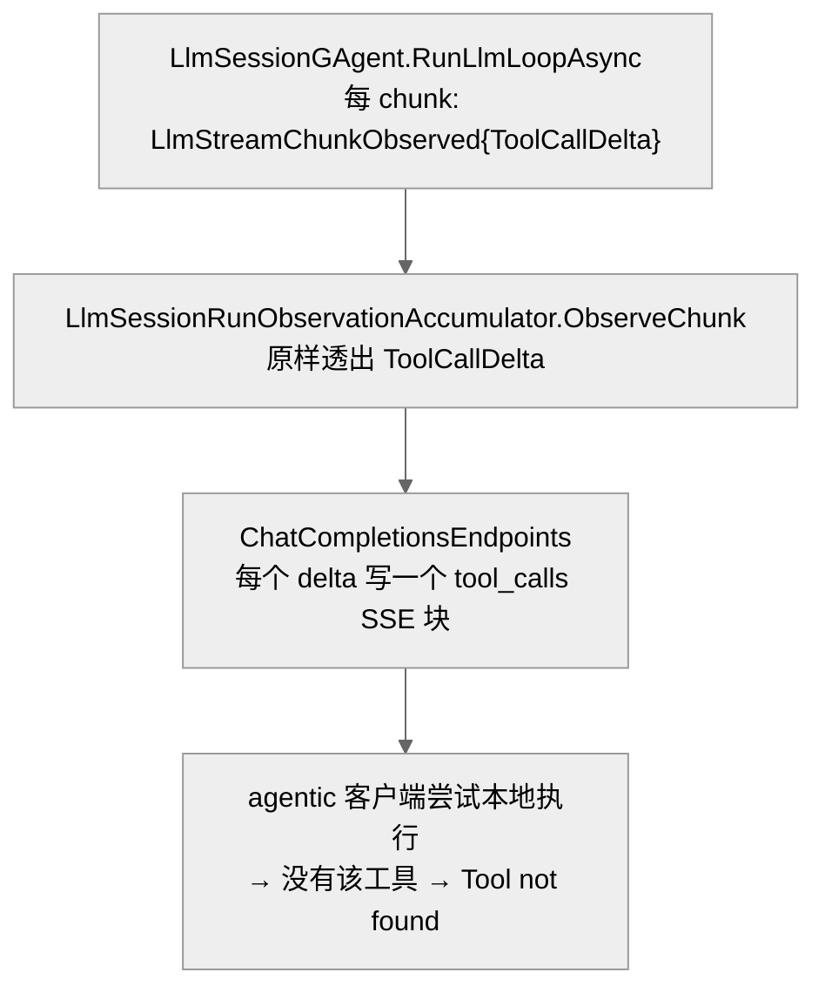

# 把 aevatar 当 model 套给 agentic 客户端:自有工具调用被泄漏进客户端流 →「Tool not found」

## 事实源/设计抽象(以 ~/Code/aevatar 为准)

> 现象:用户把 aevatar 的 OpenAI 兼容入口(`/v1/chat/completions`)配成 agentic 客户端(codex / zcode)的 model。aevatar 的 LLM 在**服务端**选中并执行了自己的工具(如 `ornn_search_skills`),但客户端的工具卡却显示该工具**返回** `Tool not found: ornn_search_skills`。这串是**客户端**给出的 tool result —— 即 aevatar 把一个只有它自己能执行的工具调用,**也**甩给了没有这个工具的客户端,客户端二次执行失败。
>
> **与 [10/02](02-codex-shell-vs-aevatar-tools.md) 的区别(关键)**:10/02 是**选择之争**——LLM 该选 codex 的 shell 还是 aevatar 的 ornn 工具,结论是「架构张力、只能提胜率、非 bug」。**本篇是它下面一层**:即便 aevatar **赢了选择、已在服务端执行了自己的工具**,它仍把这次工具调用**泄漏**进客户端流,触发客户端二次执行失败。这是一个**已确认、可复现、可修**的协议层 bug,不是概率张力。
>
> 事实源脊柱(≤3 高价值锚点):
>
> - **逐 chunk 透出 tool-call delta(不带所有权)**:`src/platform/Aevatar.GAgentService.Core/GAgents/LlmSessionGAgent.cs`(`RunLlmLoopAsync` 对每个流式 chunk 持久化 `LlmStreamChunkObserved { ToolCallDelta }`,无论该工具该谁执行)。
> - **边界原样透出**:`src/platform/Aevatar.GAgentService.Application/Responses/LlmSessionRunObservationAccumulator.cs`(`ObserveChunk` 把 `ToolCallDelta` 原样塞进面向客户端的 `LlmSessionRunObservedDelta`)。
> - **客户端 SSE 写出**:`src/Aevatar.Mainnet.Host.Api/ChatCompletions/ChatCompletionsEndpoints.cs`(对**每个** `delta.ToolCallDelta` 写一个 `tool_calls` 流块给客户端)。
>
> 核对基线:`feature/integrate`(本次会话核对于 HEAD `82e957bc8` 附近);GitHub issue `aevatarAI/aevatar#2269`,里程碑 27《Ingress Tool Ownership (agent-as-model)》。下文工具名为占位语义,不暴露真实账号标识。修复方案见 [09/02 方案](../09/02-ingress-tool-ownership/index.md)。

---

## 0. 一句话主线

> aevatar 自有工具本该在服务端执行、对客户端**隐形**(「伪装成模型返回」)。但 `/v1/chat/completions` 把 LLM emit 的**每一个** tool-call delta **无差别**写进客户端 SSE —— 包括它自己正在服务端执行的 additive 工具。agentic 客户端收到一个它根本没有的 `tool_calls`,本地执行失败,把 `Tool not found` 当 tool result 回灌,aevatar 的 LLM 再把这个失败报告给用户。**泄漏发生在流式渲染层,与「该谁执行」的 forwarded/local 分桶判定无关 —— 分桶只管 aevatar 自己执不执行,管不到这条流式线。**

---

## 1. 复现

1. 把 aevatar `/v1/chat/completions` 配成 codex / zcode 的 model provider。
2. 问一个需要 aevatar 自有工具的问题(触发 `ornn_search_skills`)。
3. 客户端工具卡显示 `ornn_search_skills` **返回** `Tool not found: ornn_search_skills`(注意:这是 tool **result**,来自客户端,不是 aevatar 的输出)。

**间歇性**:同一会话里先成功列出了 N 个 skills(那一轮服务端执行 OK),随后同名工具又报 `Tool not found`。这种「同工具、不同轮、不同结果」最初让人以为是分桶随机翻转;坐实后真因是**流式渲染层**对自有工具 delta 的无差别透出(见 §2)。

---

## 2. 根因(代码坐实)

`ornn_search_skills` 是 aevatar 的 **additive 工具**:它只来自 `src/Aevatar.Mainnet.Host.Api/Responses/ResponsesUserSkillsToolProvider.cs` 的 `GetAdditiveToolsAsync`(经 `SkillsAgentToolSource` + `OrnnAgentToolSource` 实时发现),**永远不是 substitute**。按设计它该 100% 服务端执行。但泄漏链路绕过了这一点:

| 步骤 | 位置 | 行为 |
|---|---|---|
| actor 逐 chunk 发事件 | `LlmSessionGAgent.cs:633` | 每个 chunk 持久化 `LlmStreamChunkObserved { ToolCallDelta }`,不带所有权标记 |
| accumulator 透出边界 | `LlmSessionRunObservationAccumulator.cs:27` | `ObserveChunk` 把原始 `ToolCallDelta` 塞进面向客户端的 delta |
| CC 端点写 SSE | `ChatCompletionsEndpoints.cs:118` | 对每个 `delta.ToolCallDelta` 写一个 `tool_calls` 流块给客户端 |

**次级泄漏口**:`ObserveToolCall`(`LlmSessionRunObservationAccumulator.cs:36`)不看 `Forwarded` 标记,连服务端工具**执行后**的 `LlmToolCallObserved { Forwarded=false }` 观察事件也会被透成 boundary delta。所以即使没有 live chunk delta,本地工具执行后的事件仍可能漏给客户端。

> **为什么分桶判定查不出问题**:write-side 的 forwarded/local 分桶(`SelectForwardedToolCalls` / `SelectLocalToolCalls`)只决定 aevatar 自己执不执行、以及是否发 forwarded 完成事件。它**不门控**上面这条流式渲染线。所以「为何这个工具落进 forwarded」在日志里根本找不到 —— 客户端可见症状压根不在分桶那条路径上。

---

## 3. 影响面

| ingress | 流式回调类型 | live tool-call delta 泄漏? | 完成阶段工具渲染 |
|---|---|---|---|
| `/v1/chat/completions` | `Func<LlmSessionRunObservedDelta,…>` | **有(本 bug)** `ChatCompletionsEndpoints.cs:118` | 非流式渲染 `completion.ToolCalls`;流式 stop chunk 只有 `finish_reason` |
| `/v1/responses` | `Func<string,…>`(纯文本) | 无 | 完成阶段把 `completion.ToolCalls` 渲染成 `function_call`(`ResponsesEndpoints.cs:247`) |
| `/v1/messages` | `Func<string,…>`(纯文本) | 无 | 完成阶段渲染成 `tool_use` 块(`MessagesEndpoints.cs:168`) |

- **live-delta 泄漏只发生在 `/v1/chat/completions`**(它的 facade 回调透出富 delta;另两条只回文本)。这是用户最先撞上的那条。
- **但完成阶段的工具渲染是跨三条 ingress 的**:`/v1/responses`、`/v1/messages` 在完成时把 `completion.ToolCalls` 渲染成 `function_call` / `tool_use`。只要分类把一个自有工具**误判成 forwarded**(例如客户端声明了与自有 additive 同名的工具),三条 ingress 都会在完成阶段泄漏。
- **兄弟失败模式**:工具发现(实时 NyxID 调用,吞异常)抖动时,自有工具可能从本轮工具集消失;模型仍按历史调用它 → 落进 forwarded/local **两个桶都不命中** → 静默空完成(空回复)。

---

## 4. 规避 / 修复方向

完整方案见 **[09/02 · Ingress 工具所有权](../09/02-ingress-tool-ownership/index.md)**。一句话:

> **非对称所有权**——aevatar 自有工具服务端执行、**永不上线**(对客户端隐形);只有**客户端声明的**工具才转发给客户端执行。两个落点:① 流式渲染层只让 forwarded 调用过线;② 把所有权做成 typed 分类事实(`owned_tool_names`),撞名时所有权优先。

该方案已经 codex 设计评审,审出 6 个实现缺口并已并入(详见 09/02)。决策:Part 1 + Part 2 一起 ship。

---

## 5. 性质判定

✅ **真 bug,可修**——区别于本区另两篇:

| 篇 | 性质 |
|---|---|
| [10/01](01-cli-lark-scope-isolation.md) | 按设计的 scope 隔离(缺可发现性) |
| [10/02](02-codex-shell-vs-aevatar-tools.md) | 架构固有张力(工具选择),非 bug,只能提胜率 |
| **10/03(本篇)** | **协议层 bug**:选对了仍泄漏,可在 aevatar 侧 100% 修复 |

---

## 6. 读者应能回答

- 客户端为什么报 `Tool not found`?——aevatar 把它**自己**在服务端执行的工具调用 delta 也无差别写进了客户端 SSE,客户端没有这个工具,本地执行失败。
- 这和 10/02 的区别?——10/02 是「该选谁的工具」(张力,非 bug);本篇是「选对了 aevatar 自己的工具、也执行了,却还把调用泄漏给客户端」(协议 bug,可修)。
- 三条 ingress 都受影响吗?——live-delta 泄漏只在 `/v1/chat/completions`;但完成阶段的工具渲染泄漏在分类误判时跨三条 ingress。
- 为什么日志里查不到「为何 forwarded」?——因为泄漏在流式渲染层,不在 forwarded/local 分桶那条路径上。
- 是 bug 还是张力?——真 bug,见 [09/02 方案](../09/02-ingress-tool-ownership/index.md)。
