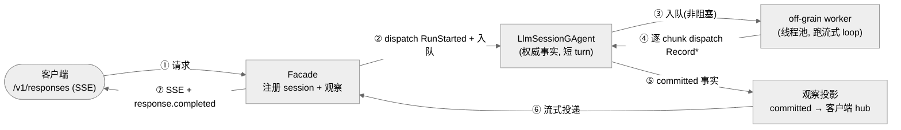
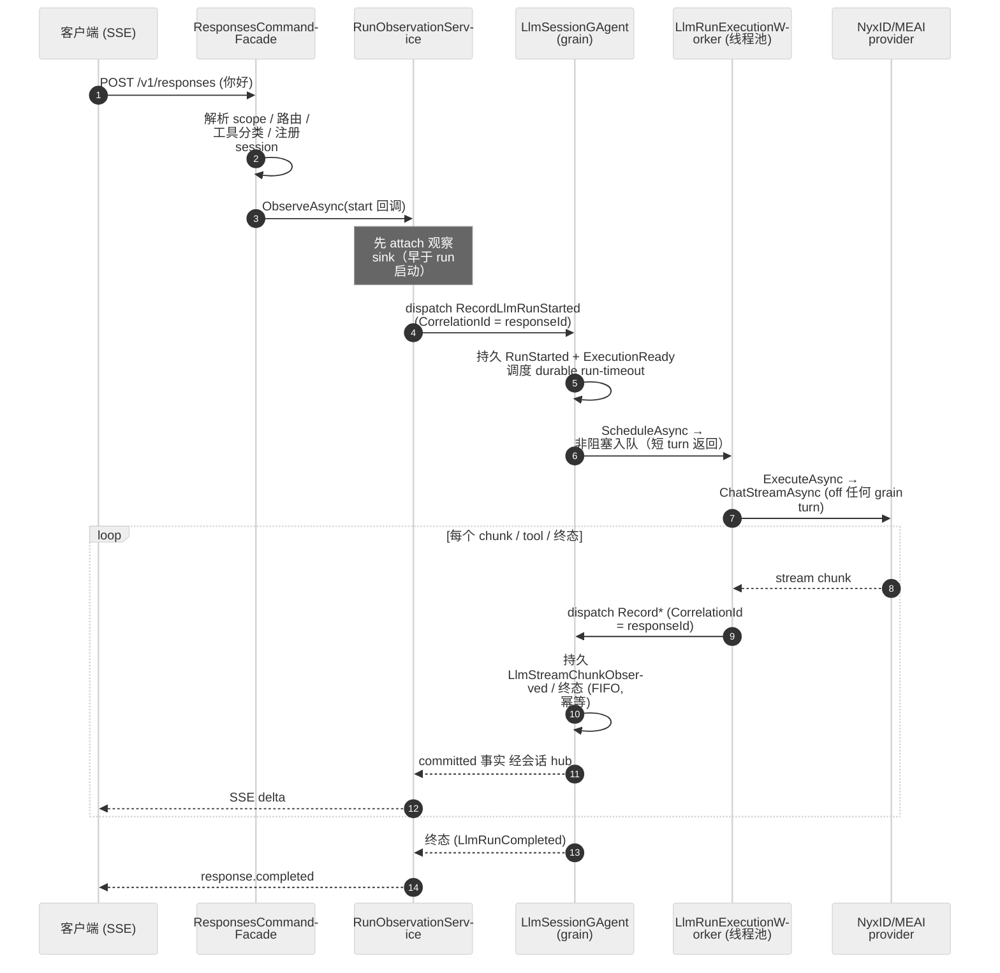
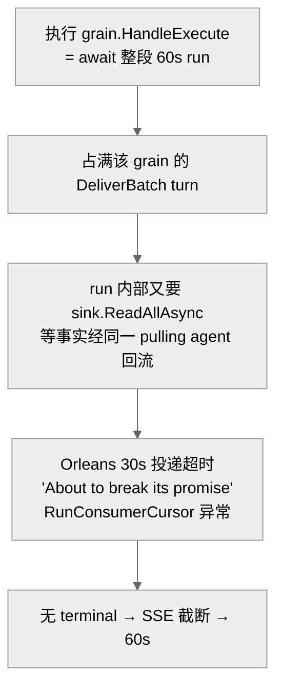
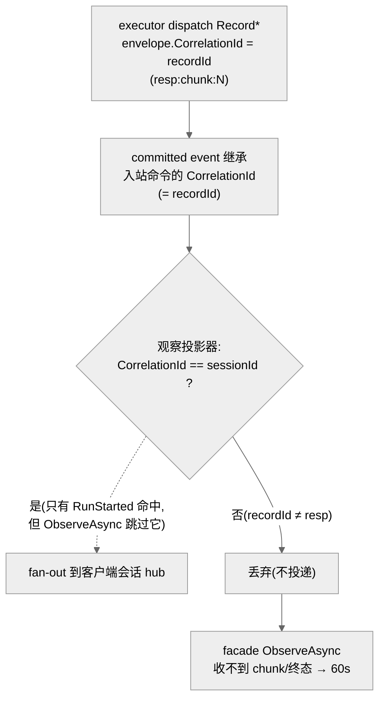
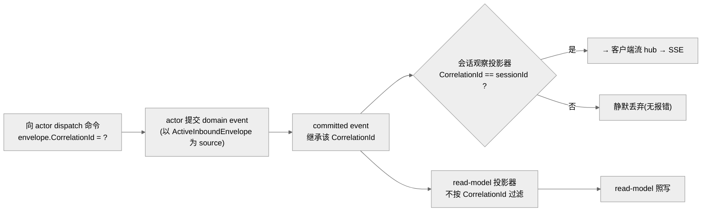

# `/v1/responses` 的 off-actor LLM run:执行与流式观察机制(四层故障复盘 → 端到端修好)

## 事实源/设计抽象(以 ~/Code/aevatar 为准)

> 现象:把 aevatar 当 OpenAI 兼容 model 的客户端(chrono-app / aevatar-cli / codex)调 `/v1/responses`,连一句 `你好` 都**挂 ~60 秒**、SSE 被网关截断、无 `response.completed`,客户端报 `cannot parse response` / `The streaming response was interrupted before it completed`。这条入口长期坏,且**坏在四个不同层**——每修好一层,下一层才暴露出来。
>
> **这是什么机制**:NyxID **直连 LLM 入口**(`/v1/responses`、`/v1/messages`、`/v1/chat/completions` 三条同源)把一次模型调用收敛到 `LlmSessionGAgent` 的 typed run 记录链路,**把长达数十秒的流式上游调用拿到 actor turn 之外执行**,再通过**观察投影**把 committed 事实流式投递回客户端 SSE。它与 [02 编排层](../02/02-definition-and-run-actors.md) 的 workflow chat(`RoleGAgent` / `ChatRuntime`)是**两套独立子系统**:这里没有 YAML、没有角色树,只有"一个 session = 一次 LLM run"。
>
> 事实源脊柱(职责,不贴行号):
>
> - **会话事实拥有者** `LlmSessionGAgent`(`Aevatar.GAgentService.Core`)—— run 的唯一权威状态机:`responseId + runId + sequence` 幂等接受 `Record*` 事实、持久 `LlmRunStartedEvent` / `LlmStreamChunkObserved` / 终态、并自调度 **durable run-timeout finalizer**。
> - **off-grain 执行** `LlmRunExecutor` + `LlmRunCore` + `LlmRunExecutionWorker`(`Application` / `Hosting`)—— 在**任何 grain turn 之外**(普通线程池后台服务)连续消费 provider 的 `ChatStreamAsync`,把每个 chunk/tool/终态作为**短 dispatch** 发回 session actor。
> - **流式观察** `LlmSessionRunObservationService` + `LlmSessionObservationSessionEventProjector`(`Application` / `Projection`)—— 把 session actor 的 committed 事实经**会话 hub** 投递给客户端 SSE。
> - canon 口径:`docs/canon/llm-streaming.md` §2.1、`docs/canon/nyxid-responses-direct.md` §4.1。
>
> 核对基线:`feature/integrate`;本文机制以 **四层全部修复、线上实测通过**(pod image `82bd5d37`,`ping`→`pong` 5s、`你好`→`你好！有什么我可以帮你的吗？` 4s)为准。四个修复 commit:`f0408b9e`(① tools 校验)、`5ed080fa`(② grain 死锁)、`b729e27c`(③ executor sink round-trip)、`82bd5d37`(④ CorrelationId 观察路由)。**性质:真 bug,四层逐层修好,已线上验证 ✅✅。**

---

## 0. 一句话主线

> 长流式 LLM 调用**不能占用 session actor 的 command turn**(actor 单线程,占住就堵死投递),所以执行被搬到 **off-grain 后台 worker**;但执行侧只是**生产事实**,session actor 仍是唯一权威,客户端实时流由**独立的观察投影**从 committed 事实喂出。这套"执行/事实/观察"三分的设计是对的,但 `#2271` 的 off-actor 实现把三个接缝**全做错了一次**:执行跑进了 grain turn(②)、执行侧多此一举地等自己的事实回读(③)、dispatch 用错了关联键导致事实进不了客户端 hub(④)。逐层修正后端点才端到端通。

---

## 1. 机制全貌(正确的 off-actor run + 流式观察)

整条链路把三件事**显式分到三个执行体**,互不占用对方的串行 turn:

| 职责 | 承担者 | 运行体 | 为什么是它 |
|---|---|---|---|
| **权威事实**(run 状态机、幂等、终态、超时) | `LlmSessionGAgent` | Orleans grain(单线程 turn) | 事实必须串行、可重放、唯一拥有者 |
| **I/O 执行**(消费 `ChatStreamAsync`、跑工具轮) | `LlmRunExecutor` / `LlmRunCore` | host 后台 `BackgroundService`(线程池) | 数十秒的流式 I/O **不能**占 actor turn |
| **客户端投递**(实时 SSE) | `LlmSessionRunObservationService` | HTTP 请求线程 | 只读已 committed 事实,最终一致流式投出 |

**几个设计要点(为什么是它,不是别的):**

- **执行体是 `BackgroundService` 而不是 grain**:worker 在线程池跑,`sink` 等待只占**线程池线程**、不占 Orleans turn;session actor 与投影 pulling agent 始终空闲,能交错处理短 `Record*` turn 与 `DeliverBatch`。换成 grain 就退化成 ② 的死锁(见 §2.2)。
- **执行体是 dispatch-only 生产者**:worker 把每个事实**发出去就继续**(只等"已入 actor 邮箱"的 admission),**不**回读自己刚发的事实。这与上线可用的 workflow 生产者 `WorkflowRunGAgent` 完全同构——生产者只提交事实,客户端投递交给独立的单条长观察。执行侧若反过来等自己的事实经投影回流,就退化成 ③(见 §2.3)。
- **观察 sink 早于 run 启动就 attach**:`ObserveAsync` 先挂观察、**再**触发 run,因此不存在"事实先于订阅产生"的竞态;它是一条**长生命周期**订阅,接住整段 run 的全部事实。
- **崩溃兜底是 actor 自持久 timeout**:worker 崩了/host 重启,run 无终态——session actor 调度的 **run-timeout finalizer** 会在分钟级把它落成终态(该超时已与 24h session TTL 解耦),客户端不会无限等。

---

## 2. 四层故障复盘(每修一层,下一层才暴露)

> 这是本文的核心:同一个"60s 超时"症状,**四个独立根因**叠在一起。它示范了"长期坏的端点 = 多层故障逐层剥",以及为什么**热路径修复必须线上实测**——前三层每修一层都让症状"看起来还坏",但 diff 证明上一层确实修好了、只是露出了下一层。

### 2.1 第一层:`invalid_tools` 400(ingress 工具校验过严)

- **现象**:客户端连 `你好` 都收 `400 tool at index 0 must be an object`。
- **根因**:aevatar 自有的 Responses ingress 解析 `tools[]` 时对**非 object 条目硬失败**。把 aevatar 当 model 的客户端(如 chrono-llm)会发出带非 object tool 条目的请求 → 直接 400,根本进不了 run。
- **怎么修(`f0408b9e`)**:非 object 条目改为 `continue` 略过(与"内建工具跳过"同哲学);缺 `name` 的 malformed function 工具仍带索引 400。这一层修好后,400 消失、揭开下一层。

### 2.2 第二层:grain-turn 自死锁(off-actor 跑偏成 per-run 执行 grain)

`#2271` 的设计白纸黑字要求执行体是 **DI service、不是 grain**,并显式否决"per-run 执行 grain"。但实现**跑偏**了:它引入了一个被否决的执行 grain,其 event handler 在**单个 Orleans `DeliverBatch` turn 里 `await` 整段 ~60s 流式 run**。

- **根因**:Orleans 的 `DeliverBatch` 必须快速返回。一个跑满 60s 的 handler 触发框架 30s 投递超时,并与 run 自己要回流的事实**自死锁**(占满的 grain 既不返回、又在等投给自己的事实)。
- **关键纠正**:`LlmSessionGAgent` **从不在 turn 内跑 loop**(只注入 scheduler),flag-on/off 两条 facade 路径**都汇到这个执行 grain**,所以那个 `OffActorLlmRunExecutorEnabled` flag 是 vestigial 重复、**不是事故开关**——改 flag 默认值救不了。
- **怎么修(`5ed080fa`)**:删执行 grain + 其 provisioner;scheduler 改为往**有界进程内队列**非阻塞入队(满则 actor 落 `execution_dispatch_failed` 终态,绝不阻塞 actor turn);host 注册 `LlmRunExecutionWorker : BackgroundService` drain 队列、在线程池跑 `LlmRunCore`。**worker 不是 grain → 等待只占线程池线程 → 死锁消失。** 同时把 run-timeout finalizer 从回退 24h session TTL 改为 Core 的分钟级 `DefaultRunExecutionTimeout`(否则 worker 崩了终态 24h 才来)。

### 2.3 第三层:executor sink 的 per-record 观察回环(run 卡在第 1 个 chunk)

死锁拆掉后,线上实测**死锁签名彻底消失**,但 run 仍卡:每个 run 恰好提交 **1 个 chunk、0 个终态**。

- **根因**:执行侧的 `DispatchingLlmRunSink` 对**每一条** `Record*` 做一次观察回环——临时订阅**会话 hub**(Orleans 流背书)→ dispatch 事实 → `ReadAllAsync` **等这条事实经 hub 回流** → 退订。在非-grain 的 worker 线程里,"订阅刚建立就 dispatch"与 publish 抢时序、且非-grain 订阅本就难收 Orleans 流投递 → **第 1 个 chunk 的回流永远等不到** → loop 永不前进、不产终态 → 60s。
- **反向坐实**:全仓只有这一处生产者在**回读自己的 committed 事实**;上线可用的 `WorkflowRunGAgent` 从不这么干——它只提交事实,客户端投递交给独立的单条长观察。这正是该模仿的模式,也是 `#2271` 原设计("executor sink = `Record*` dispatch")的本意,实现画蛇添足加了会卡死的回读。
- **怎么修(`b729e27c`)**:把 sink 改成**纯 dispatch**——每条 `Record*` 只 dispatch + 等 admission 就返回 `Continue`,**删掉整个 per-record `Attach/ReadAllAsync` 回环**。顺序与幂等归 session actor(FIFO 邮箱 + `sequence`);取消由 actor 落终态、后续 `Record*` 幂等 no-op;`RunLlmLoopAsync` 在终态后自己 return,故 `Continue` 足够。修好后 **run 服务端 3 秒就跑完**(126 chunk + 终态全提交)——但客户端仍收不到(露出第四层)。

### 2.4 第四层:CorrelationId 观察路由(事实进不了客户端 hub)

run 服务端 3s 完成、终态已提交,客户端却干等 57s 收不到任何东西。

- **根因(接线契约被违反)**:committed 事实是用**入站命令的 envelope** 作为 source 发布的,所以 committed event 的 `CorrelationId` **继承入站 `Record*` 命令的 `CorrelationId`**;而 `LlmSessionObservationSessionEventProjector` **只在 `CorrelationId == sessionId(responseId)` 时**才把事实 fan-out 到客户端会话 hub。执行侧把每条 `Record*` 的 `CorrelationId` 设成了 **recordId**(`resp:chunk:N`)≠ responseId → **每个 chunk/工具/终态都被投影器过滤掉、进不了客户端 hub**。唯独 `RecordLlmRunStarted` 用了 responseId(能进),但 `ObserveAsync` 恰好跳过 RunStarted → 客户端最终什么都收不到。
- **为什么是 `#2271` 引入的**:旧 in-actor 路径里 actor **直接** `PersistDomainEventAsync`,入站包络是原始 `LlmRunRequested`(`CorrelationId = responseId`)→ 老路径 streaming 是通的;off-actor 改成 dispatch `Record*`(`CorrelationId = recordId`)就把关联键打断了。**这很可能也是 ③ 里"per-record 回读卡第 1 个 chunk"的更深原因**——它等 hub 回流,而那条 chunk 因为同样的过滤压根没被 publish。
- **怎么修(`82bd5d37`)**:dispatch `Record*` 的 `CorrelationId` 改用 **responseId**(与 `RecordLlmRunStarted` 一致);envelope 的 `Id` 仍是 recordId 保 dispatch 幂等,actor 用 proto 里的 `RecordId` 字段做 sequence/幂等、不受影响。**修好后 `你好` 4s 拿到完整流式响应 + `response.completed`,HTTP 3-5s 不再 60s。**

---

## 3. 关键接线契约:`CorrelationId == sessionId` 的观察路由不变量

这是整套"committed 事实 → 客户端实时流"链路里**最隐蔽、最易踩**的不变量,值得单列(已抽成一条可复用规则):

> **规则**:任何"committed 事实需要流给某 session 客户端"的命令,dispatch 时 envelope 的 `CorrelationId` **必须** = 该 session/response id。设成别的(per-record id、run id、新 guid)→ 事实被观察投影器**静默过滤**出客户端 hub、客户端干等超时,**没有任何报错**。
>
> **尤其要警惕的误判**:read-model / 物化投影器**不**按 `CorrelationId` 过滤(它物化 actor 的全部 committed 事实)。所以**「read-model 已写入」≠「客户端流通」**——本案里 read-model 一直在正常写,只有客户端实时流静默断流。排查流式投递问题时,不能用"read-model 有数据"推断"observation 正常"。

---

## 4. 影响面 / 性质 / 教训

**影响面**:三条 NyxID 直连 LLM 入口(`/v1/responses`、`/v1/messages`、`/v1/chat/completions`)共享这条 run 路径,四层故障**全量**命中;workflow chat(`RoleGAgent` 路径)是独立子系统,不受影响。

**性质**:真 bug,四层逐层修好,已线上实测验证(✅✅)。非"按设计的限制"。

**教训(对照 [10/03](03-ingress-own-tool-stream-leak.md) 那种单层 bug,本案是多层叠加的范本):**

1. **长期坏的端点常是多层故障**:同一个"60s 超时"症状下叠了四个独立根因,逐层剥;每修一层,症状"看起来还坏",但其实是露出了下一层。
2. **热路径修复"看似修好"必须线上实测**:②③ 修好后单测全绿、合并干净,但端点线上仍坏——只有线上**正向断言成功信号**(chunk > 1 AND 终态 AND `response.completed` AND HTTP 短时长)才算修好;"旧失败签名消失"只能证明你修的那层对了,不能证明端点通了。
3. **部署验证别撞滚动期旧 pod**:本案里 poll 只看 `deploy.image == 目标 sha` + `pod ready` 会在滚动期撞上仍 ready 的旧 pod 而误判;须 `kubectl rollout status` 或核 serving pod 的 `start-time > push`。

**设计正当性 / 可演进点**:

- **off-actor 执行方向是对的**(actor turn 不能被数十秒流式占用),三个修复让"执行/事实/观察"三分真正落地。
- **真正脆弱的是"客户端实时流绕道持久观察管线"这套耦合**:committed 事实经 Orleans 流背书的会话 hub 投回客户端,关联键(④)、订阅时序与非-grain 投递(③)任何一处设错就**静默断流**。一个更解耦的演进方向是:执行侧手里本就有 chunk,可在**进程内**直接把流交给同一请求的 SSE writer(按 responseId 桥接),让"实时投递"不再依赖"持久观察"的全链路正确——但那是端点能用之后从容决策的优化,不是救火。

---

> 配套:aevatar 仓库 canon `docs/canon/llm-streaming.md` §2.1、`docs/canon/nyxid-responses-direct.md` §4.1 已同步为 off-grain worker + dispatch-only 模型。相邻案例见 [10/03 自有工具泄漏进客户端流](03-ingress-own-tool-stream-leak.md)(同为 `/v1` ingress 流式层,但属工具所有权而非执行/观察)。
