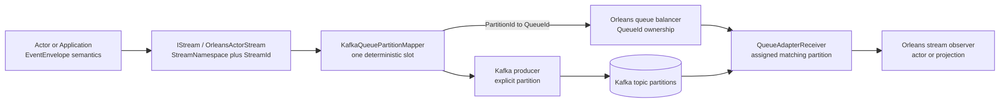
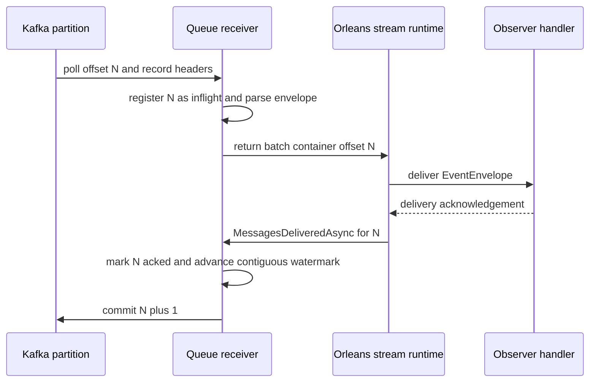

# Streaming Transport 与 Kafka：一个 Stream 身份，一套 Partition 所有权

> 版本与结论：本章是 `mixed`。当前 distributed stream backend 是 Orleans Persistent Streams 风格的 `KafkaProvider`：业务层只提交 `StreamNamespace + StreamId + EventEnvelope`，同一个 mapper 把该身份映射到Kafka partition，并让Orleans `QueueId`反向绑定同一partition。receiver只有在Orleans确认delivery后才推进连续offset水位，因此未确认记录可重放，语义是at-least-once而非exactly-once。历史MassTransit transport不在当前Mainnet组合中，只作为被替代路径进入演进说明。

## 设计抽象与事实源

- `src/Aevatar.Foundation.Runtime.Implementations.Orleans.Streaming/Streaming/OrleansActorStream.cs:12-61`、`:84-145`：上层stream只见typed envelope、subscribe lease与runtime forwarding。
- `src/Aevatar.Foundation.Runtime.Implementations.Orleans.Transport.KafkaProvider/Streaming/KafkaProviderQueueAdapter.cs:10-85`：Orleans queue adapter将stream batch交给partition-aware producer，并按queue创建receiver。
- `docs/adr/0003-kafka-transport.md:9-37`、`:116-157`：当前provider-native mapping、delivery ACK/offset边界、拓扑不变量与非目标。

## Stream 抽象与 Transport 不是两条业务主链

Application、actor和Projection使用 `IStream`发布/订阅 `EventEnvelope`。`OrleansActorStream`把业务stream ID映射为Orleans `StreamId`，并在需要时依据runtime forwarding registry生成typed forwarded envelope。KafkaProvider只是Orleans stream的一个backend；它不能改变envelope是command、domain event还是observer publication，也不拥有父子拓扑或业务完成事实。



为什么不让业务envelope带 `TargetQueueId` 或partition？queue ownership会随节点和rebalance变化，把它写进消息就形成第二路由事实。业务身份应在部署变化中稳定；transport用同一mapper从stable stream identity派生当前slot。

为什么不是Application直接写Kafka？那会跳过Orleans stream subscription、forwarding与queue lifecycle，并让本地backend和Kafka backend出现两套业务协议。上层只依赖stream/dispatch，Host选择backend。

## 唯一映射：Producer 与 Receiver 在同一 Slot 会合

当前mapping为：

```text
PartitionId = firstUInt32(SHA256(StreamNamespace + "\n" + StreamId)) % QueueCount
QueueId = OrleansQueues[PartitionId]
Reverse(QueueId) = its index in OrleansQueues
```

producer把namespace/id写入 `aevatar-stream-namespace` 与 `aevatar-stream-id` headers，并把protobuf envelope作为value发送到显式partition。receiver由Orleans分配一个 `QueueId`，反解为partition后用Kafka `Assign(partitionId)`消费；它不参加consumer group的独立partition分配决策。

这消除了两种常见漂移：producer按一种hash选partition、consumer group按另一种策略选owner；或每个pod都订阅全部partition再靠本地过滤。现在Orleans queue ownership决定哪个receiver活跃，而mapper保证该receiver恰好绑定对应partition。

启动还会检查实际topic partition数等于 `QueueCount`。partition count不是可以无迁移在线扩大的调优值：改变它会让相同stream identity重新hash到另一个partition，并破坏已有offset/ordering假设。

## ACK 后提交：为什么是 at-least-once

receiver关闭Kafka auto commit和auto offset store。poll到record后先登记inflight offset，解析headers/envelope并交成 `IBatchContainer`；Orleans调用 `MessagesDeliveredAsync` 后，该offset才进入acked集合。commit只能跨越从当前水位开始的连续acked区间，最终提交的是最后连续offset的下一位。



若进程在handler完成后、offset commit前退出，同一record可能重放；若offset N+1已ACK而N尚未ACK，receiver也不能越过N提交。这就是honest at-least-once。producer端的 `Acks.All + EnableIdempotence=true`减少生产重试导致的Kafka duplicate，却不能把消费、actor handler和外部副作用合成exactly-once事务。

因此consumer必须保留多层幂等：runtime envelope origin/attempt、actor command ID、event expected version，以及外部effect的stable idempotency key。Kafka offset只是transport进度，不是业务 `StateVersion`。

## 无效消息与失败边界

receiver遇到错误namespace、缺stream ID、空value或无法解析的envelope，会显式日志并把该offset标为可推进，避免毒消息永久阻塞partition。这是transport层的“无法形成合法内部消息”策略，不等于业务handler失败也会被跳过。成功解析并交给Orleans后，只有delivery acknowledgement才能推进。

producer启动会创建/检查topic，并拒绝partition数量不匹配；消息使用gzip与提高的producer max bytes处理合法大envelope，但上游工具结果仍应有自身payload边界。提高transport限额不是允许无界业务payload。

rolling update或queue ownership移动时，旧receiver停止poll且只提交已连续ACK的水位；新receiver绑定同一partition，从Kafka committed offset继续。其正确性还依赖Orleans queue ownership、共享persistent pubsub与 [10/03](03-garnet-clustering-and-secret-storage.md) 的同cluster前提。

## 最小映射检查

下面只核对同一stream identity的partition结果稳定且落在configured count内：

```bash
python3 - <<'PY'
import hashlib
namespace = "aevatar.actor.events"
stream_id = "actor-demo"
queue_count = 8
digest = hashlib.sha256(f"{namespace}\n{stream_id}".encode()).digest()
partition = int.from_bytes(digest[:4], byteorder="little") % queue_count
assert 0 <= partition < queue_count
print(partition)
PY
```

> Demo status：`verified-static`（本轮执行了等价SHA-256映射断言，并静态核对producer、receiver、headers、watermark与冻结integration tests；未连接Kafka或启动Orleans）。

## 为什么当前是 KafkaProvider，而不是已退役的 MassTransit

历史MassTransit路径把stream transport替换成broker adapter，却没有让Orleans queue ownership与Kafka partition成为同一slot；旧ADR和历史文档还保留其比较价值，但冻结Mainnet `Distributed`选择 `OrleansStreamBackend=KafkaProvider`，当前solution/composition没有把MassTransit作为生产backend装入这条主链。

provider-native方案更贴近Orleans Persistent Streams的queue adapter/receiver/ACK生命周期，也减少一层并行routing模型。代价是partition count成为部署契约，并且实现仍是at-least-once。历史组件、删除事实和替代原因统一进入 [12/03](../12/03-retired-and-superseded-components.md)，不能作为现行配置教程。

## 边界与演进

- Kafka header只恢复stream identity，不携带scope授权、业务target或完成状态。
- offset commit证明transport delivery ACK，不证明actor event、Projection或外部effect已到终态。
- `Acks.All`与idempotent producer不提供端到端exactly-once。
- partition/queue数量必须一致；扩容partition需要显式迁移设计，而不是直接改配置。
- **共享队列缓存是缓冲维度，不是 partition 契约**：`Orleans:QueueCacheSize` 默认从 4096 提升到 32768（`AevatarOrleansRuntimeOptions.DefaultQueueCacheSize = 32*1024`，`KafkaProviderQueueAdapterFactory` 落地为 `CacheSize = Math.Max(128, ...)`），吸收消费端瞬时高峰（burst headroom）。它不改变 partition 映射、不改变 at-least-once、不改变 `QueueCount=8` 的 partition 对齐不变量；缓存堆积不能当业务背压，有界队列/高水位治理仍在（2026-08-04 补充）。
- InMemory stream适合单机profile；多silo KafkaProvider依赖Garnet persistent runtime/pubsub和正确membership。
- MassTransit只属历史，不得写成current可选backend。

## 读完应能回答

1. 为什么业务消息只保留stream identity，而不保存 `QueueId` 或partition？
2. producer和receiver怎样通过同一mapper在一个slot会合？
3. 为什么只有 `MessagesDeliveredAsync` 后才能推进offset，且只能推进连续水位？
4. `Acks.All`、producer idempotence和consumer at-least-once分别解决什么、没解决什么？
5. MassTransit为何只能出现在历史层？

<details>
<summary>论断—冻结证据映射</summary>

| 论断 | 冻结证据 |
|---|---|
| OrleansActorStream只暴露typed publish/subscribe并由runtime registry处理forwarding | `src/Aevatar.Foundation.Runtime.Implementations.Orleans.Streaming/Streaming/OrleansActorStream.cs:36-81`、`:84-145` |
| adapter把stream namespace/id与envelope交producer，并按QueueId创建receiver | `src/Aevatar.Foundation.Runtime.Implementations.Orleans.Transport.KafkaProvider/Streaming/KafkaProviderQueueAdapter.cs:42-85` |
| mapper使用SHA-256稳定映射并提供partition/queue双向关系 | `src/Aevatar.Foundation.Runtime.Implementations.Orleans.Transport.KafkaProvider/Streaming/KafkaQueuePartitionMapper.cs:10-67` |
| producer写两个stream headers、显式partition，启用all ACK/idempotence并检查topic partition count | `src/Aevatar.Foundation.Runtime.Implementations.Orleans.Transport.KafkaProvider/Transport/KafkaProviderProducer.cs:35-79`、`:124-172` |
| receiver关闭auto commit，只有delivery ACK后推进连续水位 | `src/Aevatar.Foundation.Runtime.Implementations.Orleans.Transport.KafkaProvider/Streaming/KafkaProviderQueueAdapterReceiver.cs:66-113`、`:239-293` |
| batch container同时携带Orleans stream token与Kafka offset但不导入request context | `src/Aevatar.Foundation.Runtime.Implementations.Orleans.Transport.KafkaProvider/Streaming/KafkaProviderBatchContainer.cs:8-49` |
| ADR明确provider-native current、at-least-once与非exactly-once | `docs/adr/0003-kafka-transport.md:9-37`、`:142-187` |

</details>
