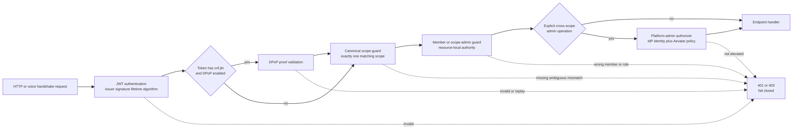
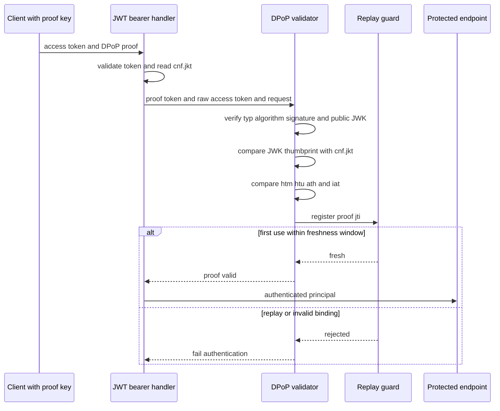
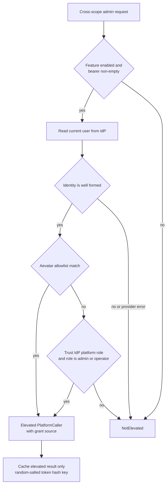

# Authentication、Scope 与 Admin：四道门，不是一枚万能 Token

> 版本与结论：本章描述冻结基线的 `current` 认证授权模型。Host 默认把调用者认证为 JWT principal；可选 DPoP 只给带 `cnf.jkt` 的 access token 增加持有证明。随后，资源入口仍须依次核对唯一 scope、member/owner 或 scope-admin 权限；只有明确的跨 scope 管理操作才调用独立的 platform-admin authorizer。**authenticated 不等于 authorized，scope admin 也不等于 platform admin。**

## 设计抽象与事实源

- `src/Aevatar.Authentication.Hosting/AevatarAuthenticationHostExtensions.cs:26-159`、`:238-341`：JWT resource-server 默认值、窄 WebSocket token 入口、DPoP hook、fallback policy 与启动期 replay guard。
- `src/Aevatar.Authentication.Hosting/DPoPProofValidator.cs:23-178`：proof signature、key thumbprint、request/access-token binding、freshness 与 replay 的完整校验顺序。
- `src/Aevatar.Authentication.Abstractions/IPlatformAdminAuthorizer.cs:3-30`：provider-neutral 的 platform-admin seam 与 missing/error/malformed/no-grant 全部 fail-closed 契约。

## 四层边界：先证明是谁，再证明能碰什么

认证层回答“请求携带的 access token 是否可被当前 Host 接受”。它不回答 token 是否属于 URL 中的 scope、是否能操作某个 Member，更不自动赋予跨 scope 管理权限。当前授权链因此分成四层：

1. **Authentication**：JWT issuer/signature/lifetime、可配置 audience、算法 allowlist；启用且适用时再校验 DPoP。
2. **Canonical scope**：从 `workflow.scope_id` / `scope_id` 得到唯一值，并与请求 scope 精确相等。
3. **Member / scope role**：调用者是目标 member，或在该 scope 内具有明确的 owner/admin 角色。
4. **Platform admin**：跨 scope 等窄操作另行解析 IdP current-user identity，并套用 Aevatar 自有 allowlist/role policy。



为什么不是“JWT 验过就放行”？JWT 只证明签发者认可了一组 claims。若 endpoint 直接相信 body/path 里的 `scopeId`，合法用户仍可把它换成别人的 scope，形成 IDOR。反过来，把 platform-admin role 塞进通用 scope guard，也会让一个局部角色意外获得跨租户权限。四道门让每个决定只消费它需要的身份事实。

## JWT resource server 的真实默认值

`AddAevatarAuthentication` 默认注册 JWT Bearer。没有显式配置时认证开启；`Aevatar:Authentication:Enabled=false` 只在 `Development` 生效，其他环境仍保持认证。认证开启后，fallback policy 要求 authenticated user，公开端点必须显式 `AllowAnonymous`。

签名算法有 allowlist：OIDC 默认只接受预列出的 RSA/ECDSA/PSS 算法，scope service token 开启时才把其 HS256/RS256 加入集合；显式配置可进一步替换该集合。scope-token issuer 还必须与 OIDC authority issuer 不同，resolver 按 issuer 选择相应密钥，避免把两套签名信任域混用。

这里有一个必须诚实保留的配置边界：`Audience` 非空时才打开 audience validation。非 Development 环境若 audience 为空，冻结实现只发启动告警，**不会 fail-fast**。因此不能把“所有部署必定校验 audience”写成当前不变量；生产配置仍应显式设置 audience，并把告警当作发布阻断信号。

NyxID claims transformer只从明确候选 `scope_id → uid → sub → NameIdentifier` 生成 canonical `scope_id`，不再从任意 `*_id` 猜 scope。这个 waterfall 是身份提供方 adapter 的规范化职责，不替代 endpoint 的 scope equality guard。

## DPoP：只约束 sender-constrained token

DPoP不是第二种“管理员认证”，而是 access token 的持有证明。只有 Host启用DPoP，且已验签 access token 带 `cnf.jkt` 时，hook才要求 `DPoP` proof；没有 `cnf.jkt` 的 token 仍按普通 bearer处理。这是冻结实现的兼容边界，不能外推为“所有 bearer 已不可重放”。



proof必须使用非对称算法并自带public JWK；validator校验自己的signature，再比较JWK的RFC 7638 thumbprint与 `cnf.jkt`。随后核对实际HTTP method/URI（忽略query/fragment的 `htu` 规范化）、access token hash `ath`、`iat` freshness以及 `jti` 唯一性。

为什么 replay guard 是启动前置条件，而不是“最好有”？单机内存或NoOp不能阻止proof在另一实例复用。Host在DPoP开启却仍解析到 `NoOpDPoPReplayGuard` 时拒绝启动，把“共享、原子、带TTL的seen-jti记录”变成部署契约。DPoP关闭时保留NoOp占位，不为未启用能力制造基础设施依赖。

## Canonical scope：缺失、歧义、错配都拒绝

`AevatarScopeAccessGuard` 收集 `workflow.scope_id` 与 `scope_id` 的非空distinct值。它只接受“恰好一个”canonical scope：

| Principal 与请求 | 决定 |
|---|---|
| 未认证 | 拒绝，认证必需 |
| 没有两个受信claim中的任一个 | 拒绝，scope missing |
| 两种claim给出不同值，或同类claim有多个不同值 | 拒绝，scope ambiguous |
| 唯一claim与requested scope大小写敏感地不相等 | 拒绝，scope mismatch |
| 唯一claim与requested scope精确相等 | 进入下一层授权 |

“遇到歧义任选一个”看似提高兼容性，实际会让claim顺序决定租户边界；“优先 `workflow.scope_id`”也会掩盖两个身份源冲突。fail closed迫使签发/转换端修正principal，而不是让业务端猜。

只看自己的观测面没有path scope时，也使用同一个guard的 `TryGetCallerScopeId`：认证开启且principal只有唯一scope才返回值。这避免“my runs”另造一套scope解析规则。

## Member、scope admin 与 platform admin

scope通过后，资源仍可能属于某个Member。`AevatarMemberAccessGuard` 接受与requested member精确相等的 `member_id/user_id/uid/sub/NameIdentifier`，或当前principal中明确的 `owner/admin/scope-admin` 角色。需要绑定类高权限操作时，可强制要求scope-admin，而不是让任意同scope成员操作。

这些role只解释**当前scope内**的资源权限。platform admin是另一条窄支路：消费方只依赖 `IPlatformAdminAuthorizer`；当前NyxID adapter拿调用者自己的bearer读取current-user identity，再由 `Aevatar:AdminAccess` 的 `AllowedUserIds`、`AllowedEmails`，以及可配置是否信任NyxID `admin/operator` role做决定。



missing token、provider error、错误信封、畸形JSON、缺identity以及无grant全部返回 `NotElevated`；只有request cancellation向上传播。authorizer只缓存elevated结果，默认30秒。cache key是每进程随机salt加token的SHA-256，不持久化也不记录raw token。这样既避免把临时IdP故障缓存成长期拒绝，也不让cache本身成为bearer泄露面。

为什么不只信 `role=admin` claim？跨scope权限是Aevatar平台政策，不能由任意被接受的token自证。独立authorizer允许关闭role信任、改用精确allowlist，也给未来IdP adapter留下稳定seam。

## Voice 与 WHIP 的窄 Token 入口

浏览器WebSocket握手不能设置任意 `Authorization` header。冻结Host只对 `/ws/voice` 与 `/whip/offer` 两个path启用特殊取token规则：优先从请求的 `Sec-WebSocket-Protocol` 列表读取 `aevatar-bearer.<token>`；server只选择并回显非敏感的 `aevatar-voice-v1`。legacy `?access_token=` 仍作兼容fallback，并依赖request-log redactor兜底。

这不是允许任意endpoint从query读取bearer，也不是把token当成真正的应用subprotocol。优先header的原因是URL会进入ingress、LB和应用日志；兼容fallback仍是开放债，不能写成“token已完全不进URL”。握手完成后还要继续经过scope、target actor和voice policy，拿到JWT不等于能attach任意actor。

## 最小静态检查

下面的检查只证明冻结代码中三条边界同时存在，不启动IdP或Host：

```bash
set -euo pipefail

auth="$AEVATAR_SRC/src/Aevatar.Authentication.Hosting/AevatarAuthenticationHostExtensions.cs"
scope="$AEVATAR_SRC/src/Aevatar.Capabilities/AevatarScopeAccessGuard.cs"

rg -q 'FallbackPolicy = new AuthorizationPolicyBuilder' "$auth"
rg -q 'RequireAuthenticatedUser' "$auth"
rg -q 'DPoP.Enabled && _replayGuard is NoOpDPoPReplayGuard' "$auth"
rg -q 'claimedScopeIds.Count == 0' "$scope"
rg -q 'claimedScopeIds.Count > 1' "$scope"
rg -q 'Authenticated scope does not match requested scope' "$scope"
rg -q 'Sec-WebSocket-Protocol|WebSocketSubprotocolToken.ExtractBearer' "$auth"

printf 'auth-scope-boundaries: verified-static\n'
```

> Demo status：`verified-static`（本轮在冻结SHA上执行了等价断言，并逐项核对JWT/DPoP、scope/member、platform-admin与WebSocket token代码及冻结tests；未获取真实token、未连接NyxID、未启动production Host）。

## 边界与演进

冻结代码已经吸收若干历史加固：Console登录通过backend finalize完成code交换（#2303）；platform-admin policy收敛到Aevatar配置与provider-neutral seam（#2612）；非生产DCR缺显式authority/redirect时阻断误注册（#2670）；Console的service-access review typed flow已存在（#2806）。这里的current结论来自E1代码，而不是issue closed状态。

以下仍只能写成缺口：

- **#2389 service identity claims**：authenticated service请求缺 `tenant_id/app_id/namespace` 时当前正确返回403，但调用链还不能稳定提供这些claims；不能用request字段替代已认证身份悄悄放行。
- **#2404 scheduled credential source**：无人值守凭证仍有历史并行路径与收敛债；canonical Automation lifecycle见 [09/03](../09/03-owner-authorization-and-agent-key.md) 与 [09/04](../09/04-vault-reference-and-revocation-compensation.md)，不能据此宣称所有旧入口已统一。
- **#2591 tool scope ownership**：workflow readmodel/artifact工具存在按actor ID直读、缺scope归属校验的安全债；JWT fallback policy不能替代对象级授权。
- **#2800 Studio service-access review**：Studio侧的完整review flow仍缺；另一前端已有实现不等于所有surface都闭合。
- **Audience与legacy query token**：非开发环境缺Audience当前只是告警，voice兼容入口仍接受query bearer；两项都应由部署/后续演进继续收紧。

这些缺口统一登记到 [12/05](../12/05-open-gaps-and-canon-drift.md)。在它们关闭前，不能把“默认认证”外推为“所有入口已完成对象级最小权限”。

## 读完应能回答

1. 为什么JWT通过后仍必须分别做scope与member授权？
2. DPoP在哪些token上生效，又为什么不能声称所有bearer都已sender-constrained？
3. scope claim缺失、歧义或与path错配时，系统为何都要fail closed？
4. scope-admin与platform-admin的事实来源和权限范围有何不同？
5. 为什么voice优先用 `Sec-WebSocket-Protocol`，legacy query fallback又留下什么风险？

<details>
<summary>论断—冻结证据映射</summary>

| 论断 | 冻结证据 |
|---|---|
| JWT默认开启，仅Development允许显式关闭，fallback要求authenticated user | `src/Aevatar.Authentication.Hosting/AevatarAuthenticationHostExtensions.cs:26-55`、`:149-159`、`:300-315` |
| audience为空时关闭validation，非Development只注册warning | `src/Aevatar.Authentication.Hosting/AevatarAuthenticationHostExtensions.cs:64-77`、`:143-147` |
| DPoP只处理带cnf.jkt的token，启用时NoOp replay guard导致启动失败 | `src/Aevatar.Authentication.Hosting/AevatarAuthenticationHostExtensions.cs:238-271`、`:318-341` |
| proof校验signature、thumbprint、htm/htu、ath、iat与jti replay | `src/Aevatar.Authentication.Hosting/DPoPProofValidator.cs:90-178` |
| claims transformer只从明确候选生成canonical scope | `src/Aevatar.Authentication.Providers.NyxId/NyxIdClaimsTransformer.cs:6-41` |
| scope guard对missing、ambiguous与mismatch分别拒绝 | `src/Aevatar.Capabilities/AevatarScopeAccessGuard.cs:98-140` |
| member guard只接受exact member或显式scope-admin role | `src/Aevatar.Capabilities/AevatarMemberAccessGuard.cs:101-149` |
| platform-admin seam要求所有异常与缺grant fail closed | `src/Aevatar.Authentication.Abstractions/IPlatformAdminAuthorizer.cs:3-30` |
| NyxID adapter使用allowlist/可选role，只缓存elevated并hash token cache key | `src/Aevatar.AI.ToolProviders.NyxId/NyxIdPlatformAdminAuthorizer.cs:12-78`、`:115-181`；`src/Aevatar.AI.ToolProviders.NyxId/ObservatoryAdminAuthorizationOptions.cs:3-16` |
| voice/WHIP优先subprotocol bearer并保留窄path query fallback | `src/Aevatar.Authentication.Hosting/AevatarAuthenticationHostExtensions.cs:79-127`；`src/Aevatar.Authentication.Hosting/WebSocketSubprotocolToken.cs:26-81` |
| authenticated service identity缺或歧义时返回403而非使用fallback | `src/platform/Aevatar.GAgentService.Governance.Hosting/Identity/ServiceIdentityEndpointAccess.cs:9-141` |

</details>
