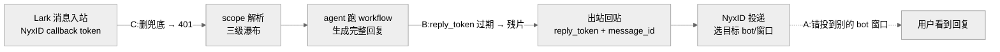
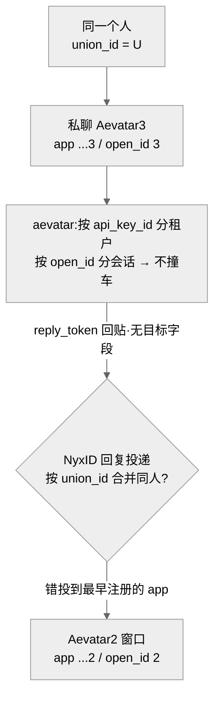
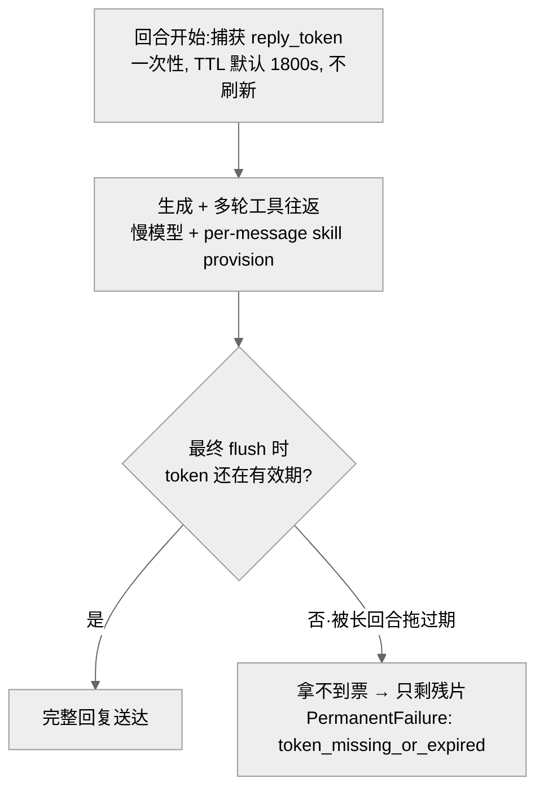
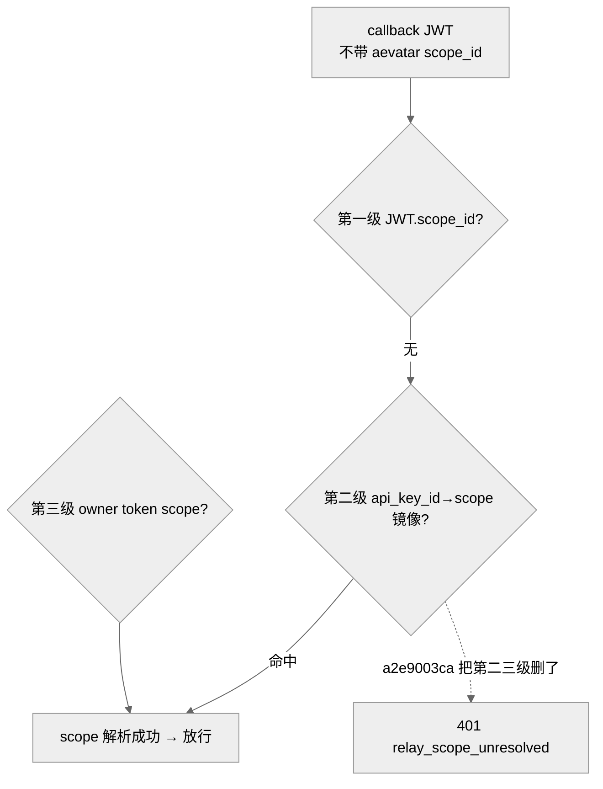

# Lark 机器人「收到却答不出」:投递层三类故障(回复错对象 / 截断成残片 / 全哑 401)

## 事实源/设计抽象(以 ~/Code/aevatar 为准)

> 现象:本周三起独立的 Lark/飞书故障都长一个样 —— **消息进来了、workflow 也跑成功了,但用户那侧的回复要么答到别的 bot 窗口、要么只剩一个残片、要么干脆全程没声**。三者根因完全不同,却都落在同一段链路:**入站 relay → 生成 → 出站回贴**。把它们放一起讲,是为了划清一条边界 —— **aevatar 只负责"用本回合的 reply_token 把正文交回 NyxID",目标 bot/窗口的选择、跨平台渲染都在 NyxID 那边** —— 于是有的故障可修(scope 解析、凭证时效),有的根本不在本仓库(错投对象)。
>
> **这是什么机制**:NyxID relay 是 aevatar 接入 Lark/Telegram 的零凭证入站骨干(见 [07/13](../07/13-lark-bot-registration.md))。一条入站消息带着 NyxID 签发的 callback token 打到 aevatar 的 relay webhook;aevatar 解析租户 scope、按 per-app 身份派生会话 actor、跑完 agent、再用**本回合捕获的一次性 reply_token** 调 NyxID 的 channel-relay reply 接口把回复送回去。出站请求体**不含任何目标标识** —— 投到哪个 bot、哪个会话窗口,由 NyxID 按平台决定。
>
> 事实源脊柱(职责,非正文骨架):
>
> - `agents/Aevatar.GAgents.NyxidChat/NyxIdChatEndpoints.Relay.cs` —— 入站 relay webhook 适配器:校验回调、**三级 scope 解析**(`ResolveRelayScopeIdAsync`)、reply_token 过期戳解析、交 ingress。
> - `agents/channels/Aevatar.GAgents.Channel.NyxIdRelay/NyxIdRelayScopeResolver.cs` —— `api_key_id → scope` 本地镜像解析器:按 api-key-id 查注册、多 scope 即拒,防错投租户。
> - `agents/channels/Aevatar.GAgents.Channel.NyxIdRelay/NyxIdRelayOutboundPort.cs` —— 出站回复端口:只组装 `reply_token + message_id + 正文`,**契约上没有目标选择字段**。
> - `agents/Aevatar.GAgents.NyxidChat/AgentRunGAgent.LarkCardDelivery.cs` —— Lark 卡片投递状态机:create→stream→finalize、卡片失败分类(pre-send 退文本 / post-send 终结)、text 回退的 interim cap + final 豁免。
>
> 核对基线:`feature/integrate`(部署线 origin @ `7d3c5a782`,2026-06-26;本地 checkout 落后 origin 21 个提交,以下"已修复/已部署"判定以 origin 祖先关系为准)。**性质:A 错对象 = 非我方(外部 NyxID);B 残片 = 真 bug,部分已修;C 全哑 = 真 bug,已 revert 修复并部署。**

---

## 0. 一句话主线

> 同一个"workflow 成功了、用户却没正常收到回复"的表象下,**三个互不相干的根因**:① 回复被投到错的 bot 窗口 —— 目标选择在 NyxID 边界外,aevatar 入站/出站全程正确;② 长回合把**一次性 reply_token** 拖过期,最终 flush 拿不到票,只落下一个残片;③ 有人"删冗余自注册"时连带删掉了 scope 解析的兜底层,而 NyxID 回调 JWT 偏偏不带 aevatar scope_id,于是 100% 解析失败、全程 401。

---

## 1. A —— 回复投到错的 bot 窗口(边界在 NyxID,非 aevatar 缺陷)

**现象**:同一飞书组织里两个测试 bot(先绑的 Aevatar2、后绑的 Aevatar3)。用户私聊 **Aevatar3**,结果 **Aevatar2 在它自己的窗口**回复。

直觉会怀疑"aevatar 把两个 bot 的 actor 撞在一起了"。但沿链路逐段核实,aevatar 这一侧**全程正确**:

- **入站身份只由 per-app `api_key_id` 决定**:不同 app 的入站消息解析出不同的 channel-bot 与 scope,发送者建模为 per-app 的 `open_id`,会话落在**互不相交**的 `ConversationGAgent` —— 两个 bot 天然不可能在 aevatar 内塌缩成同一个 actor。
- **出站回贴不选目标**:`NyxIdRelayOutboundPort` 的回复体只带"本回合 `reply_token` + 入站 `message_id` + 正文",**契约上没有任何"投给哪个 bot/窗口"的字段**。`ResolveRelayReplyToken` 还用 `CorrelationId + ReplyMessageId` 双等值把回复**死锁在同一入站回合**上,不匹配宁可拒发也不改投。
- **union_id 只做诊断**:aevatar 确实读了 Lark `union_id`(存进 `TransportExtras.NyxLarkUnionId`),但**仅用于诊断/operator 上下文,从不参与入站 keying 或出站路由**。

既然"投给哪个 bot"整个在 NyxID 边界之外,那"私聊 Aevatar3、Aevatar2 回复"只能源于 **NyxID 的回复投递路由** —— 最可能是它按 `union_id` 把"同一个人跨 app 的私聊"合并,回复走了**最早注册**的那个 app。

!!! warning "性质:非我方 —— 外部 NyxID"
    aevatar 入站/出站经全链路核实无回归。本仓库**无权也无处可改**(见 CLAUDE.md「外部仓库无改动权」);唯一能动的接缝在 NyxID 的 relay reply 路由。aevatar 侧已留的硬约束(双等值锁回合、union_id 不入路由)恰好排除了"我方错投"的可能。要钉死 NyxID 那侧,用 `aexon aevatar api get /api/channels/registrations` 把 apiKey→bot 映射拉出来对一条 live trace。

## 2. B —— 回复被截断成残片(一次性 reply_token 被长回合拖过期)

**现象**:bot"不好好执行 ornn skills",用户只收到一句"Dear …"或"Sorry …"的残片。但日志显示 **workflow 实际成功**(完整长回复已生成、`terminal=Completed`)。坏的不是生成,是**投递**。

根因是一条**凭证时效与生成时长的隐式耦合**:

- `reply_token` 是**单次使用、带 TTL** 的凭证(JWT `exp`,缺失时回退运行时 `RelayReplyTokenRuntimeTtlSeconds = 1800s`),在**回合开始时捕获一次、全程不刷新**。
- agent 的 tool-round 循环只消耗墙钟时间。一旦"生成 + 工具往返"的总时长**超过 token 有效期**,已落的 interim 编辑还在,但最终 flush 在 `ResolveRelayReplyToken` 的过期检查处拿不到票 → 用户卡在最后一个残片,整回合记为 `PermanentFailure("reply_token_missing_or_expired")`。

缺 `cardkit:card:write` scope 只是**放大器**、不是直接成因:卡片 create 报 400 属于 **pre-send** 失败 → 干净切到 text-edit 整回合回退,这条路**本身能产出完整文本**(final 帧豁免一切节流);只有当它又**叠加** token 过期,才退化成残片。卡片**已贴出后**的写失败则不回退、直接终结回合,留一个空卡片。

!!! note "对常见误解的更正(已核实)"
    - **`MaxToolRounds` 默认是 40,不是 5**。"public LLM = 5"来自 bot-owner 的 `UserConfigGAgentState.max_tool_rounds` 配置,不是代码常量。
    - 残片的**载荷主因是 reply_token 过期**,不是卡片 400;卡片 400 只是把回合导向更慢的 text-edit 路径、间接抬高过期概率。
    - 另一类"编辑次数耗尽(Lark `230072`)"型截断是**独立机制**,已被 `29e3c9e0d` 缓解(text-edit fallback 加 interim cap、豁免 final);它**不**等于 token 过期型残片。

## 3. C —— bot 全程哑火 401(删冗余时连带删掉 scope 兜底)

**现象**:某 bot 90 分钟内 29 次 401、0 成功,全是 `relay_scope_unresolved`,没有一次签名失败。

入站 relay 取租户 scope 走一条**三级瀑布**:

> (1) 已验签 callback JWT 的 `scope_id ?? sub ?? NameIdentifier` → (2) `api_key_id → scope` 本地镜像(aevatar 自注册时写入)→ (3) 兜底用 bot-owner user token 的 `scope_id ?? uid ?? sub`。

commit `a2e9003ca`("删冗余自注册")在重构时把整个 `ResolveRelayScopeIdAsync` **塌缩成只剩 `NormalizeOptional(validation.ScopeId)`** —— 基于"callback JWT 总会带 scope_id"这个**错误前提**删掉了第 (2)(3) 级。而 NyxID 的 relay callback JWT **实际不带 aevatar `scope_id`**,于是 scope 100% 解析失败、fail-closed 退化成**对所有入站消息 401**。

!!! note "性质:真 bug,已 revert 修复并部署"
    `a2e9003ca`(2026-06-24 02:29 引入)→ `105d95039`(同日 11:23 **Revert**,恢复三级瀑布 + 镜像 + facade)。当前 `ResolveRelayScopeIdAsync` 是**完整三级瀑布**,不是单一来源。`api_key_id→scope` 镜像是第 (2) 级、**不是唯一来源**(JWT `scope_id` 才是第 (1) 级权威)。修正此前"修复待定"的记忆:它**已落定为 revert**。

## 4. 影响面 / 性质 / 教训

| 子问题 | 性质 | 影响面 | 修复 |
|---|---|---|---|
| A 错对象 | 非我方·外部 NyxID | 多 app 并存时同人跨 app 私聊串窗 | aevatar 侧无可修;需 NyxID 修 relay reply 路由 |
| B 残片 | 真 bug·部分已修 | 长回合 + 慢模型 + 缺 card scope 的 bot 最易触发 | `29e3c9e0d`(编辑耗尽型);**token 过期型残片仍存** |
| C 全哑 401 | 真 bug·已修复部署 | 曾使所有镜像注册 bot 100% 哑火 | `a2e9003ca` → `105d95039` revert |

**教训:**

1. **"workflow 成功"≠"用户收到回复"**。本周最反复踩的认知坑就是把"没回复"当成"没跑";三例里 workflow 全是成功的,坏在投递层。排查 channel bot 必须把"生成成功信号(`terminal=Completed`)"与"投递成功信号"分开看。
2. **删冗余前先证明替代来源充分**(C 的教训)。`a2e9003ca` 删镜像却假设"JWT 总带 scope_id",把 fail-closed 守卫退化成 100% 关闭。这正是 CLAUDE.md「删除优先」的反面边界:删之前要有 evidence 证明被删路径真的冗余。
3. **单次/带时效的凭证不能被无界时长消费**(B 的教训)。reply_token 在回合开始捕获、全程不刷新,而 agent 回合时长无上限 —— 两者耦合就必然在长回合上断。

## 关联章节

- [07/13 Lark Bot 注册](../07/13-lark-bot-registration.md) —— 零凭证 relay 入站、`api_key_id→scope` 镜像的注册期写入。
- [10/06 Lark 身份与授权](06-lark-identity-and-authorization.md) —— 同一入站链路的下一层:用谁的身份调用、给谁授权。
- [10/01 CLI 看不到 bot 的 agent](01-cli-lark-scope-isolation.md) —— scope 隔离的另一面。
