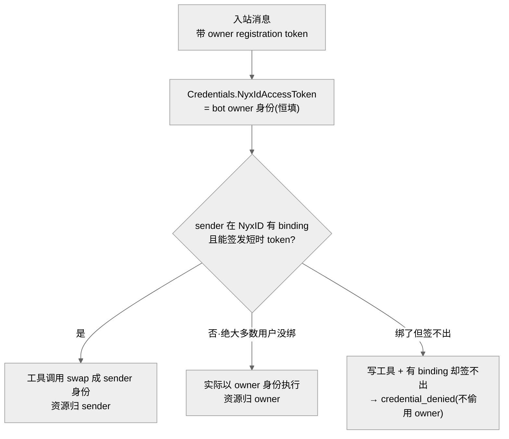
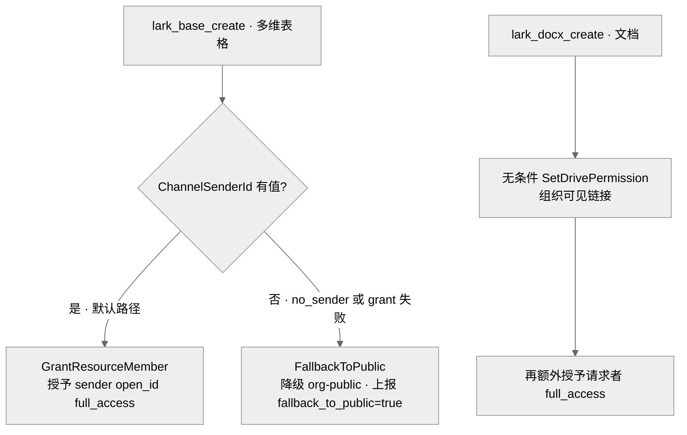

# Lark 机器人「身份与授权」:用谁的身份调用、把资源开给谁

## 事实源/设计抽象(以 ~/Code/aevatar 为准)

> 现象:两个相邻但不同的问题。① 机器人替用户调 workflow member / 工具时,用的是**谁的 NyxID 身份**?期望是"发消息的用户",怀疑是"bot owner"。② 机器人替用户创建 Lark 资源(如多维表格)时,**授权给谁**?观察到它把资源设成"组织内公开",而不是只授权请求者。两件事都关乎"代表谁行事"这条身份/最小权限不变量。
>
> **这是什么机制**:NyxID relay 入站后,`ChannelConversationTurnRunner` 解析 caller 身份,凭据以强类型 `AgentToolCredentials(NyxIdAccessToken, SenderNyxIdAccessToken, …)` 注入工具执行上下文;每次工具调用经 `ToolCallCredentialPolicyMiddleware` 决定用 owner 还是 sender 票。Lark 写工具(建多维表格/文档)再用拿到的身份,去 NyxID 经纪的 Lark API 授权资源。
>
> 事实源脊柱(职责,非正文骨架):
>
> - `src/Aevatar.AI.Core/Middleware/ToolCallCredentialPolicyMiddleware.cs` —— 每次工具调用的 owner↔sender 凭据决策中枢:无 binding 用 owner、有 sender token 用 sender、写工具有 binding 却签不出 token 则诚实 deny。
> - `agents/Aevatar.GAgents.NyxidChat/ChannelConversationTurnRunner.cs` —— 入站 channel turn 编排:sender 身份解析、binding 查询、`Channel.SenderId`(sender open_id)构建。
> - `src/Aevatar.AI.ToolProviders.Lark/Tools/LarkBaseCreateTool.cs` —— 多维表格"创建即授予请求者"工具:requester-grant 主路径 + org-public 兜底决策。
> - `src/Aevatar.AI.ToolProviders.Lark/Tools/LarkDocxCreateTool.cs` —— 文档工具:**无条件** tenant-link(组织可见)+ 额外 requester grant。
>
> 核对基线:`feature/integrate`(origin @ `7d3c5a782`)。**性质:① 身份 = 按设计的"sender 优先、owner 兜底",未绑定时落 owner(设计缺口,非 bug);② 授权 = Bitable 已默认精准授予请求者(`0b8874b3c` / `9069a5364`),Docx 仍 by-design 组织可见 + 叠加请求者。**

---

## 0. 一句话主线

> "代表谁"有两层:**身份**(用谁的 token 调用)和**授权**(把资源开给谁)。aevatar 的设计是"sender 优先、owner 兜底":只有当发消息的用户在 NyxID 有显式 binding 时,工具才换成 sender 身份;绝大多数 Lark 用户从没绑过,于是实际落到 **owner 身份**。授权侧 Bitable 工具已经"默认精准授予请求者、拿不到请求者才降级 org-public",而 Docx 工具**故意**先开组织可见链接 —— 所以"默认 org-public"这个观察**对 Docx 成立、对 Bitable 不成立**。

---

## 1. 身份:sender 优先、owner 兜底(未绑定时落 owner)

入站 Lark 消息的 caller 身份不是单一来源,而是一条**"sender 优先、owner 兜底"的条件式**:

- relay callback 提供的 `validation.UserAccessToken` 是 **bot owner / registration 身份**,恒定填入 `Credentials.NyxIdAccessToken` —— 这是"普通消息用 owner LLM 兜底"的设计语义,让没绑定的用户也能用上 bot owner 配的模型。
- 只有当 sender 在 NyxID 有显式 binding(`TryResolveSenderBindingAsync` 命中)且能签发短时 token 时,`ToolCallCredentialPolicyMiddleware` 才把**工具调用**换成 sender token。
- 诚实的一点:当 sender **已绑定**但 token 签发失败,对**写工具**会 `credential_denied` 终止,而**不**偷偷退回 owner —— 宁可报错也不冒用他人身份写数据。

**不变量违反点**:绝大多数 Lark 终端用户从未把 Lark 身份绑定到 NyxID,因此 sender binding 为空,工具实际以 **bot owner 的 NyxID 身份**执行。这满足了"授权给请求者"的一半,但副作用是**资源的创建者/拥有者仍是 owner 而非发消息的用户**。要让"以发消息用户身份创建"成立,前提是 sender 有 NyxID binding —— 当前几乎都没有,这是设计缺口,不是回归 bug。

> 强类型 `AgentToolCredentials` + 中间件决策是对的:身份选择是**显式、可观察、对写操作 fail-closed** 的,而不是把 token 散落在调用栈里隐式透传。缺的是"让未绑定 sender 也能把创建归到自己名下"的上游接缝(NyxID 侧的轻量绑定)。

## 2. 授权:Bitable 精准授予请求者,Docx 故意组织可见

"默认 org-public"这个观察,**对两个工具的答案相反** —— 它们的授权协议本就不同:

- **`LarkBaseCreateTool`(Bitable):默认精准授予请求者**。先 `GrantResourceMemberAsync`(`member_id = sender open_id`,`full_access`),**只有** `ChannelSenderId` 为空(`no_sender`)或 grant 报错时,才 `FallbackToPublicAsync` 降级 org-public,且降级会**显式上报**(`fallback_to_public=true` + `reason`)。
- **`LarkDocxCreateTool`(文档):设计上无条件先设 tenant link(组织可见)**,再**额外**给请求者加 full_access。即"组内可读 + 请求者可编辑"并存,这不是降级 fallback,是 by-design 的双重授予。

关键事实:**请求者真实 Lark id 是拿得到的** —— `ChannelSenderId` 就是 relay 注入的 sender **open_id**,正好匹配授予所需的 `member_type:"openid"`。所以 Bitable 走 org-public 的**唯一触发条件**是 `ChannelSenderId` 为空,也就是 relay payload 的 `Sender.PlatformId` 没带上 sender open_id(NyxID 边界),或那次 grant 被 Lark 拒(缺 `drive:drive` 等 scope)。

!!! warning "诚实区分:你看到的 org-public 来自哪个工具"
    - 若来自**多维表格**:它**不是默认行为**,是 fallback 被触发了 —— 返回 JSON 里会有 `fallback_to_public:true` + `reason:"no_sender"` / `grant_error`,据此可一锤定音区分"sender open_id 在 relay 丢失(NyxID 边界)"与"grant 被 Lark 拒(缺 scope)"。"私聊也走 public"恰恰指向 `ChannelSenderId` 在该路径**丢了**,而非代码默认 public。
    - 若来自**文档**:那么"默认组织可见"**成立且是 by-design**(`LarkDocxCreateTool` 无条件 tenant link),与最小权限相悖,应改为 requester-first + 可选组织共享。

## 3. 影响面 / 性质 / 修复

| 子问题 | 性质 | 修复 commit | 状态 |
|---|---|---|---|
| 写工具优先 sender 身份、缺 token 诚实报错 | 设计正确 | `5460c2b35`(#2174) | 已部署 |
| Bitable 确定性授予请求者 + 兜底 public | 已修复 | `0b8874b3c` / `9069a5364` | 已部署 |
| sender 未绑定 → 资源归 owner | 设计缺口 | —— | 仍开放(需 NyxID 侧 sender 轻量绑定) |
| Docx 默认组织可见 | by-design,违最小权限 | —— | 仍开放(可收窄为 requester-first) |

两类行为都有测试钉死:`test/Aevatar.AI.ToolProviders.Lark.Tests/LarkToolsTests.cs`(requester full_access / `no_sender → fallback_to_public` / docx `granted_to_sender`)、`test/Aevatar.AI.Tests/ToolCallCredentialPolicyMiddlewareTests.cs`(sender swap / `credential_denied` / 无 binding 留 owner)。

**教训:**

1. **"代表谁"要拆成身份与授权两层看**,别混为一谈:身份解决"用谁的 token",授权解决"把资源开给谁";本周这两层各有一个独立缺口。
2. **最小权限的兜底必须 loud 且可收窄**:Bitable 的 org-public 是"拿不到请求者时的有损兜底"且显式上报 —— 这是对的;Docx 的"无条件组织可见"违反同一原则,是真正待收窄处。
3. **"私聊也 public ⇒ 一定是代码默认 public"是错误推理**:私聊里 `ChannelSenderId` 仍来自 relay,它**为空**(边界没回传)同样触发 fallback。要证伪/坐实,得拉 live trace 看工具返回里的 `reason` 字段 —— 又一次印证"code 追根因是假设,需 evidence 证实"。

## 关联章节

- [10/05 Lark 投递层故障](05-lark-delivery-layer-failures.md) —— 同一入站链路的上一层:scope 解析与回贴。
- [07/08 Lark Bot 全链路走查](../07/08-lark-end-to-end.md) —— 从消息到工具执行的完整链路。
- [04/03 工具体系](../04/03-tool-providers.md) —— ToolProvider 与凭证策略中间件的总体位置。
