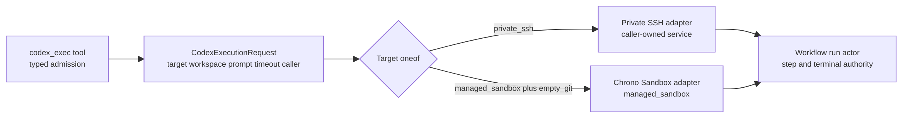
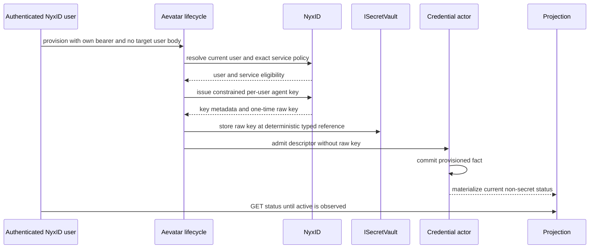
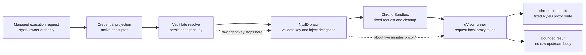

# Managed Codex：把执行、调用凭证与 Sandbox 委托拆成三层

> 版本与结论：本章是 `mixed`。冻结代码已经落地 runtime-neutral `codex_exec` contract、Aevatar 自有的 per-user credential actor/Vault lifecycle，以及经 NyxID 固定路由调用 Chrono Sandbox 的 adapter；内部 canary 当前仍依赖长期 per-user agent key、可变的 UserService forwarding policy 与约五分钟 `proxy:*` delegation。它只适合显式 allowlist 的内部用户，不能描述为面向所有 workflow 用户的安全通用执行面。

## 设计抽象与事实源

- `src/Aevatar.AI.Abstractions/CodexExecution/codex_execution.proto:7-27`、`src/Aevatar.AI.Abstractions/CodexExecution/ICodexExecutionPort.cs:3-90`：typed target/workspace、runtime-neutral port、lifecycle event与稳定failure contract。
- `src/Aevatar.AI.Infrastructure.ChronoSandbox/ChronoSandboxCodexExecutionAdapter.cs:26-95`、`src/Aevatar.AI.Infrastructure.ChronoSandbox/NyxIdChronoSandboxCodexClient.cs:31-100`：managed target adapter、Vault late resolution、固定NyxID proxy request与sanitized terminal mapping。
- `docs/canon/managed-codex-execution.md:16-115`：Aevatar、NyxID、Chrono Sandbox、operations之间的所有权、当前gVisor/direct-token选择与延期安全边界。

这里按 runtime-neutral contract、managed adapter、治理边界三个设计面分组；前两项分别成对列出 wire/port 与 adapter/client，因此共有五条路径。它们只属于事实源清单，不构成正文骨架。

## 一个业务入口，两种基础设施 Target

`codex_exec` 的业务输入不是“给我一段shell和一个容器配置”。`CodexExecutionTarget` 是 `private_ssh | managed_sandbox` 的 `oneof`；workspace也是独立 `oneof`，当前managed target只接受 `empty_git`。调用者提供prompt和timeout，但不能选runner image、sandbox runtime、provider URL、credential、shell flags、任意repository、NyxID slug/route或header。



为什么把target做成typed port，而不是让workflow直接调用Chrono HTTP？workflow需要稳定的是started/output/completed/failed语义与typed failure，不是provider route。adapter拥有transport与isolation细节，workflow run actor仍拥有step lifecycle和终态；以后替换managed runtime不会改变YAML工具参数或把基础设施异常变成业务协议。

为什么不开放任意container spec？Codex执行本身就是高权限边界。让模型选择image、command、network或credential会把“数据输入”升级成“基础设施控制面”。当前contract刻意把可变面压到prompt与bounded timeout，runner与隔离由Chrono部署固定。

## Aevatar Credential：调用 NyxID，不进入 Sandbox

managed路径不是拿interactive workflow bearer直接访问Chrono。用户以自己的NyxID bearer做authenticated self-service，lifecycle再调用`/users/me`核对body无法指定的current user；provision/rotate时解析该用户唯一、active、personal的`chrono-sandbox` UserService，并检查：

- `forward_access_token=false`；
- `inject_delegation_token=true`；
- 冻结内部canary要求`delegation_token_scope=proxy:*`；
- readiness中存在唯一可用的`chrono-llm-public` route。

随后Aevatar为该用户签发一把有限期agent key。它只有`proxy` scope、`allow_all_services=false`、只允许该用户精确的`chrono-sandbox` UserService ID、无node grant。raw key唯一持久副本进入`ISecretVault`；actor event/read model/API只保存key ID、expiry、service ID与typed `SecretReference`。



mutation response是accepted receipt，不是actor commit或projection完成。生产用Garnet distributed lease串行化同一owner的provision/rotate/revoke；rotation用新Vault reference并以previous key ID做CAS，不能覆盖当前descriptor指向的secret。revocation把NyxID key与Vault删除作为独立cleanup track记录并重试。

为什么不把raw key写进actor state再“加密一下”？actor event与projection天然复制、重放和导出；一旦secret进入事实流，删除一个store不能撤回历史副本。Vault专门拥有secret material，actor只拥有可审计lifecycle facts，这与 [09/04](../09/04-vault-reference-and-revocation-compensation.md) 的typed locator和双轨补偿是一套边界。

## 一次执行：Persistent Key 止于 NyxID，短委托进入 gVisor

执行时client先从credential projection读取active descriptor，核对owner、expiry、service slug、reference purpose/owner/version/fingerprint，再从Vault late-resolve raw key。随后只发一条server-fixed请求：

```text
POST /api/v1/proxy/s/chrono-sandbox/codex/execute?_nyxid_via=<exact-user-service-id>
Authorization: Bearer <vault-resolved-agent-key>

{"prompt":"...","timeout_secs":180,"workspace":"empty_git"}
```

`_nyxid_via` 由committed descriptor给出，不让slug auto-resolution选中同名继承service。Aevatar不把agent key放进JSON body；NyxID验证它后，按UserService policy不转发caller credential，而是注入约五分钟`proxy:*` delegation。Chrono在创建sandbox前验证delegation，并通过execd native environment map只给该次Codex进程设置`NYXID_LLM_TOKEN`。



当前隔离选择是gVisor tenant，Codex inner sandbox关闭；没有Landlock preflight、sandbox-side credential vault、placeholder substitution或TLS-intercepting credential proxy。delegation token直接进入run-local environment，operations用IP级Kubernetes NetworkPolicy限制egress。这个选择用更强escape isolation和更少moving parts，交换掉了FQDN级egress与token hiding；它不是“凭证永不进入sandbox”，而是“只有短期委托进入，长期key不进入”。

## Failure Contract 与 Kill Switch

adapter总是先产出`Started`，再收敛到一个`Completed`或`Failed`。功能关闭返回`managed_target_disabled`；caller identity、credential descriptor/Vault resolve、proxy response shape、response size、timeout、cancellation分别映射稳定failure code。raw upstream body和基础设施exception text既不返回给workflow，也不写日志。

`Enabled=false` 是全局kill switch：阻止managed execution、provision与rotation，但保留status和revoke，使operator可以先停止新风险再回收已发key。它不影响private SSH target，因为两种target共享业务contract，不共享transport、credential或isolation。

为什么status/revoke不能随kill switch一起关？如果回滚同时关掉回收面，最需要撤销credential时反而只能手工碰外部系统。kill switch停止新增和使用，read/cleanup保持可用，才是可逆运营边界。

## 最小静态检查

```bash
set -euo pipefail

src="$AEVATAR_SRC"
proto="$src/src/Aevatar.AI.Abstractions/CodexExecution/codex_execution.proto"
client="$src/src/Aevatar.AI.Infrastructure.ChronoSandbox/NyxIdChronoSandboxCodexClient.cs"
policy="$src/src/Aevatar.AI.Application.CodexExecution/ManagedCodex/ManagedCodexNyxIdCatalogResolver.cs"

rg -Fq 'CodexManagedSandboxTarget managed_sandbox' "$proto"
rg -Fq 'CodexEmptyGitWorkspace empty_git' "$proto"
rg -Fq 'workspace = "empty_git"' "$client"
rg -Fq 'CredentialSecretPurposes.ManagedCodexInvocationAgentKey' "$client"
rg -Fq 'ForwardAccessToken != false' "$policy"
rg -Fq 'DelegationTokenScope, "proxy:*"' "$policy"

printf 'managed-codex-contract: verified-static\n'
```

> Demo status：`verified-static`（本轮执行了等价contract断言，并核对port、tool admission、credential lifecycle、Vault client、Chrono adapter、canon/ADR与冻结tests；没有签发真实key、调用NyxID、创建sandbox或宣称production E2E）。

## 边界与演进

冻结E1足以证明#2896的Vault-backed per-user credential lifecycle与#2897的Chrono/NyxID delegation adapter已经落地。#2783则只证明Ornn sample/setup skill发布与其readiness验证；它**不证明**某个allowlisted账号已经从workflow穿过Aevatar、NyxID、Chrono到runner完成`managed_sandbox` E2E。

仍开放的门槛必须逐项保留：

- **#2782 / #2881**：`ProvisioningAllowedNyxIdUserIds` 是内部P0静态allowlist，不是由authority、service ownership和broker capability共同决定的typed eligibility policy；不能推广到所有workflow用户。
- **#2784**：缺绑定具体账号、版本、环境和cleanup的managed-sandbox workflow E2E证明；private SSH成功或独立Chrono smoke都不能替代。
- **#2786**：operations必须提供gVisor、quota、resource/cancellation/cleanup与IP级egress边界；Mainnet默认disabled。
- **#2898**：部署与internal canary仍是版本化运维证据任务，代码landed不等于production ready。
- **#2899**：persistent agent key、mutable non-forwarding policy与约五分钟`proxy:*` wide delegation只对显式可信内部canary接受。广泛发布前必须换成短期caller capability、不可变或request-level fail-closed的non-forwarding，以及限定到`chrono-llm-public`的service-specific scope。

这些缺口登记到 [12/05](../12/05-open-gaps-and-canon-drift.md)。`proxy:*` 不是“约等于LLM-only”；在有效期内，恶意runner可调用该用户可访问的其他NyxID REST proxy service。gVisor降低sandbox escape风险，不消除delegation过宽风险。

## 读完应能回答

1. 为什么workflow只依赖`ICodexExecutionPort`，而不直接依赖Chrono/OpenSandbox？
2. persistent agent key、interactive bearer和short-lived delegation分别在哪里终止？
3. actor state为什么只保存typed reference和cleanup facts，而不保存raw key？
4. gVisor direct-token选择增强了什么，又主动放弃了哪些保证？
5. 为什么#2783不能作为managed-sandbox E2E canary，广泛发布还被哪些issue阻断？

<details>
<summary>论断—冻结证据映射</summary>

| 论断 | 冻结证据 |
|---|---|
| port只暴露target kind和typed lifecycle，workflow run保留终态所有权 | `src/Aevatar.AI.Abstractions/CodexExecution/ICodexExecutionPort.cs:3-90` |
| managed target只接受empty_git且调用者不能提供infra控制面 | `src/Aevatar.AI.Abstractions/CodexExecution/codex_execution.proto:7-27`；`src/Aevatar.AI.ToolProviders.NyxId/Tools/NyxIdCodexExecTool.cs:104-131`、`:277-307` |
| feature默认关闭，开启时必须配置显式内部user allowlist | `src/Aevatar.AI.Application.CodexExecution/ManagedCodex/ManagedCodexOptions.cs:5-55` |
| eligibility要求唯一personal sandbox service、delegation policy与LLM route readiness | `src/Aevatar.AI.Application.CodexExecution/ManagedCodex/ManagedCodexNyxIdCatalogResolver.cs:5-68` |
| self-service identity必须与NyxID current user一致，allowlist不命中则拒绝 | `src/Aevatar.AI.Application.CodexExecution/ManagedCodex/ManagedCodexCredentialLifecycle.cs:449-469` |
| key签发使用proxy scope、单service grant、无allow-all | `src/Aevatar.AI.Application.CodexExecution/ManagedCodex/ManagedCodexCredentialLifecycle.cs:501-510` |
| raw key late-resolve后只做固定proxy request，response按上限检查 | `src/Aevatar.AI.Infrastructure.ChronoSandbox/NyxIdChronoSandboxCodexClient.cs:31-100` |
| actor拥有descriptor与独立NyxID/Vault cleanup tracks，projection是非secret query | `agents/Aevatar.GAgents.Channel.Identity/ManagedCodex/ManagedCodexCredentialGAgent.cs:14-210`；`agents/Aevatar.GAgents.Channel.Identity.Abstractions/ManagedCodex/IManagedCodexCredentialPorts.cs:6-63` |
| gVisor直接注入五分钟proxy:*，无sandbox Vault/Landlock/credential proxy | `docs/adr/0044-managed-codex-gvisor-direct-token.md:19-84` |
| internal canary仍受allowlist、mutable policy与wide delegation限制 | `docs/canon/managed-codex-execution.md:111-115`；`docs/operations/2026-07-16-managed-codex-exec-rollout.md:1-46` |

</details>
