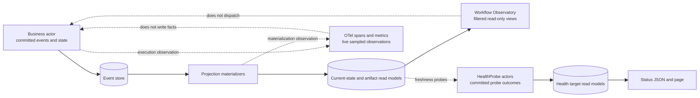
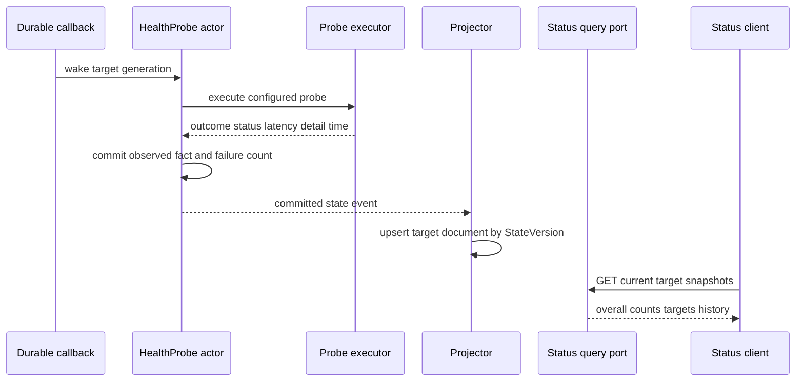
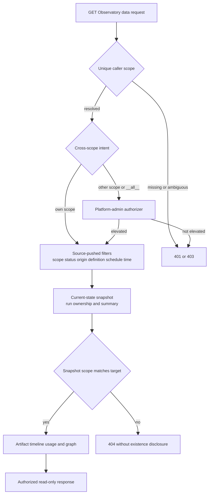

# Observability、Status 与 Observatory：观测事实，不接管业务事实

> 版本与结论：本章描述冻结基线的 `current` 观测模型。OTel trace/metric记录进程内刚发生的信号；Status把周期probe outcome提交到独立HealthProbe actor并投影成依赖健康快照；Workflow Observatory只读current-state与artifact read model，为有权限的调用者组织run列表、timeline、graph与diagnostics。三者都帮助回答“系统发生了什么、现在能否服务、已投影出什么”，但都不取代业务actor的event/state事实所有权。

## 设计抽象与事实源

- `docs/canon/observability.md:9-45`、`:253-356`：`Aevatar.Agents` / `Aevatar.GenAI` 信号面、sampling与infallible emission边界。
- `src/Aevatar.Mainnet.Host.Api/Status/StatusEndpoints.cs:31-126`、`:153-248`：Status只读已投影probe targets，执行severity roll-up、history与availability计算。
- `src/workflow/Aevatar.Workflow.Infrastructure/CapabilityApi/WorkflowRunObservatoryEndpoints.cs:15-137`、`:149-388`：GET-only查询面、own-scope默认路径、platform-admin跨scope支路与审计边界。

## 四个问题，四个不同答案

把所有“看系统”的能力统称为监控，会把时效性、权威性和授权混在一起。冻结设计实际有四个不同层次：

| 面 | 回答的问题 | 数据寿命与权威性 | 典型消费者 |
|---|---|---|---|
| OTel live signals | 刚才哪一段执行慢、失败或被调用？ | 可采样、可丢；是观察，不是业务事实 | collector、Jaeger/Tempo、metrics backend |
| Status probes | 某依赖最近是否可达/新鲜，连续失败多少次？ | HealthProbe actor拥有probe outcome事实；不拥有被测系统真相 | `/api/status`、`/status` |
| Canonical read models | committed actor事实当前投影成什么？ | 可重建、最终一致，以`StateVersion`标识进度 | API、查询service、repair工具 |
| Observatory | 有权限的读者怎样定位和解释某次run？ | 只组合read models，不dispatch、不修状态 | operator、开发者、support |



为什么不是一套万能dashboard？OTel为高吞吐诊断而允许sampling；read model为可查询业务状态而接受projection lag；probe为可运营health verdict而主动简化被测系统；Observatory还必须执行scope授权。把它们合并成一个store，任何一个取舍都会污染其他用途。

## OTel：低耦合的实时信号

`Aevatar.Agents` 承载actor event handling、spawn/deactivate/link、projection materialize、readmodel write、workflow run与channel pipeline等activity；`Aevatar.GenAI` 承载LLM/tool spans与token/duration metrics。Host把这些source/meter接入OpenTelemetry pipeline，exporter与sampler由部署选择。

OTel emission必须对业务路径infallible：typed helper集中创建activity/tag，安全设置失败不能反向让actor handler或projection失败。local listener可用bounded channel并在满时drop-oldest，宁可少一帧诊断，也不把telemetry backpressure传给业务。

这直接限定了证据强度：看到span能证明某版本的某次路径被观察到；没看到span不能单独证明路径没执行，因为它可能未采样、listener未接入或信号已丢。`aevatar.projection.state.version` 是观测到的projection版本tag，不是trace系统拥有的版本。

为什么不用OTel span恢复workflow？span命名、sampling和retention为诊断服务，不提供event expected-version、幂等command或完整replay。用trace恢复业务会把一个可丢channel误升为事实源。

## Status：Probe Outcome 的 Actor 化

Status不是每次`GET /api/status`都同步戳一遍所有依赖。manifest为每个target建立HealthProbe actor；callback触发executor后，actor提交`HealthProbeObserved`，维护last outcome、consecutive failures与bounded recent outcomes，再由projector写`HealthProbeTargetDocument`。页面和JSON endpoint只通过`IHealthStatusQueryPort`读取这些投影。



roll-up只统计enabled且known的target。critical target为`down`才把overall置为`down`；非critical down或任何degraded把overall置为`degraded`；unknown不把未配置canary强行染红。availability只在最近最多120个样本中的known outcome上计算，当前snapshot没有history时才用last outcome补一个样本。

这个模型避免慢依赖拖住status request，也保留连续失败与历史。但“probe ok”只表示该探针在某个时间按某个检查通过，不证明一次业务交易完成；“unknown”也不是healthy。operator必须同时看`last_check_at`、probe kind、target severity与projection freshness。

## Observatory：授权之后才组合 Read Models

Observatory页面与OIDC callback可以匿名加载静态asset；`/api/workflow/observatory/*` 数据面全部GET-only并要求bearer。普通调用者的scope隐式来自唯一canonical claim，列表查询把scope、status、origin、definition、schedule、from/to与take下推到projection store，在bounded take之前过滤。

单run查询先读取scope-stamped current-state snapshot。snapshot缺失或scope与caller不匹配都返回`404`，随后才读取run report、timeline、usage或graph artifact；这避免用状态码泄露其他scope的run是否存在。artifact尚未materialize时，detail可以退化为current-state summary和空timeline，而不是伪造“没有步骤”。



跨scope不是在query service里偷加一个bool。endpoint先用`IPlatformAdminAuthorizer`验证调用者自己的bearer；通过后才调用单独的`IWorkflowRunAdminQueryService`，支持`scope=__all__`或仅知道run ID时的admin drilldown。query service本身不读`HttpContext`、不做身份解析，也不依赖actor dispatch/runtime。

为什么把authorization留在endpoint？query contract可被多个host调用，若内部偷偷读取ambient principal，测试和batch caller都会得到隐式行为。endpoint拥有HTTP身份与审计，service只接受已经确定的scope并执行纯查询，边界更可审计。

Studio或Automation页面可以生成带schedule/definition/run筛选的Observatory deep link，但URL参数只是导航意图。server仍重新解析caller scope和platform-admin grant，不能因为链接来自“可信页面”而跳过授权。

## 观测到的不等于已经完成

常见误读需要逐项拆开：

- HTTP`202 Accepted` 只证明command admission，不证明actor commit或read model可见。
- OTel handler span成功，不证明其后projection、delivery或外部effect已完成。
- Status target为ok，不证明特定workflow run成功；它只证明探针契约通过。
- Observatory timeline来自committed artifact projection，比session-only流更强，但仍可能落后于actor最新commit。
- graph与timeline是同一run事实的不同read projection，不应互相补写或各自成为第二事实源。

因此排障顺序通常是：先看Status确认依赖与projection freshness，再用Observatory定位run和`StateVersion`，最后用OTel correlation查延迟/错误路径；若读侧落后，走显式repair/replay，不在页面里直接改业务状态。

## 最小静态检查

```bash
set -euo pipefail

src="$AEVATAR_SRC"
status_file="$src/src/Aevatar.Mainnet.Host.Api/Status/StatusEndpoints.cs"
observatory="$src/src/workflow/Aevatar.Workflow.Infrastructure/CapabilityApi/WorkflowRunObservatoryEndpoints.cs"
query="$src/src/workflow/Aevatar.Workflow.Application/Observatory/WorkflowRunObservatoryQueryService.cs"

rg -Fq 'IHealthStatusQueryPort port' "$status_file"
rg -Fq 'if (criticalDown) return "down"' "$status_file"
rg -Fq '.RequireAuthorization()' "$observatory"
rg -Fq 'AevatarScopeAccessGuard.TryGetCallerScopeId' "$observatory"
rg -Fq 'return detail == null ? Results.NotFound()' "$observatory"
rg -Fq 'BuildListQuery(filter, take, normalizedScopeId)' "$query"

printf 'observation-boundaries: verified-static\n'
```

> Demo status：`verified-static`（本轮执行了等价边界断言，并核对OTel source/meter、HealthProbe actor/projection、Status roll-up、Observatory endpoint/query与冻结tests；未连接collector、未运行live probe、未登录Observatory）。

## 边界与演进

- OTel tag多数仍是experimental；consumer不能把名称当永久schema，稳定项也必须走deprecation周期。
- `/api/status` 与页面当前匿名可读，内容必须保持operational summary，不能把credential、raw upstream response或跨scope业务数据塞进detail。
- Observatory跨scope依赖 [10/05](05-authentication-scope-and-admin-authorization.md) 的platform-admin authorizer；`scope=__all__` 本身从不授予权限。
- Issue #2611 已把backend console页面拆成checked-in embedded assets并由Host注入必要配置；页面组织落地不提升其中数据的证据等级。
- 旧Observatory/read-side事故、索引漂移和repair教训统一迁入 [12/04](../12/04-incident-case-studies.md)，不能在本章把“有repair”写成“不会漂移”。

## 读完应能回答

1. OTel、Status、canonical read model与Observatory各自回答什么问题？
2. 为什么Status endpoint不应在请求内同步探测所有依赖？
3. 普通调用者查询别的scope run时为什么统一得到404，而不是暴露存在性？
4. `scope=__all__` 与platform-admin grant是什么关系？
5. 为什么观测面能辅助repair，却不能直接成为业务事实所有者？

<details>
<summary>论断—冻结证据映射</summary>

| 论断 | 冻结证据 |
|---|---|
| Host收集Aevatar activity source/meters，sampler/exporter不改变业务事实 | `src/workflow/Aevatar.Workflow.Host.Api/ObservabilityExtensions.cs:13-62`；`docs/canon/observability.md:253-356` |
| typed OTel helper集中activity/tag并安全设置状态 | `src/Aevatar.Foundation.Abstractions/Observability/AevatarActivitySource.cs:11-245` |
| HealthProbe actor提交outcome、连续失败和bounded history | `agents/Aevatar.GAgents.StatusDashboard/HealthProbeTargetGAgent.cs:26-139`、`:348-426` |
| projector只从committed state event生成HealthProbeTargetDocument | `agents/Aevatar.GAgents.StatusDashboard/HealthProbeTargetProjector.cs:11-77` |
| Status只读query port，unknown不参与overall且critical down才整体down | `src/Aevatar.Mainnet.Host.Api/Status/StatusEndpoints.cs:31-126` |
| Observatory数据端点GET-only且要求authorization，跨scope先走admin gate | `src/workflow/Aevatar.Workflow.Infrastructure/CapabilityApi/WorkflowRunObservatoryEndpoints.cs:15-137`、`:171-388` |
| list filter在bounded take前下推，own-scope mismatch统一返回null | `src/workflow/Aevatar.Workflow.Application/Observatory/WorkflowRunObservatoryQueryService.cs:33-84`、`:109-137`、`:255-284` |
| detail与graph只组合current-state/artifact query ports，无dispatch/runtime | `src/workflow/Aevatar.Workflow.Application/Observatory/WorkflowRunObservatoryQueryService.cs:9-31`、`:139-253` |
| admin查询是独立窄contract且要求endpoint预先授权 | `src/workflow/Aevatar.Workflow.Application.Abstractions/Observatory/IWorkflowRunAdminQueryService.cs:3-31` |

</details>
