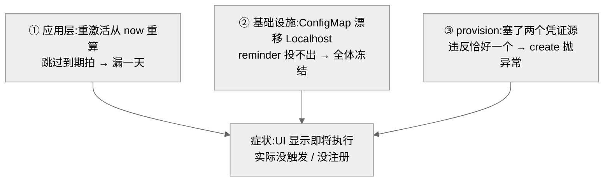
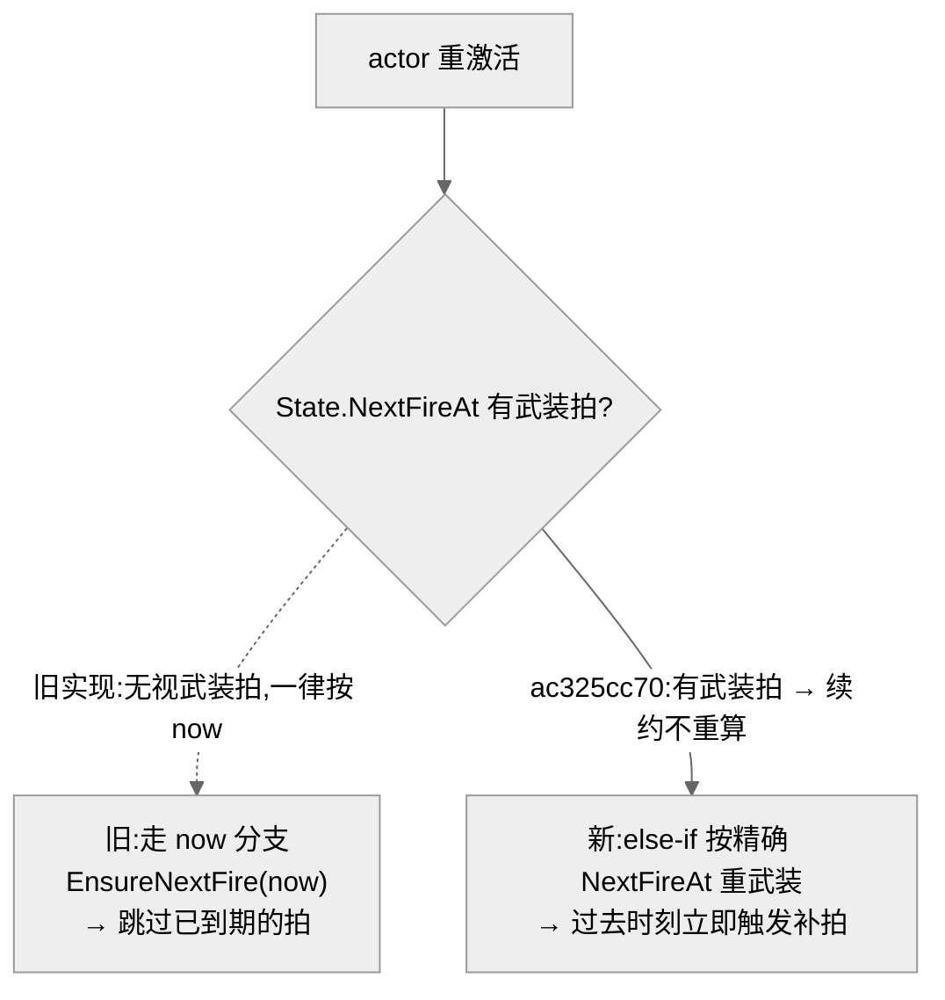
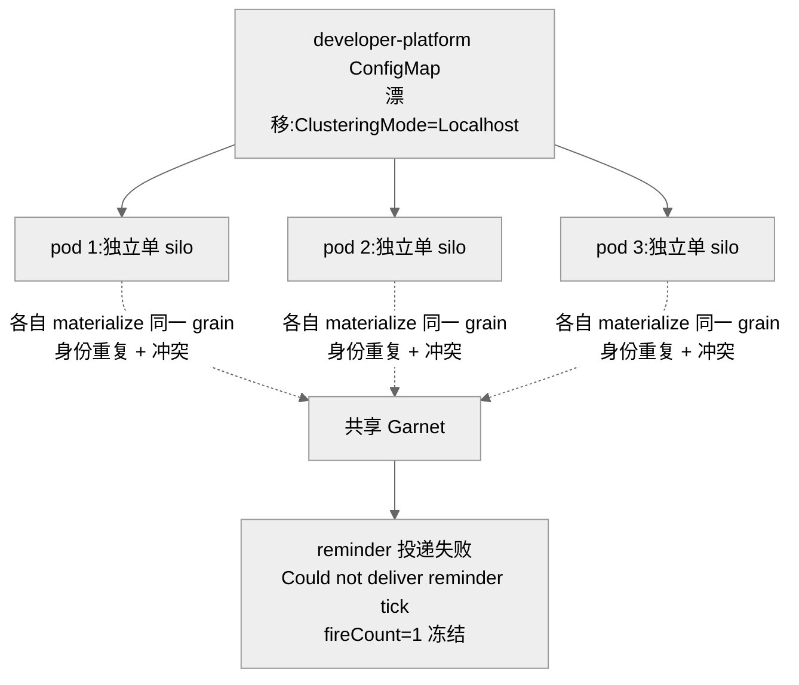

# 定时任务「为什么不触发」:重激活跳拍 / 脑裂冻结 / provision 凭证缺口

## 事实源/设计抽象(以 ~/Code/aevatar 为准)

> 现象:本周三类"定时任务到点不触发"。① 一个每天 18:25(Asia/Shanghai)的关灯任务漏了一拍;② 一大批 cron"看着即将执行、实则永不执行";③ studio 一句话 provision 定时任务,最后注册失败。三者根因分属**应用层 / 基础设施 / provision** 三个不同的层 —— 同一个"没触发"的表象,排查方法完全不同。
>
> **这是什么机制**:单个定时任务由 `ScheduledDispatchGAgent`(单线程事件溯源 actor)拥有权威状态,"下一拍触发"用一对状态字段表达 —— `NextFireAt`(已武装的回调)+ `PendingNextFireAt`(尚未武装的意图),靠 Orleans Reminder 落地的 **durable self-callback** 推进(见 [07/12](../07/12-scheduled-tasks.md))。
>
> 事实源脊柱(职责,非正文骨架):
>
> - `src/platform/Aevatar.GAgentService.Core/Schedules/ScheduledDispatchGAgent.cs` —— 单个定时任务的权威 actor:OnActivate 下一拍计算、`NextFireAt`/`PendingNextFireAt`/`FireCount` 状态机、fire/dispatch/幂等。
> - `src/platform/Aevatar.GAgentService.Abstractions/Schedules/ScheduledDispatchCalculator.cs` —— cron 计算抽象:tz-aware 的下一个 occurrence、`ComputeDueTime` 下限 1s(补漏拍即时触发的机制)。
> - `src/platform/Aevatar.GAgentService.Application/Schedules/ScheduledDispatchApplicationService.cs` —— 应用层 query/command 编排 + **"恰好一个凭证源"校验**。
> - `src/Aevatar.Studio.Application/Studio/Services/StudioWorkflowProvisioningService.cs` —— studio 一句话 provision:凭证持久性建模(`RunCredentialKind`)、`ResolveCron`。
> - `src/Aevatar.Foundation.Runtime.Implementations.Orleans/Grains/Callbacks/RuntimeCallbackSchedulerGrain.cs` —— durable self-callback 底座(`IRemindable`),定时触发最终落到 Orleans Reminder(解释 §2 的脆性)。
>
> 核对基线:`feature/integrate`(origin @ `7d3c5a782`)。**性质:① 跳拍 = 真 bug,已修部署(`ac325cc70`,含负向对照);② 脑裂 = 环境/配置根因,非代码,durable 修在门户;③ provision = 真 bug,已修部署(`625e64c7e`)。**

---

## 0. 一句话主线

> "没触发"有三种死法:① actor 在某拍触发时刻附近重激活,`OnActivateAsync` 从 `now` 重算下一拍,**把已到期的那拍静默跳过**;② Orleans membership 配置被部署漂移成 `Localhost`,每个 pod 退化成自己的单 silo,reminder 投不出去,所有 cron `fireCount=1` 后**冻结**;③ provision 时一次塞了**两个**凭证源,违反"恰好一个"校验,create 当场抛异常、零注册成功。

---

## 1. 应用层 —— 重激活时从 `now` 重算,跳过到期那拍(`ac325cc70`)

稳态下,某拍一旦武装完成,`PendingNextFireAt` 即被清空。于是 actor 重激活走 `OnActivateAsync` 的 `else` 分支 `EnsureNextFireScheduledAsync(now, …)` —— **从 `now` 重新计算下一个 occurrence**。

当 pod 在某拍触发时刻附近 churn、重激活恰好发生在 `State.NextFireAt`(到期点)之后,**那一拍被静默跳过**:`nextFireAt` 直接向前跳到再下一个 occurrence,`fireCount` 不变,无失败、无 run、无 error。日触发任务的表现就是"偶尔漏一天",且没有任何错误信号 —— 这正是关灯任务那一拍的死法。

修复(`ac325cc70`)加了一条 `else if (State.NextFireAt != null)` 分支:**若已有武装拍,按 `State.NextFireAt` 的精确时间重新武装,而不是按 `now` 重算**。重武装一个过去时刻会立即触发(`ComputeDueTime` 下限 1s)把漏拍补上,fire handler 再正常推进到下一个 occurrence;`now`-based 路径只在真正首次激活(无任何武装)时走。

!!! note "负向对照已做"
    `ac325cc70` 带回归测试,且**撤掉修复 → 回归测试以生产症状(漏拍)失败 → 恢复绿**,证明修在点子上。注意有一个**同名诱饵** `f2b7ac44d`(早 31 分钟的本地变体)未上 origin,引用时别认错。本地工作树 HEAD 缺这条修复(陈旧分叉),但**部署线 origin 已含**。

## 2. 基础设施 —— Orleans/Garnet 脑裂使 reminder 永不投递(`#2224`,配置非代码)

这是**部署边界**问题,不是 actor 设计问题。仓库 `appsettings.Distributed.json` 正确写着 `Orleans:ClusteringMode=Garnet`、`SiloHost=""`(自发现),且 `OrleansPersistenceBackend=Garnet` → C# 代码据此走 `UseRedisReminderService(garnet)`。**代码与默认值都对。**

线上事故是 developer-platform 门户管理的 K8s ConfigMap 把这两个值**漂移**成 `Localhost` + `127.0.0.1`:每个 pod 退化成自己的单 silo 共享同一 Garnet → reminder 投递报 `Could not deliver reminder tick`、`SocketException(99) localhost:8080`、ETag 冲突 → 大批 cron `fireCount=1` 后 `nextFireAt` 冻结,"看着即将执行、实则永不触发"。

!!! warning "durable 修复只能改门户配置源,别 kubectl patch"
    `kubectl patch` ConfigMap 会被下次部署还原 = 打地鼠。durable 修复必须改 developer-platform 门户的 per-service 配置源(见 [06/04](../06/04-garnet-clustering.md) 与本仓库对该事故的环境记录)。仓库代码无需改 —— 身份确定性 + 同底座 + 脑裂下的 N 重触发,是 membership 配置被覆盖的后果,不是代码缺陷。

## 3. provision —— 凭证源数量违反"恰好一个"(`625e64c7e`)

scheduled-dispatch 的 service-invocation auth 有一条强不变量:**恰好携带一个凭证源**(`NormalizeServiceInvocationAuth` 校验 `SenderNyxId + DurableSenderBearerToken + ScopeOwnerNyxId` 三者中**有且仅有一个**,否则 create 时 `throw ArgumentException`)。

Bug:studio 一句话 provision 时,`BuildScheduleAuthAsync` **同时塞了 `SenderNyxId` 和 `DurableSenderBearerToken`**(和数 = 2),create 当场抛 auth 异常,agent 反复对 ~10 个 member 重试且**零 schedule 注册成功**。

修复(`625e64c7e`)把凭证持久性建模为强类型 `RunCredentialKind`(`None / MintedDurable / ForwardedEphemeral`),由 `ResolveCron` 拥有"周期 vs 一次性"判定并喂给凭证选择,使其按 schedule 生命周期选**单一**源:可 re-mint 的 `SenderNyxId` subject ref(周期任务每拍重新铸 token,是 recurring monitor 唯一诚实的源)、或 minted durable key、或 forwarded session token(**仅**一次性 demo)。**短命的 forwarded token 绝不钉到 recurring monitor 上。**

!!! note "对记忆的更正"
    此前记忆把 (c) 记成"CredentialRole 只填一种 token" —— 实际真相是**填了两种**,违反"恰好一个";修复后才回到单一源。`RunCredentialKind` / `ResolveCron` 的强类型化才是修复核心,不只是改个赋值。另:此前"`/api/schedules` 不暴露 `scheduleKind`"的盲点也已闭环(`18bbae8c3` 起读模型带 `ScheduleKind`,origin 今日 tip `#2381` 进一步从 service target 推断 kind)。

## 4. 影响面 / 性质 / 教训

| 子问题 | 性质 | 影响面 | 修复 |
|---|---|---|---|
| ① 重激活跳拍 | 真 bug·已修部署 | 边界条件:pod 在触发时刻附近 churn 才漏,无错误信号 | `ac325cc70`(含负向对照) |
| ② 脑裂冻结 | 环境/配置·非代码 | 全局:一次漂移使所有 cron 集体冻结,最隐蔽 | 门户 per-service 配置源(非仓库) |
| ③ provision 凭证 | 真 bug·已修部署 | 仅 studio 一句话 provision 路径,硬失败非静默 | `625e64c7e` |

**教训:**

1. **重激活不能丢已武装的到期拍**:武装拍是权威事实,重激活只能**按其精确时刻续约**,不能用 `now` 覆盖。这是 actor 生命周期(`OnActivate`)与业务状态机交界处最易踩的不变量。
2. **reminder 投递的身份确定性是配置不变量,不是代码不变量**:定时触发靠 Orleans Reminder(确定性 grain 身份 + 共享 membership 表);一旦 membership 配置被覆盖成 per-pod 单 silo,确定性身份在多个隔离 silo 上被重复 materialize,触发既冲突又丢失。排查"全体不触发"先看 membership 配置,别只盯应用代码。
3. **凭证源要"恰好一个"且匹配 schedule 生命周期**:周期任务只接受可 re-mint 或 durable 的源,短命 forwarded token 仅限一次性 —— 把凭证持久性建成强类型,比在赋值处堆 if 更能堵住"塞多了/塞错了"。

## 关联章节

- [07/12 定时任务全链路](../07/12-scheduled-tasks.md) —— 调度、saga 挂起与可靠触发机制。
- [06/04 Garnet 聚类](../06/04-garnet-clustering.md) —— 共享 Garnet 成员资格,§2 脑裂的底座。
- [10/08 观测台读侧](08-observatory-read-side.md) —— 定时任务的 run 在观测台怎么看。
