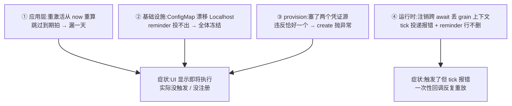
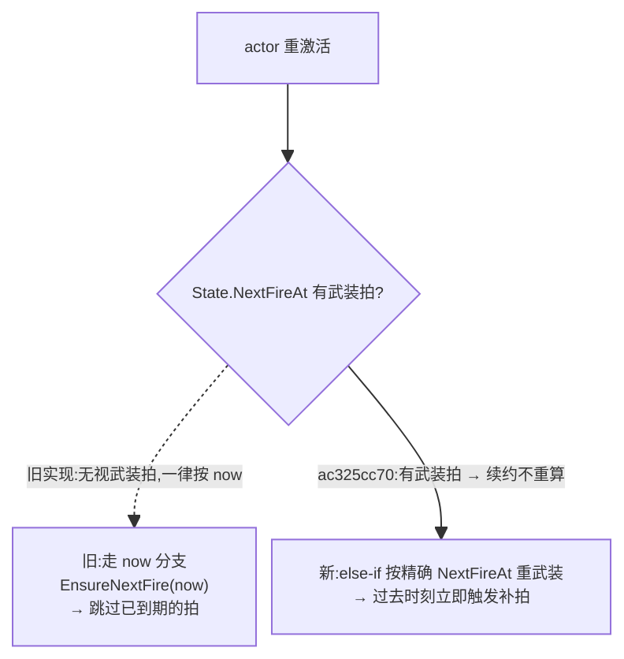
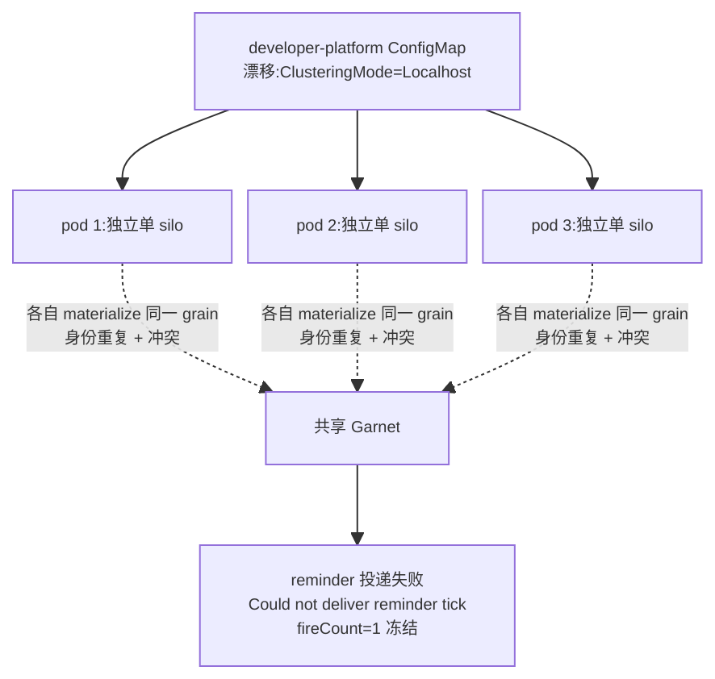
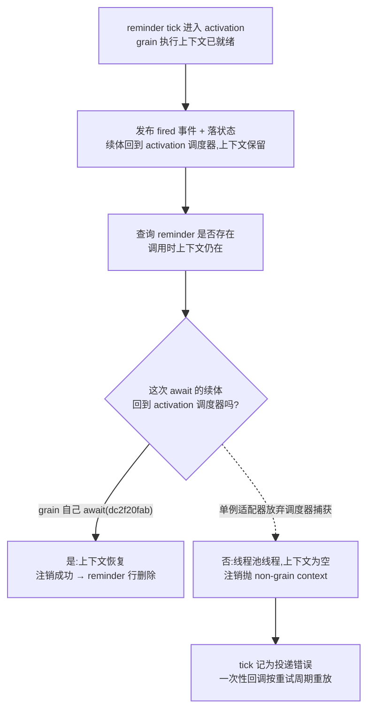

# 定时任务「为什么不触发」:重激活跳拍 / 脑裂冻结 / 历史 provision 凭证冲突 / reminder 收尾丢上下文

## 事实源/设计抽象(以 ~/Code/aevatar 为准)

> 现象:历史上暴露过四类"定时任务到点不触发"。① 一个每天 18:25(Asia/Shanghai)的关灯任务漏了一拍;② 一大批 cron"看着即将执行、实则永不执行";③ studio 一句话 provision 定时任务,最后注册失败;④ 一次性回调触发后**收尾注销失败**,tick 被 Orleans 记为投递错误、物理 reminder 行不删除。四者根因分属**应用层 / 基础设施 / provision / 运行时执行上下文**四个不同的层 —— 同一个"没触发"的表象,排查方法完全不同。
>
> **这是什么机制**:单个定时任务由 `ScheduledDispatchGAgent`(单线程事件溯源 actor)拥有权威状态,"下一拍触发"用一对状态字段表达 —— `NextFireAt`(已武装的回调)+ `PendingNextFireAt`(尚未武装的意图),靠 Orleans Reminder 落地的 **durable self-callback** 推进(见 [07/12](../07/12-scheduled-tasks.md))。
>
> 事实源脊柱(职责,非正文骨架):
>
> - `src/platform/Aevatar.GAgentService.Core/Schedules/ScheduledDispatchGAgent.cs` —— 单个定时任务的权威 actor:OnActivate 下一拍计算、`NextFireAt`/`PendingNextFireAt`/`FireCount` 状态机、fire/dispatch/幂等。
> - `src/platform/Aevatar.GAgentService.Abstractions/Schedules/ScheduledDispatchCalculator.cs` —— cron 计算抽象:tz-aware 的下一个 occurrence、`ComputeDueTime` 下限 1s(补漏拍即时触发的机制)。
> - `src/platform/Aevatar.GAgentService.Application/Schedules/ScheduledDispatchApplicationService.cs` —— 应用层 query/command 编排 + **"恰好一个凭证源"校验**。
> - `src/Aevatar.Studio.Application/Studio/Services/StudioWorkflowProvisioningService.cs` —— 当前 one-call provision 只构造 `SenderNyxId` subject;canonical Member Automation 是独立 Agent Key surface。
> - `src/Aevatar.Foundation.Runtime.Implementations.Orleans/Grains/Callbacks/RuntimeCallbackSchedulerGrain.cs` —— durable self-callback 底座(`IRemindable`),定时触发最终落到 Orleans Reminder(解释 §2 的脆性)。
>
> 原事故核对基线:`feature/integrate`(origin @ `7d3c5a782`);④ 的核对基线为 origin @ `dc2f20fab`。**性质:① 跳拍 = 真 bug,已修部署(`ac325cc70`,含负向对照);② 脑裂 = 环境/配置根因,非代码,durable 修在门户;③ provision 双凭证 = 历史真 bug,其修复模型后来又被当前 typed credential contract 取代;④ 上下文丢失 = 真 bug,已修部署(`dc2f20fab`,含真 reminder tick 的负向对照)。**

---

## 0. 一句话主线

> "没触发"有四种死法:① actor 在某拍触发时刻附近重激活,`OnActivateAsync` 从 `now` 重算下一拍,**把已到期的那拍静默跳过**;② Orleans membership 配置被部署漂移成 `Localhost`,每个 pod 退化成自己的单 silo,reminder 投不出去,所有 cron `fireCount=1` 后**冻结**;③ provision 时一次塞了**两个**凭证源,违反"恰好一个"校验,create 当场抛异常、零注册成功;④ 一次性回调**触发成功但收尾失败** —— 注销物理 reminder 的调用落在丢失 grain 执行上下文的线程上,Orleans 把整拍记为投递错误,reminder 行留存并按重试周期反复重放。

前三种是"这一拍没发生";第四种是"这一拍发生了,但没有正确结束"。区别很重要:④ 的 `fireCount` 会推进、业务事件会发出,只有 tick 收尾和物理清理失败,所以只盯 `fireCount`/`nextFireAt` 的排查会漏掉它。

---

## 1. 应用层 —— 重激活时从 `now` 重算,跳过到期那拍(`ac325cc70`)

稳态下,某拍一旦武装完成,`PendingNextFireAt` 即被清空。于是 actor 重激活走 `OnActivateAsync` 的 `else` 分支 `EnsureNextFireScheduledAsync(now, …)` —— **从 `now` 重新计算下一个 occurrence**。

当 pod 在某拍触发时刻附近 churn、重激活恰好发生在 `State.NextFireAt`(到期点)之后,**那一拍被静默跳过**:`nextFireAt` 直接向前跳到再下一个 occurrence,`fireCount` 不变,无失败、无 run、无 error。日触发任务的表现就是"偶尔漏一天",且没有任何错误信号 —— 这正是关灯任务那一拍的死法。

修复(`ac325cc70`)加了一条 `else if (State.NextFireAt != null)` 分支:**若已有武装拍,按 `State.NextFireAt` 的精确时间重新武装,而不是按 `now` 重算**。重武装一个过去时刻会立即触发(`ComputeDueTime` 下限 1s)把漏拍补上,fire handler 再正常推进到下一个 occurrence;`now`-based 路径只在真正首次激活(无任何武装)时走。

!!! note "负向对照已做"
    `ac325cc70` 带回归测试,且**撤掉修复 → 回归测试以生产症状(漏拍)失败 → 恢复绿**,证明修在点子上。注意有一个**同名诱饵** `f2b7ac44d`(早 31 分钟的本地变体)未上 origin,引用时别认错。当前文档事实基线 `4e0def2` 已包含 `ac325cc70`。

## 2. 基础设施 —— Orleans/Garnet 脑裂使 reminder 永不投递(`#2224`,配置非代码)

这是**部署边界**问题,不是 actor 设计问题。仓库 `appsettings.Distributed.json` 正确写着 `Orleans:ClusteringMode=Garnet`、`SiloHost=""`(自发现),且 `OrleansPersistenceBackend=Garnet` → C# 代码据此走 `UseRedisReminderService(garnet)`。**代码与默认值都对。**

线上事故是 developer-platform 门户管理的 K8s ConfigMap 把这两个值**漂移**成 `Localhost` + `127.0.0.1`:每个 pod 退化成自己的单 silo 共享同一 Garnet → reminder 投递报 `Could not deliver reminder tick`、`SocketException(99) localhost:8080`、ETag 冲突 → 大批 cron `fireCount=1` 后 `nextFireAt` 冻结,"看着即将执行、实则永不触发"。

!!! warning "durable 修复只能改门户配置源,别 kubectl patch"
    `kubectl patch` ConfigMap 会被下次部署还原 = 打地鼠。durable 修复必须改 developer-platform 门户的 per-service 配置源(见 [06/04](../06/04-garnet-clustering.md) 与本仓库对该事故的环境记录)。仓库代码无需改 —— 身份确定性 + 同底座 + 脑裂下的 N 重触发,是 membership 配置被覆盖的后果,不是代码缺陷。

## 3. 历史 provision —— 凭证源数量违反“恰好一个”(`625e64c7e`)

事故发生时,service-invocation auth 同时统计 `SenderNyxId + DurableSenderBearerToken + ScopeOwnerNyxId`,并要求**恰好一个凭证源**。

当时 studio 一句话 provision 的 `BuildScheduleAuthAsync` **同时塞了 `SenderNyxId` 和 `DurableSenderBearerToken`**(和数 = 2),create 当场抛 auth 异常,agent 反复对多个 member 重试且零 schedule 注册成功。

`625e64c7e` 当时用 `RunCredentialKind` 收敛为单一来源,解决了该版本的硬失败;但这不是当前 contract。现在 `durable_sender_bearer_token` 只作为历史事件读取字段保留,新写入被拒并 fail closed。当前 one-call `/provision-workflow` 只构造 `SenderNyxId`;每次 fire 由 dispatch 换一张短票,写入临时 `WorkflowCallerDurableBearerToken` Vault reference,再交给 workflow run 复用。canonical Team Member Automation 则使用 `scheduled_invocation_agent_key` typed locator。两条 surface 都满足单一 source,但授权生命周期不同。

!!! note "历史结论不能外推"
    “当时填了两种凭证”仍是该事故的准确根因;`RunCredentialKind` 只解释当时如何止血,不得再写成当前 provision 模型。当前边界见 [07/12](../07/12-scheduled-tasks.md) 与 [09/03/02](../09/03-provision-and-observe-via-nyxid/02-scheduled-agent-key-production-canary.md)。

## 4. 运行时 —— reminder 收尾跨 await 丢失 grain 执行上下文(`dc2f20fab`)

这一类和前三类都不同:**cron 触发了,业务事件也发出去了,失败的是这一拍的收尾。**

Orleans 的 reminder 注册表在每次调用前检查"当前线程是否正处在某个 grain 的执行上下文里"。这个上下文是**线程局部**的,不是随异步流传播的。它只在一种情况下被恢复:`await` 的续体被调度回该 activation 自己的任务调度器。一旦链路中某个 `await` 放弃了调度器捕获(典型是 `ConfigureAwait(false)`),续体就在普通线程池线程上恢复,上下文为空 —— **此后任何 reminder 调用都会以 `Attempted to access grain from a non-grain context` 抛出。**

一次性 timeout 触发时,scheduler actor 要顺序做三件事:发布 fired 事件 → 落状态 → 注销物理 reminder。注销本身又是**两次**需要上下文的调用(先查这个 reminder 在不在,再注销)。当这一对调用被放进一个**普通单例适配器**、并在两者之间 `await` 时,第一次调用成功、第二次落在已丢失上下文的线程上。结果是 Orleans 把整个 tick 记为投递错误,而物理 reminder 行**不会**被删除:一次性回调于是按重试周期反复重放。

### 为什么修法是删掉适配器,而不是只去掉 `ConfigureAwait(false)`

把那处 `ConfigureAwait(false)` 去掉确实能让这一条链路恢复正确 —— 这也是先落地的止血修。但它把正确性建立在一条**隐式约定**上:适配器仍是普通单例,任何调用方(后台服务、定时回调、线程池续体)都能拿到它并在非 grain 线程上调用,重新制造同一个 bug,而类型系统一句话都不会说。

让 grain 自己持有"查询 → `await` → 注销"这一对调用,约束就从约定变成**结构**:这些扩展方法只能在 grain 实例上调用,上下文所有权和业务所有权重合到同一个对象。这正是 CLAUDE.md 里"Actor 即业务实体""删除无效层""抽象一旦能被滥用即设计未完成"三条的直接后果 —— 适配器是一个 1:1 转发的空壳,它唯一的净效果就是把上下文所有权从 actor 手里拿走。

!!! note "负向对照做在真 reminder tick 上"
    旧测试**不可能**抓到这个 bug:测试用的流提供者直接返回已完成的任务,grain 里没有任何 `await` 会真正挂起,上下文因此永远不会丢。修复同时把测试改成贴近生产的形态 —— 流写入在 activation 调度器之外完成、跑真实 `LocalReminderService` 的整拍、用可控的 reminder 表观察物理行删除,并把 Orleans 记录的 non-grain-context 错误作为失败信号。把丢上下文的写法重新注入后测试变红(失败信号先到、reminder 行始终未删),恢复后 43/43 绿。

!!! warning "别把栈帧行号当镜像证据"
    这次排查最贵的一步不是根因,而是**证据归属**。事故栈里的行号指向注销调用,但那个行号只在**修复前**的文件里对得上;修复后同一调用上移了一行。一份被当作"修复无效"的生产栈,实际来自更早的镜像(revision 1102 = 修复前),而不是它被归属到的那次部署(revision 1103 = 已含修复)。结论:把生产栈归属到某次部署前,必须先用该 revision 的**镜像 tag**回到对应 commit 核对行号,而不是拿当前工作区的文件读行号。

## 5. 影响面 / 性质 / 教训

| 子问题 | 性质 | 影响面 | 修复 |
|---|---|---|---|
| ① 重激活跳拍 | 真 bug·已修部署 | 边界条件:pod 在触发时刻附近 churn 才漏,无错误信号 | `ac325cc70`(含负向对照) |
| ② 脑裂冻结 | 环境/配置·非代码 | 全局:一次漂移使所有 cron 集体冻结,最隐蔽 | 门户 per-service 配置源(非仓库) |
| ③ provision 双凭证 | 历史真 bug·已修,模型已被取代 | 当时的一句话 provision 路径,create 硬失败 | `625e64c7e`;当前 contract 见 07/12 |
| ④ 收尾丢 grain 上下文 | 真 bug·已修部署 | 所有走 durable self-callback 的一次性回调:tick 报错、reminder 行残留、按重试周期重放 | `dc2f20fab`(删适配器 + 真 tick 负向对照);止血前修 `58765ad3` |

**教训:**

1. **重激活不能丢已武装的到期拍**:武装拍是权威事实,重激活只能**按其精确时刻续约**,不能用 `now` 覆盖。这是 actor 生命周期(`OnActivate`)与业务状态机交界处最易踩的不变量。
2. **reminder 投递的身份确定性是配置不变量,不是代码不变量**:定时触发靠 Orleans Reminder(确定性 grain 身份 + 共享 membership 表);一旦 membership 配置被覆盖成 per-pod 单 silo,确定性身份在多个隔离 silo 上被重复 materialize,触发既冲突又丢失。排查"全体不触发"先看 membership 配置,别只盯应用代码。
3. **凭证源要“恰好一个”且匹配 owner contract**:one-call C1 的 fire-time subject exchange 与 canonical Member Automation 的 Agent Key 是隔离 surface;不能把 fire 后的临时 workflow credential projection 混成 schedule state 的 legacy durable bearer,也不能把其中一条的生产结论外推到另一条。
4. **需要运行时上下文的能力不能下放给普通单例**:reminder 注册表这类 API 的前置条件是"调用发生在某个 activation 的执行上下文里"。把它包一层单例适配器,并不会让调用更干净,只会把一个**运行时前置条件**变成没人检查的口头约定。这类能力应当留在 actor 自己身上 —— 让调用点和上下文所有者是同一个对象,滥用就变得不可表达。
5. **测试替身的异步形态本身就是覆盖面**:同步返回已完成任务的替身会让被测代码里的 `await` 全部退化成直线调用,于是任何"续体调度到哪儿"的 bug 都不可能被触发。凡是要覆盖执行上下文、调度器亲和性、重入顺序的测试,替身必须**真的挂起**。

## 关联章节

- [07/12 定时任务全链路](../07/12-scheduled-tasks.md) —— schedule actor、durable callback、Team Member Automation 与凭证生命周期。
- [06/04 Garnet 聚类](../06/04-garnet-clustering.md) —— 共享 Garnet 成员资格,§2 脑裂的底座。
- [10/08 观测台读侧](08-observatory-read-side.md) —— 定时任务的 run 在观测台怎么看。
