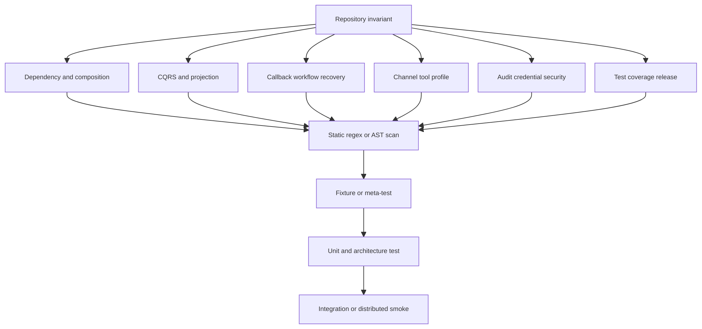
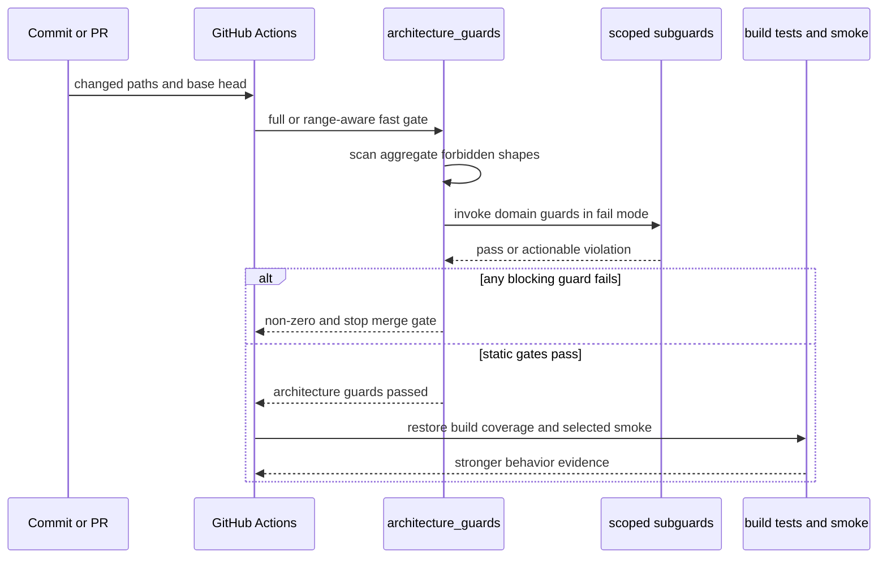

# Architecture 与 Security Guards：把边界写成可失败的规则

> 版本与结论：本章描述冻结基线的 `current` 治理面。`tools/ci/` 顶层名称包含 `guard` 的shell脚本按精确glob共有56个，它们把dependency direction、CQRS/read-side、projection/callback、channel/tool/profile、audit/secret与test/release约束转成可执行失败。guard能阻止已知坏形状回归，却不能证明运行时语义、外部系统配置或整个安全模型正确；通过guard是进入更强验证的必要条件，不是充分条件。

## 设计抽象与事实源

- `tools/ci/architecture_guards.sh:39-68`、`:932-961`、`:2140-2176`：full/range扫描入口、子guard编排与最终阻断式汇总。
- `tools/ci/README.md:1-59`：quality guards、build/test、provider/runtime smoke与CI job之间的责任映射。
- `tools/ci/audit_trail_guards.sh:1-76`：raw payload/tool result、伪redaction、弱HMAC默认值与sanitizer入口的窄安全门。

## Guard 的位置：Policy 到 Evidence 之间

架构原则只有写在文档里时，reviewer必须记得每条历史教训；编译器又只知道类型和语法，不知道“query path不能偷偷replay”“runtime token不能进入durable fact”“Observatory只能GET”。guard把这些项目特定不变量转成机器可判定的拒绝模式，放在普通build之前尽早失败。

```mermaid
%%{init: {"maxTextSize": 100000, "flowchart": {"useMaxWidth": false, "nodeSpacing": 17, "rankSpacing": 46}, "themeVariables": {"fontSize": "10px"}}}%%
flowchart LR
    P["Canon ADR and host policy\nwhat must remain true"]
    G["Architecture and security guards\nknown forbidden shapes"]
    B["Restore build lint\ntype and contract validity"]
    T["Unit architecture integration tests\nbehavior and fixtures"]
    S["Provider runtime distributed smoke\nreal composition boundaries"]
    R["Review and versioned operations evidence\nsemantic and production claims"]
    P --> G --> B --> T --> S --> R
    G -. "fast precise regression signal" .-> P
    R -. "new failure teaches a new invariant" .-> P
```



为什么不只靠review？边界回归往往是一行看似方便的`ProjectReference`、`ListAsync`、raw token字段或`MapPost`，reviewer容易在大diff中漏掉。为什么不只靠编译？这些形状大多完全可编译；错误在职责与事实所有权，而非语法。

## 六组不变量，而不是 56 个孤立脚本

精确清单会变化，设计责任更稳定。冻结56个顶层guard可按下列六组理解；一个脚本可服务多组，不应为凑计数强行唯一归类。

### 1. Dependency 与 Composition 边界

这组约束project reference方向、solution split、test project ownership、Host policy、static service activation、frontend/static asset边界，以及retired host/transport/component不能重新进入composition。核心问题是“谁可以依赖谁、谁负责装配”。

典型机制既有对`.csproj`/solution的结构扫描，也有Python layer graph和Host DI smoke。它们防止Foundation倒依赖adapter、Channel吞入vendor SDK、frontend直连actor内部端点、Mainnet重新启用scripting等。

### 2. CQRS、Event Sourcing 与 Projection 边界

这组禁止query-time event replay/materialize、command path等待projection readiness、readmodel绕过typed query port、state version丢失、projection route映射漂移、已退役 StateMirror 或 legacy envelope重新出现。它还要求public projection activation、existing-side attach与projector registration覆盖。

不变量是：write side提交事实，projection异步物化，query side只读read model；`202`不能冒充commit/readiness。guard查的是能静态识别的反模式，Roslyn architecture tests再覆盖继承与依赖语义。

### 3. Callback、Workflow 与恢复边界

runtime callback、run ID、closed-world primitive、binding、caller context、Saga compensation和script runtime snapshot等guard，保护generation/lease/idempotency、typed capability ref与可重放恢复。它们拒绝process-local registry冒充跨turn事实、callback直接承担业务状态、或workflow core渗入channel-specific payload。

这组的价值不是证明所有并发交错正确，而是让已知事故根因对应的坏token/坏调用图无法悄悄回来。真正的race、crash recovery与distributed behavior仍需定向测试和smoke。

### 4. Channel、Tool 与 Profile 治理

channel native SDK/project reference、mega-interface、inbox GAgent、tombstone、card literal、relay direct-create与Lark path contract共同守住adapter/runtime/outbound三层。tool approval wiring与secret-bearing delivery reader guard阻止工具绕过审批或读取本不属于它的credential。

agent kind/profile guard则把stable kind、reviewed package、Host-owned overlay、exact version和default-off写成机器规则，避免prompt/profile在运行时靠名字分支或广泛credential tool扩权。

### 5. Audit、Credential 与 Security 边界

audit guard拒绝raw request/response/payload字段、未经sanitizer的tool arguments/results、“截断即脱敏”以及弱HMAC默认值。architecture聚合器还禁止durable channel inbound token、voice process-local credential store、system skill overlay secret和不安全本地port/endpoint形状。

这类guard应优先检查trust boundary，而不是做泛化“找secret字符串”的噪声扫描：明确哪些DTO、write site与composition不得出现credential material，误报更少，失败也能给出修复方向。

### 6. Test、Coverage 与 Release Evidence

test stability、coverage、test ownership、slow suite、proto lint与solution split约束“验证本身不能静默缺席”。某些wrapper还检查test filter不能零命中，guard自己的fixture/meta-test确认它确实会拒绝bad case。

PR size明确是advisory，不应和blocking security guard混称同一证据强度；provider E2E、Kafka integration、EventSourcing regression、Host composition、3-node与mixed-version smoke也不属于上述顶层guard inventory，却是release evidence不可缺的后续层。



## 一次 Guard 怎样进入 CI

`architecture_guards.sh` 是聚合入口。它会根据PR/base/head或push SHA决定range/worktree mode，执行自身扫描，再调用projection、query priming、callback、channel、tool、profile、CQRS、audit等子guard。CI的`fast-gates` job在非docs-only变更上运行它，同时运行test stability；coverage/build、slow tests与各类smoke位于独立job，按变更域或main/nightly条件运行。



一个guard若依赖复杂语义，应该配fixture或meta-test验证bad case确实失败、good case通过；否则“脚本本身绿色”可能只是pattern永远不命中。wrapper调用dotnet filter时也必须拒绝zero-test match，不能把“没有测试运行”打印成passed。

## Guard 能证明什么，不能证明什么

guard通过可以证明：在它实际扫描的冻结路径、pattern、AST或test范围中，没有出现它定义的违规形状，且命令以0退出。它不能证明：

- 未扫描目录或动态生成代码没有同类问题；
- 允许形状在运行时参数、并发、failure recovery下必然正确；
- 外部NyxID/Chrono/Kafka/Garnet配置符合repository假设；
- 所有secret都不可泄露，所有对象级授权都覆盖；
- production canary或灾备恢复已经成功。

因此“加一个regex guard”不是一个安全修复的全部。最小闭环应是：明确不变量 → 写会失败的guard/fixture → 保留行为/架构测试 → 在适用时跑integration/smoke → 对production claim绑定版本化证据。

为什么不把所有语义都塞进`architecture_guards.sh`？巨型grep会变成不可理解的隐式规范，且无法模拟运行时。稳定边界用静态guard，局部逻辑用test，跨组件用smoke，外部环境用canary；每层做它擅长的事。

## 最小 Inventory 检查

下面严格按计划的顶层glob计数，不递归把`tools/ci/tests/`下的guard自测脚本算成生产guard：

```bash
set -euo pipefail

setopt null_glob
guards=("$AEVATAR_SRC"/tools/ci/*guard*.sh)
test "${#guards[@]}" -eq 56

rg -Fq 'bash "${SCRIPT_DIR}/query_projection_priming_guard.sh"' \
  "$AEVATAR_SRC/tools/ci/architecture_guards.sh"
rg -Fq 'bash tools/ci/audit_trail_guards.sh' \
  "$AEVATAR_SRC/tools/ci/architecture_guards.sh"
rg -Fq 'run: bash tools/ci/architecture_guards.sh' \
  "$AEVATAR_SRC/.github/workflows/ci.yml"

printf 'top-level-guards=%s verified-static\n' "${#guards[@]}"
```

> Demo status：`verified-static`（本轮在冻结SHA执行了精确glob与聚合/CI接线断言，得到56个顶层guard；未运行上游全套guard/build/test/smoke，因此不把inventory核对写成release pass）。

## 边界与演进

现有治理仍有明确安全缺口：

- **#375 zero-secret-material**：Mainnet composition把`AllowLocalFileSecretsStore`固定为false，但通用default host/local dev仍保留read/write file secret path，runtime也存在可写`IRuntimeSecretStore`抽象。当前是分层secret boundary，不是“线上零secret material”完全落地。
- **#2580 relay credential persistence**：`agent_run.proto` 在generation注释中写明runtime credential应留在state外，但`AgentRunReplyStepState` 仍持有`llm_control/tool_context/owner_fallback_*`字段；这些payload可承载NyxID token。冻结guards没有把该矛盾全部消除，不能因其他token guard通过就判定已修复。
- 静态guard的allowlist/baseline必须经过review；盲目扩allowlist等于关闭报警，而不是解决违规。
- guard路径/regex随重命名可能失效，因此需要fixture/meta-test与周期性inventory审计。

这些缺口登记到 [12/05](../12/05-open-gaps-and-canon-drift.md)。安全债只有在E1代码、对应guard/test和适用的运行证据共同闭合后，才能从open gap移出。

## 读完应能回答

1. 为什么架构原则需要guard，而编译与review仍不可省？
2. 56个顶层guard可按哪六组不变量理解？
3. blocking guard、advisory PR size与integration smoke的证据强度有何不同？
4. 为什么guard通过不能证明#375/#2580已经解决？
5. 一个新的跨层事故应怎样沉淀成可执行、可自测的治理规则？

<details>
<summary>论断—冻结证据映射</summary>

| 论断 | 冻结证据 |
|---|---|
| architecture聚合器支持range/worktree模式并调用domain subguards | `tools/ci/architecture_guards.sh:39-68`、`:932-961`、`:2140-2176` |
| CI fast-gates阻断architecture/test stability，PR size标为advisory | `.github/workflows/ci.yml:196-234` |
| build/coverage、slow tests和provider/runtime smoke分属后续job | `tools/ci/README.md:23-59`；`.github/workflows/ci.yml:272-399` |
| audit guard拒绝raw payload/tool write、截断伪脱敏与弱HMAC默认值 | `tools/ci/audit_trail_guards.sh:35-76` |
| architecture guard明确拒绝durable channel token与voice process-local credential store | `tools/ci/architecture_guards.sh:115-199` |
| Mainnet强制关闭local file secret store，通用host默认仍允许local file store | `src/Aevatar.Mainnet.Host.Api/Hosting/MainnetHostBuilderExtensions.cs:121-140`；`src/Aevatar.Bootstrap/Hosting/WebApplicationBuilderExtensions.cs:40-80` |
| AgentRun事实注释与reply step credential-bearing context仍同时存在 | `agents/Aevatar.GAgents.NyxidChat/protos/agent_run.proto:65-88`、`:202-230` |
| guard README明确静态、coverage与smoke不是同一层 | `tools/ci/README.md:5-59` |

</details>
