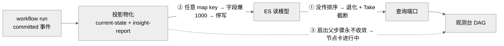
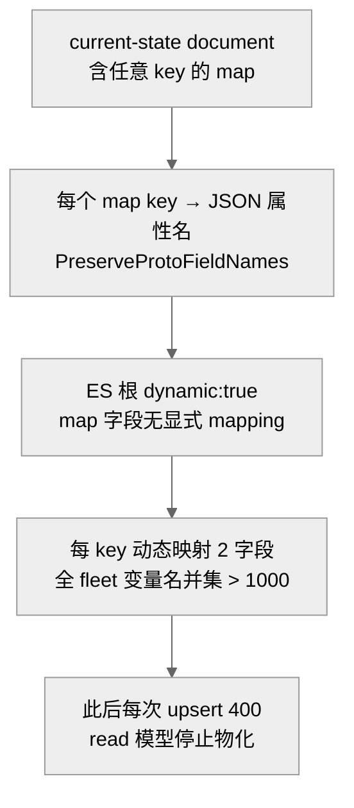
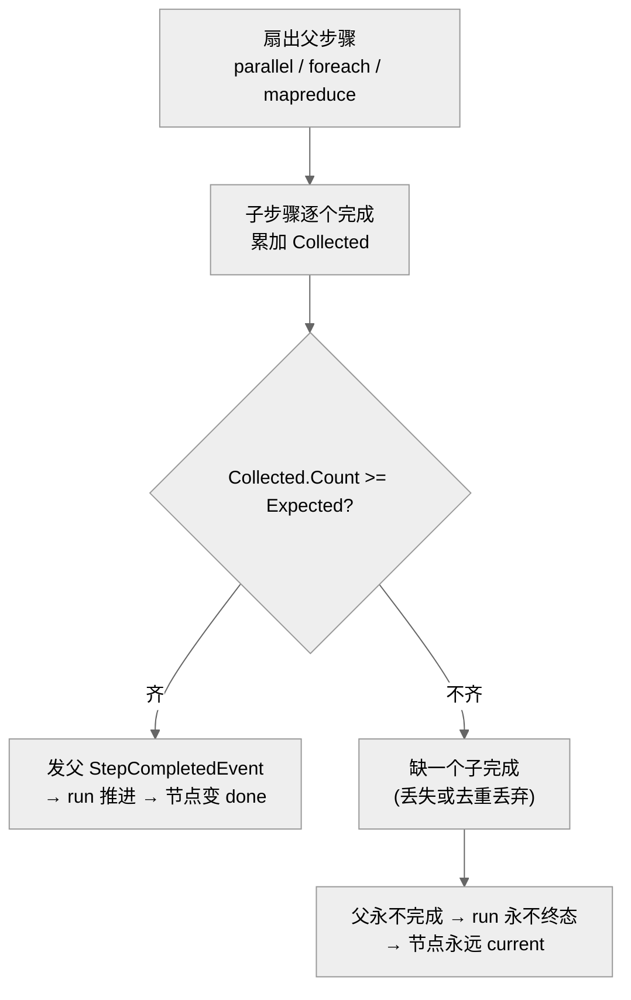

# 观测台「看不到我的 run / run 状态不对」:排序缺失 / ES 字段爆表 / 节点卡进行中

## 事实源/设计抽象(以 ~/Code/aevatar 为准)

> 现象:本周三类"run 跑了、观测台却不对"。① 看"全部 scope"时,看不到自己最近的 run;② run 明明 `success=True`,却永远不出现在观测台;③ 某节点一直"进行中",后面的都完成了它还在转。三者分属**查询排序 / 读模型物化 / 节点状态机**三层。
>
> **这是什么机制**:观测台读侧是标准 CQRS 投影(见 [05/04](../05/04-workflow-projection.md)):committed run 事件 → `WorkflowExecutionCurrentState` 物化(列表/筛选)+ `WorkflowRunInsightReport`(timeline/step,即节点图数据源)物化 → ES 读模型 → 查询端口 → 前端 DAG。读侧只物化、不重算业务状态机。
>
> 事实源脊柱(职责,非正文骨架):
>
> - `src/workflow/Aevatar.Workflow.Projection/Orchestration/WorkflowExecutionCurrentStateQueryPort.cs` —— 观测台 current-state 列表查询端口:显式 recency 排序 + scope/status/run_origin/time-range 过滤。
> - `src/Aevatar.CQRS.Projection.Providers.Elasticsearch/Stores/ElasticsearchProjectionDescriptorMappingSupport.cs` —— 通用 ES provider 从 proto descriptor 生成索引 mapping;对 map 字段写 `enabled:false`。
> - `src/workflow/Aevatar.Workflow.Projection/workflow_projection_transport.proto` —— 读模型投影传输契约:current-state document(含无界 `map<>`)+ insight-report document(step/timeline 条目,节点图真实数据源)。
> - `src/workflow/Aevatar.Workflow.Core/Modules/ParallelFanOutModule.cs` —— 扇出父步骤完成门控(收齐子步骤才发父完成),§3 的根因证据;同模式见 `ForEachModule.cs` / `MapReduceModule.cs`。
>
> 核对基线:`feature/integrate`(origin @ `7d3c5a782`)。**性质:① 排序 = 真 bug,已修部署(`6c15d4685`);② 字段爆表 = 真 bug,已修部署(`f45025016`);③ 节点卡进行中 = 真 bug,仍开放(扇出收敛缺口)。**

---

## 0. 一句话主线

> ① 列表查询**没传排序**,ES 退回一个不存在的字段、退化成 actor-id 序 + 先 `Take(100)`,你最近的 run 落在窗口外;② current-state document 带**任意 key 的 `map<>`**,被 ES 动态映射成字段,全 fleet 变量名/step id 的并集**撑爆 1000 字段上限**,此后整个读模型停止物化;③ 观测台节点状态是从 committed timeline **重建**的,扇出父步骤的完成被"收齐子节点"门控,缺一个子完成就**永不收敛**,该节点永远"进行中"。

---

## 1. 跨 scope 看不到自己的 run —— 排序契约缺失(`6c15d4685`)

`ListWorkflowActorCurrentStatesAsync` 对 ES 读模型查询时**没有传 Sorts**,ES 退回到一个**不存在的默认排序字段 `CreatedAt`**(current-state document 根本没有这个字段),于是排序退化为 actor-id 序;再叠加 `Take(boundedTake)` 的有界截取 → 返回的是任意 N 条而非"最近 N 条"。

admin"全部 scope"总量约 200、`take=100` 时,调用者自己的 3 条最近 run 只命中 1 条 —— 这就是"全 scope 看不到自己"。修复(`6c15d4685`)让查询端口**显式发出 `UpdatedAtUtcValue DESC`**,先按 recency 排序再截取。commit body 记的 live 证据:`take=100` 时 own runs 1/3 → 修后全 3 条。

> **不变量**:列表读模型的"最近 N"语义,必须由查询端口**显式表达的稳定排序键**保证,不能依赖存储层对缺失字段的隐式回退 —— 否则有界截取退化成不确定窗口。
>
> 顺带澄清两套读模型别混:观测台 = `workflow-execution-current-states`(本篇),per-scope 视图 = `gagent-service-runs`,两者表达同一事实的不同查询形态。

## 2. run success 却进不了观测台 —— ES 字段随业务 payload 任意 key 膨胀(`f45025016`)

write 侧 `success=True` 已提交,但 current-state 投影写 ES 被 `400 document_parsing_exception: Limit of total fields [1000] has been exceeded` 拒绝。

根因是**读模型 ES 字段集随业务 payload 的 key 基数无界增长**:`WorkflowExecutionCurrentStateDocument` 携带**任意 key 的 protobuf `map<>`** —— `fork_seed_variable_entries`(按变量名)、`fork_seed_idempotency_entries`(按 step id)、`inline_workflow_yaml_entries`;文档以 `PreserveProtoFieldNames` 序列化,使每个 map key 变成 JSON 属性名;而通用 ES provider 当时**跳过 map 字段、不给显式 mapping**,叠加索引根 `dynamic:true`,ES 把每个 key 动态映射为 `<key>` + `<key>.keyword` = 2 个字段(正对应错误信息 `adding new fields [2]`)。全 fleet 变量名/step id 的并集超过 1000 → 此后**每一次** upsert 全部 400,整个 current-state document 停止物化。

修复(`f45025016`,实现 issue `#2321` 的 Option B):通用 provider 对所有 map 字段写 `{"type":"object","enabled":false}` —— 存于 `_source` 但**完全不索引** key,字段数从此恒定、与写入量/变量名基数无关;索引根 `dynamic:true` 保持不变。

!!! note "为何 enabled:false 而非 flattened,以及自愈代价"
    `flattened` 把所有叶值索引为 keyword,工作流变量值可能超过 Lucene 32KB term 上限 → 反而引入新的 `document_parsing_exception`;`enabled:false` 只存不索引,无 term 长度风险。**自愈**:索引按 `{alias}-v{mapping 指纹}` 命名,mapping 变更 → host 启动时 reindex 建新物理索引、从 `_source` 重建、原子 alias 切换。⚠️ reindex 有 **2 分钟硬预算**,已撑爆的超大索引可能需手工更长预算 —— 这条修复是"一次消除整个 bug 类",但代价是全平台投影索引首次部署的全量 reindex-heal。

## 3. 节点卡"进行中" —— 扇出父步骤被"收齐子节点"门控(仍开放)

观测台 DAG 的节点状态**不存于任何 document 字段**(current-state document 只有 `execution_state_count`),而是前端 `deriveNodeStatus` 从 committed timeline 事件流**实时重建**:节点有 `step.request` 但无 `step.completed`/`step.failed`、且 run 仍 `running` → 渲染"进行中(current)"。关键:一旦 run 到达终态,已 started-未 finished 的节点会被**重分类**为 done/failed,不再 current。

所以"某节点永远进行中、后面节点已完成"只可能 = **该 step 从未发出完成事件,且 run 从未到终态**。最强代码支撑的具体原因:**扇出父步骤(`parallel`/`foreach`/`mapreduce`)的自完成被"收齐子步骤"门控** —— `Collected.Count >= Expected` 才 publish 父 `StepCompletedEvent`。只要有一个子完成丢失(never reported,或被 `CollectedStepIds.Contains` 去重丢弃),父收集永不达 `Expected` → 父永不完成 → kernel 永不发 `WorkflowCompletedEvent`(run 卡 `running`)→ 父节点永远 current,而兄弟/前序节点显示 done。

!!! warning "对设问方向的更正:缺口在 write 侧,不在投影"
    `WorkflowExecutionCurrentStateDocument` **根本不带 per-node 状态**;节点图真实数据源是 `WorkflowRunInsightReportDocument`(step/timeline)+ 前端重建。投影器消费**每一个** committed run 事件,凡是发了完成事件的 step 都会物化 —— 并非"丢了终态 relay"。真正的缺口在 **write 侧节点状态机不收敛**:健康设计应保证每个被调度的 step 在 run 终止时都有确定终态事件(成功/失败/取消其一),完成判定**不依赖"子节点全部回报"这一可能不收敛的前提**。该 bug **仍开放**(git log 无对应修复)。要把"机制成立"升到"该 run 实锤",需拉该 run 的 committed timeline,找出有 `step.request` 而无 `step.completed` 的 `stepId` 并核其 `stepType`。

## 4. 影响面 / 性质 / 教训

| 子问题 | 性质 | 影响面 | 修复 |
|---|---|---|---|
| ① 排序缺失 | 真 bug·已修部署 | 所有 current-state 列表读路径,admin 全 scope + 总量超 take 时最易暴露 | `6c15d4685` |
| ② 字段爆表 | 真 bug·已修部署 | **系统性**:`map` 跳过对所有读模型生效;修复触发全平台 reindex-heal | `f45025016`(#2321) |
| ③ 节点卡进行中 | 真 bug·仍开放 | 所有含扇出步骤或子 run 的 workflow;节点永转 + run 永不终态 | 未修(write 侧收敛缺口) |

**教训:**

1. **列表读模型的"最近 N"必须有显式权威排序键**:`Take` 前由查询端口发稳定排序,不依赖存储层对缺失字段的隐式回退。
2. **ES 字段集不随业务 payload 任意膨胀**:任意 key 的 `map<>`(变量袋、idempotency 袋)属于"开放扩展边界",其 key 不是稳定查询维度,应"存而不映射"(`enabled:false`),字段数与变量名基数解耦 —— 这正是 CLAUDE.md「核心语义强类型 / 开放扩展袋」在读侧的落地。
3. **投影只物化、不推导;节点终态须由本步骤的 committed 完成事件承载**:观测台从 timeline 重建节点状态(never invented)是对的,但 write 侧的"父完成 = 子全回报"这一**推导**一旦不收敛,就没有可投影的终态。完成判定不该建在可能不收敛的子集合门控上。

## 关联章节

- [05/04 Workflow 投影](../05/04-workflow-projection.md) —— current-state 与 insight-report 两类投影器。
- [05/03 ReadModel 存储](../05/03-readmodel-providers.md) —— ES / Neo4j / InMemory 读模型,§2 的 ES mapping 落点。
- [09/03 provision 与观测全链路附录](../09/03-provision-and-observe-via-nyxid/01-end-to-end.md) —— §5 live 实测里同一条 ES 字段超限发现。
