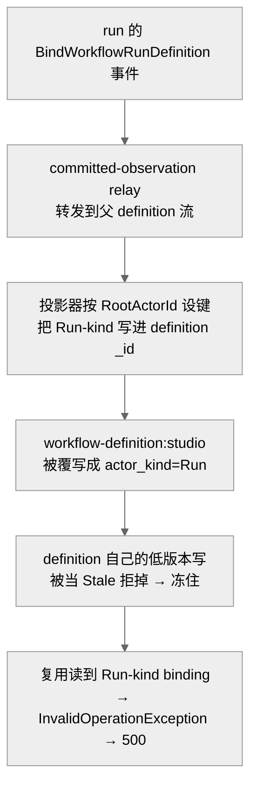
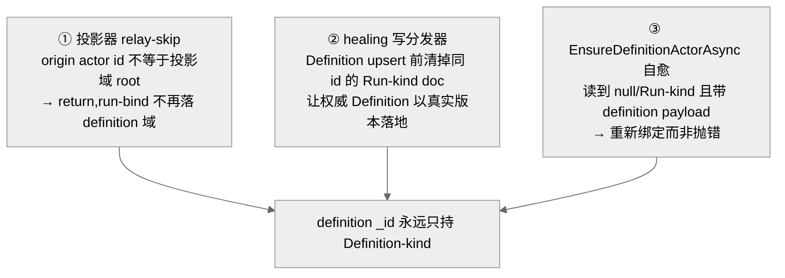

# Studio 控制台三个坑:binding 覆写致 500 / 对话失忆 / 深链 chip 溢出

## 事实源/设计抽象(以 ~/Code/aevatar 为准)

> 现象:`/workflow/studio` 这周踩了三个坑,层次完全不同。① **后端 500**:每次 `POST /api/chat {"workflow":"studio"}` 都 500「Workflow execution failed」,栈底是 `Actor 'workflow-definition:studio' is not a workflow definition actor`;② **对话失忆**:每轮 `/api/chat` 不带历史,agent 记不住上文;③ **深链 chip 溢出**:从 studio 跳观测台时那个定时任务筛选 chip 在窄列里连 ✕ 一起溢出。第一个是实质的后端投影/actor 边界 bug,后两个是前端。
>
> **这是什么机制**:studio 走 workflow `direct` 路径 —— `/api/chat` 触发一次 run,actor 解析时需要复用名为 `workflow-definition:studio` 的 **definition actor** 作为定义源(见 [02/02](../02/02-definition-and-run-actors.md))。definition actor 与 run actor 是**不同 `actor_kind`** 的两类实体,各自有独立的 binding 读模型;一旦 run 的 binding 串进了 definition 的投影域,复用就会失败。
>
> 事实源脊柱(职责,非正文骨架):
>
> - `src/workflow/Aevatar.Workflow.Infrastructure/Runs/WorkflowRunActorPort.cs` —— run/definition actor 解析与绑定端口;`EnsureDefinitionActorAsync`(含那句报错与自愈 re-bind)。
> - `src/workflow/Aevatar.Workflow.Projection/Projectors/WorkflowActorBindingProjector.cs` —— binding 投影物化器;relay-skip 守卫(origin actor id 不等于投影域 root 则跳过 run-bind)。
> - `src/workflow/Aevatar.Workflow.Application.Abstractions/Runs/WorkflowRunPorts.cs` —— 定义 `WorkflowActorKind { Unsupported=0, Definition=1, Run=2 }`,即 `actor_kind` 的语义源。
> - `src/workflow/Aevatar.Workflow.Projection/workflow_actor_binding_document.proto` —— binding 读模型 proto,字段 `int32 actor_kind_value`(注意是 int32,不是 proto enum)。
> - `src/workflow/Aevatar.Workflow.Infrastructure/CapabilityApi/WorkflowStudioPage.cs` —— studio 页(嵌在 C# 里的 HTML/JS);`composePromptWithHistory`、prompt-chip 的 `dispatchEvent(new Event("input"))` 都在此。
>
> 核对基线:`feature/integrate`(origin @ `7d3c5a782`;本地工作树落后 origin 21 提交,且 `fa2ff7223` 新增的 healing 写分发器文件**本地不存在**,以 origin 为准)。**性质:① 真 bug,已修部署(`fa2ff7223`,且线上已自愈被污染的 binding doc);② 前端,已修(`c087df8cf` / `9ab3d115a`);③ 前端,已修(`a162d09e0`)。**

---

## 0. 一句话主线

> 一个 run 的 binding 经 committed-observation relay 转发到**父 definition actor 的流**上,投影器按 `RootActorId` 给 Run-kind doc 设键,于是把 `_id = workflow-definition:studio` 的 **Definition doc 覆写成了 Run-kind**;通用写评估器只比 `StateVersion`,run 的高版本反把 definition 自己的低版本写当 Stale 拒掉、冻住;复用时读到 Run-kind binding → 抛错 → HTTP 500。前两个前端坑则简单:对话失忆是因为 `/api/chat` 无状态、记忆该由前端折叠注入;chip 溢出是 CSS 缺宽度约束。

---

## 1. 后端 500 —— run-bind 覆写 definition binding doc(`fa2ff7223`)

违反的是**权威状态拥有者唯一 + readmodel 单调覆盖**这对不变量:

- `workflow-definition:<name>` 的 binding 读模型属于 **definition 投影域**。但一个 run 的 `BindWorkflowRunDefinitionEvent` 经 committed-observation relay(`LinkAsync`)被转发到**父 definition actor 的流**上。`WorkflowActorBindingProjector` 当时按 `context.RootActorId` 给 Run-kind doc 设键 → 在 definition 的投影域里把 `_id = workflow-definition:studio` 写成了 `actor_kind=Run`,**覆写**了 Definition doc。
- 通用 `ProjectionWriteResultEvaluator` 只比 `StateVersion`:run 的高版本反过来把 definition 自己的低版本写**当 Stale 拒掉**,doc 冻在 Run-kind 上。
- `EnsureDefinitionActorAsync` 读到 Run-kind binding → 抛 `InvalidOperationException` →(在 direct-fallback 路径上包装为 `WorkflowDirectFallbackTriggerException`)→ HTTP 500。

studio 偏偏是个"新且低版本"的 definition,正好命中;`direct`/`auto`/Lark 因每次 run 都重新绑定、版本盖过 clobber 而幸免。

`fa2ff7223` 的修法是**三段组合**(作用域严格限定 workflow binding 链路,通用评估器不动):

① 投影器在写 Run doc 前取 origin actor id,不等于 `context.RootActorId` 就 `return` —— relay 来的 run-bind 不再落 definition 域;② 新增的 healing 写分发器(`WorkflowActorBindingHealingWriteDispatcher`)在 Definition upsert 前,发现同 `_id` 上蹲着 Run-kind doc 就先删,让权威 Definition doc 以**真实版本**落地(不伪造版本),**自愈线上已被污染的 `workflow-definition:studio`**;③ `EnsureDefinitionActorAsync` 改为"读到 null/Run-kind 且调用方带 definition payload(built-in/catalog 定义都带)时重新绑定",真正非 definition 的 actor 仍 fast-fail 抛那句报错。

!!! note "对记忆的更正:别把部署 commit 认错"
    `2999c3d9` 是 `Add Studio workflow save-and-bind endpoint (#2363)`(功能 commit),**不是 `fa2ff7223` 的部署载体**。准确说法:**fix 是 `fa2ff7223`,随 `feature/integrate` 滚动部署生效**;若要点名某次部署,应核当时 live image 的 sha,而不是引用一个无关功能 commit。另:proto 里是 `int32 actor_kind_value`(不是 proto enum),语义由 C# `WorkflowActorKind`(1=Definition / 2=Run)承载。

## 2. 对话失忆 —— 会话记忆归属错位(前端,`c087df8cf`)

`/api/chat` run 在协议上是**无状态**的:一次调用一个 prompt,`SessionId` 只是**关联标签**,后端从不据它 rehydrate 历史。这本身符合"写侧 run-scoped、查询走 readmodel"的边界 —— 问题在于"**谁该承载会话记忆**"没定义。前端页面本就在 `localStorage` 里持有完整 transcript,所以记忆该由前端折叠注入。

修复(`c087df8cf`):前端 `composePromptWithHistory` 把最近 ~10 轮(`HISTORY_TURN_CAP=10`、`HISTORY_CHAR_CAP=6000` 双上限)折进 prompt;首轮行为不变(无历史发裸 prompt),注入历史有界、不会无限膨胀。

另一个相关前端 bug(`9ab3d115a`):点 prompt-chip 只 `set textarea.value`、**没派发 `input` 事件** → send 按钮的 disabled 切换器不触发、按钮恒灰(Enter 却照常)。修复在 chip click 里补 `ta.dispatchEvent(new Event("input",{bubbles:true}))` 复用既有监听。

> **不变量**:无状态 run 的会话记忆由**持有完整 transcript 的一方**(这里是前端)承载并有界注入;后端不该为"记忆"去 rehydrate run。这是一条"会话记忆归属"边界,不是后端 bug。

## 3. 深链 chip 溢出 —— 布局约束缺失(前端,`a162d09e0`)

观测台的定时任务深链筛选 chip(`.sched-filter`)在窄 runs 列里**没有宽度上限/收缩规则**,文本不省略 → 连 ✕ 一起溢出。修复给 `.sched-filter` 加 `max-width: calc(100% - 32px)`,`.sf-id` 设 `flex: 0 1 auto; min-width: 0` + 省略号,icon/label/✕ 设 `flex: 0 0 auto`。

!!! note "这条改在 observatory 页,不在 studio 页"
    深链来自 studio/schedules 生态,但承载该 CSS 的文件是 `WorkflowRunObservatoryPage.cs`(观测台),不是 `WorkflowStudioPage.cs`。归到"studio 三坑"叙事可以,但别说成"在 studio 页里改的"。

## 4. 影响面 / 性质 / 教训

| 子问题 | 性质 | 影响面 | 修复 |
|---|---|---|---|
| ① binding clobber 500 | 真 bug·已修部署 | 所有"新建/低版本 definition 复用 definition actor"的 run,studio 是受害典型(100% 500) | `fa2ff7223`(三段 + 线上自愈) |
| ② 对话失忆 | 前端·已修 | studio 对话体验 | `c087df8cf`(+ chip 解灰 `9ab3d115a`) |
| ③ chip 溢出 | 前端·已修 | observatory/schedules 深链窄列布局 | `a162d09e0` |

**教训:**

1. **每个 binding readmodel `_id` 只能由它自己的投影域拥有**:run 的 binding 只属于 run 自己的投影域;relay 把 committed event 转发到父 definition 流是**用于观察**,不是授权它去写 definition 域的 `_id`(投影域 root ≠ origin actor id 即不该落键)。根治在源头不写错键,healing 只兜底已被污染的历史 doc、且不伪造版本。
2. **"单调覆盖 + 比版本"在跨投影域时会咬人**:通用评估器只比 `StateVersion` 本身没错,错在让**异源(run)的高版本**进了**他人(definition)的 `_id`**。版本对齐的前提是"同一权威源"。
3. **无状态接口的"记忆"要明确归属**:别让后端偷偷 rehydrate,也别让前端默认丢历史 —— 由持有完整 transcript 的一方有界注入,边界才清楚。

## 关联章节

- [02/02 definition actor vs run actor](../02/02-definition-and-run-actors.md) —— 两类 actor 的职责切分,本篇 §1 的边界基础。
- [05/04 Workflow 投影](../05/04-workflow-projection.md) —— binding 投影与 current-state 投影。
- [10/08 观测台读侧](08-observatory-read-side.md) —— 同一前端 shell 的另一组读侧问题。
