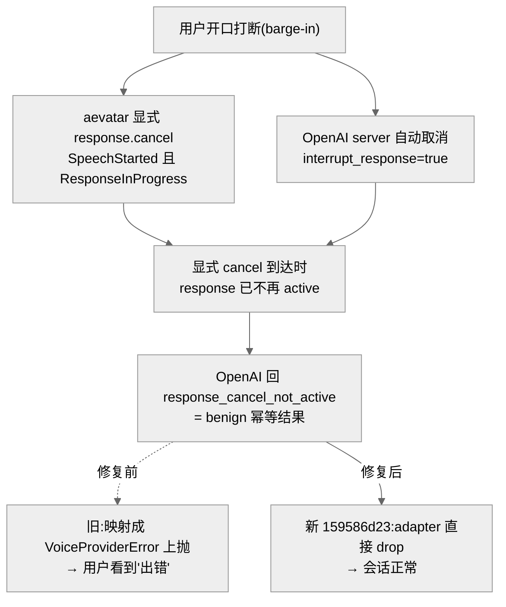
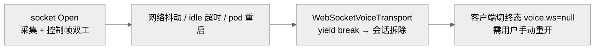

# 语音 `/voice` 与 `/ws/voice`:打断 cancel 竞态被当致命错误 / 重连缺失

## 事实源/设计抽象(以 ~/Code/aevatar 为准)

> 现象:两个语音问题。① `/voice` 实时语音里,用户一**打断(barge-in)**就报「出错 · Cancellation failed: no active response found」,可这其实是**正常工作**的会话被一个 benign 协议帧吓出的假错;② `/ws/voice` 一旦因网络抖动/idle 超时/pod 重启断开,会话直接拆掉、**没有重连**,要用户手动重开麦克风。
>
> **这是什么机制**:`/voice` 是真正的 `/ws/voice` 麦克风客户端(浏览器采集 24kHz PCM16 走 WebSocket)。aevatar 的 VoicePresence 子系统(见 [07/04](../07/04-voice-presence.md))把上游 realtime provider(OpenAI)的事件经 adapter 映射成内部会话事件;打断时存在**双重取消主体** —— server 端自动取消 + aevatar 显式 `response.cancel` —— 二者对同一个 response 构成竞态。
>
> 事实源脊柱(职责,非正文骨架):
>
> - `src/Aevatar.Foundation.VoicePresence.OpenAI/OpenAIRealtimeProvider.cs` —— OpenAI realtime adapter;`MapSessionEvent` 事件映射 + benign 竞态归类(`IsBenignRealtimeRaceError`)。
> - `src/Aevatar.Foundation.VoicePresence/Modules/VoicePresenceModule.cs` —— 运行态 actor 事件处理;在 `SpeechStarted` 且 `ResponseInProgress` 时**显式下发 `response.cancel`**(竞态的"显式 cancel"一方)。
> - `src/Aevatar.Mainnet.Host.Api/Voice/PolicyAwareVoiceEndpoints.cs` —— `/ws/voice` 服务端路由映射、策略解析、附挂传输。
> - `src/Aevatar.Foundation.VoicePresence/Transport/WebSocketVoiceTransport.cs` —— WS 传输:断开即 `yield break`,**无重连循环**,是 §2 的事实源。
> - `docs/canon/voice-presence-integration.md` —— canon;issue `#2159` 登记的 `/ws/voice` reconnect/reattach 契约。
>
> 核对基线:`feature/integrate`(origin @ `7d3c5a782`;本地工作树落后 origin 21 提交,`OpenAIRealtimeProvider.cs` 本地仍是**修复前**版本,以 origin 为准)。**性质:① 真 bug,已修部署(`159586d23`,线上 trace 证实);② 仍开放(重连未实现)。**

---

## 0. 一句话主线

> 打断时 OpenAI server 端在检测到用户说话(VAD)后**自动取消**当前 response,aevatar 又**显式**发了一个 `response.cancel`;后者到达时 server 端往往已经取消完毕,于是回 `response_cancel_not_active` —— 这是每次打断的**预期幂等结果**,却被旧实现无差别映射成致命错误上抛、渲染给用户。修复让 adapter 把这种 benign 协议帧直接 drop。另一头,`/ws/voice` 单 socket 单生命周期、断即拆,缺重连契约(issue #2159)。

---

## 1. 打断 cancel 竞态 —— benign 协议帧被当致命错误(`159586d23`)

打断的取消语义存在**双重取消主体**:

- 会话在 `interrupt_response=true` 下,由 **OpenAI server 端**在检测到用户说话(VAD `speech_started`)时**自动取消**进行中的 response;
- 同时 aevatar 运行态在收到 `SpeechStarted` 且 `state.Status == ResponseInProgress` 时,**又显式发送一个 `response.cancel`**。

这两个取消针对**同一个 response**,构成竞态:当显式 cancel 到达时,server 端往往已经取消完毕,于是 OpenAI 回 `response_cancel_not_active`。

被违反的不变量是:**显式 cancel 不能假设 response 仍然 active**。在 server 端也会自动取消的协议下,"显式 cancel 输给自动 cancel"是每次打断的**预期幂等结果**,cancel 的后置条件(response 已不再活跃)本就已满足,因此是 no-op 而非 failure。旧实现把这个 provider 边界的 benign 协议帧无差别映射成 `VoiceProviderError` 上抛,越过了"协议层竞态"与"真实故障"的边界,最终被客户端渲染成用户可见的致命错误,让一个**正常工作**的语音会话看起来坏了。(对称地,冗余 `response.create` 触发的 `conversation_already_has_active_response` 也是同类幂等竞态。)

修复(`159586d23`)在 `MapSessionEvent` 增加 `OpenAIRealtimeErrorEvent error when IsBenignRealtimeRaceError(error.Code) => null`(**直接 drop,不上抛**),`IsBenignRealtimeRaceError` 精确匹配 `response_cancel_not_active` 与 `conversation_already_has_active_response`;接收循环把这两类日志降到 Debug,其余 `rate_limit`/`auth` 真实错误仍 Warning + 上抛。带回归测试(断言 3 个错误帧只剩 `rate_limit` 1 个到达客户端),并以线上 trace 证实"一次会话 → 一个 `response.cancel` → 一个 `response_cancel_not_active` → 客户端'出错'"。该任务已归档(`2c83a79a7`)。

!!! warning "残留弱点:客户端把任意 error 帧都当致命"
    这条修复只是从**服务端**断了 benign 帧的来源;客户端 `rf.error` 一律切终态、无任何恢复路径,这个"任意 error 即致命"的脆弱性**本身未改**。它与 §2 的重连缺失同源:客户端缺一套"区分 benign/fatal + 可恢复"的错误处理。

## 2. `/ws/voice` 重连缺失(issue `#2159`,仍开放)

`/ws/voice` 的 WebSocket 传输是**单 socket 单生命周期**:服务端 `WebSocketVoiceTransport` 只在 socket `Open` 时收帧,遇 `WebSocketException`/`Close` 即 `yield break`、置完成;`VoiceWebSocketAttachExecutor` 也只 await 一次 `Completion` 就收尾。socket 一旦因网络抖动、idle 超时或 pod 重启断开,会话即被拆除。已核实**服务端与浏览器客户端两侧都没有任何重连/重试/backoff**:客户端 `ws.onclose`/`ws.onerror` 只切终态、置 `voice.ws=null`,靠用户手动再点麦克风开新会话。

缺的是"断开 → 重连/重附 → 恢复会话"这条契约 —— 这正是 issue #2159 的本质(`docs/canon/voice-presence-integration.md` 已登记为待实现契约 + wire dead attach timeouts)。原 issue 的起点已过时,但重连工作仍要做(close 旧 issue、新开一个做重连)。

## 3. 影响面 / 性质 / 教训

| 子问题 | 性质 | 影响面 | 修复 |
|---|---|---|---|
| ① 打断 cancel 竞态 | 真 bug·已修部署 | 仅 `/voice` 打断路径;修复收敛在 adapter 单文件 + 一个回归测试,零跨层扩散 | `159586d23` |
| ② 重连缺失 | 仍开放 | 任何网络抖动/idle/部署都终止语音会话且不自动恢复 | 未做(#2159) |

**教训:**

1. **显式 cancel 不能假设 response 仍 active**:当 server 端在同一协议下也会自动取消时,"显式 cancel 输给自动 cancel"是预期幂等结果,应判为 no-op。
2. **benign 协议帧必须在 adapter 层吸收,不越界进用户可见错误流**:provider 边界的幂等竞态(`response_cancel_not_active` / `conversation_already_has_active_response`)在 adapter drop + Debug 日志即可;真实故障(`rate_limit`/`auth`)语义不变、照常上抛 —— 这是"协议层竞态"与"业务故障"的边界。
3. **传输生命周期边界需要恢复契约**:单 socket 单生命周期 + 断即拆,缺"断开→重连/重附→恢复会话",再叠加客户端"任意 error 即致命",可用性缺口就被放大。修服务端只是不再制造假错,客户端的健壮性是另一条待补的线。

## 关联章节

- [07/04 VoicePresence](../07/04-voice-presence.md) —— 语音路由、provider(MiniCPM/OpenAI)抽象。
- [07/09 voice-presence 边缘设备与大脑](../07/09-voice-presence-edge-brain.md) —— 双工交互与语音路由的全景。
