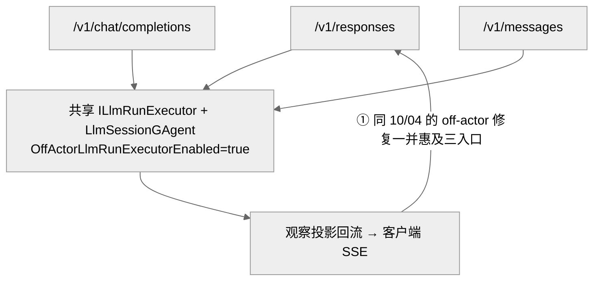
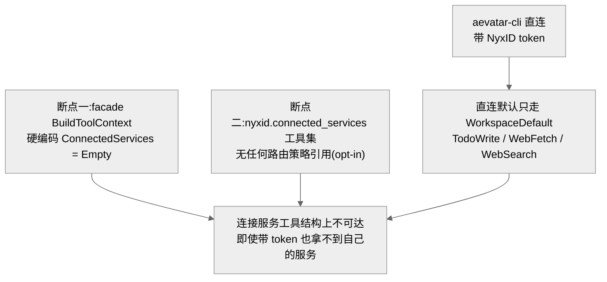

# NyxID 直连 LLM 入口:chat/completions 收不到回复 / 入口不暴露我的服务工具

## 事实源/设计抽象(以 ~/Code/aevatar 为准)

> 现象:把 aevatar 当 OpenAI/Anthropic 兼容 model 直连时,两类问题。① `/v1/chat/completions`、`/chat/completions` 直连**收不到回复**;② `/v1/responses` 直连(如 aevatar-cli)**"不知道我在 NyxID 上有什么服务"** —— LLM 不会自动把 caller 的 NyxID 经纪服务当工具调用。
>
> **这是什么机制**:三条直连 LLM 入口(`/v1/responses`、`/v1/chat/completions`、`/v1/messages`)共享同一条 Application 命令骨架和同一套运行底座 —— `*CommandFacade` → `LlmSessionGAgent` 会话 → off-actor `ILlmRunExecutor` 执行 → 观察投影回流(见 [10/04](04-responses-llm-run-offactor-and-observation.md))。Host 只做协议帧映射(OpenAI chunk / Responses SSE / Anthropic block),业务完成判定全在共享链路。
>
> 事实源脊柱(职责,非正文骨架):
>
> - `src/platform/Aevatar.GAgentService.Application/Responses/ChatCompletionsCommandFacade.cs` —— `/v1/chat/completions` 的 Application facade;与 responses **同一** `ILlmRunExecutor` + `OffActorLlmRunExecutorEnabled` 门控;`BuildToolContext` 里 `ConnectedServices = Empty`。
> - `src/platform/Aevatar.GAgentService.Application/Responses/ResponsesCommandFacade.cs` —— `/v1/responses` 对称 facade;off-actor 经 `StartOffActorRunAsync` / `observationService.ObserveAsync`。
> - `src/Aevatar.AI.ToolProviders.NyxId/NyxIdConnectedServiceToolSource.cs` —— 把 caller NyxID 连接服务**请求期 live 发现**并物化为工具的唯一工具源(无 token 即返回空,零进程缓存)。
> - `src/Aevatar.Mainnet.Host.Api/Hosting/MainnetHostBuilderExtensions.cs` —— 工具集装配权威点:`WorkspaceDefault`(直连默认,不含连接服务)+ `NyxIdConnectedServices`(注释为 opt-in / route-policy-only)。
> - `src/Aevatar.AI.Abstractions/ToolProviders/AgentToolExecutionContext.cs` —— 类型化工具执行上下文;`AgentToolConnectedServicesContext(ContextJson)` 这个注入插槽及其 `Empty`。
>
> 核对基线:`feature/integrate`(origin @ `7d3c5a782`)。**性质:① 与 [10/04](04-responses-llm-run-offactor-and-observation.md) 同一共享底座,off-actor 修复已惠及三入口(交叉引用,不重写);② 连接服务工具注入 = 双重断点的设计缺口,仍开放(部分 by-design)。**

---

## 0. 一句话主线

> ① "收不到回复"在**代码结构**上与 [10/04](04-responses-llm-run-offactor-and-observation.md) 的 `/v1/responses` 四层 off-actor 故障**同根**:三入口共用 `ILlmRunExecutor` + `LlmSessionGAgent` + 观察投影,那套修复一并惠及 chat/completions —— 但要钉死某次具体失败是 off-actor 还是 401 scope-unresolved,**得拉 live trace**;② "不暴露我的服务"是**双重断点**:facade 硬编码 `ConnectedServices.Empty`,**且** `nyxid.connected_services` 工具集没有任何路由策略引用它 —— 两处任一不补都不通。

---

## 1. chat/completions 收不到回复 —— 与 `/v1/responses` 共享底座(交叉引用 10/04)

三个 facade 的构造函数都注入**同一个**可空 `ILlmRunExecutor`,并读**同一份** `ResponsesIngressOptions.OffActorLlmRunExecutorEnabled`(默认 `true`),都经 `observationService.ObserveAsync(…)` 触发 off-actor run。因此"收不到回复"若根因在 off-actor 执行/观察链路(dispatch-only sink、按 response_id 关联、观察等待终态),那么 chat/completions 与 responses 在**协议无关层面是同一段代码、同一个不变量**;区别仅在边界协议渲染与各自的 `Normalize`。

[10/04](04-responses-llm-run-offactor-and-observation.md) 记录的那组修复 —— `06dcc533f`(把 LLM 执行移出会话 actor turn,#2298)、`5ed080fa`(off-grain 止死锁)、`b729e27c`(sink 改 dispatch-only)、`82bd5d37`(按 response_id 关联使观察回到客户端)、`489da19dd`(off-grain run 重解析 route tool set)、`f0408b9e`(容忍非 object tool 条目)—— 全在共享的 `LlmRunExecutor` / `LlmSessionGAgent` 层,**chat/completions 自动受益**。

!!! warning "限定:结构同根 ≠ 那次失败已坐实"
    我只在**代码结构**上确认三入口共享底座;**没有** live trace 证实 chat/completions 那次"收不到回复"的具体失败码确实落在 off-actor 链路。它在结构上**也可能**是 **scope-unresolved 鉴权**:直连 caller scope 由 `callerScopeResolver.ResolveAsync` 从 inbound bearer 解析,失败即 `ResponsesCallerScopeUnavailableException` → 401 `authentication_required` —— 这与 [10/05](05-lark-delivery-layer-failures.md) 的 **relay callback** scope 解析是**两条独立路径**,别混为一谈。按本仓库教训(code 追的根因是假设、需 evidence),结论写成:**与 10/04 同底座、预期同根因(交叉引用);要钉死某次具体失败,拉一条 chat/completions 直连 live trace 看落点(off-actor observation timeout/dispatch 失败 vs 401 scope-unresolved)**。不建议独立成篇 —— 独立成篇的前提是 chat/completions 有 responses 不具备的专属失败路径,当前代码不支持这个前提。

## 2. 入口不暴露 NyxID 服务工具 —— 双重断点(仍开放,部分 by-design)

把 caller 的 NyxID 连接服务变成可调用工具,唯一的工具源是 `NyxIdConnectedServiceToolSource`(请求期向 NyxID proxy live 发现、零进程缓存),它只在工具集 `nyxid.connected_services` 里。直连入口拿不到它,是因为**两处同时断**:

- **断点一**:三条直连 facade 在 `BuildToolContext(…)` 里把 `AgentToolConnectedServicesContext` 硬编码成 `Empty`,从不填充。
- **断点二**:`nyxid.connected_services` 工具集**已注册但无任何路由策略引用**(注释明确写"不折进 `workspace.default`,以免默认给每个 caller 注入其连接服务"),而全仓 chat-routing 层没有任何地方命名它。直连入口默认只走 `WorkspaceDefault`(含 TodoWrite/WebFetch/WebSearch,不含连接服务)。

!!! note "这是有意的安全默认,缺的是'让带 token 的 caller 主动开启'的接缝"
    工具可见性是**显式 opt-in、不是默认全量** —— 连接服务携带 per-user NyxID surface,默认全注入是安全风险。所以"不暴露"对**匿名/通用直连**是有意为之。gap 在于:直连入口连"让有 token 的 caller 主动开启"的接缝都没有(既无路由规则命名该集,也无 facade 填 `ContextJson`),导致 aevatar-cli 即使带 NyxID token 也拿不到自己的服务。
    
    对比:**workflow/studio** 经 `ConnectedServicesContextMiddleware` 把预加载服务清单文本追加进 system message(需上游先填 `ContextJson`);**Voice** 经 query param `connected_services_context` 填。即"连接服务暴露"有两套不同机制(system-message 上下文 vs 类型化工具),直连 host 两套都没接 —— 这正是缺口。

## 3. 影响面 / 性质 / 教训

| 子问题 | 性质 | 影响面 | 修复 |
|---|---|---|---|
| ① chat/completions 收不到回复 | 同 10/04 底座 | responses/chat-completions/messages 三入口共底座,off-actor 修复一致生效 | 见 [10/04](04-responses-llm-run-offactor-and-observation.md) |
| ② 入口不暴露服务工具 | 设计缺口·部分 by-design | 所有 `/v1/*` 直连且期望"LLM 自动能调我 NyxID 服务"的 caller | 未修(需路由命名工具集 + facade 填 ContextJson + caller token 透传) |

**教训:**

1. **共享底座的好处与陷阱**:三入口共用 off-actor 执行底座,意味着一处修复全惠及 —— 但也意味着排查时不能默认"chat/completions 坏 = 有独立 bug",先看是不是共享底座或 scope 解析。
2. **两条 scope 解析路径别混**:直连入口从 inbound bearer 解析(失败 401 `authentication_required`),relay callback 从 callback JWT + 本地镜像解析(见 [10/05](05-lark-delivery-layer-failures.md))—— 同样表现为"收不到回复",根因路径完全不同。
3. **安全默认要留显式 opt-in 接缝**:"默认不注入每个 caller 的连接服务"是对的,但必须给带 token 的 caller 一条"主动开启"的路 —— 否则就是"安全到不可用"。

## 关联章节

- [10/04 `/v1/responses` off-actor 四层故障](04-responses-llm-run-offactor-and-observation.md) —— ① 的共享底座与逐层修复。
- [10/02 shell 工具 vs 自有工具](02-codex-shell-vs-aevatar-tools.md) / [10/03 自有工具泄漏进客户端流](03-ingress-own-tool-stream-leak.md) —— 同为"把 aevatar 当 model"直连入口的工具语义问题。
- [10/01 CLI 看不到 bot 的 agent](01-cli-lark-scope-isolation.md) —— scope 解析与可发现性的另一面。
