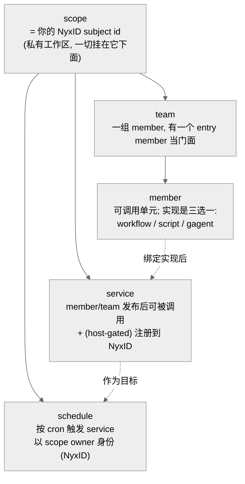
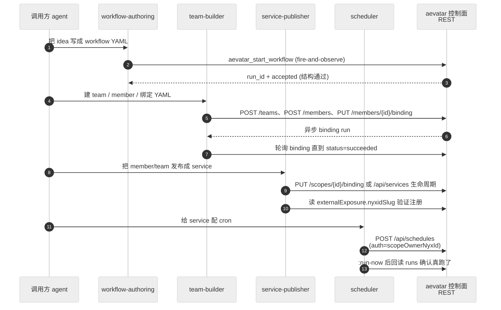
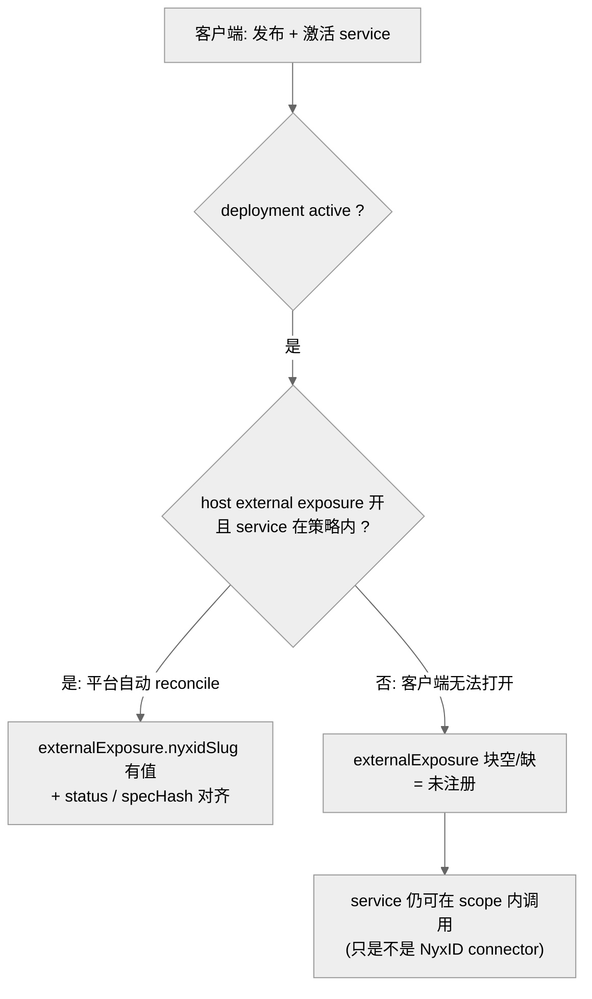
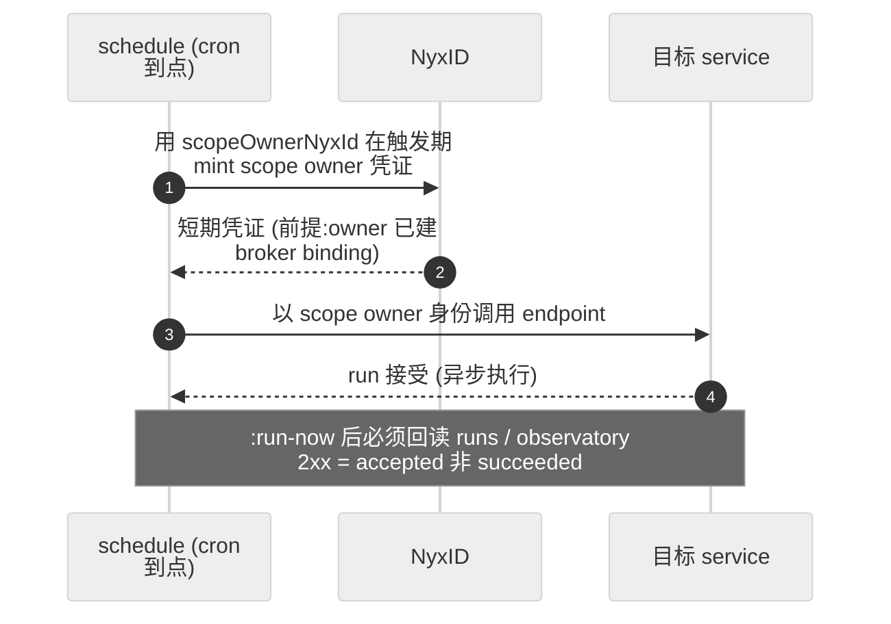

# 控制面家族:从 idea 到 schedule 的客户端 REST recipe

## 事实源/设计抽象(以 ~/Code/aevatar 为准)

> 本章讲的是 **aevatar 控制面 skill 家族**——一组让"手里有 NyxID token 的 agent"用纯 REST 把 idea 一路推到可调用、可调度服务的 skill。它们是 ornn-native `SKILL.md`,不住在 aevatar 源码树里;论断按下面两段事实源:
>
> - **skill 定义(只读,非 aevatar 源码)**:`~/Code/aevatar-ornn-skills/aevatar-platform-map/SKILL.md`、`.../aevatar-team-builder/SKILL.md`、`.../aevatar-service-publisher/SKILL.md`、`.../aevatar-scheduler/SKILL.md`——每个 skill 的边界、端点、黄金路径以各自 `SKILL.md` 为唯一权威。
> - **它们驱动的 aevatar 主链(`~/Code/aevatar`)**:控制面 REST 前门、published service 与 NyxID 的唯一结构耦合点,已在 [09/01 把 workflow 发布成 NyxID 服务](../09/01-workflow-as-nyxid-service/index.md) 沿真实源码(`ScopeServiceEndpoints.cs`、`service_definition.proto` 的 `ExternalExposure`)讲透。本章只做"skill → 主链"映射,不重复 09 的源码论证。
>
> 这四个 skill **都是本会话新建**的客户端 REST recipe,类别均为 `plain`(`metadata.category: plain`)。REST 基址统一为 `https://aevatar-console-backend-api.aevatar.ai`。可见性:`aevatar-platform-map` 线上 **public**,其余三个 **private**(`scope=mine` skill-search 实测)。

---

## 0. 一句话主线

> 控制面家族把 aevatar 的对象模型——**`scope`(= 调用方 NyxID subject id)→ `team` → `member`(实现是 `workflow`/`script`/`gagent` 之一)→ published `service`(host-gated 注册到 NyxID)→ `schedule`(cron)**——拆成一张 hub(`aevatar-platform-map`)+ 三根 spoke。每根 spoke 自包含,但都教同一件事:**你是客户端,用 NyxID bearer 打 REST,事实由 aevatar 主链拥有,你只负责按顺序调用 + 回读状态。**

## 1. 对象模型(一张图)

`aevatar-platform-map/SKILL.md` 把整个控制面收敛成一棵以 `scope` 为根的树;每根 spoke 负责其中一层:

`SKILL.md` 写明的典型生命周期(黄金路径):**author 一个 workflow → 包成 member → 聚成 team → 发布成 service(注册 NyxID)→ 给它配 schedule。** 这条链横跨四个 skill,下面一张时序图串起来。

## 2. 黄金路径:四个 skill 接力(端到端)

每一跳 `SKILL.md` 都反复强调同一条诚实纪律:**2xx 只代表 accepted,不代表 succeeded**——binding / deploy / schedule 触发都是异步,必须回读状态(binding run status、`externalExposure` 块、observatory runs),不能凭一个 2xx 报成功。

## 3. 鉴权与 scope 解析(每个 spoke 的 bootstrap){ #bootstrap }

四个 skill 的 `SKILL.md` 都以同一段 bootstrap 开头(各自重述,不互相依赖):

- **基址**:`https://aevatar-console-backend-api.aevatar.ai`。
- **鉴权**:每个调用带 `Authorization: Bearer <token>`;token 来自本地 NyxID CLI(`~/.nyxid/access_token`)或 agent 已持有的 NyxID-brokered 凭证(API key 同样当 bearer 发)。
- **解析 scope 一次**:`scopeId` = 你的 NyxID subject id,经 `GET /api/studio/context` 读回(`/api/auth/me`、`/api/workflow/observatory/me` 也返 `scopeId`)。
- **资源路径**:studio 资源全在 `/api/scopes/{scopeId}/...` 下;账户级 service / schedule 管理在 `/api/services`、`/api/schedules`。

---

## 4. `aevatar-platform-map` —— hub / 路由 { #platform-map }

**类别 `plain` · public · `SKILL.md` 是 panorama,不干活。**

- **职责**:它是家族的**入口与路由表**。教三件事——(1) 对象模型那棵树;(2) 怎么用 NyxID token 鉴权 + `GET /api/studio/context` 解析 scope;(3) 每个任务该 load 哪根 spoke。
- **关键:它自己不执行任务**。`SKILL.md` 的 router 表把"你想干什么"映射到"用哪个 skill + 关键端点",但真正的 create/bind/publish/schedule 都委托给 spoke;每根 spoke 也自包含,可不经 map 直接用。
- **诚实规则(原文承袭)**:`SKILL.md` 专门有一节 "Honesty rules" —— **你是客户端**(没有服务端工具替你建 team/service,都是你自己打 HTTP)、**NyxID 注册 host-gated**(host 没开 external exposure 就不会生成 NyxID connector,你开不了)、**很多步骤异步**(回读状态别假设)、**绝不编造 id**(只用 create/bind 响应回的 id)。

> **设计正当性**:为什么要一个"只导航不干活"的 hub?因为 `use_skill` 一次只注入一份 `SKILL.md` 正文,把对象模型 + 鉴权 + 路由集中在 map 里,spoke 才能保持窄而专;agent 先读 map 建立全局心智,再按需 load 单根 spoke,避免把四套 recipe 一次性灌进上下文。

## 5. `aevatar-team-builder` —— 建 team / member / 绑实现 { #team-builder }

**类别 `plain` · private。**

- **职责**:建一个 **team**、往里填 **member**(每个 member 的实现是 `workflow`(最常见)/ `script` / `gagent` 之一)、绑定各 member 的具体实现(**workflow YAML 在这一步以 inline 字符串挂上去**)、等异步 binding 跑到成功、设 team 的 entry member。产物是一个可调用的 team。
- **关键端点**:`POST /api/scopes/{id}/teams`(建 team)、`POST /api/scopes/{id}/members`(建 member 壳,typed `implementationRef` 引用实现 id)、`PUT /api/scopes/{id}/members/{memberId}/binding`(绑实现,启动异步 binding run)、`PUT /api/scopes/{id}/teams/{teamId}/entry-member`(设门面)。
- **强类型实现引用**:member 创建用 typed `implementationKind`(`workflow`/`script`/`gagent`)+ `implementationRef`;binding 请求体 `UpdateStudioMemberBindingRequest` **恰好携带其一**:`workflow{workflowId, workflowYamls[]}` / `script{scriptId, scriptRevision?}` / `gAgent{agentKind, endpoints?}`。这与本仓库 CLAUDE.md「API 字段单一语义 / 核心语义强类型」一致——不是塞一个通用 bag,而是按实现种类分 typed 子消息。
- **异步纪律(原文承袭)**:binding 状态机 `accepted → admission_pending → admitted → platform_binding_pending → … → succeeded`(或 `failed`/`rejected`)。`SKILL.md` 明令:**不要凭 PUT 的 2xx 报成功**,要轮询 `currentBindingRun.status` 到 `succeeded`,此时 member 才拿到 `publishedServiceId` 并可调用。

## 6. `aevatar-service-publisher` —— 发布成 service + 验证 NyxID 注册 { #service-publisher }

**类别 `plain` · private。**

- **职责**:把 member / team / workflow 变成**可调用 service**,并**验证它是否注册成了 NyxID brokered connector**,然后调用它。覆盖三条路径:已绑 member 读回其 published service(Path A)、一把 `PUT /api/scopes/{id}/binding` 把单个 workflow 发布成 scope 的 service(Path B)、账户级 service 完整生命周期(Path C:revision → prepare → publish → deploy,4-tuple `tenantId/appId/namespace/serviceId` 当身份)。
- **NyxID 注册的诚实口径(本块反复强调,源自 `SKILL.md`)**:注册是**自动但 host-gated** 的——deployment 变 active 时平台才把它 reconcile 到 NyxID,**且仅当 host 开了 external exposure、且该 service 在策略范围内**。客户端能驱动 publish + activation 并读结果,**但开不了 host 暴露**。所以必须验证。

- **验证即真相(原文承袭)**:`externalExposure` 块就是注册真值——`nyxidSlug`(空 ⇒ 未注册)、`status` / `lastError`、`desiredSpecHash` vs `registeredSpecHash`(相等 ⇒ NyxID 与当前契约同步)。块整体缺/空 ⇒ host 暴露对此 service 关着,**如实报告,别假装注册了**。
- **调用**:先读 endpoint 契约(`.../endpoints/{endpointId}/contract`),再 `POST /api/scopes/{scopeId}/services/{serviceId}/invoke/{endpointId}`(流式追 `:stream`);member/team 同形调用。运行观察走 `.../runs` 或 observatory。

> 这条 host-gated 缺口正是 [09/01 方案](../09/01-workflow-as-nyxid-service/index.md) 讲的"当中那一跳"——aevatar 侧 `ExternalExposure.nyxid_slug` 只是本地 slug 指针,把已发布 service 接到 NyxID 是平台/host 侧动作。service-publisher 把"验证这一跳到底有没有发生"做成了 skill 的固定步骤。

## 7. `aevatar-scheduler` —— cron 触发 + scope-owner 鉴权 { #scheduler }

**类别 `plain` · private。**

- **职责**:建一个 **schedule** 按 cron 触发已发布 service;preview / enable / disable / run-now / update / delete。先用 service-publisher 发布 service(需要其身份、endpoint、payload 类型)。
- **关键端点**:`POST /api/schedules/preview`(先预览 cron 的下 N 次触发,引擎无隐式本地时区,必须给真 IANA `timezone`)、`POST /api/schedules`(建)、`/{scheduleId}:run-now` / `:enable` / `:disable`(注意动作用**冒号**不是斜杠)、`PUT` / `DELETE`。
- **鉴权:`serviceInvocation.auth` 二选一**:
    - **`scopeOwnerNyxId: { scope }`** —— 触发时从 scope **owner** 的 NyxID 重新 mint 凭证,owner-run 调度的正确选择。**前提:scope owner 已建立 NyxID owner(broker)binding**,否则建 schedule 直接 400(见下「启用 scope-owner 定时任务」)。
    - **`senderNyxId: { subject{platform, externalUserId, tenant?}, scope }`** —— 以某个外部 subject 身份触发,**仅当该 subject 已有持久 NyxID 绑定**时才用,否则触发期 mint 失败。

### 启用 scope-owner 定时任务:建立 NyxID owner binding

实测(2026-06-23):用 `~/.nyxid` 的 NyxID CLI token 能建 team / member / service 并 invoke(整条链已端到端验证),但**建 `scopeOwnerNyxId` 调度会 400**:

> `Authenticated NyxID owner binding is required for scope owner schedule auth; complete or refresh NyxID login before creating a scope owner schedule.`

- **为什么**:定时触发无人值守,服务端要在触发期**重新 mint** scope owner 的 NyxID 凭证,因此要求 owner 有一条服务端**外部身份绑定**记录。`ScheduledDispatchEndpoints.EnsureScopeOwnerNyxIdBindingExistsAsync` 从会话 claims 解析 owner subject,再用 `IExternalIdentityBindingQueryPort.ResolveAsync(subject)` 查这条绑定;查不到即上面的 400。纯 CLI token 不携带它。
- **怎么建**:在 aevatar 控制台(studio web)用 NyxID **登录一次**——该 OAuth 流程会请求 `urn:nyxid:scope:broker_binding` scope(见 `GET /api/auth/nyxid/config`),登录完成即在服务端登记 owner binding;之后用同一身份建 `scopeOwnerNyxId` 调度即通过。token 过期后"刷新登录"重建绑定。
- **另一道闸(与鉴权无关)**:目标用 `payloadJson` 时必须带 `revisionId`(或目标 service 有 active serving revision),否则 400 `payloadJson requires a revisionId`;取 `GET /api/scopes/{scopeId}/services` 里的 `defaultServingRevisionId` 填入。

> **设计正当性**:为什么调度鉴权用 `scopeOwnerNyxId` 而不是绑一个具体外部 subject?因为定时触发是**无人值守**的——触发时没有 live 请求带 token,凭证必须能在触发期重新 mint。绑定到 scope owner 让"谁拥有这个 scope"成为天然可重 mint 的身份;代价是 owner 须先在控制台建立一次 broker binding(上面「启用」),但这比"为每个外部 subject 维护持久绑定"轻得多,也正对治 [07/12 定时任务](../07/12-scheduled-tasks.md) 沿 aevatar 源码讲的 Studio 定时"能建、触发失败"根因。

---

## 8. 这条家族的边界与诚实缺口

- **它们全是客户端 recipe,不是服务端能力**。`category: plain` 意味着 `use_skill` 只把 `SKILL.md` 正文注入模型——没有服务端工具替你建 team/service。所有动作 = agent 自己打 `https://aevatar-console-backend-api.aevatar.ai` 的 REST。事实始终由 aevatar 主链(actor 持久态 + committed event + observatory readmodel)拥有,skill 只教调用顺序。
- **NyxID 注册客户端开不了**(§6):host external exposure 默认关;skill 能驱动 publish + 验证 `nyxidSlug`,但打不开 host 暴露。这是 [09/01](../09/01-workflow-as-nyxid-service/index.md) 登记的同一条缺口,本家族把它显式写进每个相关 `SKILL.md`。
- **异步无处不在**:binding / deploy / schedule fire 都是 accepted ≠ succeeded,必须回读。这是本块从 `SKILL.md` 承袭、与不动点 FI-006 一致的硬纪律。
- **泛化、不硬编码**:四个 `SKILL.md` 里没有任何具体业务/组织/skill 名,符合本仓库 CLAUDE.md「不得对特定 skill 名硬编码」。

> 配套:这条家族驱动的 aevatar 主链源码论证见 [09/01 把 workflow 发布成 NyxID 服务](../09/01-workflow-as-nyxid-service/index.md)(发布—注册—发现—调用四步 + ADR)与 [09/03 provision 并实时观测](../09/03-provision-and-observe-via-nyxid/index.md)(调度鉴权前提的 live 实测)。authoring / fallback / probe 见 [本块 02](02-aevatar-platform-and-probe-skills.md)。

⟦AI:AUTO-LOOP⟧
