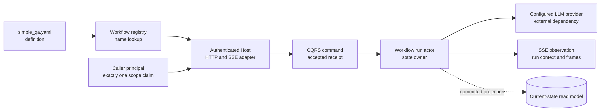
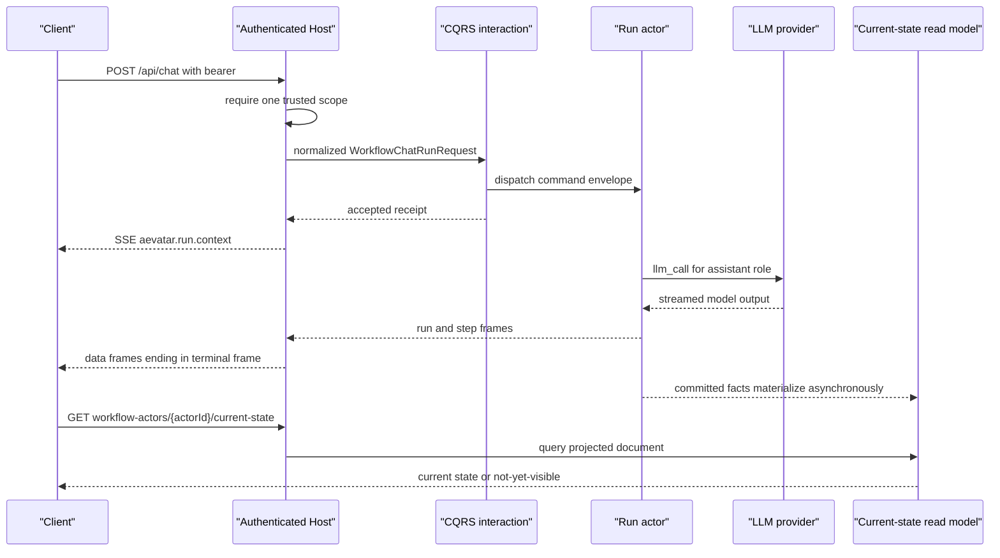

# 运行最小 Workflow：先证明定义，再观察一次运行

> 版本与结论：本章描述冻结基线的 `current` 框架契约。仓库自带的 `simple_qa` 只有一个 role 和一个 `llm_call` step；一次真实 `POST /api/chat` 必须经过已注册 authentication scheme 的 Host，caller token 还必须解析出恰好一个 scope claim。冻结版 Standalone Workflow Host 没有注册该 scheme，因此本章实际完成的是 `verified-static`；只有在具备有效 token、唯一 scope 与 LLM provider 的已组合部署上，后半段才可升级为 `verified-local`。

## 设计抽象与事实源

- `workflows/simple_qa.yaml:1-9`：最小定义只有 `assistant` role 与绑定该 role 的 `llm_call` step。
- `src/workflow/Aevatar.Workflow.Host.Api/README.md:3-22`、`:61-80`：Host 只负责 HTTP/SSE/WebSocket 与组合，命令经过 CQRS 骨架，accepted 只提供可追踪句柄。
- `src/workflow/Aevatar.Workflow.Infrastructure/CapabilityApi/ChatEndpoints.cs:31-58`、`:271-375`、`:1013-1052`：真实路由、SSE interaction、认证与唯一 trusted scope 准入。

## 先看边界：定义、Host、身份与模型缺一不可

最小 YAML 只是“要执行什么”的定义，不自带模型凭证、调用者身份或持久结果。运行时先从文件注册表解析 `simple_qa`，再从认证主体取得 scope，把请求规范化为 command，最终由 run actor 驱动 role 调用 LLM。SSE 是这次 interaction 的实时观察面；断线后的权威状态来自 current-state read model。



为什么不把 API、YAML 和 LLM key 塞成一个“运行脚本”？三者的 owner 不同：workflow 定义由作者维护，caller scope 由身份系统证明，provider credential 由 Host 配置持有。把它们合成一个文件会让定义携带秘密，也会让 body 里的 `scopeId` 冒充授权事实。

## 步骤 0：先判断当前 Host 能否完成真实请求

冻结代码有一个必须正视的组合缺口：

1. `POST /api/chat` 在进入 interaction 前要求 authentication 已开启、principal 已认证、`scope_id` / `workflow.scope_id` 去重后恰好一个；否则分别返回 `403 SCOPE_ACCESS_DENIED`、`401 AUTHENTICATION_REQUIRED` 或 `403 SCOPE_ACCESS_DENIED`。
2. `Aevatar.Workflow.Host.Api/Program.cs` 只组合 default Host、Platform、NyxID admin authorizer 与工具，没有调用 `AddAevatarAuthentication()`；default Host 只注册 authorization services，并且只在已有 scheme 时启用 authentication middleware。
3. Mainnet 确实组合 NyxID authentication 与 JWT resource server，但它把产品正式入口定义为 scope-first；其物理存在的 `/api/chat` 已不再是 `aevatar app` 的正式 contract。

因此有两条诚实路径：

| 目标 | 使用面 | 本章能证明什么 |
|---|---|---|
| 学定义与帧协议 | Standalone Workflow Host + 静态检查 | YAML shape、注册表来源、请求/错误/SSE contract |
| 跑产品闭环 | 已配置认证的 Mainnet/部署，走 scope-first draft、binding、invoke | 需要 scope、revision 与 binding；见 [11/03](03-create-bind-and-invoke-a-team-member.md) |

!!! warning "冻结基线的 Standalone 教程缺口"
    不要通过关闭认证来绕过：`ResolvePostTrustedScope` 在 authentication disabled 时明确返回 `403`。此组合漂移需要在 [12/05](../12/05-open-gaps-and-canon-drift.md) 登记；退出条件是 Standalone Host 明确组合认证，或 `/api/chat` 的准入契约重新提供可测试的开发身份注入面。

## 步骤 1：静态验证最小定义

先验证不依赖网络和秘密的部分。命令只使用 macOS/Linux 常见的 Ruby 标准库 `yaml`；`AEVATAR_REPO` 指向冻结提交或与之相同的 checkout：

```bash
export AEVATAR_REPO=~/Code/aevatar

ruby -ryaml -e '
doc = YAML.safe_load(
  File.read(File.join(ENV.fetch("AEVATAR_REPO"), "workflows/simple_qa.yaml")),
  permitted_classes: [], aliases: false
)
abort "wrong name" unless doc["name"] == "simple_qa"
abort "wrong role" unless doc.fetch("roles").map { |role| role["id"] } == ["assistant"]
step = doc.fetch("steps").fetch(0)
abort "wrong step" unless step.values_at("id", "type", "role") == ["answer", "llm_call", "assistant"]
puts "simple_qa-static: OK"
'
```

本章撰写时该命令对冻结快照的输出为：

```text
simple_qa-static: OK
```

这证明 YAML 能被通用 YAML parser 读取，且关键字段与冻结定义一致；它不等价于调用了 Aevatar 的完整 semantic validator。完整的 schema、primitive 与 capability admission 分层见 [03/02](../03/02-yaml-schema-and-validation.md) 和 [03/07](../03/07-connectors-and-capability-admission.md)。

## 步骤 2：启动 Host，并先查 catalog

在本地配置与启动依赖满足时，Standalone Host 可用于检查进程组合与文件注册表。它没有钉死监听端口，教程显式设置一个地址；本轮没有执行这条启动命令：

```bash
cd "$AEVATAR_REPO"
ASPNETCORE_URLS=http://127.0.0.1:5000 \
  dotnet run --project src/workflow/Aevatar.Workflow.Host.Api
```

另开终端查询：

```bash
curl -fsS http://127.0.0.1:5000/api/workflows
```

注册表会从应用目录、仓库根 `workflows/`、当前目录 `workflows/` 与 `~/.aevatar/workflows` 收集定义，duplicate policy 是 `Override`。看到 `simple_qa` 只能证明“定义已加载”，不能证明 provider、身份或执行已就绪。

## 步骤 3：在具备认证组合的部署发起请求

只有满足以下前提才执行本节：

- `AEVATAR_BASE` 指向包含 workflow capability 且已注册 JWT authentication 的部署；
- `ACCESS_TOKEN` 是该部署接受的 bearer，claims transformation 后恰好一个 canonical scope；
- Host 已配置能服务 `simple_qa` 的 LLM provider；
- 若指向 Mainnet，理解 `/api/chat` 只是冻结版框架兼容面，产品集成应改走 scope-first。

```bash
export AEVATAR_BASE=https://aevatar.example
export ACCESS_TOKEN='<user-provided-bearer>'

curl -N "$AEVATAR_BASE/api/chat" \
  -H "Authorization: Bearer $ACCESS_TOKEN" \
  -H 'Content-Type: application/json' \
  -H 'Accept: text/event-stream' \
  --data '{"prompt":"用一句话解释 Actor 模型","workflow":"simple_qa"}'
```

不要在 body 里添加 `scopeId`：该字段是被忽略的 legacy 输入，trusted scope 只能来自 principal。也不要把 access token 写进 YAML、shell history 文件或文档；上例的值是显式占位符。

## 步骤 4：区分 accepted、实时帧与读模型

一次成功 interaction 的顺序如下。accepted receipt 先让 Host 写 correlation header 并开启 SSE；`aevatar.run.context` 给出 `actorId`、`workflowName`、`commandId`。随后才是 run/step/text/terminal 帧。连接中断时不能拿“最后看见的一帧”冒充最终事实，应以 actor ID 查询 current-state read model。



SSE 的线格式固定为 `data: <protobuf JSON>` 加空行；空闲时 writer 每 15 秒发 `: keepalive` 注释。中间帧数量与 delta 切片不固定，不应写脚本依赖“第三帧一定是文本”。真正稳定的解析策略是按 oneof payload 类型分派，并记录 context 帧给出的句柄。

从首个 context 帧提取 `actorId` 后查询：

```bash
export ACTOR_ID='<actorId-from-aevatar.run.context>'

curl -fsS \
  -H "Authorization: Bearer $ACCESS_TOKEN" \
  "$AEVATAR_BASE/api/workflow-actors/$ACTOR_ID/current-state"
```

Projection 最终一致，所以 accepted 后立刻查询可能暂时 `404`；有限退避重试可以等待物化，GET 路径不应触发同步 replay。更完整的实时/事实区分见 [05/02](../05/02-committed-state-and-observation.md)。

## 失败定位：先看在哪道边界被拒绝

| 观察 | 所在边界 | 正确动作 |
|---|---|---|
| `simple_qa-static` 失败 | 文件/YAML shape | 回到冻结文件，先修名称、role 或 step；不要启动 Host |
| catalog 没有 `simple_qa` | 文件来源/工作目录 | 核对 `workflows/` 路径与启动目录 |
| `401 AUTHENTICATION_REQUIRED` | authentication principal | 提供部署接受的 bearer，不在 body 伪造 scope |
| `403 SCOPE_ACCESS_DENIED` | trusted scope | 核对认证是否启用、scope claim 是否缺失或歧义 |
| `404 WORKFLOW_NOT_FOUND` | registry lookup | 核对请求的 `workflow` 名称与 catalog |
| 开流后 `runError` | run/LLM execution | 读取 typed error，再查 current state 与 OTel；HTTP 200 不代表成功 |
| current-state 暂时 404 | Projection lag | 有限退避后重查，不在 query path 做 replay |

## Demo 状态与完成条件

> Demo status：`verified-static`。实际执行了 Ruby YAML shape 检查并得到 `simple_qa-static: OK`；本轮未启动上游 Host、未读取用户凭证、未调用 LLM，也未观察真实 SSE/current-state。缺失前提是可用 authentication 组合、带唯一 scope 的 bearer 与 LLM provider。满足前提并保存命令、终帧和读模型证据后，才可把一次具体环境的记录标为 `verified-local`；章节本身不因示例命令存在而自动升级。

## 边界与演进

- `current`：`simple_qa` 的定义、文件注册表、`/api/chat` interaction、trusted scope gate、SSE writer 与 current-state 查询路由均存在于冻结代码。
- 组合缺口：Standalone Host 的 README 仍把 `/api/chat` 当直接入口，但其 Program 没有注册 authentication scheme；代码准入与宿主说明发生漂移。
- 产品边界：Mainnet 的正式 API 是 scope-first。第一次学习可用本章理解框架协议，正式创建、绑定和调用 Member 则转到 [11/03](03-create-bind-and-invoke-a-team-member.md)。
- 不承诺：本章不保证某个 provider、model、网络或外部 token 可用，也不把一条 SSE 连接视为 durable truth。

## 读完应能回答

1. `simple_qa` 的最小定义包含哪些 role 与 step？
2. 为什么 YAML 解析成功仍不能证明 workflow 已可运行？
3. `POST /api/chat` 的 scope 从哪里来，为什么 body `scopeId` 不能授权？
4. accepted receipt、SSE terminal frame 与 current-state read model 分别证明什么？
5. 为什么冻结版 Standalone Host 只能用于本章的静态/catalog阶段，而不能被描述为匿名 chat 已跑通？

<details>
<summary>论断—证据映射</summary>

| 论断 | 等级 | 冻结证据 |
|---|---|---|
| `simple_qa` 只有一个 `assistant` role 与一个 `llm_call` step | E1 | `workflows/simple_qa.yaml:1-9` |
| Workflow Host 是协议适配与组合边界，不拥有业务编排 | E1 | `src/workflow/Aevatar.Workflow.Host.Api/README.md:3-22` |
| workflow 文件来源包含应用、repo root、cwd 与用户目录，重复策略为 Override | E1 | `src/workflow/Aevatar.Workflow.Infrastructure/DependencyInjection/WorkflowCapabilityServiceCollectionExtensions.cs:79-86` |
| `POST /api/chat` 映射到统一 interaction 入口 | E1 | `src/workflow/Aevatar.Workflow.Infrastructure/CapabilityApi/ChatEndpoints.cs:31-58` |
| POST 要求 authentication enabled、authenticated principal 与唯一 scope claim | E1 | `src/workflow/Aevatar.Workflow.Infrastructure/CapabilityApi/ChatEndpoints.cs:1013-1052`；`test/Aevatar.Workflow.Host.Api.Tests/ChatEndpointsInternalTests.cs:1128-1291` |
| body `scopeId` 是 ignored legacy field | E1 | `src/workflow/Aevatar.Workflow.Infrastructure/CapabilityApi/ChatCapabilityModels.cs:73-93` |
| Standalone Program 没有注册 authentication；default Host 只按已有 scheme 启用 middleware | E1 | `src/workflow/Aevatar.Workflow.Host.Api/Program.cs:18-49`；`src/Aevatar.Bootstrap/Hosting/WebApplicationBuilderExtensions.cs:94-103`、`:142-153` |
| Mainnet 显式组合 NyxID authentication 与 JWT resource server | E1 | `src/Aevatar.Mainnet.Host.Api/Hosting/MainnetHostBuilderExtensions.cs:158-161` |
| Mainnet 正式用户面是 scope-first，`/api/chat` 已不是 app 正式 contract | E1 | `src/Aevatar.Mainnet.Host.Api/README.md:137-188`、`:208-214` |
| accepted 后先写 context frame，再持续写 run frames | E1 | `src/workflow/Aevatar.Workflow.Infrastructure/CapabilityApi/ChatEndpoints.cs:319-345`、`:770-784` |
| SSE 使用 `data:` 行并每 15 秒写 keepalive comment | E1 | `src/workflow/Aevatar.Workflow.Infrastructure/CapabilityApi/ChatSseResponseWriter.cs:10-18`、`:37-68` |
| current-state HTTP 路由是 `/api/workflow-actors/{actorId}/current-state` | E1 | `src/workflow/Aevatar.Workflow.Infrastructure/CapabilityApi/ChatQueryEndpoints.cs:32-39`、`:127-137` |
| 静态 demo 对冻结文件返回 OK | E3 | 2026-07-29 本地运行本章 Ruby 命令：`simple_qa-static: OK` |

</details>
