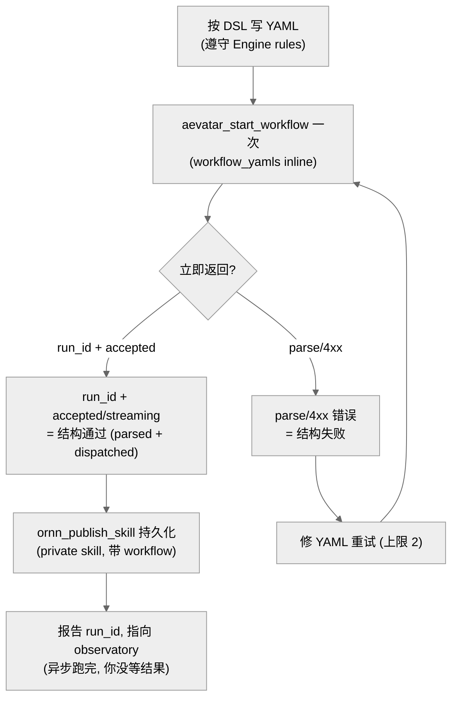
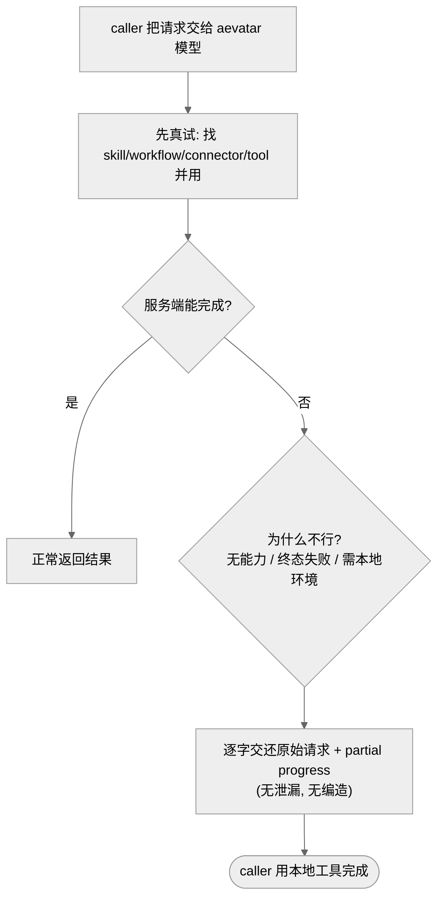

# 平台 skill 与 probe:authoring / fallback / 体检探针

## 事实源/设计抽象(以 ~/Code/aevatar 为准)

> 本章收 [控制面家族](01-aevatar-control-plane-skills.md) 之外、其余 aevatar 相关的 skill:一个 authoring skill、一个 fallback 护栏、一组 probe 体检探针。它们同样是 ornn-native `SKILL.md`,论断按两段事实源:
>
> - **skill 定义(只读,非 aevatar 源码)**:`~/Code/aevatar-ornn-skills/aevatar-workflow-authoring/SKILL.md`、`.../fallback-to-calling-agent/SKILL.md`,以及 `aevatar-*-probe` 各探针目录;作用以各自 `SKILL.md` 为唯一权威。
> - **authoring 驱动的 aevatar 引擎(`~/Code/aevatar`)**:workflow YAML 语法、引擎执行语义、observatory,已在 [02 编排层](../02/index.md) 沿真实源码讲透;本章只讲"authoring skill 怎么封装它"的契约与陷阱。
>
> 可见性(`scope=mine` skill-search 实测):`aevatar-workflow-authoring` 与 `fallback-to-calling-agent` 线上 **public**;`aevatar-*-probe` 六个全部 **private**。authoring 类别 `tool-based`,fallback 类别 `plain`。

---

## 0. 一句话主线

> 这三类 skill 落在能力层的不同位置:**authoring** 是"把 idea 变成可运行 workflow YAML"的服务端工具型 skill(`tool-based`,真调 `aevatar_start_workflow` 等工具);**fallback** 是套在所有 skill 之外的 try-catch 护栏(`plain`,搞不定就把原始请求逐字交还调用方);**probe** 是一组小体检探针(`private`,逐项探一个平台能力是否在线)。三者都遵守同一条诚实纪律:只承诺真做到的,做不到就显式交还/报告。

## 1. `aevatar-workflow-authoring` —— 生成 / 校验 / 持久化 workflow YAML { #workflow-authoring }

**类别 `tool-based` · public · 服务端工具:`aevatar_start_workflow` / `nyxid_services` / `ornn_publish_skill`。**

- **职责**:把用户自然语言请求变成**有效、试跑过、可复用**的 aevatar workflow。一个 workflow 是 `roles` + `steps` 的 YAML 文档,引擎执行它;校验后持久化成一个 private skill,用户可复跑并在 observatory 里看。
- **与控制面家族的区别**:authoring 是 `tool-based`——`use_skill` 注入正文外,它真的**调服务端工具**(`aevatar_start_workflow` 试跑、`nyxid_services` 列连接器、`ornn_publish_skill` 持久化);控制面四个 spoke 是 `plain`,只教 agent 自己打 REST。

### fire-and-observe 校验契约(本 skill 的核心纪律)

`SKILL.md` 的 Protocol 第 5 步是整份 skill 最关键的约束:**只 dispatch 一次试跑,fire 后立刻看返回,绝不等 `run_finished`**:

- **为什么 fire-and-observe**:`SKILL.md` 明写整个 turn 有 ~60s 网关上限,且工具轮不产可见文本。**等/轮询 `run_finished` 会把 turn 跑爆 → 整轮无输出被截断**。所以"立即返回 `run_id`"就是结构通过,业务结果交给 observatory 异步看。这与 [10/04 off-actor LLM run](../10/04-responses-llm-run-offactor-and-observation.md) 揭示的"长流式不能占用一个 turn"是同一条底层约束在 authoring 侧的体现。
- **引擎陷阱(`SKILL.md` 列为 must-obey,本块承袭)**:单终态步骤(无 `next` 且文档最后一行);fall-through 按文档顺序非 id 顺序(放错会静默覆盖输出);引擎无时钟(`today` 要从 input 注入);`role` 不是 model;`parameters` 值全是字符串;钱/计数/去重必须用 `transform` 不能交给 `llm_call`;外部调用走 `nyxid_proxy` 等工具不嵌裸 host。
- **插值陷阱(高价值、易踩)**:`${steps.<id>.output}` 才是对的——**引擎注册 `.output`、从不注册 `.text`**,写成 `${steps.<id>.text}` 会静默解析成空串(每步仍"completed",但下游工具收到空参数而失败)。这条正是本仓库 [02 编排层](../02/index.md) 沿引擎源码核实过的非显然事实,authoring skill 把它写进了 `SKILL.md` 的 Gotchas 以免生成的 workflow 踩坑。

## 2. `fallback-to-calling-agent` —— 通用 try-catch 护栏 { #fallback }

**类别 `plain` · public。**

- **职责**:aevatar 模型的**通用 try-catch 的 catch 半边**。当服务端**真做一遍**仍搞不定一个请求时,不静默失败、不道歉进死胡同、不编造结果,而是把**原始请求逐字**交还给调用它的 agent(caller),让 caller 用自己的本地工具完成。
- **三种触发场景(`SKILL.md`)**:(1) 服务端没有任何 skill/workflow/connector/tool 能做;(2) 试过可用路径但终态失败、无可行替代;(3) 任务本质需要 caller 的本地环境(本地文件、跑命令、看不到的本地上下文)——这是最该交还的情形。
- **关键护栏**:**先真试再 catch**(不是逃避借口,不能仅因"没把握"就交还);**逐字带原始意图**(不 paraphrase 掉细节);**不编造**;**不泄漏**(凭证/内部 host/connector 标识/服务端私有态);**带上 partial progress**(已产出的草稿/数据一并交回,让 caller 续做不重来)。
- **泛化设计**:`SKILL.md` 明令"generic by design",handoff 文本对"the calling agent"说话,**不硬编码任何 caller 身份或具体工具名**(handoff 用标签化纯文本 `HANDOFF TO CALLING AGENT` + 原请求逐字)。这与本仓库 CLAUDE.md「不得对特定 skill / 命令名硬编码」完全一致。

> **设计正当性**:为什么需要一个"交还"skill,而不是直接报错?因为 aevatar 模型常被**另一个 agent**(Claude Code / Codex)当 LLM 调用,caller 手里有 aevatar 服务端结构上没有的能力(本地 shell、文件)。一个干净的、带原始意图与 partial 的交还,让"服务端搞不定"不再是死胡同,而是把接力棒诚实地传回更有能力的一侧。注意它是**纯 skill**,只覆盖"模型在回路里的那个 turn"——抓不到后台异步 run 的失败(那是引擎级、out-of-scope)。

## 3. `aevatar-*-probe` —— 平台能力体检探针 { #probes }

**类别(未在本块逐一展开)· 全部 private。**

线上 `scope=mine` skill-search 实测,aevatar 名下有一组 probe skill,各探一个平台能力是否在线、行为是否符合预期:

| Probe | 探什么能力 |
|---|---|
| `aevatar-capability-probe` | 平台能力面整体可用性 |
| `aevatar-workflow-engine-probe` | workflow 引擎是否在线、可 dispatch |
| `aevatar-scripting-probe` | scripting 能力 |
| `aevatar-vision-probe` | 多模态 / 视觉 |
| `aevatar-attachment-probe` | 附件处理 |
| `aevatar-file-extract-probe` | 文件抽取(document extract) |

- **定位**:它们是**小体检探针**,不是给终端用户的功能 skill——用来确认"某个平台能力今天到底在不在线/行不行",是发布家族与 authoring 之外的运维/诊断辅助。本块只作为一组列出、不逐一展开各自 `SKILL.md`。
- **可见性**:六个全部 **private**(`scope=mine` 实测),与面向终端用户、需公开发现的 `aevatar-platform-map` / `aevatar-workflow-authoring` / `fallback-to-calling-agent` 形成对照——体检探针属于"自己人用"的内部能力,不公开。

> 这组 probe 对应的平台能力本身,分散在本书各组件块:vision/attachment/file-extract 见 [07/11 文件全链路](../07/11-file-handling-end-to-end.md),workflow-engine 见 [02 编排层](../02/index.md),scripting 见 [07/05 Studio + Scripting](../07/05-studio-and-scripting.md)。probe 只是"探针",真相仍在那些组件块里。

---

## 4. 附:本机的开发/运维 Claude Code skills(与平台 skill 区分)

> **边界说明**:下面这些是装在**开发者本机**的 Claude Code skill(`~/.claude/skills/`),**不是** ornn 平台 skill——它们跑在开发者机器上、操作开发者的工具链(CLI / kubectl / ornn 发布流),与上面"服务端经 `use_skill` 注入给 aevatar 模型"的 ornn skill 是两套东西。仅列本机**实测存在**的、与 aevatar/ornn 相关的:

| 本机 skill | 跑在哪 | 作用 |
|---|---|---|
| `aevatar-cli-mainnet` | 开发者机器 | 用 `@aevatar/cli` 验证 aevatar 主网功能(OpenAPI / scopes / runs / invoke / 通用 api 调用)。 |
| `aexon-aevatar` | 开发者机器 | 经 Aexon CLI 的 `aevatar` 子命令读主网接口 / `/api/openapi.json` / 调任意 `/api/...`,复用 `~/.nyxid` 登录态。 |
| `aevatar-pod-logs` | 开发者机器 | 经 kubectl 从 k8s 拉 aevatar console-backend(mainnet)stdout 日志,排查 bot/webhook/template 问题。 |
| `deploy-aevatar-app` | 开发者机器 | 部署 aevatar app。 |
| `ornn-build` / `ornn-search-and-run` / `ornn-upload` | 开发者机器 | ornn skill 的生成 / 搜索·拉取·执行 / 上传发布工具链。 |

- **为什么单独分一节**:这些 skill **不出现在线上 ornn skill-search**(它们不是发布到 ornn 的 skill),也不被 aevatar 模型 `use_skill` 注入。把它们和平台 skill 混在一张表里会误导"哪些是 aevatar 平台对外暴露的能力"。它们是开发者侧的脚手架:`ornn-upload` 等正是把上面那些 ornn 平台 skill **发布上去**的工具,二者是"工具" vs "产物"的关系。

> 配套:平台 skill 驱动的 aevatar 主链见 [11/01 控制面家族](01-aevatar-control-plane-skills.md) 与 [09 方案区](../09/index.md);workflow 引擎本身见 [02 编排层](../02/index.md)。

⟦AI:AUTO-LOOP⟧
