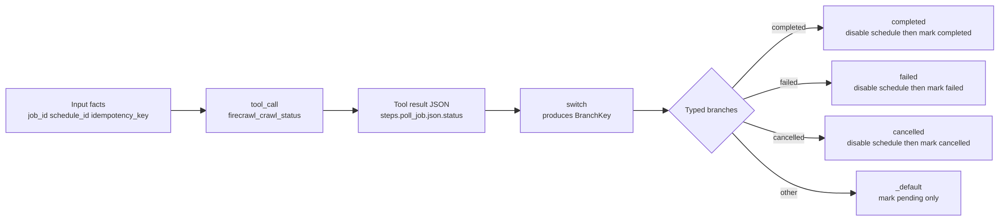
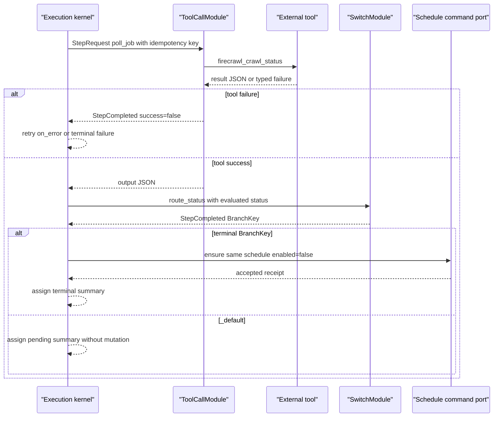

# 编写分支 Tool Workflow：把结果、路由与副作用分开

> 版本与结论：本章描述冻结基线的 `current` authoring contract。`firecrawl_agent_async_poll` 每次只调用一次状态工具，再按 `completed / failed / cancelled / _default` 四路分支；三个终态分支禁用同一个确定性 schedule，默认分支只记录 pending。冻结契约测试已用真实 `WorkflowParser + WorkflowValidator` 验证模板结构，状态为 `verified-static`；本轮没有调用 Firecrawl、没有获取 tool credential，也没有创建或修改 schedule。

## 设计抽象与事实源

- `src/workflow/Aevatar.Workflow.Core/Primitives/WorkflowPrimitiveCatalog.cs:12-59`、`:71-118`：canonical type、alias 与 side-effecting primitive 的集中策略。
- `src/workflow/Aevatar.Workflow.Core/Primitives/WorkflowYamlValidatorImpl.cs:5-44`：轻量入口只做 parse 与计数，不等同于完整结构或 capability readiness。
- `workflows/firecrawl_agent_async_poll.yaml:1-87`：一次 poll、四路 switch、终态 schedule disable 与 pending 输出的现行模板。

## 先画数据流，再写 YAML

分支 workflow 最容易犯的错，是把“工具返回了什么”“该走哪条边”“外部资源是否已改变”揉成一个字符串判断。冻结内核把它们拆成三层：

1. `tool_call` 输出 JSON，并把结果写入 `steps.poll_job.json.*` 变量；
2. `switch` 只选择 `BranchKey`，不执行目标 step；
3. execution kernel 用 typed `branches` 把 key 解析成下一 step，目标 primitive 再执行副作用。



为什么不用一个 `tool_call` 后直接结束？因为外部 job 的“本次查询成功”不等于 job 已终态。只有结果 JSON 的 `status` 决定是否停止轮询；HTTP/tool success 只说明这次读取完成。

## 步骤 1：从受测模板建立工作副本

不要从空白猜字段，先复制冻结模板并改名：

```bash
export AEVATAR_REPO=~/Code/aevatar
cp "$AEVATAR_REPO/workflows/firecrawl_agent_async_poll.yaml" /tmp/my_async_poll.yaml
sed -i.bak 's/^name: firecrawl_agent_async_poll$/name: my_async_poll/' /tmp/my_async_poll.yaml
```

`sed -i.bak` 在 macOS 与 BSD sed 上可用；Linux GNU sed 也会留下 `.bak`。本章不建议直接改上游示例，因为模板同时被注册表和契约测试消费。

先保留四类输入身份：

| 输入 | 用途 | 不变量 |
|---|---|---|
| `job_id` | 查询外部 job | 只进入工具参数与结果摘要 |
| `idempotency_key` | 约束同一次 side effect/retry identity | 不能每次 retry 随机生成 |
| `schedule_id` | 指向要禁用的同一个 poll schedule | 终态分支不得创建另一个 schedule |
| `scope_id` | 绑定 schedule mutation 与当前 run scope | 必须与 run scope 完全相等 |

## 步骤 2：写一个有 typed failure 的 Tool step

模板的第一步是：

```yaml
- id: poll_job
  type: tool_call
  idempotency_key: "${input.idempotency_key}"
  parameters:
    tool: firecrawl_crawl_status
    arguments: '{"job_id":"${json(input.job_id)}","idempotency_key":"${json(input.idempotency_key)}"}'
  next: route_status
```

新 authoring 应写 canonical `tool_call`，而不是自创 `http_poll`。`parameters.tool` 是 catalog name，`arguments` 是 JSON string；`json(...)` 用于转义嵌入值，不能把未经转义的 input 拼进 JSON。

`ToolCallModule` 会先发 tool-start observation，再从已组合的 tool sources 查 exact name。找不到工具、审批被拒绝、credential/外部调用失败都会形成 typed step failure；不会把失败 JSON 当普通成功输出继续送入 switch。`tool_call` 被 catalog 标为 side-effecting primitive，所以 idempotency identity 是重试边界的一部分，不是日志装饰。

## 步骤 3：用 `branches` 维护唯一作者路由

最小 switch 写法：

```yaml
- id: route_status
  type: switch
  parameters:
    on: "${steps.poll_job.json.status}"
  branches:
    completed: stop_completed_schedule
    failed: stop_failed_schedule
    cancelled: stop_cancelled_schedule
    _default: mark_pending
```

`WorkflowValidator` 要求 `switch` 至少有一个 branch 且必须有 `_default`；每个 target 还必须指向存在的 step。运行时先对 `on` 求值，`SwitchModule` 按 exact、case-insensitive contains、`_default` 的顺序选 key，然后 kernel 用 typed `branches` 解析 target。

冻结模板还在 `parameters` 里显式写了四个 `branch.*`，同时又写 typed `branches`。这不是需要复制的双事实源：dispatch 时 kernel 会从 typed map 重新写入 `request.Parameters["branch.<key>"]`，覆盖同名普通参数。新文件只维护 `branches` 即可；保留旧模板时，两处必须一致，否则 typed map 才是实际路由事实。

## 步骤 4：把终态清理与 pending 分开

终态不是直接 `assign`。它先确保同一个 schedule 被禁用，再记录业务摘要：

```yaml
- id: stop_completed_schedule
  type: self_reschedule
  parameters:
    schedule_id: "${input.schedule_id}"
    display_name: "Poll ${input.job_id}"
    cron_expression: "*/5 * * * *"
    timezone: UTC
    workflow_name: my_async_poll
    scope_id: "${input.scope_id}"
    prompt: "$input"
    enabled: "false"
  next: mark_completed

- id: mark_completed
  type: assign
  parameters:
    target: async_job
    value: '{"status":"completed","job_id":"${json(input.job_id)}"}'

- id: mark_pending
  type: assign
  parameters:
    target: async_job
    value: '{"status":"pending","job_id":"${json(input.job_id)}"}'
```

`enabled: "false"` 仍是一次 schedule command，不是内存 flag。`self_reschedule` 校验 `scope_id == run scope`，并把 accepted receipt 映射为 step completion；accepted 只表示 schedule command 已受理，不证明 projection 已可见。失败或取消分支应使用相同形状，各自再写不同的业务结果。

默认分支不触碰 schedule，因为 poll schedule 本来就会负责下一拍。若默认分支也调用 `self_reschedule enabled=true`，会把“保留既有 durable intent”变成重复 mutation，并扩大凭证、幂等与竞态面。



## 步骤 5：用真实 parser 与结构 validator 验证

仓库已为这两个 Firecrawl 模板提供精确契约测试。运行：

```bash
cd "$AEVATAR_REPO"
dotnet test test/Aevatar.Workflow.Host.Api.Tests/Aevatar.Workflow.Host.Api.Tests.csproj \
  --filter 'FullyQualifiedName~WorkflowAsyncJobTemplateContractTests' \
  --no-restore --nologo --verbosity quiet
```

如果本机尚未 restore，去掉 `--no-restore`。本轮在冻结派生快照上实际执行增量命令，结果为：

```text
已通过! - 失败: 0，通过: 4，已跳过: 0，总计: 4
```

四个测试共同证明：模板可被 `WorkflowParser` 解析、`WorkflowValidator.Validate` 无结构错误、四路 branch 与三个终态 cleanup 精确存在、没有退役的 `await_job / async_job` primitive 或 business headers。构建同时报告冻结依赖 `Microsoft.OpenApi 2.0.0` 与 `SIPSorcery 8.0.23` 的既有 NU1903 告警；测试通过不消除这些安全告警。

`WorkflowYamlValidatorImpl.Validate` 更轻：它成功只返回 name、step/role count。需要 authoring gate 时至少运行 parser + `WorkflowValidator`；需要发布或运行时，还要继续通过 known primitive、tool discovery、capability admission 与 caller authority。

## 失败定位

| 失败 | 所属边界 | 不应采取的捷径 |
|---|---|---|
| YAML parse error | schema/parser | 不要删字段直到“能读”，先看 offending field |
| branch target missing / no `_default` | structure validator | 不要依赖列表顺序偷偷兜底 |
| unknown primitive | current Host module set | 不要因 catalog 有名字就假定 extension 已安装 |
| tool not found / approval pending | tool catalog 与授权 | 不要把 pending 当空结果继续 switch |
| `scope_id must match` | schedule mutation boundary | 不要从 body/变量伪造另一个 scope |
| schedule accepted 但查询未见 | ACK 与 projection | 不要在 GET 里 replay 或重复创建 |

## Demo 状态

> Demo status：`verified-static`。本轮运行了冻结仓库的 `WorkflowAsyncJobTemplateContractTests`，4/4 通过；没有执行外部工具、没有取得 Firecrawl/NyxID credential、没有创建或禁用真实 schedule。因此它证明定义与结构，不证明 external call、授权、cron fire 或 cleanup 已在某环境成功。

## 边界与演进

- canonical type 与 parser/validator 是当前实现；Firecrawl 名称只是一个已提交模板，不构成 provider availability 承诺。
- `idempotency_key` 约束一次 side-effect identity，但不把外部 provider 变成 exactly-once。
- `switch` 的 contains fallback 会让 `completed_with_warnings` 命中 `completed`；若业务状态必须 exact-only，应在上游先规范化或改用更窄的条件，不要假装当前 switch 是严格枚举。
- schedule disable 的完整 actor/callback/credential 语义见 [09/02](../09/02-scheduled-actor-callback-and-fire.md) 与 [09/03](../09/03-owner-authorization-and-agent-key.md)。
- tool lookup、presentation 与审批边界见 [04/03](../04/03-tool-loop-catalog-and-presentation.md) 与 [04/04](../04/04-tool-approval-and-authorization.md)。

## 读完应能回答

1. 为什么 tool success 不能直接解释为外部 job terminal？
2. `SwitchModule` 的 `BranchKey` 与 typed `branches` 各由谁消费？
3. 为什么默认 pending 分支不应重新 enable schedule？
4. parser success、structure validation、tool readiness 与真实 execution 分别证明什么？
5. 4/4 契约测试通过后，为什么 demo 仍只能标 `verified-static`？

<details>
<summary>论断—证据映射</summary>

| 论断 | 等级 | 冻结证据 |
|---|---|---|
| canonical/alias 与 side-effecting primitive 由集中 catalog 判定 | E1 | `src/workflow/Aevatar.Workflow.Core/Primitives/WorkflowPrimitiveCatalog.cs:12-59`、`:71-118` |
| 轻量 YAML validator 只 parse 并返回计数 | E1 | `src/workflow/Aevatar.Workflow.Core/Primitives/WorkflowYamlValidatorImpl.cs:5-44` |
| parser 把 type、parameters、next 与 branches 归一到 typed step | E1 | `src/workflow/Aevatar.Workflow.Core/Primitives/WorkflowParser.cs:170-206`、`:1161-1220` |
| structure validator 检查 branch target，switch 强制 `_default` | E1 | `src/workflow/Aevatar.Workflow.Core/Validation/WorkflowValidator.cs:219-238`、`:290-300` |
| kernel 求值参数并从 typed branches 注入 `branch.*` | E1 | `src/workflow/Aevatar.Workflow.Core/Execution/WorkflowExecutionKernel.cs:1850-1897` |
| switch 依 exact、contains、default 选择 key，不直接决定 target | E1 | `src/workflow/Aevatar.Workflow.Core/Modules/SwitchModule.cs:25-84` |
| kernel 用 `BranchKey` 与 typed map 解析下一 step | E1 | `src/workflow/Aevatar.Workflow.Core/Execution/WorkflowExecutionKernel.cs:459-507`；`src/workflow/Aevatar.Workflow.Core/Primitives/WorkflowDefinition.cs:60-89` |
| tool lookup/credential/approval 失败成为 typed step failure | E1 | `src/workflow/Aevatar.Workflow.Core/Modules/ToolCallModule.cs:44-108`、`:111-146` |
| self-reschedule 要求 exact run scope，`enabled=false` 进入 command configuration | E1 | `src/workflow/extensions/Aevatar.Workflow.Extensions.Schedules/Modules/WorkflowSelfRescheduleModule.cs:78-160`、`:217-220` |
| 当前模板的四分支与三次终态 disable | E1 | `workflows/firecrawl_agent_async_poll.yaml:1-87` |
| 仓库契约测试解析模板并核对结构 | E1 | `test/Aevatar.Workflow.Host.Api.Tests/WorkflowAsyncJobTemplateContractTests.cs:41-105` |
| 冻结测试实际 4/4 通过 | E3 | 2026-07-29 本地增量 `dotnet test`，failed 0 / passed 4 |

</details>
