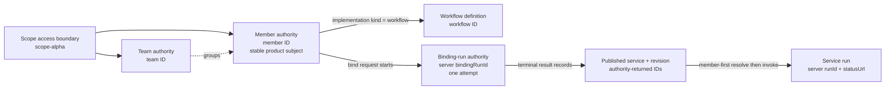
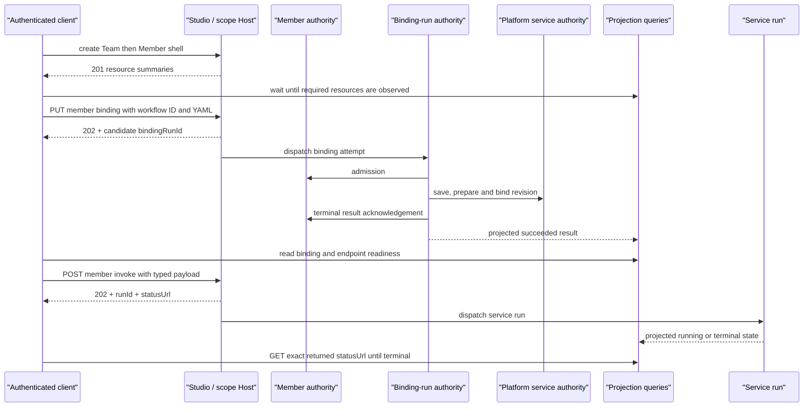

# 创建、绑定并调用 Team Member：沿响应句柄逐层观察

> 版本与结论：本章描述冻结基线的 `current` member-first 操作链。workflow Member 必须先有 Team 与 Member 壳，再用独立的 Workflow identity 发起 binding；首次 binding 的 `202 Accepted` 只给 candidate `bindingRunId`，要继续观察 terminal run、Member binding 与 endpoint readiness。buffered invoke 再返回新的 `runId/statusUrl`，它也不是最终结果。本轮只验证命令、JSON/YAML 与冻结契约测试，状态为 `verified-static`，没有启动 Host、发布 service 或调用 LLM。

## 设计抽象与事实源

- `src/Aevatar.Studio.Hosting/Endpoints/StudioMemberEndpoints.cs:46-77`、`:154-228`：Member create/bind/read surface，以及 binding-run `202 + Location` 观察句柄。
- `src/Aevatar.Studio.Application/Studio/Services/StudioMemberWorkflowBindingPort.cs:33-79`、`:83-174`：capability admission、首次 bind 与已发布 save-and-bind 两条路径。
- `src/platform/Aevatar.GAgentService.Hosting/Endpoints/ScopeServiceEndpoints.cs:56-132`、`:861-900`、`:2296-2419`：member-first resolve、invoke receipt 与 run status URL。

## 先分配身份，再发请求

这条教程故意让五个 ID 不相等。相等的字符串不能替代 typed relationship：

| 身份 | 示例 | 产生者 / 读取位置 | 只能用于 |
|---|---|---|---|
| `scopeId` | `scope-alpha` | authenticated scope claim 与 route | 所有 owner-scoped 请求 |
| `teamId` | `team-20260729` | 客户端显式选择，Team create response 确认 | Team route、Member 的分组字段 |
| `memberId` | `member-20260729` | Member create request/response | Member route |
| `workflowId` | `workflow-20260729` | binding body | draft Workflow identity |
| `bindingRunId` | 服务器生成 | 首次 bind accepted receipt | 该次 binding-run query |
| `publishedServiceId`、`revisionId` | authority/read model 返回 | terminal binding result 或 Member binding | endpoint/readiness 的已发布事实 |
| `runId`、`statusUrl` | invoke receipt 返回 | buffered invoke response | 该次 service run observation |



为什么不把 `memberId` 同时当作 Workflow 或 service ID？Member 是产品主体，Workflow 是可替换实现，published service 是跨 revision 的调用身份。把三者压成一个字符串会让重新绑定、发布新 revision 或迁移命名约定变成隐式换主键；current Host 因而从 Member authority/read model 解析真实 service identity。

## 步骤 1：准备 authenticated Mainnet / Studio Host

以下命令只把 secret 放在环境变量中，不把 bearer token 写进文件或命令示例。Host 必须已经启用 Studio、Workflow、projection 与 authentication；principal 还必须能访问 URL 中的 exact scope。认证与 scope 失败应先按 [10/05](../10/05-authentication-scope-and-admin-authorization.md) 排查。

```bash
export HOST=http://127.0.0.1:5080
export SCOPE_ID=scope-alpha
read -r -s -p 'Bearer token: ' TOKEN && printf '\n'
: "${TOKEN:?authenticated bearer token is required}"

export AEVATAR_REPO=~/Code/aevatar
test -f "$AEVATAR_REPO/workflows/simple_qa.yaml"

SUFFIX="$(date -u +%Y%m%d%H%M%S)"
export TEAM_ID="team-$SUFFIX"
export MEMBER_ID="member-$SUFFIX"
export WORKFLOW_ID="workflow-$SUFFIX"
```

时间后缀只是让一次手工演练少撞名，不是业务 idempotency contract。若要重试已受理的写请求，应先读取原 resource/operation 状态，不能靠生成另一个 ID 掩盖不确定结果。

## 步骤 2：创建 Team，并等到查询面可见

workflow Member 在 current create contract 中要求 `teamId`。先创建 Team：

```bash
jq -n \
  --arg teamId "$TEAM_ID" \
  '{teamId:$teamId,displayName:"Tutorial team",description:"11/03 verified scenario"}' \
  > /tmp/aevatar-team-create.json

curl --fail-with-body -sS \
  -H "Authorization: Bearer $TOKEN" \
  -H 'Content-Type: application/json' \
  -d @/tmp/aevatar-team-create.json \
  "$HOST/api/scopes/$SCOPE_ID/teams" \
  | tee /tmp/aevatar-team-created.json

jq -e --arg id "$TEAM_ID" '.teamId == $id and .scopeId == env.SCOPE_ID' \
  /tmp/aevatar-team-created.json
```

Team create 返回 `201 Created` 与 locally built summary，但这不证明 Team read model 已物化。Member create 会通过查询边界检查目标 Team，所以先做有界观察：

```bash
rm -f /tmp/aevatar-team-observed.json
for attempt in $(seq 1 30); do
  if curl -fsS \
    -H "Authorization: Bearer $TOKEN" \
    "$HOST/api/scopes/$SCOPE_ID/teams/$TEAM_ID" \
    > /tmp/aevatar-team-observed.json; then
    break
  fi
  sleep 1
done
jq -e --arg id "$TEAM_ID" '.teamId == $id' /tmp/aevatar-team-observed.json
```

这里的 `30 × 1s` 是手工 demo 上限，不是生产 SLO。超时后保留响应和日志排查 projection，而不是重复创建 Team。

## 步骤 3：创建 Member 壳，不在 create 中偷渡实现

`implementationRef` 在 create body 中被明确拒绝。创建一个 `workflow` kind 的 Member 壳，只带 Team relationship：

```bash
jq -n \
  --arg memberId "$MEMBER_ID" \
  --arg teamId "$TEAM_ID" \
  '{memberId:$memberId,teamId:$teamId,displayName:"Tutorial member",implementationKind:"workflow"}' \
  > /tmp/aevatar-member-create.json

curl --fail-with-body -sS \
  -H "Authorization: Bearer $TOKEN" \
  -H 'Content-Type: application/json' \
  -d @/tmp/aevatar-member-create.json \
  "$HOST/api/scopes/$SCOPE_ID/members" \
  | tee /tmp/aevatar-member-created.json

jq -e \
  --arg member "$MEMBER_ID" \
  --arg team "$TEAM_ID" \
  '.memberId == $member and .teamId == $team and .implementationKind == "workflow"' \
  /tmp/aevatar-member-created.json
```

Member create 同样返回 `201`，不是 read-model watermark。绑定前沿 stable Member Location 做有界观察；更重要的是，后续所有 Member API 都继续使用 response 中的 `memberId`，不把 `workflowId` 填进 Member path：

```bash
rm -f /tmp/aevatar-member-observed.json
for attempt in $(seq 1 30); do
  if curl -fsS \
    -H "Authorization: Bearer $TOKEN" \
    "$HOST/api/scopes/$SCOPE_ID/members/$MEMBER_ID" \
    > /tmp/aevatar-member-observed.json; then
    break
  fi
  sleep 1
done
jq -e --arg id "$MEMBER_ID" '.summary.memberId == $id' \
  /tmp/aevatar-member-observed.json
```

## 步骤 4：绑定受测 Workflow，并观察 binding run

用 `jq --rawfile` 把仓库受测 YAML 编进 JSON，避免手工转义换行：

```bash
jq -n \
  --arg workflowId "$WORKFLOW_ID" \
  --rawfile workflow "$AEVATAR_REPO/workflows/simple_qa.yaml" \
  '{workflow:{workflowId:$workflowId,workflowYamls:[$workflow]}}' \
  > /tmp/aevatar-member-bind.json

curl --fail-with-body -sS \
  -D /tmp/aevatar-member-bind.headers \
  -o /tmp/aevatar-member-bind-accepted.json \
  -X PUT \
  -H "Authorization: Bearer $TOKEN" \
  -H 'Content-Type: application/json' \
  -d @/tmp/aevatar-member-bind.json \
  "$HOST/api/scopes/$SCOPE_ID/members/$MEMBER_ID/binding"

BIND_RUN_ID="$(jq -er '.bindingRunId' /tmp/aevatar-member-bind-accepted.json)"
printf 'bindingRunId=%s\n' "$BIND_RUN_ID"
```

首次绑定的期望 HTTP 状态是 `202 Accepted`；body 中 `ackStage=dispatch_accepted` 与 `bindingRunRole=candidate` 只证明新 attempt 已被接受。沿 response 的 run identity 观察，不轮询写接口：

```bash
for attempt in $(seq 1 60); do
  code="$(curl -sS -o /tmp/aevatar-binding-run.json -w '%{http_code}' \
    -H "Authorization: Bearer $TOKEN" \
    "$HOST/api/scopes/$SCOPE_ID/members/$MEMBER_ID/binding-runs/$BIND_RUN_ID")"
  if [ "$code" = 200 ]; then
    status="$(jq -r '.status' /tmp/aevatar-binding-run.json)"
    case "$status" in
      succeeded) break ;;
      failed|rejected) jq . /tmp/aevatar-binding-run.json; exit 1 ;;
    esac
  fi
  sleep 1
done
jq -e '.status == "succeeded" and .stateVersion > 0' /tmp/aevatar-binding-run.json
```

刚拿到 Location 后查询可能短暂 `404`，因为 binding-run document 还没物化；这不等于 run 从未存在。terminal `succeeded` 包含 platform binding result 与 Member terminal acknowledgement，但仍不自动证明 endpoint readiness。

再从 Member binding 读取真实发布身份：

```bash
curl -fsS \
  -H "Authorization: Bearer $TOKEN" \
  "$HOST/api/scopes/$SCOPE_ID/members/$MEMBER_ID/binding" \
  > /tmp/aevatar-member-binding.json

SERVICE_ID="$(jq -er '.lastBinding.publishedServiceId' /tmp/aevatar-member-binding.json)"
REVISION_ID="$(jq -er '.lastBinding.revisionId' /tmp/aevatar-member-binding.json)"
printf 'publishedServiceId=%s revisionId=%s\n' "$SERVICE_ID" "$REVISION_ID"
```

为什么不自行计算 `member-$MEMBER_ID`？那只是 current create convention，不是客户端协议。authority 已经返回确切值，读取它比复制 prefix 规则更稳定。

## 步骤 5：读 endpoint contract，再调用与观察 run

Member endpoint contract 同时给出 schema、revision 与 readiness。先确认 `chat` 当前可调用：

```bash
curl -fsS \
  -H "Authorization: Bearer $TOKEN" \
  "$HOST/api/scopes/$SCOPE_ID/members/$MEMBER_ID/endpoints/chat/contract" \
  > /tmp/aevatar-member-chat-contract.json

jq -e \
  --arg revision "$REVISION_ID" \
  '.endpointId == "chat" and .revisionId == $revision and .invocationReadiness.canInvoke == true' \
  /tmp/aevatar-member-chat-contract.json

REQUEST_TYPE_URL="$(jq -er '.requestTypeUrl' /tmp/aevatar-member-chat-contract.json)"
```

contract 对 chat 通常把 `invokePath` 指向 SSE sibling。为了演示“受理与终态观察”分离，本节显式调用同一 member-first surface 的 buffered route：

```bash
jq -n \
  --arg typeUrl "$REQUEST_TYPE_URL" \
  --arg revisionId "$REVISION_ID" \
  --arg prompt 'Reply with exactly: member workflow OK' \
  '{payloadTypeUrl:$typeUrl,revisionId:$revisionId,payloadJson:({prompt:$prompt}|tojson)}' \
  > /tmp/aevatar-member-invoke.json

curl --fail-with-body -sS \
  -D /tmp/aevatar-member-invoke.headers \
  -o /tmp/aevatar-member-invoke-accepted.json \
  -X POST \
  -H "Authorization: Bearer $TOKEN" \
  -H 'Content-Type: application/json' \
  -d @/tmp/aevatar-member-invoke.json \
  "$HOST/api/scopes/$SCOPE_ID/members/$MEMBER_ID/invoke/chat"

RUN_ID="$(jq -er '[(.runId // ""),(.commandId // "")] | map(select(length > 0)) | first // error("missing run id")' \
  /tmp/aevatar-member-invoke-accepted.json)"
STATUS_URL="$(jq -er '.statusUrl | select(length > 0)' \
  /tmp/aevatar-member-invoke-accepted.json)"
case "$STATUS_URL" in
  http://*|https://*) RUN_URL="$STATUS_URL" ;;
  *) RUN_URL="$HOST$STATUS_URL" ;;
esac
printf 'runId=%s statusUrl=%s\n' "$RUN_ID" "$RUN_URL"
```

buffered invoke 的期望状态仍是 `202`。唯一可靠的下一跳是 response 给出的 `statusUrl`；它当前可能是 service-keyed path，调用方不应重新拼接。随后有界查询：

```bash
for attempt in $(seq 1 120); do
  if curl -fsS -H "Authorization: Bearer $TOKEN" "$RUN_URL" \
    > /tmp/aevatar-member-run.json; then
    completion="$(jq -r '(.completionStatus // 99) | tostring | ascii_downcase' \
      /tmp/aevatar-member-run.json)"
    case "$completion" in
      1|completed) break ;;
      2|3|4|5|6|timedout|timed_out|failed|stopped|notfound|not_found|disabled)
        jq . /tmp/aevatar-member-run.json
        exit 1
        ;;
    esac
  fi
  sleep 1
done
jq -e '(.completionStatus == 1) or (.completionStatus == "Completed") or (.completionStatus == "completed")' \
  /tmp/aevatar-member-run.json
```

`completionStatus` 是 Workflow 执行的终态观察；冻结 Host 的默认 `System.Text.Json` 配置把该 enum 编码为数字（`Completed=1`），脚本也容忍显式启用字符串 enum 的 Host。不要仅因为 GET 已返回 `200`、或 registry `status` 仍是 `Accepted` 就停止，也不要把 invoke receipt 中的 `requestId/commandId` 当成 `runId`，除非 response 明确没有 run ID并按其 fallback contract 给出 status URL。



## 为什么是这条链，不是快捷拼接

**为什么先创建 Member 壳，再绑定 Workflow？** create boundary 固定产品 identity、kind 与 Team relationship，并拒绝 `implementationRef`；binding 是带 capability admission、revision 与失败恢复的独立协议。把两者揉成一次请求会让“资源已创建、发布失败”的部分结果无法命名和恢复。

**为什么 binding 与 invoke 都返回 operation handle？** 两者跨 actor、projection 和外部能力边界。同步等待会把 read-model lag 或 LLM latency变成 HTTP 不确定失败；`bindingRunId` 与 `runId/statusUrl` 让每次 attempt 有稳定观察身份。

**为什么 readiness 不能省略？** binding terminal 证明 Member authority 接受发布结果，不证明 catalog、serving set 与 prepared artifact 已被当前查询面观察。endpoint contract 集中返回 exact revision/schema/readiness，避免客户端分别猜多个 projection。

**为什么调用 member-first route，而不是先把 Member 转成 service URL？** Host 内部 resolver 读取 authority-backed `publishedServiceId`，使重新绑定和 service 命名约定变化不泄漏到客户端。response 的 `statusUrl` 再接管 run 路由，客户端不需要复制 resolver 逻辑。

## Demo 状态

> Demo status：`verified-static`。本轮用冻结 `simple_qa.yaml` 生成并解析 Team、Member、binding 与 invoke JSON，运行相关 Studio/Scope endpoint 契约测试；没有可用的 authenticated Mainnet Host、scope、LLM credential 或已部署 projection，因此没有发出上述 HTTP mutation，也没有把静态验证写成“发布/调用已跑通”。

## 边界与演进

- create 的 `201` 与 bind/invoke 的 `202` 都不是 committed/read-model/terminal proof；每一步只沿其稳定 resource 或 operation handle 观察。
- workflow Member 当前要求 `teamId`，但 Team create 与 Team read model 之间可能有传播窗口；demo 的有界等待只暴露这个事实，不定义生产 SLO。
- 直接 `PUT .../members/{memberId}/binding` 返回 `bindingRunId`。使用 `StudioMemberWorkflowBindingPort` 的组合调用者会在其观察到已发布 Member 时改走 save-and-bind 并返回 `revisionId`；两条入口当前没有统一 durable operation shape，客户端必须按 typed response 区分。
- binding-run document 尚未物化与真正不存在当前都可能呈现 `404`。客户端只能基于刚收到的 accepted receipt 做有界重试；更强协议需要显式 pending shape 或 watermark。
- endpoint readiness 是当前观察快照，不是永久许可。invoke 仍可能因 concurrent revision/serving 漂移、LLM/provider、authorization 或 runtime failure 失败。
- Studio-aware resolver 在 Member projection缺失时保留 legacy `publishedServiceId == memberId` fallback。教程先观察 Member/binding并从返回值读 ID，避免把该 fallback 当成 Studio 发布成功。
- chat 的 endpoint contract倾向返回 SSE `invokePath`；buffered sibling 用于获得 `202`/run handle，SSE 用于实时 frame。两者共享 service execution identity，但断开 stream 不等于取消或终结 run。
- 命令里的 `TOKEN`、`SCOPE_ID` 与 Host 配置均由操作者提供。本章不附带真实 bearer、canary resource 或外部 service credential。

## 读完应能回答

1. Team、Member、Workflow、binding run、published service/revision 与 service run 的 ID 分别从哪里取得，为什么不能互换？
2. 首次 bind 的 `202 + bindingRunId`、run `succeeded`、Member binding 可见与 endpoint `canInvoke` 各证明什么？
3. 为什么 workflow Member 要先创建 Team/Member 壳，且 create body 不能包含 `implementationRef`？
4. buffered invoke 返回 `202` 后，为什么应该使用 response 的 `statusUrl`，而不是自行拼 Member 或 service run path？
5. 哪些前置条件缺失时，本章只能标 `verified-static`？

<details>
<summary>论断—证据映射</summary>

| 论断 | 等级 | 冻结证据 |
|---|---|---|
| Team create contract 接受 display/description/optional Team ID，route 返回 `201` | E1 | `src/Aevatar.Studio.Application.Abstractions/Studio/Contracts/TeamContracts.cs:51-54`；`src/Aevatar.Studio.Hosting/Endpoints/StudioTeamEndpoints.cs:35-40`、`:65-83` |
| workflow Member create 必须带 Team，create 禁止 implementationRef | E1 | `src/Aevatar.Studio.Application.Abstractions/Studio/Contracts/MemberContracts.cs:206-227`；`src/Aevatar.Studio.Application/Studio/Services/StudioMemberCreateRequestValidator.cs:18-46` |
| Member routes区分 create、bind、binding view、binding run 与 endpoint contract | E1 | `src/Aevatar.Studio.Hosting/Endpoints/StudioMemberEndpoints.cs:46-77` |
| bind body 是 typed workflow/script/gagent union，workflow variant含 Workflow ID 与 YAML 列表 | E1 | `src/Aevatar.Studio.Application.Abstractions/Studio/Contracts/MemberContracts.cs:279-327` |
| 首次 bind receipt只承诺 candidate run与dispatch accepted stage | E1 | `src/Aevatar.Studio.Application.Abstractions/Studio/Contracts/MemberContracts.cs:32-53`、`:329-337`；`src/Aevatar.Studio.Hosting/Endpoints/StudioMemberEndpoints.cs:154-176` |
| binding-run response暴露 status、StateVersion、failure/result，而 published/rebind走另一条 save-and-bind路径 | E1 | `src/Aevatar.Studio.Application.Abstractions/Studio/Contracts/MemberContracts.cs:169-191`；`src/Aevatar.Studio.Application/Studio/Services/StudioMemberWorkflowBindingPort.cs:70-79`、`:83-174` |
| Member endpoint contract携 published service、revision、invoke path、schema与readiness | E1 | `src/Aevatar.Studio.Application.Abstractions/Studio/Contracts/MemberContracts.cs:347-378`；`src/Aevatar.Studio.Application/Studio/Services/StudioMemberService.cs:214-244`、`:775-843` |
| member-first invoke先解析 authority-backed service ID，再进入通用 invoke core | E1 | `src/Aevatar.Studio.Application/Studio/Services/StudioAwareMemberPublishedServiceResolver.cs:42-68`；`src/platform/Aevatar.GAgentService.Hosting/Endpoints/ScopeServiceEndpoints.cs:861-900` |
| buffered invoke返回 accepted receipt并生成 statusUrl，receipt分别携 command/run/status identity | E1 | `src/platform/Aevatar.GAgentService.Hosting/Endpoints/ScopeServiceEndpoints.cs:2296-2419`；`src/platform/Aevatar.GAgentService.Abstractions/Protos/service_endpoint.proto:74-84` |
| typed JSON payload要求 type URL，JSON与base64互斥；chat request至少含 prompt | E1 | `src/platform/Aevatar.GAgentService.Hosting/Endpoints/ScopeServiceEndpoints.cs:2358-2395`、`:4267-4273`；`src/Aevatar.AI.Abstractions/ai_messages.proto:53-73` |
| 教程 YAML 是冻结仓库中的最小 LLM workflow | E1 | `workflows/simple_qa.yaml:1-9` |

</details>
