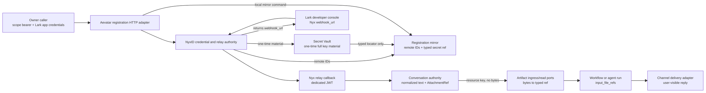
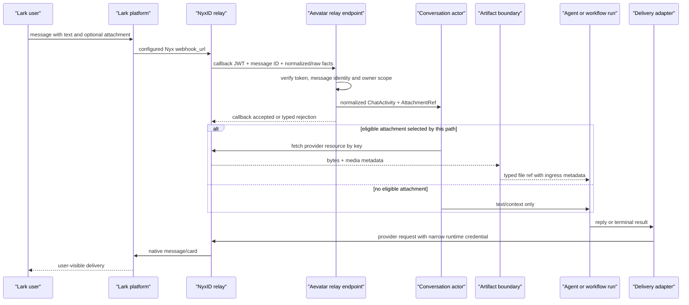

# 连接 Channel 并处理文件：注册、入站、Artifact 与 Delivery 分层验证

> 版本与结论：本章描述冻结基线的 `current` released surface。操作者用 authenticated `/api/channels/registrations` 让 Aevatar 在 NyxID 创建 Lark bot/route/key 并登记 local mirror；Lark 开发者后台配置 response 的 `webhook_url`，Nyx 再以专用 callback JWT 调用 Aevatar 的 `relay_callback_url`。附件先成为 channel-neutral `AttachmentRef`；普通 Chat 只在有界 recent window 内处理可见的 Lark 图片，Workflow draft 只处理当前 activity 的 Lark 图片/文件，下载/ingress 后才产生 typed artifact ref。owner 字段由具体入口提供，raw bytes 与 app secret 不进入 conversation/workflow durable facts。本轮未使用真实 Lark/NyxID credential，状态为 `verified-static`。

## 设计抽象与事实源

- `agents/channels/Aevatar.GAgents.Channel.NyxIdRelay/ChannelCallbackEndpoints.cs:29-75`、`:92-179`、`:336-445`：authenticated registration/list/status/repair surface 与异步观察字段。
- `agents/Aevatar.GAgents.Channel.Abstractions/protos/channel_contracts.proto:96-154`：bot binding、adapter capability 与 `supports_files` 的 channel-neutral 边界。
- `src/workflow/Aevatar.Workflow.Infrastructure/CapabilityApi/WorkflowMultipartFileInputParser.cs:21-97`、`:150-190`：multipart 字段、大小/MIME 准入及 bytes→artifact ref 转换边界。

## 四个事实面，不能用一次 `202` 代替

| 事实面 | owner / adapter | 稳定观察 | 不能证明 |
|---|---|---|---|
| provisioning | NyxID + Vault + local registration command | registration response 的 remote IDs、随后 registration list | local actor 已 commit、bot 收到消息 |
| relay activity | Nyx channel bot + Aevatar relay admission | registration status 的 `active/pending_webhook/unknown` 与 `last_event_at` | conversation reply 已送达 |
| attachment/artifact | relay adapter、Conversation、artifact ingress/read/ownership ports | adapter-owned attachment key；有界 recent-image context；执行时的 typed file ref、hash/TTL 与入口可选 owner | 任意文件都对 LLM 可见、所有路径都支持跨消息聚合或 owner 必然非空 |
| reply/result delivery | Conversation / WorkflowRunDelivery actor | 用户在真实 channel 看见结果；内部 delivery facts与 OTel/logs | 只因 HTTP/tool/LLM 成功就已送达 |



为什么不是让 Lark 直接打 Aevatar？NyxID 统一持有 channel credential、验证平台 webhook、生成短期 callback JWT、路由并提供 reply/resource proxy；Aevatar 只接收 authenticated relay callback。这样 app secret、reply token 与 user token 的生命周期不必复制进 Conversation actor。代价是 Nyx remote resources、Vault 与 local mirror 不构成一个原子事务，因此必须逐层观察和补偿。

## 步骤 1：准备 owner 身份与 HTTPS callback base

使用已装配 Channel Runtime、NyxID client、Vault、projection 与 authentication 的 Mainnet Host。默认本地监听来自冻结 README；真实 Lark callback 必须能被 NyxID 从公网访问，因此 `WEBHOOK_BASE_URL` 应是指向当前 Host 的 HTTPS origin，而不是浏览器页面地址。

```bash
export HOST=http://127.0.0.1:5080
export SCOPE_ID=scope-alpha
export WEBHOOK_BASE_URL=https://aevatar.example.com
read -r -s -p 'Aevatar bearer token: ' TOKEN && printf '\n'
read -r -p 'Lark app id: ' LARK_APP_ID
read -r -s -p 'Lark app secret: ' LARK_APP_SECRET && printf '\n'
read -r -s -p 'Lark verification token: ' LARK_VERIFICATION_TOKEN && printf '\n'
: "${TOKEN:?bearer required}" "${LARK_APP_ID:?app id required}"
: "${LARK_APP_SECRET:?app secret required}" "${LARK_VERIFICATION_TOKEN:?verification token required}"
```

production `webhook_base_url` 必须是 absolute HTTPS；只有 loopback development 允许 HTTP。先检查公开的 shallow health route，只证明 route 已挂载：

```bash
curl -fsS "$WEBHOOK_BASE_URL/api/webhooks/nyxid-relay/health" | jq -e \
  '.status == "ok" and .endpoint == "/api/webhooks/nyxid-relay"'
```

它不访问 NyxID、不验证 callback signing keys，也不证明 bot registration。production 不映射 `/diag`；不要把 development token relay probe 当生产健康检查。

## 步骤 2：通过 released surface 注册 Lark bot

registration JSON 使用 snake_case。secret 只存在本次 request body；响应和 registration list不应回显它：

```bash
jq -n \
  --arg platform lark \
  --arg scope_id "$SCOPE_ID" \
  --arg webhook_base_url "$WEBHOOK_BASE_URL" \
  --arg app_id "$LARK_APP_ID" \
  --arg app_secret "$LARK_APP_SECRET" \
  --arg verification_token "$LARK_VERIFICATION_TOKEN" \
  '{platform:$platform,scope_id:$scope_id,webhook_base_url:$webhook_base_url,
    app_id:$app_id,app_secret:$app_secret,verification_token:$verification_token,
    label:"11/04 tutorial bot"}' \
  > /tmp/aevatar-channel-registration.json

curl --fail-with-body -sS \
  -o /tmp/aevatar-channel-registration-accepted.json \
  -X POST \
  -H "Authorization: Bearer $TOKEN" \
  -H 'Content-Type: application/json' \
  -d @/tmp/aevatar-channel-registration.json \
  "$HOST/api/channels/registrations"

REGISTRATION_ID="$(jq -er '.registration_id | select(length > 0)' \
  /tmp/aevatar-channel-registration-accepted.json)"
LARK_WEBHOOK_URL="$(jq -er '.webhook_url | select(length > 0)' \
  /tmp/aevatar-channel-registration-accepted.json)"
RELAY_CALLBACK_URL="$(jq -er '.relay_callback_url | select(length > 0)' \
  /tmp/aevatar-channel-registration-accepted.json)"
printf 'registration=%s\nLark console webhook=%s\nNyx callback to Aevatar=%s\n' \
  "$REGISTRATION_ID" "$LARK_WEBHOOK_URL" "$RELAY_CALLBACK_URL"
```

成功响应是 `202 Accepted`，但 provisioning 已在返回前顺序执行了多项远端操作，并只把 local mirror command 的 acceptance 包进结果。response 的两个 URL 不能互换：

- 在 **Lark 开发者后台**配置 `webhook_url`，形如 NyxID 的 `/api/v1/webhooks/channel/lark/{botId}`。
- `relay_callback_url` 固定落到 Aevatar `/api/webhooks/nyxid-relay`，由 Nyx provisioning 写入 route；Lark 后台不应直接指向它。

不要把 registration payload/response提交到 Git；前者含 app secret。请求若网络结果不确定，先用 list/status查现有 registration和Nyx资源，不要盲目重发：current registration每次生成新 identity，重复调用不是 exactly-once。

## 步骤 3：分别观察 local mirror、bot live status 与 delivery capability

先等 owner-scoped registration projection可见：

```bash
for attempt in $(seq 1 30); do
  curl -fsS -H "Authorization: Bearer $TOKEN" \
    "$HOST/api/channels/registrations" \
    > /tmp/aevatar-channel-registrations.json
  if jq -e --arg id "$REGISTRATION_ID" \
    'any(.[]; .id == $id and .owned == true)' \
    /tmp/aevatar-channel-registrations.json >/dev/null; then
    break
  fi
  sleep 1
done
jq -e --arg id "$REGISTRATION_ID" '.[] | select(.id == $id)' \
  /tmp/aevatar-channel-registrations.json
```

再读 bot live/relay observation：

```bash
curl -fsS -H "Authorization: Bearer $TOKEN" \
  "$HOST/api/channels/registrations/$REGISTRATION_ID/status" \
  | tee /tmp/aevatar-channel-status.json

jq -e '.status == "active" or .status == "pending_webhook" or .status == "unknown"' \
  /tmp/aevatar-channel-status.json
```

含义不同：

| 字段 | 可接受值 | 解释 |
|---|---|---|
| `status` | `pending_webhook` | bot已配置，但尚未观察到 verified inbound |
| `status` | `active` | Nyx或Aevatar已观察到入站活动；不是 reply delivery proof |
| `status` | `unknown` | live status query不可用；不能反推 bot dead |
| `workflow_result_delivery_status` | `enabled` | terminal-result delivery有 typed credential handle |
| 同上 | `repair_required/repairing/repair_failed` | 需要 owner-scoped repair或继续观察，不能宣称后台结果可送达 |

只有 Lark registration 且 capability非 `enabled` 时，才使用 released repair route；它是有副作用的 key rotation/Vault/route修复，不是普通 GET：

```bash
curl --fail-with-body -sS -X POST \
  -H "Authorization: Bearer $TOKEN" \
  "$HOST/api/channels/registrations/$REGISTRATION_ID/workflow-result-delivery/repair" \
  | jq .
```

`202 repairing` 仍需继续查 status；`200 repaired/already_enabled` 才是该 capability 的当前结果。退役的 `/test-reply` 固定返回 `410 Gone`，不能拿它作为 reply smoke test。

## 步骤 4：让真实平台产生 callback，不手工伪造 JWT

在 Lark 中给刚注册的 bot 发送一条普通消息。NyxID 应验证 Lark event并调用 `relay_callback_url`，携带至少专用 `X-NyxID-Callback-Token` JWT 与 `X-NyxID-Message-Id`。Aevatar校验 signature、issuer、audience、`token_type=relay_callback`、JTI/message/correlation关系与 replay window，再解析 conversation identity并 dispatch。



不要用普通 bearer `curl` 手工 POST relay route；它会缺 callback JWT/JTI/message identity，测试的是拒绝路径，不是 end-to-end。实际验证至少收集：registration status变为 `active`或 `last_event_at`推进、Aevatar audit/trace中有 `channel.relay.inbound`、以及用户在Lark看到对应回复。三个信号分别属于 live activity、ingress admission、delivery，不能相互代替。

## 步骤 5：验证文件准入与 ref 边界

Channel `AttachmentRef.attachment_id` 是 adapter-owned identifier；对冻结实现里的 Lark 图片/文件，它是下载所需的 provider resource key，不是 artifact ID。实际消费还需要 platform message ID、短期 user credential 与正确的 provider client。三个入口不能混成一个“自动附件管线”：

| 入口 | 选择范围 | ingress 结果 | 失败语义 |
|---|---|---|---|
| 普通 Lark Chat | 当前 activity + Conversation 最近 10 分钟内最多 5 条 attachment activities；只把图片送入 multimodal LLM | `source_kind=chat_input`，保留 source message/resource key；该入口不主动填 owner | 文本继续执行，并注入 attachment visibility warning，禁止假装看过附件 |
| Lark Workflow draft | 仅当前 activity 的 `image/file`，不读取 recent window | `source_kind=connected_service_resource`，写 owner run/scope | download/ingress 缺失或失败时 fail closed 为 `workflow_attachment_ingress_failed` |
| HTTP multipart service invoke | 当前 request 中可重复的 `file` | `source_kind=form_upload`，入口传 owner scope，ref 进入 workflow input parts | 任一 pending file 不合规即拒绝 request；逐文件 ingress 不是批量事务 |

为隔离第三条 file ingress，可对上一章已经 ready 的 workflow Member 做 multipart probe：

```bash
export MEMBER_ID=member-from-11-03
export REVISION_ID=revision-from-member-binding
export SAMPLE_FILE=/absolute/path/to/sample.png
test -s "$SAMPLE_FILE"

jq -cn --arg revisionId "$REVISION_ID" \
  '{prompt:"Describe the attached file",revisionId:$revisionId}' \
  > /tmp/aevatar-file-payload.json

curl --fail-with-body -sS -N \
  -H "Authorization: Bearer $TOKEN" \
  -H 'Accept: text/event-stream' \
  -F 'payload=</tmp/aevatar-file-payload.json;type=application/json' \
  -F "file=@$SAMPLE_FILE;type=image/png" \
  "$HOST/api/scopes/$SCOPE_ID/members/$MEMBER_ID/invoke/chat:stream"
```

默认 form字段名是 `payload` 与可重复的 `file`。每个 file必须非空、不超过当前配置（默认10 MiB），且 MIME在 allowlist；任一文件字段名、大小或MIME错误会拒绝整批 pending input。file parser先把 bytes留在 pending form，multipart chat parser逐个调用 artifact ingress，成功后才构造 `source_kind=form_upload` 的 typed ref。该 probe只验证 HTTP multipart路径，不证明 Lark resource download链；真实 channel attachment必须由 Lark activity触发并结合 relay/download日志验证。

为什么不把 base64/bytes写进 actor event？内容可能很大、会过期、需要独立授权与清理；event history却要长期可重放。artifact ref保留身份、hash、长度、MIME与TTL；Workflow draft/multipart等知道 run/scope 的入口再提供 owner，普通 Chat image ingress当前不主动填 owner。读取端经窄 port验证descriptor与内容hash后再打开内容。为什么还允许 ingress边界读 bytes？不读取内容就无法建立可信hash/长度和artifact记录；关键是 bytes止于边界，不成为 durable actor fact。

## Demo 状态

> Demo status：`verified-static`。本轮用 `jq` 实际生成并校验 snake_case registration JSON与multipart payload，运行冻结 registration/provisioning/relay parser、callback authentication和multipart parser测试；没有 Lark app、NyxID owner token、public HTTPS callback或 ready Member，因此没有创建 remote bot/key/route、没有上传真实文件，也没有声称用户已收到回复。

## 为什么是它，不是别的

**为什么 registration endpoint接收 app secret，却不让 actor保存？** provisioning adapter需要用 secret在Nyx建立bot/proxy；长期业务事实只需remote IDs与typed Vault locator。把secret写进event/read model会把rotation、撤销与retention绑定到不可变历史。

**为什么操作者配置 Nyx `webhook_url`，而不是 Aevatar relay URL？** Lark签名/事件适配与channel credential属于Nyx authority；Aevatar只接受Nyx签发的callback identity。绕过Nyx直打Aevatar会失去正确的JWT、resource proxy、reply token与owner binding。

**为什么 attachment先是 resource key，后是 artifact ref？** relay收到的key只在特定provider/message语境可解析；下载边界取回bytes，artifact ingress生成hash/TTL并保留入口实际提供的owner字段后，才形成可被运行链引用的稳定身份。提前把key叫artifact会绕过内容准入与ownership。

**为什么没有一个“registration success”代表全链成功？** Nyx remote provisioning、Vault put、local actor commit、projection、first inbound、run与delivery分别可失败。一个大同步事务既跨系统又跨用户动作；小的accepted receipt加明确观察点更诚实，也允许按失败边界修复。

## 边界与演进

- registration每次生成新ID，重复提交可创建新的remote key；网络不确定时先查现有资源。稳定caller idempotency/operation状态落地前，不能把POST称为exactly-once。
- response `workflow_result_delivery_status=repair_required`不否定interactive relay reply；两者使用不同credential path。也不能因interactive reply成功推断terminal-result delivery已enabled。
- status `active`只说明观察到inbound/live bot状态，不证明LLM完成或delivery succeeded。当前没有公开owner-scoped conversation-delivery HTTP查询；需要结合真实channel可见结果与OTel/logs，内部read model不能被虚构成released API。
- `/api/webhooks/nyxid-relay/health`是shallow route probe；production不映射`/diag`。不应在生产开放任意token gateway探针。
- 普通 Lark Chat 已支持有界的“先发图片、后提问”：Conversation保留最近10分钟内最多5条含附件activity，`/clear`会清空；可下载且模型支持的图片进入后续Chat输入，不可见附件产生明确warning。它不是通用file inbox，也不是consume-once drain：非图片不进入普通Chat多模态输入，同一recent图片在过期、超cap或`/clear`前可能参与多个turn。
- Workflow draft只选择触发命令所在当前activity的Lark `image/file`，不会读取上述recent window；因此“先发文件、后发 `/workflow ...`”仍不成立。把Workflow文件与触发命令放在同一消息，跨路径统一聚合缺口见 [08/04](../08/04-file-artifacts-and-attachments.md) 与后续 `12/05`。
- multipart目前只支持workflow service stream；static GAgent与scripting target带文件会被拒绝。MIME allowlist和size是Host配置，教程默认值不是永久协议。
- artifact ingress逐文件执行，不是批量事务；后项失败时前项artifact可能保留到TTL cleanup。不要用重试制造另一批孤儿对象。
- 删除registration先清远端bot/route/key再tombstone local mirror；hard bot delete失败会保留mirror以便重试。它不是本教程的cleanup shortcut，执行前先确认资源owner。

## 读完应能回答

1. registration response中的 `webhook_url` 与 `relay_callback_url` 分别由谁调用，为什么不能互换？
2. `202 Accepted`、registration可见、bot `active`、workflow-result delivery `enabled`与用户看到回复各证明什么？
3. 为什么不能用普通 bearer手工模拟 Nyx relay callback？
4. channel `AttachmentRef`、provider resource key、artifact ref与raw bytes分别止于哪条边界，哪些入口会填 owner？
5. 普通 Chat 的 recent-image window 与 Workflow draft 的 current-activity file input 有何不同，为什么两者都不能叫通用 drain？

<details>
<summary>论断—证据映射</summary>

| 论断 | 等级 | 冻结证据 |
|---|---|---|
| registration/list/status/repair是authenticated released surface，test-reply已退役 | E1 | `agents/channels/Aevatar.GAgents.Channel.NyxIdRelay/ChannelCallbackEndpoints.cs:29-75`、`:562-585` |
| registration body为snake_case且接收Lark app fields、scope与HTTPS base | E1 | `agents/channels/Aevatar.GAgents.Channel.NyxIdRelay/ChannelCallbackEndpoints.cs:86-147`、`:723-767` |
| provisioning创建key/bot/route/provider连接，Vault只返回typed ref，local mirror最后accepted | E1 | `agents/channels/Aevatar.GAgents.Channel.NyxIdRelay/NyxLarkProvisioningService.cs:109-235` |
| response区分Nyx webhook URL与Aevatar relay callback URL | E1 | `agents/channels/Aevatar.GAgents.Channel.NyxIdRelay/NyxLarkProvisioningService.cs:131-133`、`:211-235`；`agents/channels/Aevatar.GAgents.Channel.NyxIdRelay/NyxRelayCallbackUrl.cs:14-30` |
| owner-scoped status区分live状态与workflow-result delivery capability，跨scope默认隐藏存在性 | E1 | `agents/channels/Aevatar.GAgents.Channel.NyxIdRelay/ChannelCallbackEndpoints.cs:182-249`、`:319-445` |
| relay route只豁免普通bearer，仍要求专用callback JWT/message identity并做scope解析 | E1 | `agents/Aevatar.GAgents.NyxidChat/NyxIdChatEndpoints.cs:37-57`；`agents/channels/Aevatar.GAgents.Channel.NyxIdRelay/NyxIdRelayAuthValidator.cs:71-159`、`:194-225` |
| relay把text/conversation/delivery address与附件规范化为channel-neutral activity/ref | E1 | `agents/channels/Aevatar.GAgents.Channel.NyxIdRelay/NyxIdRelayTransport.cs:21-187`、`:225-295` |
| AttachmentRef只承载adapter-owned identifier/metadata，channel capability单独声明supports_files | E1 | `agents/Aevatar.GAgents.Channel.Abstractions/protos/chat_activity.proto:155-171`；`agents/Aevatar.GAgents.Channel.Abstractions/protos/channel_contracts.proto:96-154` |
| 普通Chat recent attachment window为10分钟/最多5条，`/clear`清空；仅可用Lark图片物化，失败时注入可见性warning | E1 | `agents/Aevatar.GAgents.Channel.Runtime/Conversation/ConversationGAgent.cs:76-81`、`:340-360`、`:2889-2899`、`:3451-3525`；`agents/Aevatar.GAgents.NyxidChat/ConversationReplyGenerator.cs:558-744` |
| Workflow draft只取当前Lark activity的image/file，download后以run/scope owner ingress，失败时fail closed | E1 | `agents/Aevatar.GAgents.NyxidChat/WorkflowDraftRun/ChannelWorkflowDraftRunInteractionPort.cs:238-324`、`:358-378` |
| multipart只接受配置字段、size/MIME，成功ingress后才构造typed ref并传入caller scope | E1 | `src/workflow/Aevatar.Workflow.Infrastructure/CapabilityApi/WorkflowMultipartFileInputParser.cs:21-97`、`:150-190`；`src/platform/Aevatar.GAgentService.Hosting/Endpoints/ScopeServiceEndpoints.cs:1859-1913`、`:3990-4028` |
| 默认file/payload字段、10MiB与allowlisted MIME来自Host options | E1 | `src/workflow/Aevatar.Workflow.Infrastructure/CapabilityApi/WorkflowFormFileIngressOptions.cs:3-10`；`src/workflow/Aevatar.Workflow.Infrastructure/CapabilityApi/WorkflowMultipartFileIngressOptions.cs:3-25` |
| conversation delivery有独立projected state，但当前无公开delivery HTTP surface | E1 | `agents/Aevatar.GAgents.Channel.Runtime/protos/conversation_delivery_current_state.proto:5-21`；`agents/Aevatar.GAgents.Channel.Runtime/ConversationDeliveryQueryPort.cs:5-20`；冻结route枚举无对应public endpoint |

</details>
