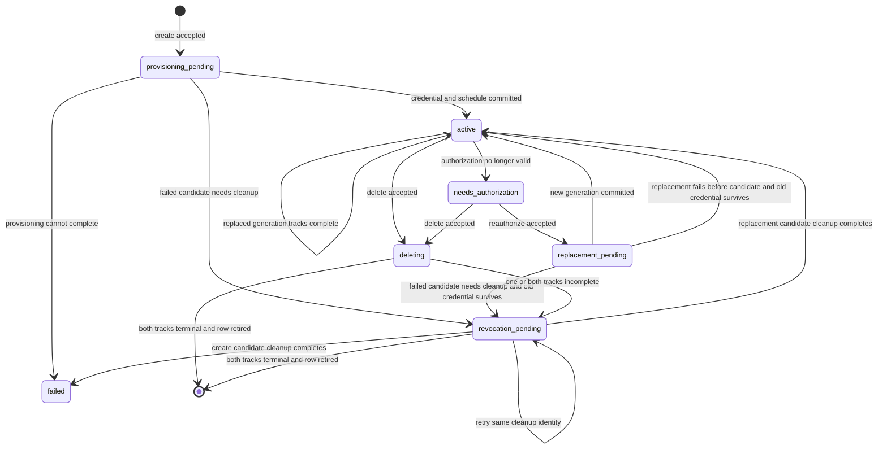
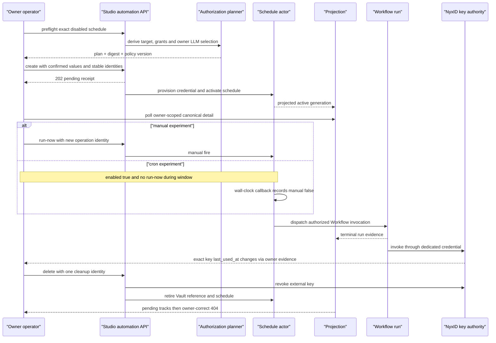

# 创建、验证与排障 Automation：不要把 `202` 当成已经执行

> 版本与结论：本章描述冻结基线的 `current` Studio Team Member automation surface。推荐先对已绑定的 Workflow Member 做 preflight，再以 `enabled=false` 创建 dedicated scheduled-invocation Agent Key，观察 owner-scoped detail 到 `active`，最后分别选择 `run-now` 或真实 wall-clock cron 验证。`202 Accepted`、projected state、Workflow run、fire record、exact key use 与双轨撤销是不同证据层。本轮没有启动 Host、创建 Agent Key、等待 cron 或访问生产环境，demo 状态为 `verified-static`。

## 设计抽象与事实源

- `src/Aevatar.Studio.Hosting/Endpoints/StudioMemberAutomationEndpoints.cs:19-47`、`:50-167`、`:203-400`、`:558-598`：owner-scoped route、请求 contract、`202` receipt 与动作边界。
- `src/platform/Aevatar.GAgentService.Projection/Queries/ScheduledDispatchQueryPort.cs:16-49`、`:158-250`：projected summary、fire record 与 `manual` 事实的内部读模型边界。
- `docs/operations/2026-07-23-scheduled-agent-key-production-canary.md:1227-1343`、`:1433-1641`、`:1643-1874`：精确 preflight、active/run/key-use 证据、双轨撤销与恢复顺序。

## 一项 automation 跨越多个事实所有者

客户端只提交时间、提示词、显示名和确认值；它不能指定 Workflow identity、service grant、key ID 或 secret reference。服务器从 exact Team Member binding、owner authorization catalog 与 LLM route 推导授权计划，再把 credential 和 schedule 生命周期交给各自事实所有者。

```mermaid
%%{init: {"maxTextSize": 100000, "flowchart": {"useMaxWidth": false, "nodeSpacing": 15, "rankSpacing": 48}, "themeVariables": {"fontSize": "10px"}}}%%
flowchart LR
    U["Authenticated owner<br/>scope claim + fresh bearer"]
    M["Studio Team Member authority<br/>Team + Member + bound Workflow"]
    P["Authorization planner<br/>exact grants + owner LLM selection"]
    N["NyxID credential authority<br/>dedicated Agent Key"]
    V["Aevatar Vault<br/>secret custody"]
    S["Schedule actor<br/>lifecycle + fire intent"]
    Q["Projection<br/>owner-scoped summary"]
    R["Workflow run authority<br/>terminal execution evidence"]
    U -->|"preflight and confirm digest"| P
    M -->|"server-derived target"| P
    P -->|"non-wildcard credential plan"| N
    N -->|"one-time material"| V
    P -->|"authorization fact"| S
    V -->|"typed secret locator"| S
    S --> Q
    S --> R
    Q -->|"no raw key, key ID or secret ref"| U
```



为什么不让浏览器直接提交 grants 或 key？这些值来自绑定 revision、NyxID catalog 与 owner LLM selection；若客户端可以覆盖，就能把“确认服务器计划”降级成“自行声明权限”。preflight 返回可审查的 typed plan，create 只回传其 digest 与 policy version。任何计划漂移都必须重新 preflight，不能沿用旧确认。

公开 Studio automation detail 是 owner-scoped summary，只包含 lifecycle、credential generation/expiry、next/last fire、owner LLM selection 与 revocation tracks；它不返回 raw key、`apiKeyId`、`SecretReference`，也不返回 `recentFires[].manual`。内部 schedule projection 保存 fire records 与 `manual`，但本教程不把平台级 `/api/schedules/{scheduleId}` 当成 Team owner 的证明接口：冻结路由没有像 Studio route 那样将 caller claim 与 query 中的 scope 做等价校验。生产 cron proof 应使用绑定版本的受控 canary/owner-scoped 运维证据，而不是扩大普通调用者权限。

## 生命周期与完成点



`active` 只表示可用 credential generation 与 schedule 已提交并投影，不表示 fire 已发生。`enabled` 只控制 recurring cron；`run-now` 在 disabled automation 上仍可被接受。reauthorize 期间旧 credential 继续服务；新 candidate 失败时，若 candidate 已产生则先进入 `revocation_pending` 清理它，清理完回到旧 credential 的 `active`，而不是静默丢掉旧 generation。新 generation 成功后也会撤销被替换的旧 credential，此时 lifecycle 可保持 `active`，同时 `revocationPending=true` 直到两条 replacement tracks 收敛。pause/resume 不撤销 credential；delete 则对终止使用的 active credential 启动 NyxID 与 Vault 撤销。终态 row 消失之前可能观察到 `deleting` 或 `revocation_pending`；owner-correct `404` 仍需和 list absence、exact key absence 或受控 `6202` audit 组合，才能提高撤销结论强度。

## 步骤 1：准备上一章的 Team Member

先完成 [11/03](03-create-bind-and-invoke-a-team-member.md)，确认 Member 是 `workflow` kind、binding terminal succeeded，且 `publishedServiceId/revisionId` 来自 authority response。Host 必须装配 Studio、Workflow、projection、authentication、NyxID catalog、credential materializer 与 Vault。

```bash
export HOST=http://127.0.0.1:5080
export SCOPE_ID=scope-alpha
export TEAM_ID=team-from-11-03
export MEMBER_ID=member-from-11-03
read -r -s -p 'Aevatar owner bearer: ' TOKEN && printf '\n'
test -n "$TOKEN"

export AUTOMATION_BASE="$HOST/api/scopes/$SCOPE_ID/teams/$TEAM_ID/members/$MEMBER_ID/automations"

curl --fail-with-body -sS \
  -H "Authorization: Bearer $TOKEN" \
  "$HOST/api/scopes/$SCOPE_ID/members/$MEMBER_ID/binding" \
  > /tmp/aevatar-automation-member-binding.json

export PUBLISHED_SERVICE_ID="$(jq -er '.lastBinding.publishedServiceId' \
  /tmp/aevatar-automation-member-binding.json)"
export REVISION_ID="$(jq -er '.lastBinding.revisionId' \
  /tmp/aevatar-automation-member-binding.json)"
```

同一 bearer 的 authenticated subject 必须能解析到 verified NyxID binding，并且 URL 中的 `scopeId/teamId/memberId` 必须和 Member authority 一致。跨 scope 会被拒绝；跨 Team/Member ownership 被隐藏为 `404`，不要据此猜测资源是否存在。

## 步骤 2：preflight 并人工确认 exact plan

示例先使用 disabled schedule。以下四个期望值来自 owner 已保存的 LLM route 与 NyxID catalog，不是从 route string 猜出的替代身份：

```bash
export SCHEDULE_CRON='0 9 * * *'
export SCHEDULE_TIMEZONE=UTC
export AUTOMATION_PROMPT='Produce the daily digest'
export AUTOMATION_DISPLAY_NAME='Daily digest'

read -r -p 'Expected NyxID user service ID: ' EXPECTED_USER_SERVICE_ID
read -r -p 'Expected service slug: ' EXPECTED_SERVICE_SLUG
read -r -p 'Expected owner LLM route: ' EXPECTED_OWNER_LLM_ROUTE
read -r -p 'Expected owner LLM model: ' EXPECTED_OWNER_LLM_MODEL
: "${EXPECTED_USER_SERVICE_ID:?required}" "${EXPECTED_SERVICE_SLUG:?required}"
: "${EXPECTED_OWNER_LLM_ROUTE:?required}" "${EXPECTED_OWNER_LLM_MODEL:?required}"

jq -n \
  --arg cron "$SCHEDULE_CRON" \
  --arg timezone "$SCHEDULE_TIMEZONE" \
  --arg prompt "$AUTOMATION_PROMPT" \
  --arg displayName "$AUTOMATION_DISPLAY_NAME" \
  '{
    scheduleCron: $cron,
    scheduleTimezone: $timezone,
    prompt: $prompt,
    displayName: $displayName,
    enabled: false
  }' > /tmp/aevatar-automation-preflight.json

curl --fail-with-body -sS \
  -H "Authorization: Bearer $TOKEN" \
  -H 'Content-Type: application/json' \
  -d @/tmp/aevatar-automation-preflight.json \
  "$AUTOMATION_BASE/preflight" \
  > /tmp/aevatar-automation-preflight-response.json
```

不要只检查 `success=true`。确认 invocation target、exact service grant、两个 wildcard、owner LLM selection、digest 与 policy version：

```bash
jq -e \
  --arg scope "$SCOPE_ID" \
  --arg team "$TEAM_ID" \
  --arg member "$MEMBER_ID" \
  --arg service "$PUBLISHED_SERVICE_ID" \
  --arg revision "$REVISION_ID" \
  --arg userService "$EXPECTED_USER_SERVICE_ID" \
  --arg slug "$EXPECTED_SERVICE_SLUG" \
  --arg route "$EXPECTED_OWNER_LLM_ROUTE" \
  --arg model "$EXPECTED_OWNER_LLM_MODEL" '
  .success == true
  and .plan.invocationTarget.studioMember.scopeId == $scope
  and .plan.invocationTarget.studioMember.teamId == $team
  and .plan.invocationTarget.studioMember.memberId == $member
  and .plan.invocationTarget.studioMember.publishedServiceId == $service
  and .plan.invocationTarget.studioMember.workflowRevisionId == $revision
  and .plan.credentialPolicy.allowAllServices == false
  and .plan.credentialPolicy.allowAllNodes == false
  and (([.plan.nyxIdServiceGrants[].userServiceId] | sort) == [$userService])
  and (([.plan.nyxIdServiceGrants[].serviceSlug] | sort) == [$slug])
  and .plan.ownerLlmSelection.routeKind == 2
  and .plan.ownerLlmSelection.routeValue == $route
  and .plan.ownerLlmSelection.nyxIdUserServiceId == $userService
  and .plan.ownerLlmSelection.serviceSlugSnapshot == $slug
  and .plan.ownerLlmSelection.model == $model
  and (.plan.permissionDigest | type == "string" and length > 0)
  and (.plan.credentialPolicy.policyVersion | type == "string" and length > 0)
  ' /tmp/aevatar-automation-preflight-response.json

export PERMISSION_DIGEST="$(jq -er '.plan.permissionDigest' \
  /tmp/aevatar-automation-preflight-response.json)"
export POLICY_VERSION="$(jq -er '.plan.credentialPolicy.policyVersion' \
  /tmp/aevatar-automation-preflight-response.json)"
```

冻结响应中 `ownerLlmSelection.routeKind == 2` 表示 `NyxIdUserService`。它不是可随意替换的 magic number；若部署改变 JSON enum 表示或 contract version，应以部署 contract 与 fresh preflight 为准，并重新验收脚本。

本例沿用上一章的单一 LLM service Workflow，所以要求 service-grant 集合恰好等于一个 expected UserService。若受测 Workflow 还调用 connector/tool，先从业务批准清单得到**完整 exact grant set**再修改等值断言；不能把等值检查弱化成“包含某一项”。

## 步骤 3：使用同一 plan 创建 disabled automation

为本次 mutation 生成一次 operation 与 idempotency identity，并把它们保留到结果明确。响应丢失时不得换 ID 再 create。

```bash
export CREATE_OPERATION_ID="tutorial-create-$(uuidgen | tr '[:upper:]' '[:lower:]')"
export CREATE_IDEMPOTENCY_KEY="tutorial-create-$(uuidgen | tr '[:upper:]' '[:lower:]')"

jq -n \
  --arg cron "$SCHEDULE_CRON" \
  --arg timezone "$SCHEDULE_TIMEZONE" \
  --arg prompt "$AUTOMATION_PROMPT" \
  --arg displayName "$AUTOMATION_DISPLAY_NAME" \
  --arg digest "$PERMISSION_DIGEST" \
  --arg policy "$POLICY_VERSION" \
  --arg operationId "$CREATE_OPERATION_ID" \
  --arg idempotencyKey "$CREATE_IDEMPOTENCY_KEY" '
  {
    scheduleCron: $cron,
    scheduleTimezone: $timezone,
    prompt: $prompt,
    displayName: $displayName,
    enabled: false,
    confirmedPermissionDigest: $digest,
    confirmedPolicyVersion: $policy,
    credentialProvisioningKind: "dedicated_scheduled_invocation_agent_key",
    operationId: $operationId,
    idempotencyKey: $idempotencyKey
  }' > /tmp/aevatar-automation-create.json

curl --fail-with-body -sS \
  -H "Authorization: Bearer $TOKEN" \
  -H 'Content-Type: application/json' \
  -d @/tmp/aevatar-automation-create.json \
  "$AUTOMATION_BASE" \
  > /tmp/aevatar-automation-create-response.json

jq -e --arg operation "$CREATE_OPERATION_ID" '
  .accepted == true
  and .status == "pending"
  and .operationId == $operation
  and (.scheduleId | type == "string" and length > 0)
  and (.commandId | type == "string" and length > 0)
  ' /tmp/aevatar-automation-create-response.json

export SCHEDULE_ID="$(jq -er '.scheduleId' \
  /tmp/aevatar-automation-create-response.json)"
```

这个 `202` 只证明 admission/commit handoff。它不证明 credential 已激活、schedule 已启用、fire 已发生、run 已完成或任何一条 revocation 已完成。request 也不得额外携带 `workflowId`、`publishedServiceId`、`serviceGrants`、`apiKeyId`、`secretReference`、owner 或 credential expiry；冻结 contract 会拒绝未映射字段。

## 步骤 4：沿 canonical detail 观察到 active

创建后的 `404` 可能只是 projection 尚未物化。做有界观察；一旦进入不可接受终态就停止，不要靠第二次 create 掩盖失败：

```bash
rm -f /tmp/aevatar-automation-detail.json
AUTOMATION_ACTIVE=false
for attempt in $(seq 1 90); do
  code="$(curl -sS -o /tmp/aevatar-automation-detail.json -w '%{http_code}' \
    -H "Authorization: Bearer $TOKEN" \
    "$AUTOMATION_BASE/$SCHEDULE_ID")"
  if test "$code" = 404; then
    sleep 2
    continue
  fi
  test "$code" = 200
  status="$(jq -er '.authorizationStatus' /tmp/aevatar-automation-detail.json)"
  case "$status" in
    active) AUTOMATION_ACTIVE=true; break ;;
    failed|needs_authorization|revocation_pending)
      jq . /tmp/aevatar-automation-detail.json
      exit 1
      ;;
  esac
  sleep 2
done
test "$AUTOMATION_ACTIVE" = true

jq -e \
  --arg scope "$SCOPE_ID" \
  --arg team "$TEAM_ID" \
  --arg member "$MEMBER_ID" \
  --arg schedule "$SCHEDULE_ID" \
  --arg service "$PUBLISHED_SERVICE_ID" \
  --arg operation "$CREATE_OPERATION_ID" \
  --arg userService "$EXPECTED_USER_SERVICE_ID" '
  .scopeId == $scope
  and .teamId == $team
  and .memberId == $member
  and .scheduleId == $schedule
  and .publishedServiceId == $service
  and .operationId == $operation
  and .authorizationStatus == "active"
  and .enabled == false
  and .credentialSourceKind == "scheduled_invocation_agent_key"
  and .credentialGeneration > 0
  and (.credentialExpiresAtUtc | type == "string" and length > 0)
  and .revocationPending == false
  and .ownerLLMUserServiceId == $userService
  and .stateVersion > 0
  and ([has("apiKeyId"), has("secretReference"), has("rawKey")] | any | not)
  ' /tmp/aevatar-automation-detail.json

export ACTIVE_STATE_VERSION="$(jq -er '.stateVersion' \
  /tmp/aevatar-automation-detail.json)"
```

public view 中出现 raw key、key ID、Vault reference、ciphertext 或 bearer 都应视为 contract regression，而不是“方便调试”。

## 步骤 5A：验证 manual path，但不要冒充 cron proof

`run-now` 使用新的 operation/idempotency pair，并允许 automation 保持 disabled。它适合先隔离 credential、dispatch 与 Workflow run：

```bash
export RUN_OPERATION_ID="tutorial-run-$(uuidgen | tr '[:upper:]' '[:lower:]')"
export RUN_IDEMPOTENCY_KEY="tutorial-run-$(uuidgen | tr '[:upper:]' '[:lower:]')"

jq -n \
  --arg operationId "$RUN_OPERATION_ID" \
  --arg idempotencyKey "$RUN_IDEMPOTENCY_KEY" \
  '{operationId: $operationId, idempotencyKey: $idempotencyKey}' \
  > /tmp/aevatar-automation-run-now.json

curl --fail-with-body -sS \
  -H "Authorization: Bearer $TOKEN" \
  -H 'Content-Type: application/json' \
  -d @/tmp/aevatar-automation-run-now.json \
  "$AUTOMATION_BASE/$SCHEDULE_ID/run-now" \
  > /tmp/aevatar-automation-run-now-response.json

jq -e \
  --arg schedule "$SCHEDULE_ID" \
  --arg operation "$RUN_OPERATION_ID" '
  .accepted == true
  and .status == "accepted"
  and .scheduleId == $schedule
  and .operationId == $operation
  ' /tmp/aevatar-automation-run-now-response.json
```

再沿 owner-scoped Member runs 查询 exact schedule，等待业务 run terminal：

```bash
RUN_COMPLETED=false
for attempt in $(seq 1 120); do
  curl --fail-with-body -sS \
    -H "Authorization: Bearer $TOKEN" \
    "$HOST/api/scopes/$SCOPE_ID/members/$MEMBER_ID/runs?take=20&scheduleId=$SCHEDULE_ID" \
    > /tmp/aevatar-automation-member-runs.json
  if jq -e --arg schedule "$SCHEDULE_ID" '
      [.runs[] | select(.scheduleId == $schedule)] as $matching
      | ($matching | length) == 1
        and ($matching[0].completionStatus == 1
             or $matching[0].completionStatus == "Completed"
             or $matching[0].completionStatus == "completed")
        and $matching[0].lastSuccess == true
    ' /tmp/aevatar-automation-member-runs.json; then
    RUN_COMPLETED=true
    break
  fi
  sleep 2
done
test "$RUN_COMPLETED" = true

curl --fail-with-body -sS \
  -H "Authorization: Bearer $TOKEN" \
  "$AUTOMATION_BASE/$SCHEDULE_ID" \
  > /tmp/aevatar-automation-after-run.json

jq -e --argjson prior "$ACTIVE_STATE_VERSION" '
  .authorizationStatus == "active"
  and .enabled == false
  and .lastFireAt != null
  and .stateVersion > $prior
  ' /tmp/aevatar-automation-after-run.json
```

这组证据能说明“manual request 被接受，matching Workflow run terminal，automation fire summary 前进”，但 owner-scoped Studio detail 没有暴露 fire record 的 `manual=true`。更不能据此证明 recurring callback、timezone 或 wall-clock cron。若业务 run 成功还要证明使用了 dedicated key，必须由 NyxID owner/operator 读取**同一 exact key**的 `last_used_at` before/after；不要把 LLM 文本、run succeeded 或 detail 的 `active` 当作 credential selection 证据。完整 secret-safe 操作见 [09/05](../09/05-production-canary-and-recovery.md)。

## 步骤 5B：需要 cron proof 时，启用后不要调用 run-now

cron 验证是另一项实验，不和上一步混做。用 update 将同一 automation 设为 enabled；update 会重验证现有 permission digest/policy，不接受客户端替换 grants：

```bash
export ENABLE_OPERATION_ID="tutorial-enable-$(uuidgen | tr '[:upper:]' '[:lower:]')"
export ENABLE_IDEMPOTENCY_KEY="tutorial-enable-$(uuidgen | tr '[:upper:]' '[:lower:]')"

jq -n \
  --arg cron "$SCHEDULE_CRON" \
  --arg timezone "$SCHEDULE_TIMEZONE" \
  --arg prompt "$AUTOMATION_PROMPT" \
  --arg displayName "$AUTOMATION_DISPLAY_NAME" \
  --arg operationId "$ENABLE_OPERATION_ID" \
  --arg idempotencyKey "$ENABLE_IDEMPOTENCY_KEY" '
  {
    scheduleCron: $cron,
    scheduleTimezone: $timezone,
    prompt: $prompt,
    displayName: $displayName,
    enabled: true,
    operationId: $operationId,
    idempotencyKey: $idempotencyKey
  }' > /tmp/aevatar-automation-enable.json

curl --fail-with-body -sS -X PUT \
  -H "Authorization: Bearer $TOKEN" \
  -H 'Content-Type: application/json' \
  -d @/tmp/aevatar-automation-enable.json \
  "$AUTOMATION_BASE/$SCHEDULE_ID" \
  > /tmp/aevatar-automation-enable-response.json

jq -e --arg operation "$ENABLE_OPERATION_ID" '
  .accepted == true and .operationId == $operation
  ' /tmp/aevatar-automation-enable-response.json
```

这里的 `operationId/idempotencyKey` 是 strict request contract 的必填字段，但 current update path 只把 `operationId` 放进 public receipt，没有把 caller 的 `idempotencyKey` 传入底层 schedule update；pause/resume 也不使用这两个值做底层重放判定。网络中断后的 PUT/pause/resume 恢复必须先读 canonical detail 判断目标状态，不能假定换回同一 body 就具备 create/delete 那种 operation-level idempotency。`run-now`、delete 与 `retry-revocation` 则会把两值传给 Team automation 主链。

轮询 canonical detail 到 `authorizationStatus=active`、`enabled=true` 且 `nextFireAt` 非空，记录该 UTC 时间和当时 `stateVersion/lastFireAt`。然后：

1. 验证窗口内**不要调用 `run-now`**，也不要用另一个操作者对同一 schedule 手动触发。
2. 等过 `nextFireAt` 后，要求 detail 的 `lastFireAt/stateVersion` 前进，并在 Member runs 中找到新 terminal run。
3. 要达到强 cron proof，再由受控 owner-scoped schedule evidence/OTel 证明 unique fire 的 `manual=false`，并关联 exact key `last_used_at` transition。

冻结 Studio public view 只能完成前两项的摘要观察；它不能自行证明 `manual=false`。历史生产结果也只能按 source/image/date 版本化引用：首次 audited canary 使用 `run-now`，不是 cron proof；第三次在另一个 source 上观察到唯一 `manual=false` wall-clock fire 与 exact key transition，但缺 `6202`；第四次 mutation 前因可信时钟探针 401 停止，只能是 `FAIL/not_evaluated`。不要把这些历史结果外推成当前冻结 commit 已经 live 验证。

## 步骤 6：删除、观察双轨，必要时复用原 identity 重试

delete body 只创建一次。若后续需要恢复撤销，**Studio 的 `retry-revocation` 端点已不再读取 body**：服务端从 schedule 持久化的 `TeamAutomationOperationId` 恢复原 operation（`StudioMemberAutomationEndpoints.cs:363-400`、`StudioMemberWorkflowSchedulePort.cs:373`、`:571`），调用只需 fresh owner bearer，receipt 的 `operationId` 仍等于原删除操作：

```bash
export DELETE_OPERATION_ID="tutorial-delete-$(uuidgen | tr '[:upper:]' '[:lower:]')"
export DELETE_IDEMPOTENCY_KEY="tutorial-delete-$(uuidgen | tr '[:upper:]' '[:lower:]')"

jq -n \
  --arg operationId "$DELETE_OPERATION_ID" \
  --arg idempotencyKey "$DELETE_IDEMPOTENCY_KEY" \
  '{operationId: $operationId, idempotencyKey: $idempotencyKey}' \
  > /tmp/aevatar-automation-delete.json

curl --fail-with-body -sS -X DELETE \
  -H "Authorization: Bearer $TOKEN" \
  -H 'Content-Type: application/json' \
  -d @/tmp/aevatar-automation-delete.json \
  "$AUTOMATION_BASE/$SCHEDULE_ID" \
  > /tmp/aevatar-automation-delete-response.json

jq -e \
  --arg schedule "$SCHEDULE_ID" \
  --arg operation "$DELETE_OPERATION_ID" '
  .accepted == true
  and .status == "pending"
  and .scheduleId == $schedule
  and .operationId == $operation
  ' /tmp/aevatar-automation-delete-response.json
```

只要 detail 仍是 `200`，合法过渡包括 `deleting/revocation_pending`，且 `nyxIdRevocationStatus` 与 `vaultRevocationStatus` 分别可能为 `Pending/Completed/Failed`。有界观察后，只有 detail 明确停在 `revocation_pending`、`revocationPending=true` 且至少一条轨道仍为 `Pending/Failed`，才取得 fresh owner bearer 并调用 retry。假设最后一次 `200` response 已保存为 `/tmp/aevatar-automation-delete-state.json`，先做 fail-closed gate：

```bash
jq -e '
  .authorizationStatus == "revocation_pending"
  and .revocationPending == true
  and ([.nyxIdRevocationStatus, .vaultRevocationStatus]
       | any(. == "Pending" or . == "Failed"))
  ' /tmp/aevatar-automation-delete-state.json

curl --fail-with-body -sS \
  -H "Authorization: Bearer $TOKEN" \
  "$AUTOMATION_BASE/$SCHEDULE_ID/retry-revocation" \
  > /tmp/aevatar-automation-retry-revocation-response.json

jq -e \
  --arg schedule "$SCHEDULE_ID" \
  --arg operation "$DELETE_OPERATION_ID" '
  .accepted == true
  and .status == "pending"
  and .scheduleId == $schedule
  and .operationId == $operation
  ' /tmp/aevatar-automation-retry-revocation-response.json
```

不要为 cleanup 生成第二组 operation/idempotency；这会把恢复误建模成新删除（服务端会用 schedule 持久化的原 operation identity 续跑）。生产 canary 证据路径也已从 Studio retry-revocation 切换为**重放同一 canonical DELETE**：平台级 `DELETE /api/schedules/{scheduleId}`（`ScheduledDispatchEndpoints.cs:46`，body 含 `reason` + `owner{kind,scopeId,teamId,memberId}` + `operationId` + `idempotencyKey`），pending/failed track 时用同一 `delete.json` 重放，delete 侧以 exact owner/operation/idempotency/reason 幂等续跑（含 healing partial delete）。两条 track terminal 后，canonical detail 应变为 owner-correct `404`，list 中 exact `scheduleId` 消失。public disappearance 证明 committed visibility，不单独证明 NyxID key 已失效或 `6202` 已被观察。生产 cleanup 还应验证 exact key absent/inactive，并用 allowlisted operational audit 将同一 `scope/team/member/schedule/operation` 关联到 `Completed/Completed`。

## 证据梯度：每层只能回答一个问题

| 证据 | 能证明 | 不能证明 |
|---|---|---|
| mutation `202` | command/effect admission，返回 canonical `scheduleId/operationId/commandId` | `active`、fire、run、key use、revocation terminal |
| Studio detail `active` + generation/expiry/version | dedicated credential generation 与 schedule facts 已提交并投影 | 哪份 key 真被 LLM 使用、cron 已触发 |
| matching Member run terminal | exact schedule 对应的 Workflow run 完成 | manual 还是 wall-clock、credential selection |
| unique fire `manual=false` | wall-clock callback 到 schedule fire 主链成立 | Workflow 业务成功、Agent Key 被使用 |
| exact key `last_used_at` transition | 同一 dedicated key 发生实际调用 | run 业务语义、fire 类型、撤销终态 |
| `6201` / `6202` | verified-binding create acceptance / 两条 revocation track 的 operational correlation | 不能取代 actor/projected 业务事实 |
| detail `404` + list absent + exact key absent | owner-visible deletion与外部 key postcondition | 若缺 `6202`，不能称完整 audited cleanup |



## 排障与恢复矩阵

| 观察 | 先查什么 | 正确恢复 | 禁止捷径 |
|---|---|---|---|
| `401 TEAM_AUTOMATION_UNAUTHORIZED` | bearer、NyxID subject、verified binding | 重新登录并取得 fresh owner bearer | 把 token 打进日志或 payload |
| scope `403` / owner-hidden `404` | exact scope claim、Team 与 Member binding | 回到 authority response 恢复真实 IDs | 猜 ID、放宽 owner filter |
| preflight `success=false` | `failureCode/detail`、catalog snapshot、Member readiness | 修复 binding/catalog/owner LLM 后重新 preflight | 自行删 grant 或改 digest |
| `503 ...PROJECTION_PENDING` | `requiredStateVersion` 与 catalog projection | 有界等待后重试 read/preflight 或同一 mutation identity | 刷新多次制造竞争 catalog operation |
| `409 ...PLAN_CHANGED/REAUTHORIZATION_REQUIRED` | response 的 `preflightLocator`（含 `authorizationPlanMismatchReason`） | fresh preflight；已有 automation 用 `reauthorize` 提交新确认 | 沿用旧 digest/policy |
| create/reauthorize response 丢失或超时 | canonical list/detail、原 operation/idempotency | 先读后决定；重放时只用原 identity | 换 ID 再 create，制造第二把 key |
| PUT/pause/resume response 丢失 | canonical detail 的 definition、`enabled/stateVersion` | 先读取目标状态；必要时再发明确的新操作 | 假定 request 中的 idempotency key 已进入底层主链 |
| `active` 但没有 run | enabled、`nextFireAt`、Member runs、dispatch/run logs | 区分 manual 与 cron 实验后沿 exact schedule 排查 | 用第二次 run-now 掩盖第一次未知 |
| run terminal 但 key 未使用 | exact key ID/name 与 `last_used_at`、owner LLM route | 排查 runtime credential selection | 用成功文本冒充 Agent Key proof |
| `revocation_pending` | 两条 track 值、原 delete identity、bearer freshness | fresh bearer + `retry-revocation`（无需 body，服务端按持久化原 operation 续跑），或重放同一 canonical DELETE | 新 delete operation、先删 Member/Team |
| `409 TEAM_AUTOMATION_AUTHORIZATION_BINDING_REQUIRED` | NyxID binding、authorization plan 状态 | Reconnect NyxID to authorize this automation 后重新 preflight/提交 | 绕过 binding 直接复用旧 credential |
| delete 后 detail `404` | list、`6202`、exact key、checkpoint ledger | 继续 read-only 交叉验证，再清理上游资源 | 单独 `404` 就宣称 audited cleanup |

pause/resume 只切换 recurring enablement 并保留 credential，适合短暂停止自动 fire；它们不是 authorization 修复，也不是撤销手段。`needs_authorization` 应 fresh preflight + `reauthorize`，不是反复 resume。

## 最小 demo 与静态自检

本章所有 mutation 命令都要求真实 Host、owner credential 与 NyxID/Vault 外部副作用，不能在文档验证中安全执行。最小离线 demo 只验证三类 request shape 与“create 必须复用 preflight 的确认值”：

```bash
jq -e '
  (keys | sort) == ([
    "displayName", "enabled", "prompt", "scheduleCron", "scheduleTimezone"
  ] | sort)
  and .enabled == false
  ' /tmp/aevatar-automation-preflight.json

jq -e \
  --arg digest "$PERMISSION_DIGEST" \
  --arg policy "$POLICY_VERSION" '
  (keys | sort) == ([
    "confirmedPermissionDigest", "confirmedPolicyVersion",
    "credentialProvisioningKind", "displayName", "enabled",
    "idempotencyKey", "operationId", "prompt", "scheduleCron",
    "scheduleTimezone"
  ] | sort)
  and .confirmedPermissionDigest == $digest
  and .confirmedPolicyVersion == $policy
  and .credentialProvisioningKind == "dedicated_scheduled_invocation_agent_key"
  and .enabled == false
  ' /tmp/aevatar-automation-create.json

jq -e '
  (keys | sort) == (["idempotencyKey", "operationId"] | sort)
  and (.operationId | length > 0)
  and (.idempotencyKey | length > 0)
  ' /tmp/aevatar-automation-delete.json
```

> Demo status：`verified-static`。本轮实际生成并校验示例 JSON、解析 shell 与 Mermaid，并运行冻结契约测试；没有启动 Host、读取 owner-only evidence、创建/使用/revoke Agent Key 或执行真实 cron。历史 canary 证据只通过 [09/05](../09/05-production-canary-and-recovery.md) 版本化引用。

## 设计正当性、边界与演进

- 为什么 dedicated key 而不是长期复用交互 bearer：定时执行跨越用户会话，必须有独立 expiry、exact grant、use evidence 与 delete-time revocation；browser 永远不接触 secret。
- 为什么 `202` 后还要 canonical read：credential issue、Vault custody、actor commit 与 projection 无法伪装成单个同步事务；异步 receipt 保留命令身份，read side 给出可恢复观察点。
- 为什么 pause 不 revoke：短暂停火不应制造新 key generation 与授权重审；安全边界由 enabled flag 控制 recurring fire，credential 仍受 expiry 与 owner policy 约束。需要终止权限时必须 delete。
- 为什么双轨撤销：NyxID 负责 external key，Vault/Aevatar 负责 secret custody；任一失败都不能被另一条成功吞掉。`retry-revocation` 因此延续原 cleanup operation。
- ⚠️ current update/pause/resume request 虽统一携带 operation/idempotency 字段，但 caller idempotency key 没有进入底层 dispatch；本章不把它们描述成 operation-level replay contract。
- ⚠️ 当前 owner-scoped Studio detail 缺 fire record/`manual`。在公开、claim-bound 的 Team fire-detail surface 落地前，普通教程只能把 cron 强证明交给受控 canary/OTel evidence，不能推荐更宽的通用 schedule detail route。
- production checkpoint ledger 只保存 IDs、status/version、UTC 时间与 artifact hash，不保存 bearer、raw key、secret reference、ciphertext 或完整外部 inventory。跨 shell/turn 恢复以 ledger 为准，不依赖进程内变量。

## 读完应能回答

1. preflight 为什么必须核对 exact grants、两个 wildcard、owner LLM selection、digest 与 policy version？
2. `202`、`active`、matching run、`manual=false`、exact key `last_used_at` 与 `6202` 分别证明哪一层？
3. 为什么 disabled automation 上的 `run-now` 不能证明 cron，Studio detail 又为什么不足以强证 `manual=false`？
4. delete 卡在 `revocation_pending` 时，为什么只能用 fresh bearer 和原 delete operation/idempotency 调 `retry-revocation`？
5. detail `404` 后还应收集哪些证据，才能从 owner-visible deletion 升级为 audited cleanup？

<details>
<summary>论断—冻结证据映射</summary>

| 论断 | 冻结证据 |
|---|---|
| Studio routes、camelCase request 与严格拒绝额外 mutation 字段 | `src/Aevatar.Studio.Hosting/Endpoints/StudioMemberAutomationEndpoints.cs:19-47`、`:404-423`、`:558-598`；`src/Aevatar.Studio.Hosting/StudioHostingServiceCollectionExtensions.cs:36-43` |
| create/reauthorize 需要 fresh owner、digest、policy 与 dedicated provisioning kind，receipt 只返回五个安全字段 | `src/Aevatar.Studio.Hosting/Endpoints/StudioMemberAutomationEndpoints.cs:50-167`；`src/Aevatar.Studio.Application.Abstractions/Provisioning/StudioMemberWorkflowScheduleContracts.cs:55-75`、`:154-159` |
| public automation view 字段、生命周期名称与 sensitive exclusions | `src/Aevatar.Studio.Application.Abstractions/Provisioning/StudioMemberWorkflowScheduleContracts.cs:109-159`；`src/Aevatar.Studio.Application/Studio/Services/StudioMemberWorkflowSchedulePort.cs:1170-1210` |
| pause/resume、run-now、delete 与 retry-revocation 的不同 credential/owner 要求 | `src/Aevatar.Studio.Application/Studio/Services/StudioMemberWorkflowSchedulePort.cs:349-459` |
| update 会重验证授权，但 caller idempotency key 未进入底层 update dispatch | `src/Aevatar.Studio.Application/Studio/Services/StudioMemberWorkflowSchedulePort.cs:281-346`；`src/platform/Aevatar.GAgentService.Application/Schedules/ScheduledDispatchApplicationService.cs:89-125` |
| internal projection 保存 recent fire 与 `manual`，Studio view 只映射 summary | `src/platform/Aevatar.GAgentService.Projection/Queries/ScheduledDispatchQueryPort.cs:158-250`；`src/Aevatar.Studio.Application/Studio/Services/StudioMemberWorkflowSchedulePort.cs:265-279` |
| 通用 schedule detail 可返回 fire record，但冻结 route 未把 caller claim 与 query scope 做 Studio 等价校验 | `src/platform/Aevatar.GAgentService.Hosting/Endpoints/Schedules/ScheduledDispatchEndpoints.cs:57-63`、`:371-395`；`src/Aevatar.Authentication.Hosting/AevatarAuthenticationHostExtensions.cs:149-156` |
| owner-scoped Member runs 可按 `scheduleId` 查询 terminal Workflow run | `src/platform/Aevatar.GAgentService.Hosting/Endpoints/ScopeServiceEndpoints.cs:1218-1289`、`:3414-3449` |
| 精确 preflight、disabled create、active、run/key-use 与双轨撤销的 production procedure | `docs/operations/2026-07-23-scheduled-agent-key-production-canary.md:1227-1641`、`:1643-1874` |

</details>
