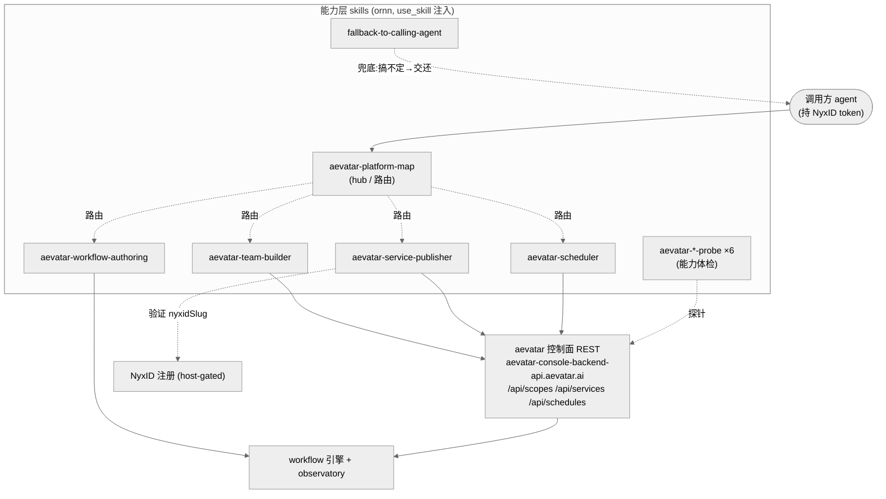

# 11 Skills 能力层

## 事实源/设计抽象(以 ~/Code/aevatar 为准)

> 11 不是某个 aevatar 内部组件的解读块,而是**面向 agent 的能力层(skills)盘点**:把"今天已经存在、可以驱动 aevatar 的 skill"集中列清楚——它们各自是什么、谁可见、属于哪一类、落在 aevatar 的哪条主链上。这些 skill 本身不住在 `~/Code/aevatar` 源码树里(它们是 ornn-native 的 `SKILL.md`,发布到 ornn,服务端经 NyxID `use_skill` 注入给 aevatar 模型),所以本块的事实源分两段:
>
> - **skill 定义事实源**(只读,非 aevatar 源码):`~/Code/aevatar-ornn-skills/`——每个 skill 一个目录,`SKILL.md` 是唯一权威。本块对每个 skill 的"作用"论断都回指对应 `SKILL.md`。
> - **它们驱动的 aevatar 主链**(`~/Code/aevatar`,本仓库本职事实源):控制面 REST 前门、workflow 引擎、NyxID 注册耦合点,已分别在 [09 方案区](../09/index.md) 沿 `~/Code/aevatar` 源码讲透。本块只做"能力层 → 主链"的映射,不重复 09 的源码论证。
>
> 可见性事实以**线上 ornn skill-search**(`scope=mine`)实测为准,不脑补哪个是 public / private。

---

## 这个块是什么

- **定位**:00–08 回答"aevatar 怎么构成、怎么运转";09 回答"针对某个目标该怎么搭、还差什么";**11 回答"今天有哪些现成的 skill 可以让一个 agent 直接驱动 aevatar"**。它是**能力层的目录**,不是又一篇组件解读。
- **为什么单列一块**:这些 skill 是 aevatar 对外暴露的**泛化协议入口**——一个手里有 NyxID token 的 agent(Claude Code / Codex / 任意 OpenAI 兼容客户端)靠它们把 idea 变成可调用、可调度的 aevatar 服务。它们横跨"控制面 REST""workflow 引擎""NyxID 注册"多条主链,塞进任何单个组件章都不合适,所以集中成块。
- **诚实口径**:`SKILL.md` 自己反复强调的边界(`你是客户端`、`NyxID 注册 host-gated`、`很多步骤异步、要回读状态、别凭 2xx 报成功`)本块**原样承袭**,不写"一键打通"。

> **SCOPE_EXTEND**:11 块不在仓库 `PLAN.md` 原始 00–08 清单内,是按"集中盘点 aevatar 能力层 skill"的需要新增的横切块,已在 `PLAN.md` 登记(与 09 同类新增)。

## 一张图:skill 怎样套在 aevatar 主链上

skill 不是平行于 aevatar 的"第二系统",而是**对已有主链的薄封装**——它们把同一套 REST / 工具调用收敛成"agent 读一遍就能照做"的行为契约。控制面家族走客户端 REST,authoring 走服务端工具,fallback 是纯散文护栏,probe 是体检探针:

## skill 盘点(总表)

> 只收 aevatar 相关的 skill:控制面家族 + authoring + fallback + 一组 probe。可见性来自线上 `scope=mine` skill-search 实测。"类别"= `SKILL.md` 的 `metadata.category`(ornn 的 `plain` / `tool-based` / `runtime-based` / `mixed` 枚举),决定 `use_skill` 注入时是否还要带 output-type / runtime。

| Skill | 可见性 | 类别 | 作用(回指 `SKILL.md`) |
|---|---|---|---|
| [`aevatar-platform-map`](01-aevatar-control-plane-skills.md#platform-map) | **public** | `plain` | **入口 / hub**:对象模型、NyxID 鉴权 + `GET /api/studio/context` 解析 scope、能力索引、把任务路由到对应 spoke;自己不干活,只导航。 |
| [`aevatar-team-builder`](01-aevatar-control-plane-skills.md#team-builder) | private | `plain` | 建 team、建 member(`workflow` / `script` / `gagent`)、绑定实现(异步 binding run → `succeeded`)、设 entry member。 |
| [`aevatar-service-publisher`](01-aevatar-control-plane-skills.md#service-publisher) | private | `plain` | 把 member / team / workflow 发布成可调用 service,经 `externalExposure.nyxidSlug` 验证 NyxID 注册,调用它;覆盖 scope 绑定与账户级 service 生命周期。 |
| [`aevatar-scheduler`](01-aevatar-control-plane-skills.md#scheduler) | private | `plain` | 建 cron schedule 触发 service,用 `scopeOwnerNyxId` 在触发期 mint scope owner 的 NyxID;preview / run-now / enable / disable / update / delete。 |
| [`aevatar-workflow-authoring`](02-aevatar-platform-and-probe-skills.md#workflow-authoring) | **public** | `tool-based` | 从自然语言生成、校验(fire-and-observe)、持久化可复用的 workflow YAML;服务端工具 `aevatar_start_workflow` / `nyxid_services` / `ornn_publish_skill`。 |
| [`fallback-to-calling-agent`](02-aevatar-platform-and-probe-skills.md#fallback) | **public** | `plain` | 通用 try-catch 护栏:服务端真做一遍仍搞不定时,把原始请求**逐字**交还调用方 agent 用其本地工具完成,而不是静默失败或编造。 |
| [`aevatar-capability-probe`](02-aevatar-platform-and-probe-skills.md#probes) 等 ×6 | private | — | 平台能力体检探针(capability / workflow-engine / scripting / vision / attachment / file-extract),逐项探一个平台能力是否在线。 |

## 本块怎么读

| 章节 | 回答的问题 | 现状 |
|---|---|---|
| [01 控制面家族:idea → schedule 的客户端 REST](01-aevatar-control-plane-skills.md) | platform-map / team-builder / service-publisher / scheduler 各自的边界、对象模型黄金路径、用哪些 REST 端点、host-gated 注册诚实口径 | 本会话新建;客户端 REST recipe,无服务端集成 |
| [02 平台 skill 与 probe:authoring / fallback / 体检探针](02-aevatar-platform-and-probe-skills.md) | workflow-authoring 的 fire-and-observe 契约与引擎陷阱、fallback 的 try-catch 协议、一组 probe 的用途 | authoring/fallback 现役 public;probe 现役 private |

## 这条能力层的设计正当性

为什么是「一组泛化 skill + 客户端 REST recipe」,而不是「给每个动作做一个服务端按钮」?

- **skill 是泛化协议,不感知具体业务**。`SKILL.md` 里没有任何硬编码的具体项目/组织/skill 名(`README.md` 的 Conventions 明令"stay generic"),与本仓库 CLAUDE.md「不得对特定 skill / 命令 / 模板名硬编码」一致。能力层因此对任意调用方、任意任务复用,而不是为某个客户写死一套。
- **控制面家族是纯客户端 REST(`category: plain`)**。它们不在服务端新增执行体,只把"一个 agent 该怎么按顺序打 `https://aevatar-console-backend-api.aevatar.ai` 的 REST"写成可读的 recipe。这避免了"为便利在中间层再造一套编排"的第二系统——所有事实仍由 aevatar 主链(actor 持久态 + committed event + observatory readmodel)拥有,skill 只是教 agent 怎么驱动它。
- **诚实边界是设计的一部分,不是免责声明**。"`你是客户端`、`NyxID 注册 host-gated`(客户端开不了 host 暴露)、`步骤异步要回读、别凭 2xx 报成功`"这些约束直接写进每个 `SKILL.md`,让模型不会越权承诺。这正是不动点 FI-006(变更基于 evidence、越界承诺要显式暴露)在能力层的落地。

⟦AI:AUTO-LOOP⟧
