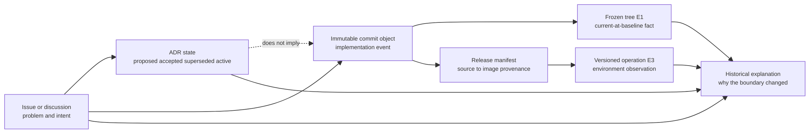
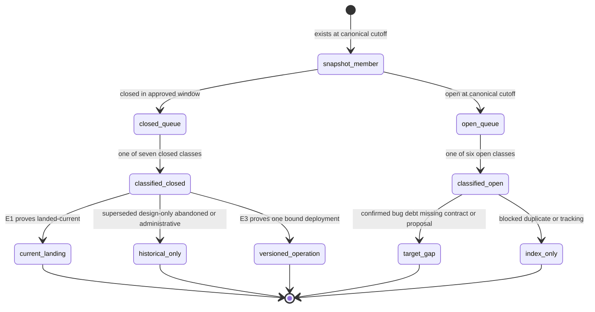

# 演进方法与时间线：先分清三套时钟，再解释“为什么变成现在这样”

> 版本与结论：本章是 `historical` 演进导读，不是功能清单。批准快照包含 154 个在 2026-07-06 至 2026-07-25 窗口关闭的 issue 与 canonical cutoff 时仍 open 的 126 个 issue；两组共 280 个唯一成员。issue 创建/关闭、代码 commit、release/生产观察是三套不同时间。只有冻结 commit `f02aa690` 中的 E1 能说明 current 实现，E3 只能说明绑定版本曾在绑定环境运行，issue/ADR 则解释决策与未决方向。

## 设计抽象与事实源

- 本仓库 [Issue 演进账本](../migration/2026-07-25-issue-evidence-ledger.md) §1–5 与 `docs/adr/0006-multi-agent-evolution.md:1-28`：冻结成员恢复、280 行分类，以及 `superseded` 历史状态实例。
- `docs/adr/0037-scheduled-invocation-credential-source-model.md:1-60`：`accepted` ADR 的历史问题、决定与 locked rules；是否已落地仍需逐项回到冻结代码。
- `docs/adr/0041-scheduled-invocation-agent-key-credential-reference.md:1-37`：`proposed` 状态示例，证明“仓库里有 ADR”不等于 current contract 已采用。

## 三套时钟回答三个问题

旧周报曾把部署线、issue 状态与本地 checkout 混在同一张“已修/未修”表里。重构后的演进层改用三套显式时钟：

| 时钟 | 权威记录 | 回答 | 不能回答 |
|---|---|---|---|
| governance clock | issue event、ADR status | 何时提出、接受、替代、关闭或仍有争议 | 代码是否进入冻结基线、是否部署 |
| implementation clock | commit object、冻结树 E1、测试 | 某语义何时进入历史，冻结基线是否仍有它 | 某环境是否已经运行该 commit |
| operation clock | source SHA、immutable image、日期、环境、allowlisted evidence | 绑定版本在绑定环境发生了什么 | 当前 HEAD 或未来发布必然同样成功 |



为什么不按 issue close date 直接画“功能上线时间线”？close 可以表示代码合并、设计交付、重复关闭、失败放弃、运维验证或纯看板动作。批准 closed 队列中就同时存在 `landed-current`、`landed-superseded`、`design-only`、`ops-verified`、`duplicate/replaced`、`failed/abandoned` 与 `administrative`。把它们都画成“上线”会系统性制造假历史。

## 快照成员为什么固定在 280 行

“2026-07-25 快照”使用本地时区日期，但 canonical cutoff 是设计提交时刻 `2026-07-24T16:58:27Z`。账本通过 GitHub issue events 重放找到唯一满足 `open=126`、窗口内 `closed=154` 的区间 `[2026-07-24T15:23:48Z, 2026-07-24T19:23:10Z)`，cutoff 位于其中。区间内没有状态事件，所以成员集合唯一。

这条冻结规则有两个重要结果：

1. cutoff 后关闭的 issue 仍属于本轮 open 队列；例如 `#2954–#2957` 后来发生的 live 状态变化不能倒改批准快照。
2. cutoff 后新增的 issue 不进入 280 行；它们是 drift telemetry，除非下一轮治理明确批准新基线。



分类不是给 issue 贴“好/坏”标签，而是限制它能支持的句子。`landed-current` 还需真实 E1；`ops-verified` 必须携带版本和环境；`proposal/dispute` 只能写“issue 提议”；`blocked/duplicate/tracking` 只进入索引，不能主导架构叙事。

## 主题时间线：记录边界迁移，不罗列功能

下面日期取 issue governance clock。每行都另给 current 落点；读者要判断冻结实现时，应沿落点查看 E1，而不是把日期当 release attestation。

| 治理日期带 | 代表 issue / 决策 | 边界怎样移动 | current / historical 落点 |
|---|---|---|---|
| 2026-07-06—07-10 | `#2589`、`#2609`、`#2673`、`#2405–#2407`、`#2688–#2692` | audit 从日志字段变成显式生命周期；Channel 从 Lark 特例收敛为中立消息面；大图片从 durable base64 改为 ref；schedule credential 从并行 raw/source 路径转向 typed reference 与 Vault | [05/06](../05/06-audit-trail-lifecycle-and-export.md)、[08/01](../08/01-ingress-normalization-and-routing.md)、[08/04](../08/04-file-artifacts-and-attachments.md)、[09/03](../09/03-owner-authorization-and-agent-key.md)、[09/04](../09/04-vault-reference-and-revocation-compensation.md) |
| 2026-07-11—07-16 | `#2406–#2409`、`#2412`、`#2728`、`#2733`、`#2781`、`#2787` | credential validation 下沉、fire/cleanup 收敛；附件进入 relay；SkillRunner runtime 删除；Codex execution 获得 runtime-neutral port；audit terminal/export 语义落地 | [09/03](../09/03-owner-authorization-and-agent-key.md)、[12/03](03-retired-and-superseded-components.md)、[10/06](../10/06-managed-codex-sandbox-and-delegation.md)、[05/06](../05/06-audit-trail-lifecycle-and-export.md) |
| 2026-07-17—07-21 | `#2814–#2816`、`#2834`、`#2842–#2846`、`#2871`、`#2792`、`#2451` | Profile 从 request hint 变成 immutable/actor-owned turn catalog；Conversation/Turn 由后端分配；ChatHistory terminal append 重发；tool error 不再伪装成功 | [07/03](../07/03-agent-profile-and-immutable-binding.md)、[01/03](../01/03-chat-conversation-turn-contract.md)、[07/01](../07/01-conversation-turn-and-chat-history.md)、[03/03](../03/03-execution-kernel-and-outcomes.md) |
| 2026-07-22—07-24 | `#2804`、`#2895–#2897`、`#2900`、`#2907`、`#2913`、`#2920`、`#2931`、`#2909` | NyxIdChat route/profile 成为 server-owned；外部 capability admission typed 化；managed sandbox 使用 per-user key；schedule 解析 exact owner LLM；catalog visibility fail closed；续聊注入 history；Lark relay 去特例；Workflow schedule 统一走 Studio Member path | [07/02](../07/02-nyxid-chat-actor-model-and-progress.md)、[03/07](../03/07-connectors-and-capability-admission.md)、[10/06](../10/06-managed-codex-sandbox-and-delegation.md)、[09/03](../09/03-owner-authorization-and-agent-key.md)、[06/03](../06/03-catalog-visibility-and-scope-authorization.md)、[07/01](../07/01-conversation-turn-and-chat-history.md)、[08/02](../08/02-channel-runtime-and-credential-boundary.md) |

这不是“7 月功能完成表”。例如 `#2688` 的分类是 `design-only`：它交付了 accepted ADR 修订，而相邻 issues 才分别提供冻结代码切片。`#2783` 是唯一 `ops-verified` closed row，它证明特定 managed-sandbox 发布与 27/27 live 验证，不自动证明所有 managed execution。`#2733` 的价值恰恰是删除：current E1 是替代运行时存在且旧类型全树零命中。

## ADR 状态也不能脱离代码读取

| ADR 状态 | 合法结论 | 还需什么 |
|---|---|---|
| `proposed` | 方案已被写下，问题与选择仍未决 | 只能进 target/history；禁止写成 current |
| `accepted` | 设计决定已批准 | 逐条在冻结代码、proto、guard、测试找 E1 |
| `active` | 文档声明它描述活跃架构 | 仍要核对实现和其他 ADR 是否漂移 |
| `superseded` | 该方案已被替代 | 找替代 ADR/代码，并检查旧路径是否真的删除 |

大小写不是新状态：冻结 ADR 同时使用 `Accepted/accepted` 与 `Proposed/proposed`，索引必须规范化比较，但不得擅自改写文档原状态。更重要的是，`accepted` 也可能只交付设计。`docs/adr/0037-scheduled-invocation-credential-source-model.md` 与 `#2688` 就要求把“决定已接受”和“哪些切片已落地”分开写。

## 矛盾处理：保留冲突，不选顺眼的一边

遇到 issue、ADR、code、canary 不一致时，按以下顺序收敛：

1. 先确定句子是在说 current、historical、versioned operation 还是 target。
2. current 行为只读冻结树 E1；不存在就不能用 closed issue 补位。
3. 历史判断查 immutable commit/删除事实；不要从 current 零命中猜“从未存在”。
4. 生产判断要求 source/image/date/environment；没有 release provenance 就降低证据等级。
5. 保留矛盾：例如“functional repeat 成功但缺 operational audit”必须同时成立，不能压成一个绿色状态。
6. 把真正未决项送往 [12/05](05-open-gaps-and-canon-drift.md)，写 current limit 与 exit criterion，不写承诺。

为什么不选最新文档覆盖旧记录？最新文本也可能是 Proposed ADR、stale canon 或未合并分支。为什么不只信代码？代码能说明基线行为，却不能单独解释为什么舍弃旧边界、哪个生产版本曾经通过、某缺口是否被正式承认。三套证据必须保持分工。

## 最小 demo：机械重算冻结成员与分类

以下脚本只读本仓库已经批准的 issue ledger，验证成员、唯一性与分类计数；它不会访问 live GitHub，因此不会把今天的状态漂移写回历史：

```bash
python3 - <<'PY'
from collections import Counter
from pathlib import Path

text = Path("docs/migration/2026-07-25-issue-evidence-ledger.md").read_text()

def rows_between(start, end=None):
    body = text.split(start, 1)[1]
    if end:
        body = body.split(end, 1)[0]
    rows = []
    for line in body.splitlines():
        if not line.startswith("| "):
            continue
        cells = [cell.strip() for cell in line.strip().strip("|").split("|")]
        if len(cells) >= 10 and cells[1].startswith("#"):
            rows.append(cells)
    return rows

closed = rows_between("## 4. 冻结成员：closed（154）", "## 5. 冻结成员：open（126）")
opened = rows_between("## 5. 冻结成员：open（126）")

assert len(closed) == 154
assert len(opened) == 126
assert len({row[1] for row in closed + opened}) == 280
assert Counter(row[7] for row in closed) == {
    "landed-current": 113,
    "failed/abandoned": 17,
    "administrative": 16,
    "landed-superseded": 5,
    "duplicate/replaced": 1,
    "ops-verified": 1,
    "design-only": 1,
}
assert Counter(row[7] for row in opened) == {
    "missing-contract": 44,
    "confirmed-bug": 22,
    "ops-ux-test": 21,
    "proposal/dispute": 16,
    "blocked/duplicate/tracking": 15,
    "security-debt": 8,
}
print("issue-evolution-ledger: 154 closed + 126 open = 280 unique rows")
PY
```

> Demo status：`verified-static`。本轮实际运行脚本并验证 280 行与 13 个分类计数；没有重新访问 GitHub、没有推断 release 时间、没有启动 Aevatar。成员恢复算法另由治理账本记录的 `issue-snapshot/issue-replay` fixtures 验证。

## 设计正当性、边界与演进

- 为什么按主题里程碑而不是周报：周界会把同一 credential/Channel/Conversation 决策切碎；主题边界更接近状态所有者，日期仍保留为索引。
- 为什么冻结成员：live issue 状态每天漂移；没有 immutable cutoff，统计和结论无法复核。
- 为什么保留 administrative/failed 行：删掉噪声会让“覆盖 280 行”不可证，也会把失败方向误算成从未发生；正文不必展开，但索引必须留存。
- 为什么 current 章节不以 issue 为骨架：issue 是变更动机，不是 runtime contract。current 落点以代码职责、协议与不变量组织。
- 本章截至批准快照，不吸收之后新建 issue 或后来关闭状态。需要更新时应建立新的有日期基线和差异账本，不原地重写本轮历史。

## 读完应能回答

1. issue close、commit 与 production observation 分别能证明什么？
2. 为什么 `accepted` ADR 和 `landed-current` issue 仍需冻结 E1？
3. canonical cutoff 后 issue 被关闭时，为什么本轮仍把它保留在 open 队列？
4. `ops-verified` 与 `landed-current` 为什么不能互相替代？
5. issue、ADR、code 与 canary 矛盾时，应如何保留并分层结论？

<details>
<summary>论断—证据映射</summary>

| 论断 | 证据 |
|---|---|
| canonical cutoff、唯一成员区间、154/126 恢复算法与交叉校验 | [Issue 演进账本 §1–2](../migration/2026-07-25-issue-evidence-ledger.md) |
| closed 七类的 154 行计数与 E1 复核口径 | [Issue 演进账本 §3.1](../migration/2026-07-25-issue-evidence-ledger.md) |
| 154 个 closed 成员及每行 implementation evidence / destination | [Issue 演进账本 §4](../migration/2026-07-25-issue-evidence-ledger.md) |
| open 六类的 126 行计数与 target-only 口径 | [Issue 演进账本 §3.2](../migration/2026-07-25-issue-evidence-ledger.md) |
| 126 个 open 成员及每行 current-limit evidence / destination | [Issue 演进账本 §5](../migration/2026-07-25-issue-evidence-ledger.md) |
| accepted 与 proposed 不同状态、credential 设计决定不能自动替代 E1 | `docs/adr/0037-scheduled-invocation-credential-source-model.md:1-60`；`docs/adr/0041-scheduled-invocation-agent-key-credential-reference.md:1-37` |

</details>
