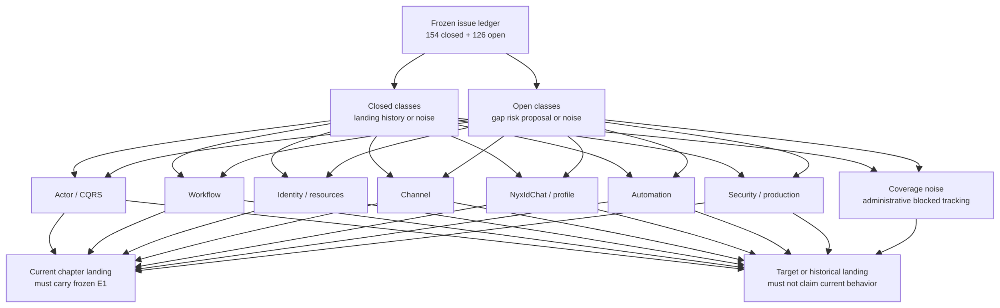
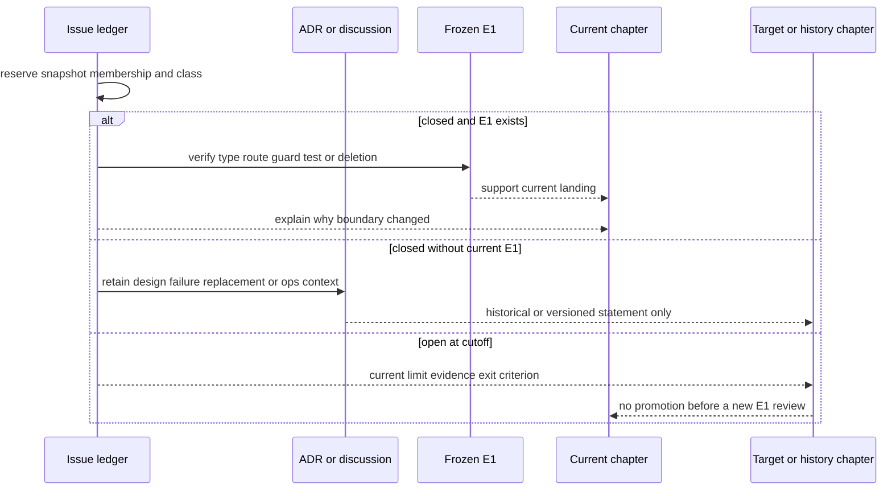

# Issue 决策主题图：把 280 个工作项还原成边界迁移

> 版本与结论：本章是 `mixed` 演进索引。冻结队列含 154 个 closed 与 126 个 open issue；closed 只有在 `f02aa690` 存在 E1 时才说明 current landing，open 只说明缺口、风险或未决方向。七个技术主题覆盖 249 行，另有 31 行行政/阻塞噪声单列保全；它们合计无损覆盖 280 行。

## 设计抽象与事实源

- 本仓库 [Issue 演进账本](../migration/2026-07-25-issue-evidence-ledger.md) §3–5：280 个冻结成员、逐行分类、实现证据与章节落点，是本章计数的唯一成员事实源。
- `docs/canon/cqrs-projection.md:55-96`：Actor committed fact、projection 与 read model 的当前职责边界，支撑 Actor / CQRS 主题的 current landing。
- `docs/canon/nyxid-chat-agent-profile-binding.md:9-70`：profile snapshot、turn-local catalog 与 actor ownership 的当前边界，支撑 NyxIdChat / profile 主题的 current landing。

## 先建立模型：issue 不是运行时模块

主题是读者视角的决策索引，不是新的组件层。每行仍只在冻结账本中保存一次；本章按“第一个现役章节落点”归属主题，仅在没有现役落点时使用账本已有的 `theme:` 标签和标题。`administrative` 与 `blocked/duplicate/tracking` 不强塞进技术主题。



为什么不按代码目录或周次分组？同一决策常跨越 proto、actor、read model、Host 与 Console；按目录会拆散 owner 边界，按周次又会把一条 credential 或 Conversation 演进切成数段。主题只承担导航，current 合同仍由对应章节和冻结 E1 拥有。

## 覆盖矩阵：closed 与 open 同时可见

括号内为分类数量；每个分类总和等于该主题的 closed/open 小计。

| 主题 | Closed | Open | 主要 current / target 落点 |
|---|---:|---:|---|
| Actor / CQRS | 6（`landed-current` 5、`failed/abandoned` 1） | 12（`missing-contract` 7、`ops-ux-test` 3、`confirmed-bug` 1、`proposal/dispute` 1） | [02 Actor 内核](../02/01-agent-actor-runtime.md)、[05 CQRS](../05/01-command-event-projection-readmodel.md)、[12/05](05-open-gaps-and-canon-drift.md) |
| Workflow | 13（`landed-current` 10、`failed/abandoned` 3） | 16（`missing-contract` 9、`proposal/dispute` 4、`confirmed-bug` 2、`ops-ux-test` 1） | [03 Workflow](../03/01-workflow-model-and-identities.md)、[04 AI 与工具](../04/03-tool-loop-catalog-and-presentation.md)、[12/05](05-open-gaps-and-canon-drift.md) |
| Identity / resources | 23（`landed-current` 21、`failed/abandoned` 2） | 27（`ops-ux-test` 10、`missing-contract` 9、`confirmed-bug` 6、`proposal/dispute` 2） | [06/01](../06/01-scope-team-member-resource-model.md)、[06/02](../06/02-draft-revision-binding-and-published-service.md)、[12/05](05-open-gaps-and-canon-drift.md) |
| Channel | 17（`landed-current` 16、`failed/abandoned` 1） | 12（`confirmed-bug` 5、`missing-contract` 5、`proposal/dispute` 2） | [08/01](../08/01-ingress-normalization-and-routing.md)、[08/03](../08/03-lark-delivery-interaction-and-repair.md)、[12/05](05-open-gaps-and-canon-drift.md) |
| NyxIdChat / profile | 20（`landed-current` 18、`duplicate/replaced` 1、`failed/abandoned` 1） | 10（`missing-contract` 5、`proposal/dispute` 4、`confirmed-bug` 1） | [07/01](../07/01-conversation-turn-and-chat-history.md)、[07/03](../07/03-agent-profile-and-immutable-binding.md)、[12/05](05-open-gaps-and-canon-drift.md) |
| Automation | 36（`landed-current` 27、`landed-superseded` 5、`failed/abandoned` 3、`design-only` 1） | 13（`missing-contract` 6、`confirmed-bug` 5、`ops-ux-test` 1、`proposal/dispute` 1） | [09/01](../09/01-automation-resource-api-and-readmodels.md)、[09/04](../09/04-vault-reference-and-revocation-compensation.md)、[12/05](05-open-gaps-and-canon-drift.md) |
| Security / production | 23（`landed-current` 16、`failed/abandoned` 6、`ops-verified` 1） | 21（`security-debt` 8、`ops-ux-test` 6、`missing-contract` 3、`confirmed-bug` 2、`proposal/dispute` 2） | [10/05](../10/05-authentication-scope-and-admin-authorization.md)、[10/08](../10/08-architecture-and-security-guards.md)、[12/05](05-open-gaps-and-canon-drift.md) |
| 覆盖噪声 | 16（`administrative` 16） | 15（`blocked/duplicate/tracking` 15） | 最终在 13/04 issue 索引无损展示 |
| **合计** | **154** | **126** | **280 个唯一成员** |

“覆盖噪声”不是无用记录：它证明没有通过删掉 bot fork、看板动作或 blocked tracker 来美化统计。但这些行既无 current E1，也不表达稳定设计选择，所以只进入无损索引。

## Actor / CQRS：从“收到消息”转向“提交事实后才可观察”

Closed 决策的 current landing 是三段式边界：Actor 拥有写状态，[committed envelope](../05/02-committed-state-and-observation.md) 才进入 projection，read model 只回答查询而不反向成为写侧事实。`#2472` 把 Mission Wall 的 fan-out 查询收敛为投影视图；`#2925` 把 catalog current state 的版本比较带入写入路径。它们分别落在 [05/05](../05/05-workflow-agui-and-live-observation.md) 与 [05/04](../05/04-readmodel-stores-versioning-and-rebuild.md)，是否 current 由章内 E1 而不是 close 状态证明。

Open 队列仍记录 projection rebuild、run event 续传、proto alias 冲突与展示板等缺口。它们说明“已能 materialize current state”不等于“已有无损灾备、续传或所有查询契约”。`ops-ux-test` 行则只要求测试/展示面，不应倒逼另建一份业务事实源。

为什么选择 committed fact 而不是直接查询 actor 内存？前者给 projection lease、幂等版本和恢复提供共同边界；代价是读侧存在延迟与修复责任，必须显式暴露水位和 rebuild 限制。

## Workflow：从 YAML 语法扩展到 typed outcome 与 capability admission

Closed 主题把 Workflow 从“能解析步骤”推进为带 identity、typed failure、pause/resume 和外部 capability admission 的执行模型。代表性决策包括 `#2451`：tool result error 不再伪装成功，落在 [03/03](../03/03-execution-kernel-and-outcomes.md)；`#2895`：外部 capability 在 bind 前接受 typed admission，落在 [03/07](../03/07-connectors-and-capability-admission.md)。`#2315` 则把 Ornn workflow YAML 定位为需显式 mount/import 的模板，而非 scope 内天然权威定义。

Open 队列中的 connector operation schema、artifact port、draft-only pinned artifacts、durable approval 和 Kestra-derived primitives 仍是缺失合同或提案。它们不能被现有通用 `connector_call`、inline payload 或基础 wait module 冒充。

为什么把 tool error 提升为 engine outcome？若模块只看 HTTP/调用完成，错误会穿透到后续步骤，最终产出“成功”假象；typed failure 在执行 owner 处一次收敛，比分散由每个 workflow 作者解析供应商 payload 更可审计。

## Identity / resources：把名称、草稿、修订、绑定与可服务状态拆开

Closed 决策围绕 `scope → team → member` owner 链、draft/revision identity、binding run 与 published service 展开。`#2368` 的 save-and-bind、`#2244` 的 `202 + bindingRunId` 可观察 ACK、`#2913` 的 catalog scope visibility 分别落在 [06/02](../06/02-draft-revision-binding-and-published-service.md)、[06/04](../06/04-studio-commands-acks-and-readmodels.md)、[06/03](../06/03-catalog-visibility-and-scope-authorization.md)。共同决策是：提交命令、绑定完成、serving readiness 和目录可见性不是同一状态。

Open 行集中在 member-first API、version provenance、headless owner binding、service access review、资源变更闭环和前端恢复引导。其中 `#435` 疑似已有部分 E1、但它在 canonical cutoff 仍是 open；因此只能作为 [12/05](05-open-gaps-and-canon-drift.md) 的 drift candidate，而不能从队列删除。

为什么不用一个 `serviceId` 串起全部阶段？单 ID 会把可编辑意图、immutable revision、actor binding 与 runtime serving 混为“存在”；拆开身份与 ACK 虽增加查询步骤，却能诚实表达失败发生在哪条边界。

## Channel：从 Lark 特例转向 provider-neutral ingress / delivery

Closed 决策把入站 normalization、conversation routing、attachment reference 与 delivery repair 分离。`#2609` 将 credential 下沉到 runtime owner，`#2673` 把 durable 大图片从 base64 改为 ref，`#2931` 移除 NyxIdChat prompt/context 中的 Lark 字面特例；它们分别落在 [08/02](../08/02-channel-runtime-and-credential-boundary.md)、[08/04](../08/04-file-artifacts-and-attachments.md) 和同一中立 Channel 边界。

Open 行仍指出 Lark downloader/identity resolver 泄漏到 NyxIdChat、provider-specific metadata/card contract、file-to-workflow 组合输入以及 delivery 并发/去重缺口。这里的方向只是“adapter 应拥有 provider 特例”；具体 proto 迁移未定时不能提前写成 current。

为什么保留 adapter 而非让核心理解所有平台字段？provider 事件与凭证变化快，放入 durable core 会扩大迁移面；中立 activity/ref contract 稳定，但代价是 adapter 必须承担显式映射、失败分类与 repair。

## NyxIdChat / profile：把一次请求升级为 actor-owned turn

Closed 决策完成了 server-owned Conversation/Turn identity、immutable profile binding、turn-local tool catalog 与 committed progress。`#2815/#2842/#2871` 的 profile snapshot/catalog 演进落在 [07/03](../07/03-agent-profile-and-immutable-binding.md) 与 [07/04](../07/04-turn-authority-tool-catalog-and-retry.md)；`#2792` 取代 `#2778`，说明 duplicate row 只能指向权威替代项。

Open 队列中的 history ownership unify、stop、typed steering、task plan 和 reconnect current-state 都没有冻结 E1。尤其 `#2954–#2957` 只属于 [12/05](05-open-gaps-and-canon-drift.md)：SSE 断开不能写成 actor stop，已有 progress 也不能写成可续传 current-state contract。

为什么 profile 要 snapshot 到 turn，而不是每步重读 mutable profile？快照让同一 turn 的 prompt/tool authority 可复核；代价是 profile 更新只影响后续 turn，必须把 version 与 binding 明示给读者。

## Automation：从 cron 配置升级为 owner、credential 与补偿协议

Automation 是本轮 closed 最密集的主题。`#2405–#2409` 收敛 typed credential source/role，`#2688` 只交付 accepted ADR 因而是 `design-only`，相邻 landed issues 才提供 E1；`#2731–#2733` 删除旧 SkillRunner path 并由 scheduled actor/callback 链替代。current 合同分别落在 [09/02](../09/02-scheduled-actor-callback-and-fire.md)、[09/03](../09/03-owner-authorization-and-agent-key.md) 与 [09/04](../09/04-vault-reference-and-revocation-compensation.md)。

Open 行仍包含 typed owner 双轨、fire history、filtered run history、callback/reminder edge cases 与授权计划闭环。`#2418`、`#2737` 是疑似已有部分实现但未关单的 drift candidate；保留为 open 能迫使 exit criterion 对齐完整合同，而不是只看到某个 DTO/issuer 就宣称闭合。

为什么 schedule 不直接持久化 bearer token？长期状态需要 reference、generation 与补偿轨道，fire-time 才交换短期材料；这增加了 preflight/revocation 状态机，却把泄漏、轮换与 cleanup 变成可审计事件。

## Security / production：准入、隔离与运行证据必须分开

Closed current 决策包括 NyxID login finalize、DPoP/admin authorization、Garnet secret store、managed Codex port 与 architecture guards。唯一 `ops-verified` 行 `#2783` 只证明指定 Ornn 部署在 2026-07-16 完成 27/27 live 验证；它不能替代 [10/06](../10/06-managed-codex-sandbox-and-delegation.md) 的冻结 E1，也不能外推其他环境。

八个 `security-debt` open 行明确记录 broad `proxy:*` delegation、allowlist admission、relay credential persistence、tool scope authorization 与 zero-secret-material 缺口。另有 MassTransit residue `#2209`：runtime 已退役，但 props/guard/ADR 残留仍待决，因此既不能当 current transport，也不能宣称“已彻底清理”。

为什么把生产 proof 与实现 landing 分成两列？代码存在不证明部署，canary 成功也不证明当前冻结树或所有租户；两列强迫每个结论绑定自己的 commit/image/date/environment 或 E1。

## 沿一条决策链走读



这条链也解释了为何 `landed-current` 不是永恒标签：下一次冻结基线可能删除或替代该 E1，届时应新增一轮差异记录，而不是倒改本轮成员与分类。

## 最小 demo：复算覆盖总数与分类守恒

下面脚本只读冻结账本和本章表中的已审定主题小计，不访问 live GitHub：

```bash
python3 - <<'PY'
from collections import Counter
from pathlib import Path

rows = []
for line in Path("docs/migration/2026-07-25-issue-evidence-ledger.md").read_text().splitlines():
    if line.startswith("| closed | #") or line.startswith("| open | #"):
        escaped = line.strip().strip("|").replace(r"\|", "\0")
        cells = [cell.replace("\0", "|").strip() for cell in escaped.split("|")]
        rows.append(cells)

assert Counter(row[0] for row in rows) == {"closed": 154, "open": 126}
assert len({row[1] for row in rows}) == 280
assert Counter(row[7] for row in rows if row[0] == "closed") == {
    "landed-current": 113, "failed/abandoned": 17, "administrative": 16,
    "landed-superseded": 5, "duplicate/replaced": 1, "ops-verified": 1,
    "design-only": 1,
}
assert Counter(row[7] for row in rows if row[0] == "open") == {
    "missing-contract": 44, "confirmed-bug": 22, "ops-ux-test": 21,
    "proposal/dispute": 16, "blocked/duplicate/tracking": 15, "security-debt": 8,
}
closed_by_theme = [6, 13, 23, 17, 20, 36, 23, 16]
open_by_theme = [12, 16, 27, 12, 10, 13, 21, 15]
assert sum(closed_by_theme) == 154
assert sum(open_by_theme) == 126
print("issue-theme-coverage: 8 buckets, 154 closed + 126 open = 280")
PY
```

> Demo status：`verified-static`。本轮实际运行覆盖与分类守恒检查；主题归属是基于逐行 destination/theme 的编辑判断，不伪装成上游自带字段。

## 设计正当性、边界与演进

- 主题表服务于阅读，冻结账本服务于审计；不复制 280 行，避免两份逐行事实源漂移。
- Closed 中的 `failed/abandoned`、`landed-superseded`、`design-only` 与 `ops-verified` 仍计数，但不得挤进 current 功能清单。
- Open 中的 bug/debt/contract/proposal 只说明 current limit；是否后来关闭不改变本轮 canonical cutoff 成员。
- Administrative 与 blocked/tracking 最终只在 13/04 issue 索引无损展示，正文不从中推导架构。
- 本章没有把 live GitHub、Proposed ADR 或生产单次结果外推为 `f02aa690` 的 current 能力。

## 读完应能回答

1. 为什么 closed issue 不等于 current landing，open issue 也不等于“完全没有相关基础设施”？
2. 七个技术主题与 31 行覆盖噪声如何无损回到 280 个成员？
3. Identity / resources 为什么必须区分命令 ACK、binding result、serving readiness 与 catalog visibility？
4. `#2954–#2957` 为什么只能进入 target，而不能补写进 NyxIdChat current 章节？
5. `ops-verified` 为什么不能替代冻结 E1，反过来也一样？

<details>
<summary>论断—证据映射与主题归属例外</summary>

| 论断 / 归属 | 证据 |
|---|---|
| 154 closed、126 open、逐行分类及 destinations | [Issue 演进账本 §3–5](../migration/2026-07-25-issue-evidence-ledger.md) |
| Actor committed fact → projection → read model | `docs/canon/cqrs-projection.md:55-96`；[05/01](../05/01-command-event-projection-readmodel.md) |
| profile snapshot 与 turn-local tool catalog | `docs/canon/nyxid-chat-agent-profile-binding.md:9-70`；[07/03](../07/03-agent-profile-and-immutable-binding.md) |
| accepted ADR 不自动等于完整 landing | `docs/adr/0037-scheduled-invocation-credential-source-model.md:1-60`；账本 `#2688` |
| `#2954–#2957` 仍属 frozen open 且只进 target | [Issue 演进账本 §3.2、§5](../migration/2026-07-25-issue-evidence-ledger.md) |
| 无现役 destination 的六行归属 | `#2377`、`#2645`、`#2851`、`#2209`、`#2935` 归 Security / production；`#2475` 的 Mission Wall summary 归同组的 production/product surface。归属只影响本章聚合，不改账本分类或落点。 |

</details>
